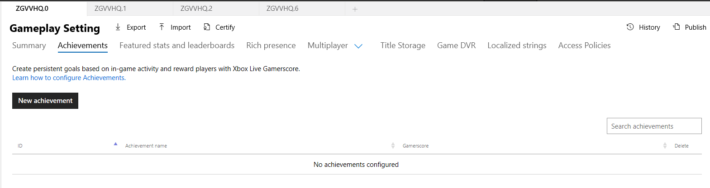
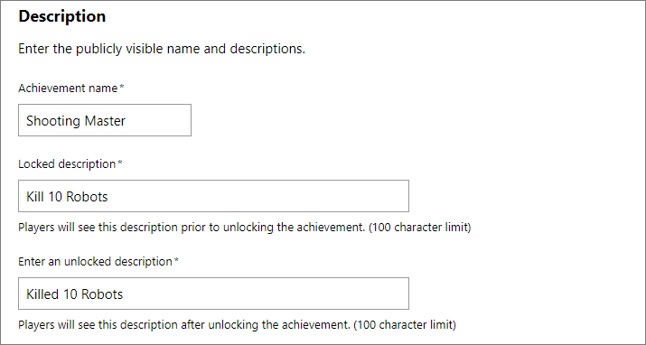
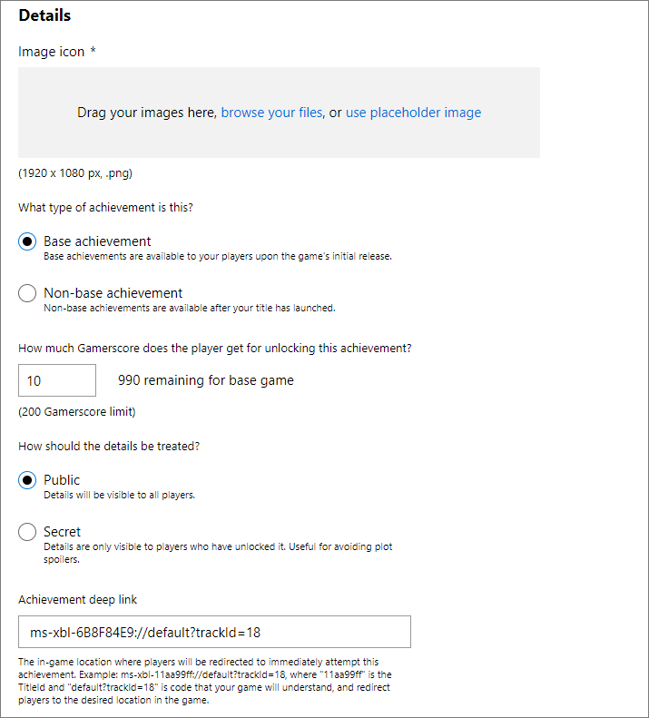
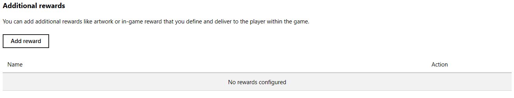
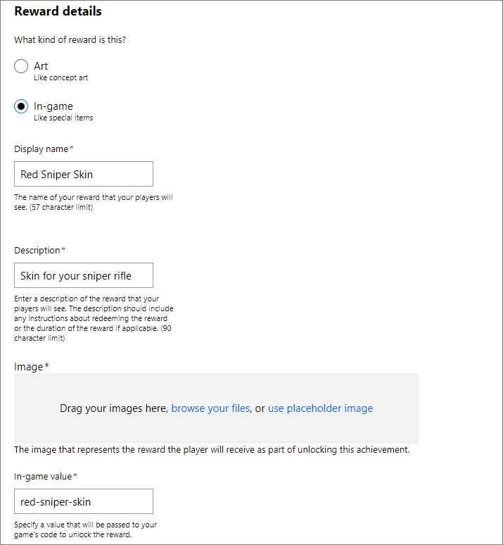

# Configuring title-managed Achievements in Partner Center

> [!NOTE]
> Titles configured as **Game Demo** in Partner Center can't have achievements published.

This topic describes how to use [Partner Center](https://partner.microsoft.com/dashboard) to configure title-managed Achievements that are associated with your game.

Add a new achievement by doing the following:

1. In Partner Center, select your title, and go to **Xbox services** > **Gameplay settings**.

2. Select **Achievements** to go to the **Achievements** section for your title.

3. Select **New achievement** (shown as follows), and then fill out the form. When you're done, select **Save**.

## Description

Use the **Description** section (shown as follows) to enter basic information about your achievement, like its name and locked/unlocked descriptions.
Add localization support to achievements by going to the **Localized strings** service configuration section in [Partner Center](https://partner.microsoft.com/dashboard).

The **Achievement name** box has the public-facing name of the achievement.

The **Locked description** box has the description that players see when they haven't unlocked the achievement.
The description has a 100-character limit.

The **Enter an unlocked description** box has the description that players see after they've unlocked the achievement.
The description has a 100-character limit.

## Details

Use the **Details** section (shown as follows) to associate important information with your achievement like the image, the type of achievement, the gamerscore reward (if any), and whether the achievement should be hidden until it's unlocked.

The **Image icon** box has the image that's displayed alongside the achievement.
It must be a 1920 &#215; 1080p .png file.

**Base achievement** indicates that base achievements are available to your players when the initial game has been released.
**Non-base achievement** indicates that non-base achievements are available after the initial game has been released (such as with new downloadable content (DLC)).

The **Gamerscore** box has the amount of gamerscore points that your achievement awards when it's unlocked.
Each achievement can reward 0&ndash;200 points.

**Public** indicates that achievements are visible to all players, regardless of whether they've unlocked the achievement.
**Secret** indicates that achievements are hidden until they've been unlocked.

**Achievement deep link** provides a way for you to get a parameter back from the achievement. You can link to a place in your game where the achievement can be earned.
The deep link is returned in the `GET API` response.
The URL specified must contain the `ms-xbl-{titleID}://` prefix.

> [!NOTE]
> Achievement deep links require the hexadecimal TitleId of your game. You can find it on the **Xbox Settings** screen in [Partner Center](https://developer.microsoft.com/dashboard). For more information, see [Setting up a game at Partner Center, for Managed Partners](../../../../fundamentals/portal-config/live-setup-partner-center-partners.md).

## Additional rewards

In some cases, you might want to offer an in-game reward or artwork when a player unlocks an achievement.
You can define the rewards (if any) that are associated with an achievement in the **Additional rewards** section (shown as follows).
An achievement can contain two additional rewards&mdash;one of each reward type.

For more information, see [Achievement rewards](../concepts/live-achievement-rewards.md).

To create a new reward, select **Add reward** in the **Additional rewards** section (shown as follows) and then fill out the form.

### Reward details

Fill out the **Reward details** form (shown as follows) to associate a new reward. When you're done, select **Add**.

You can create two types of achievement rewards.

1. Select **Art** if you want to reward the player with things like high-resolution concept art, early design drawings, specially created art assets, or other digital art. Art assets are displayed within the Xbox dashboard and in companion experiences by querying the Achievements service.

2. Select **In-game** if you want to reward the player with custom in-game rewards without updating your title. Some potential scenarios are extra in-game currency/points or access to special characters, weapons, or maps.

The **Display name** box has the name of the reward that players see.
The name has a 57-character limit.

The **Description** box has the description of the reward that players see and must include any redemption instructions.
The description has a 90-character limit.

The **Image** or **Art** box has the image that's associated with the reward.
If the type is set to **Art**, this is the artwork that players are rewarded.
Otherwise, it represents the in-game reward that they receive.
The image must be a 1920 &#215; 1080p .png file.

The **In-game value** box is only visible if you select the **In-game** reward type.
It specifies the value that's passed to your game's code, which can be used to unlock the in-game reward.