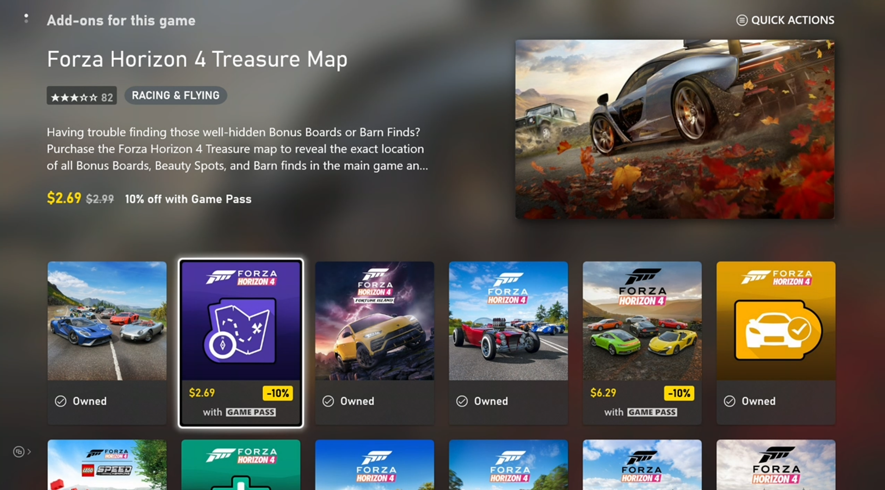

# Basic store operations

An in-game store typically involves three basic operations:

1. [Determining what users can purchase](#1-determining-what-users-can-purchase)
2. [Evaluating what products the user owns or is entitled to](#2-evaluating-what-products-the-user-owns-or-is-entitled-to)
3. [Purchasing eligible products](#3-purchasing-eligible-products)

This article illustrates sample code for each operation, derived from the InGameStore sample, which is continuously updated to reflect best practices.

## Preparing to call XStore APIs

All `XStore` APIs operate over an `XStoreContextHandle` created by using [XStoreCreateContext](../../../reference/system/xstore/functions/xstorecreatecontext.md).

This context enables you to perform store operations in the context of the specified user on console and the default user available on a PC.
On console, a Suspend or Quick Resume event invalidates the context.
To safely handle these conditions, close the `XStoreContextHandle` and recreate it whenever the game resumes from a suspended state.

## 1. Determining what users can purchase

What a game usually offers for purchase is their add-ons.
The following code demonstrates the basic [XStoreQueryAssociatedProductsAsync](../../../reference/system/xstore/functions/xstorequeryassociatedproductsasync.md) API call needed for the game to know what products are available.

This query automatically returns only **purchasable** add-ons associated with the game.
Unrelated products associated with the same publisher (that is, configured with the same Partner Center account) can also be made to return in this call so long as the game is set with a "can sell" relationship to this product in the **Product relationship setup** section in Partner Center.

To learn more about configuring product relationships, see [Configure product relationships for a game](/gaming/game-publishing/tutorial-xbox-managed/how-to-create-product-relationships).

```cpp
bool CALLBACK ProductEnumerationCallback(const XStoreProduct* product, void* context)
{
    // Handle adding the product to the game

    printf("%s %s %u\n", product->title, product->storeId, product->productKind);

    return true;
}

void QueryCatalog()
{
    auto async = new XAsyncBlock{};
    async->queue = m_asyncQueue;
    async->callback = [](XAsyncBlock* async)
    {
        XStoreProductQueryHandle queryHandle = nullptr;

        HRESULT hr = XStoreQueryAssociatedProductsResult(async, &queryHandle);
        if (SUCCEEDED(hr))
        {
            hr = XStoreEnumerateProductsQuery(queryHandle, async->context, ProductEnumerationCallback);

            if (SUCCEEDED(hr))
            {
                // TODO: Check for more pages to process
                printf("Enumeration complete\n");
            }

            XStoreCloseProductsQueryHandle(queryHandle);
            delete async;
        }
    };

    XStoreProductKind typeFilter =
        XStoreProductKind::Consumable |
        XStoreProductKind::Durable |
        XStoreProductKind::Game;

    HRESULT hr = XStoreQueryAssociatedProductsAsync(
        m_xStoreContext,
        typeFilter,
        UINT8_MAX,  // placeholder maximum, see Paging
        async)

    if (FAILED(hr))
    {
        delete async;
    }
}
```

### Things to note

- Only purchasable products are returned with `XStoreQueryAssociatedProductsAsync`; products that are only granted in bundles or otherwise not set to be independently purchasable don't return.
For the latter, use `XStoreQueryProductsAsync`.
- There's no upfront knowledge of the number of products that return, therefore the count must be accumulated.

### Paging

Handling paging isn't optional when querying associated products or entitlements.
The number of pages returned by the service, and the number of items returned per page, can vary between environments and service load.
For an example of how to handle paging, see [XStoreQueryAssociatedProductsAsync](../../../reference/system/xstore/functions/xstorequeryassociatedproductsasync.md).

### Other options

[XStoreQueryProductsAsync](../../../reference/system/xstore/functions/xstorequeryproductsasync.md) can be used to query specific products, if the `storeId` is known or if other `actionFilters` are desired.
"Actions" are usage scenarios that apply to a product, which include verbs like `Purchase`, `License`, `Gift`, and `Redeem`.

[XStoreQueryAssociatedProductsForStoreIdAsync](../../../reference/system/xstore/functions/xstorequeryassociatedproductsforstoreidasync.md) can be used to query associated products for other games, which can be useful to cross-sell a different title's add-ons.

[XStoreQueryProductForCurrentGameAsync](../../../reference/system/xstore/functions/xstorequeryproductforcurrentgameasync.md) is to query just the product for the currently running game.

[XStoreShowAssociatedProductsUIAsync](../../../reference/system/xstore/functions/xstoreshowassociatedproductsuiasync.md) transitions the user to the Microsoft Store app to a view of associated products, filtered by product kind.
This API is an alternative to having to enumerate available products to present in an in-game interface.



## 2. Evaluating what products the user owns or is entitled to

This step involves much of the same code shown earlier, but with these replacements:

- [XStoreQueryAssociatedProductsAsync](../../../reference/system/xstore/functions/xstorequeryassociatedproductsasync.md) &#8594; [XStoreQueryEntitledProductsAsync](../../../reference/system/xstore/functions/xstorequeryentitledproductsasync.md)
- [XStoreQueryAssociatedProductsResult](../../../reference/system/xstore/functions/xstorequeryassociatedproductsresult.md) &#8594; [XStoreQueryEntitledProductsResult](../../../reference/system/xstore/functions/xstorequeryentitledproductsresult.md)

The `QueryEntitledProducts` APIs return the products entitled to the user.
Entitled means the user either directly owns the product, satisfies the entitlement through other products (such as bundles and subscriptions), or gains entitlement through a shared entitlement from another user.

Additionally, the results of [XStoreQueryAssociatedProductsAsync](../../../reference/system/xstore/functions/xstorequeryassociatedproductsasync.md) (and related functions) determine entitlement. The [XStoreProduct](../../../reference/system/xstore/structs/xstoreproduct.md) struct contains an `isInUserCollection` field that's set to true when the user is entitled.

### Consumable ownership

The consumable quantity is noted in `XStoreProduct.skus[i].collectionData.quantity`.
Typically, there's only one SKU for a consumable product.

You can also use [XStoreQueryConsumableBalanceRemainingAsync](../../../reference/system/xstore/functions/xstorequeryconsumablebalanceremainingasync.md) to inquire about quantity, but avoid using it for a large number of consumables individually as each call incurs a service call.

To maintain the integrity of consumable-based ecosystems, use service-side validation and redemption of consumables.
For more information, see [Consumable-based ecosystems](xstore-consumable-based-ecosystems.md).

### Durable ownership

It's not enough to check if the account owns the product to determine that they should be entitled to use the product in-game.
Durable products must adhere to the content sharing policy that is described in [Product sharing model for games](xstore-product-sharing-model-for-games.md).

Use [XStoreAcquireLicenseForPackageAsync](../../../reference/system/xstore/functions/xstoreacquirelicenseforpackageasync.md) for a **durable with a package** to determine if it's licensable according to the rules of content sharing.

Use [XStoreAcquireLicenseForDurablesAsync](../../../reference/system/xstore/functions/xstoreacquirelicensefordurablesasync.md) for a **durable without a package** to do the same.

Use [XStoreQueryAddOnLicensesAsync](../../../reference/system/xstore/functions/xstorequeryaddonlicensesasync.md) for a **digitally** licensed game to return the list of licensable durable without package products.

For more information, see [Manage and license downloadable content](xstore-manage-and-license-optional-packages.md) and [How to use a durable without a package](xstore-dwobs.md).

## 3. Purchasing eligible products

To show the purchase flow for a purchasable product, pass the `storeId` into the [XStoreShowPurchaseUIAsync](../../../reference/system/xstore/functions/xstoreshowpurchaseuiasync.md) API:

```cpp
void MakePurchase(const char* storeId)
{
    auto async = new XAsyncBlock{};
    async->context = &storeId;
    async->queue = m_asyncQueue;
    async->callback = [](XAsyncBlock *async)
    {
        const char* = reinterpret_cast<const char*>(async->context);

        HRESULT hr = XStoreShowPurchaseUIResult(async);
        if (SUCCEEDED(hr))
        {
            printf("Purchase succeeded (%s)\n", storeId);

            // Refresh ownership and update game
        }
        else
        {
            printf("Purchase failed (%s) 0x%x\n", storeId, hr);

            if (hr == E_GAMESTORE_ALREADY_PURCHASED)
            {
                printf("Already own this\n");
            }
        }

        delete async;
    };

    HRESULT hr = XStoreShowPurchaseUIAsync(
        m_xStoreContext,
        storeId,
        nullptr,    // Can be used to override the title bar text
        nullptr,    // Can be used to provide extra details to purchase
        async);

    if (FAILED(hr))
    {
        delete async;
        printf("Error calling XStoreShowPurchaseUIAsync : 0x%x\n", hr);
        return;
    }
}

```

Players can also make purchases outside of the game by explicitly switching to the Microsoft Store, on Xbox.com, PC, mobile apps, or other outlets.
Therefore, provide a place in your game that reliably refreshes product ownership on demand.
The initial sign-in flow is a perfect spot, but also add the refresh as part of the transition to the in-game store or somewhere in the settings.

## See also

[Commerce Overview](../commerce-nav.md)

[Enabling XStore development and testing](../getting-started/xstore-product-testing-setup.md)

[XStore API reference](../../../reference/system/xstore/xstore_members.md)
