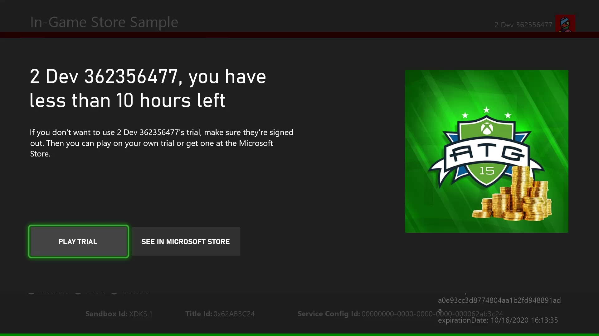
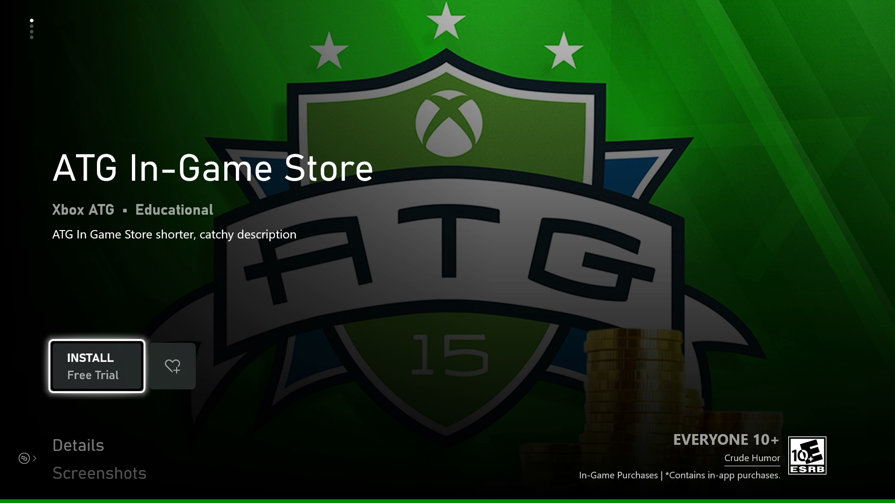

# Implementing trials for your game

You can configure several different types of free trials for your game:

* *Time-limited free trials* - These trials expire after a certain amount of *calendar* time passes (for example, seven days after the user downloads the trial, regardless of how long they use it).
* *Usage-limited free trials* - Allows configuration to let the user run the game for a certain amount of *game runtime*, then requires that the user purchase the game to continue using it.  
* *Curated trials* - These trials have no expiry or game runtime limits, but the game can limit what is playable. Similar to a demo, but the whole game is required to be downloaded.

> [!NOTE]
> Time- and Usage-based trials are intended to be offered once per title per user and must not be mixed with other trial offers.
> Expired or exhausted trial entitlements stay on the user account and prevents acquisition of any extra trial offers for the same game.
>Trial type can't be altered or reset once a trial is acquired by a customer.

> [!NOTE]
> Some trials are free but are limited to users who own specific subscriptions.
This article applies to those trials as well.

> [!NOTE]
> Games running as part of **Free Play Days** offers aren't running as actual trials, but can be launched only by temporary full licenses.
Trial configuration and related structures don't apply.

## Configuring a usage-limited trial in Partner Center

> [!NOTE]
> You can access this feature only if you have the proper permissions and if your game uses [restrictive licensing](../pc-specific-considerations/xstore-open-and-restrictive-licensing.md).
For details, contact your Microsoft account manager.  

You can configure usage-limited free trials in Partner Center without altering the game's code.
However, you have to add code in the following scenarios:

* Restricting trial access only to the user who acquired the trial in the store.
* Saving game state between play sessions and carrying over the user's progress from the trial to the full game after being purchased.

1. From the **Submission overview** page, go to the **Pricing and availability** page.

2. Under **Free trial**, open the drop-down menu, and then select **Usage-limited**.

3. In the second drop-down menu that appears, select the maximum time that users can use your app.

4. Select **Save**.

After you publish your game to Microsoft Store, you'll see the trial information on the game's product page.

## Restrict access to only users who acquired the trial

In some cases, you might want to let only trial owners run the game.
This limitation is important for a usage-limited trial as you don't want someone else to run down the trial time for another account.
You can implement this functionality by checking the [XStoreGameLicense](../../../reference/system/xstore/structs/xstoregamelicense.md)`.isTrialOwnedByThisUser` property.
If it's `false`, block the current player from proceeding and inform the user to obtain their own trial license.

The user that owns the active trial license is displayed on a message when the trial game is launched:



The following code example shows how to do check `isTrialOwnedByThisUser`.

```cpp
void CALLBACK GameLicenseTrialCheck(XAsyncBlock* asyncBlock)
{
    XStoreGameLicense result{};

    HRESULT hr = XStoreQueryGameLicenseResult(
        asyncBlock,
        &result);

    // Is this a trial?
    if (result.isActive && result.isTrial)
    {
        // Is this trial owned by this user?  
        if (!result.isTrialOwnedByThisUser)
        {
            // The user can't use another user's trial time. Show an error message.
        }
    }
}

void QueryGameLicense(XStoreContextHandle storeContextHandle, XTaskQueueHandle taskQueueHandle)
{
    auto async = new XAsyncBlock{};
     asyncBlock->queue = m_asyncQueue;
    asyncBlock->callback = GameLicenseTrialCheck;

    HRESULT hr = XStoreQueryGameLicenseAsync(
        storeContextHandle,
        async);
}

```

## Save the game state for the original trial user

Xbox services-enabled games that have single player campaigns or other game modes tracking progress between sessions use connected storage to save the game state.
With a limited trial, however, a PC user can create multiple Microsoft accounts and keep playing beyond the time limit while saving progress (by using the same Xbox account).
For more information on this scenario, see [Handling mismatched store account scenarios on PC](../pc-specific-considerations/xstore-handling-mismatched-store-accounts.md).

This loophole can be prevented by saving the [XStoreGameLicense](../../../reference/system/xstore/structs/xstoregamelicense.md)`.trialUniqueId` value when the game progress is saved.
Later, when the user starts playing the trial again, you can check whether the `trialUniqueId` value matches the one from the first run.

This code assumes the game saves the `trialUniqueId` as part of the game save, and has a `GetSavedTrialUniqueId` function that returns this value.

```cpp
void CALLBACK GameLicenseTrialCheck(XAsyncBlock* asyncBlock)
{
    XStoreGameLicense result{};

    HRESULT hr = XStoreQueryGameLicenseResult(
        asyncBlock,
        &result);

    // Is this a trial?
    if (result.isActive && result.isTrial)
    {
        // Is this trial owned by this user?
        if (!result.isTrialOwnedByThisUser)
        {
            // The user can't use another user's trial time. Show an error message.
        }
        else
        {
            // Read the trialUniqueId that was saved with the game on the first run.
            char trialUniqueId = GetSavedTrialUniqueId();
            if (trialUniqueId != result.trialUniqueId)
            {
                // Because the IDs don't match, start the game from the beginning.
            }
        }
    }
}
```

## Testing trials in development

In order to test your game with a trial license, the game must first be configured with a trial license in Partner Center.

### Xbox

For local builds, a real license is required.
For loose and packaged builds, applying a content ID and EKBID override is required in MicrosoftGameConfig.
For more information, see [Enabling license testing](../getting-started/xstore-licensing-setup.md).

Note the actual EKBID from a trial build must be used here.
To get the EKBID, you need to download the game build from the Microsoft Store with an account that has a trial license.



Once configured, launching with a [test account](../../../services/develop/test-accounts/live-setup-testaccounts.md) that obtained the trial license from the store, `XStoreGameLicense` exhibits accurate trial attributes.
Launching the build should display the trial notification UI.

### PC

Same as how to enable builds with a full license&mdash;use the correct app identity in MicrosoftGame.config and ensure the proper content ID in the registry location, and the build respects the license for the signed in account of the Microsoft Store app, trial or otherwise.

## See also

[Commerce Overview](../commerce-nav.md)

[Enabling XStore development and testing](../getting-started/xstore-product-testing-setup.md)

[Enabling license testing](../getting-started/xstore-licensing-setup.md)

[XStore API reference](../../../reference/system/xstore/xstore_members.md)
