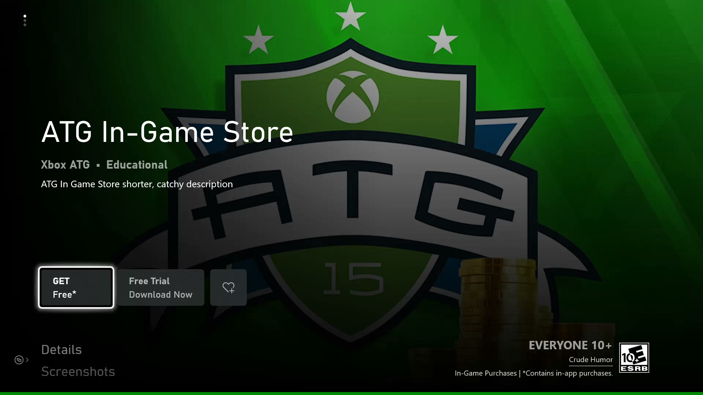
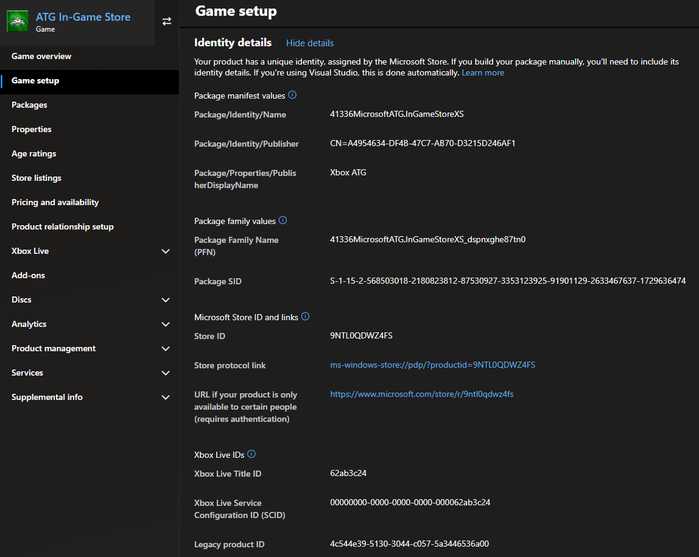
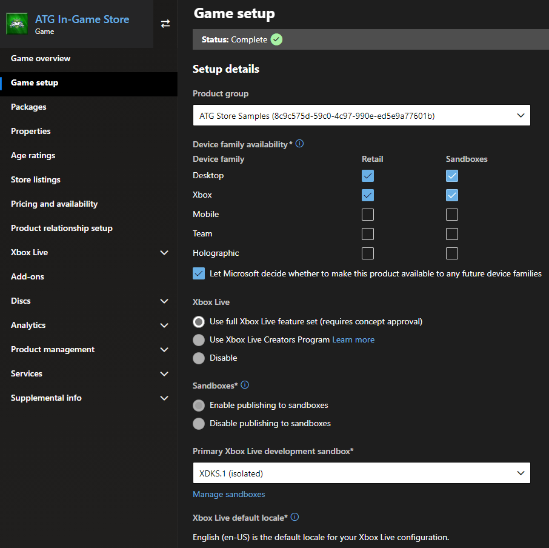
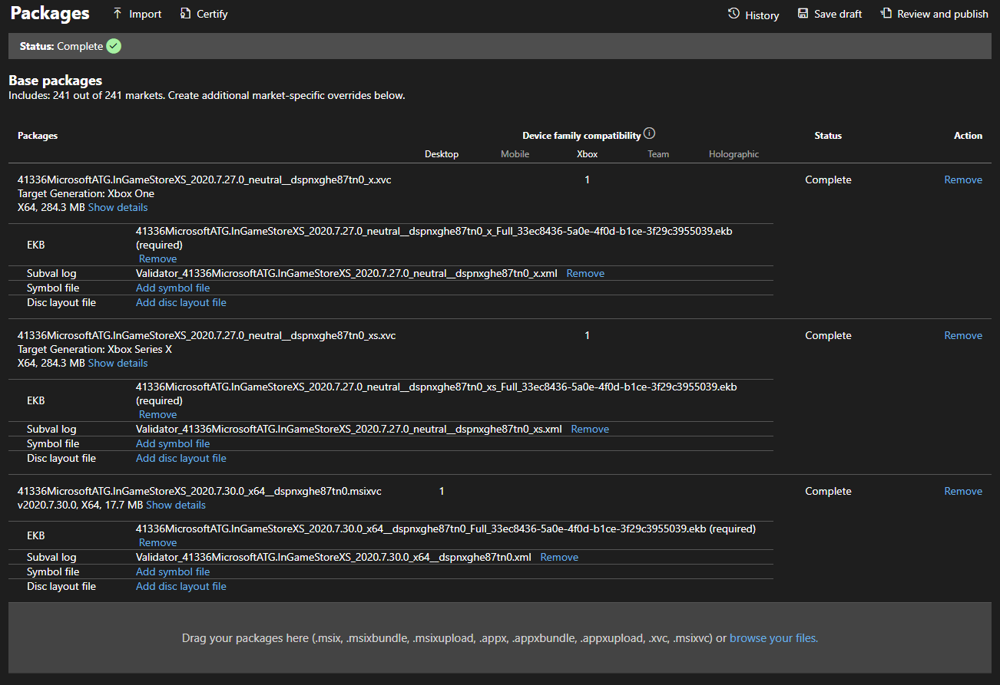
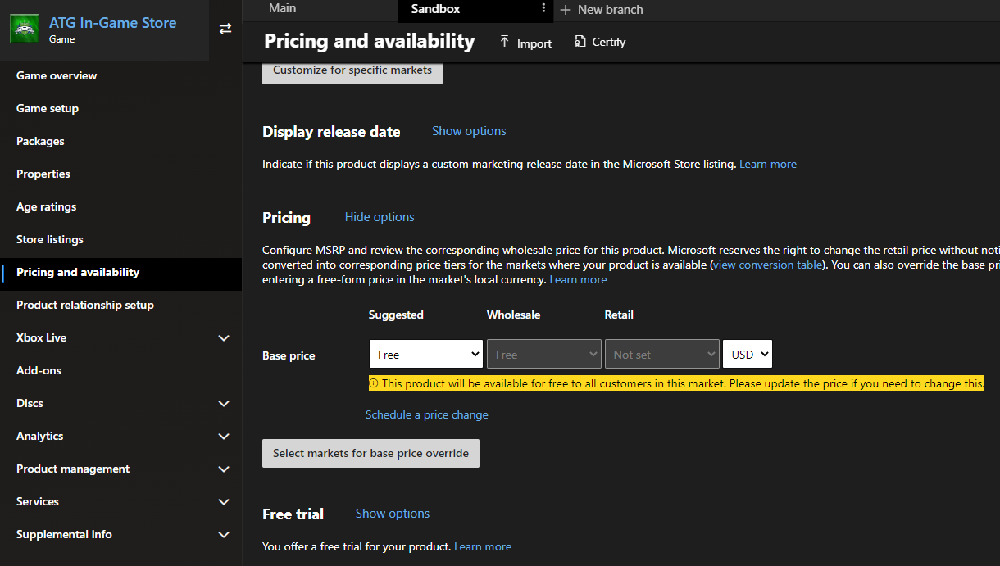
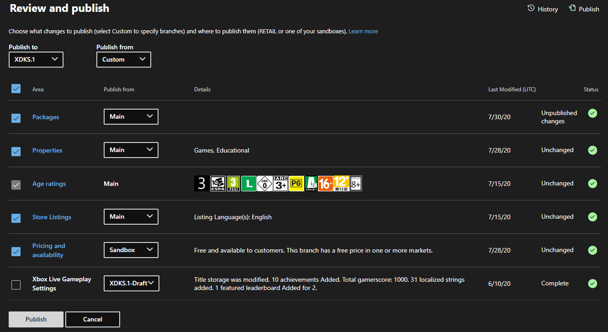

# Initial configuration in Partner Center

To develop and test commerce features, products must be configured in and published from Partner Center.
Usually the initial publishing is to a developer sandbox under your publisher.

The most important aspect is the ability to see, acquire, and download your product from the Microsoft Store in your development sandbox.

To view, acquire, and download your product a successful submission within Partner Center is required with the following elements:

1. [Reserving a name](#1-reserving-a-name)
2. [Selecting which device families to target](#2-selecting-which-device-families-to-target)
3. [Enabling the game for Xbox services](#3-enabling-the-game-for-xbox-services)
4. [Enabling the game for sandbox publishing](#4-enabling-the-game-for-sandbox-publishing)
5. [Uploading one or more packages](#5-uploading-one-or-more-packages)
6. [Assign age ratings](#6-assign-age-ratings)
7. [Defining store listings](#7-defining-store-listings)
8. [Set up pricing and availability](#8-set-up-pricing-and-availability)
9. [Publishing to sandbox](#9-publishing-to-sandbox)

This document isn't intended to be a comprehensive guide to all things related to Partner Center configuration, but the **minimum** requirements to be able to get test accounts in the right state for testing the `XStore` API.

Here are some considerations to each of the previous elements.

## 1. Reserving a name

Identifies your title within the services and device ecosystem.
The name is static for the lifetime of the product, can't be changed once published, and is used to generate the app identity and Package Family Name.
Typically, end users don't see this name in marketing and consumer interfaces, but they can find it in diagnostic info and directory structures.

Examples:

| Name | App identity | Package Family Name |
| - | - | - |
| InGameStoreXS | **41336MicrosoftATG**.*InGameStoreXS* | **41336MicrosoftATG**.*InGameStoreXS*_**dspnxghe87tn0** |
| FlightSimulator | **Microsoft**.*FlightSimulator* | **Microsoft**.*FlightSimulator*_**8weka3d8bne** |

*Name* is what is reserved.
The strings in **bold** are associated with your publisher and are automatically generated.

The app identity must be assigned in your MicrosoftGame.Config for Partner Center to accept the associated package.
The identity is also required for both loose and packaged builds of your game on a Windows PC.
Without the proper identity values, your title can't link to the correct Xbox Live configuration or `XStore` operations.

Many titles opt to use a code name for the reserved name as there are instances of the name showing on a user's device when the product package is installed.
Using a code name can be important for pre-orders, where the package is pre-installed but needs to remain secret until the day of release.

Variations of the app identity and Package Family Name can be found in:

- `get-appxpackage`
- `wdapp list` when the package is installed.
- C:\Program Files\WindowsApps or C:\XboxGames
- Registry
- Xbox: File info in My games

> [!NOTE]
> The identity name section uses part of a random string when the product is created. Therefore, if you delete a Partner Center product then re-create it with the same app name, it generates a different identity string.

The finalized identity details can be found in **Game setup > Identity details**.

## 2. Selecting which device families to target

If your title is cross-platform, select each device family in the checklist your title is releasing for.
In general, only Xbox and Desktop are needed.

The Xbox is a single device family, which encompasses Xbox One and Xbox Series X/S devices.
Select Xbox regardless of whether your title supports only Xbox One, only Xbox Series X/S, or both.
To support PC, select the Desktop option.

> [!NOTE]
> Selecting Xbox and Desktop for the same product implies you wish to offer your game as a Smart Delivery title. For more information, see [Smart delivery](../../../features/console/cross-gen/cross-gen-smart-delivery.md).

The alternative is to have separate products for each device family or console generation.
This approach is complicated if you wish to share Xbox Live services or add-on products between console generations.
Speak to your Microsoft Representative to talk through the implications of each option.

## 3. Enabling the game for Xbox services

Typically, enabling the game for Xbox services involves some steps that your production team and Microsoft Account Management need to set up, including concept approval.
For the purposes of these articles, we're assuming your title is utilizing the full tier of Xbox services.

This setup is essential as switching sandboxes requires Xbox services authentication, and any B2B API that your title services use.

Contact your Microsoft Representative for more information on enabling Xbox Live services for your title.

## 4. Enabling the game for sandbox publishing

A well-established convention of Xbox and PC game development is to isolate development content from retail.
Not enabling the sandbox publishing option forces the submissions to immediately publish in retail.
Testing in RETAIL can be difficult on console and risks early exposure of your title if not properly configured for a flight / user group.
RETAIL testing can be more straightforward for simple PC titles.

Keep in mind that once the product is published for the first time, it's impossible to change the sandbox capability from disabled to enabled or vice versa.

This figure shows a typical configuration for a cross-platform PC and Xbox game, fully Xbox services-enabled product, which is developed in a sandbox by default.

## 5. Uploading one or more packages

Each device family requires at least one package submitted before it can be published.
For the Xbox device family, one package for each generation is also supported.
Keep in mind that for the purposes of being able to test commerce scenarios, this package doesn't have to represent a fully featured game&mdash;a stub package is sufficient.

For more information on how to generate packages for each device, see these articles:  
[Getting started packaging titles for Xbox consoles](../../../features/common/packaging/overviews/packaging-getting-started-for-console.md)  
[Getting started with packaging titles for a PC](../../../features/common/packaging/overviews/packaging-getting-started-for-PC.md)

This figure shows a cross-platform, Smart Delivery title that has packages for all relevant devices.
Note the **Target Generation** differentiating between Xbox One and Xbox Series X/S.

## 6. Assign age ratings

Talk to your Microsoft Representative for any questions regarding obtaining and submitting age ratings for actual game.
For the purposes of testing commerce scenarios, any initial rating can be set as test accounts are always created with an adult age.
The catalog results respect age ratings when called by accounts that don't meet the required age.

## 7. Defining store listings

Here, just one language needs to be populated.
The store listing by default shows the reserved name as the title of the product, to be seen in the Microsoft Store product page.
Certain images of different dimensions are also required.

## 8. Set up pricing and availability

Create a branch for your sandbox Pricing and Availability so that your test configuration doesn't interfere with retail pricing and visibility.
All retail publishing is done from the main branches.

To properly test your in-game UI for pricing, set your title with a test price in your sandbox branch.
This price can be the planned retail pricing, or any other arbitrary amount.
All test accounts have a test payment instrument and can acquire the product through the purchase flow in your sandbox

In your sandbox branch, set availability and visibility to *as soon as possible*.
For the Main branch however, set your product's actual announcement and release dates.

The following image shows a product's pricing and availability configured in two branches:

## 9. Publishing to sandbox

Once all of the previous elements are configured, even if not final, select **Review and publish** to publish your changes to the developer sandbox.
An initial publish can take up to a few hours to become visible within the sandbox, depending on the size of the package.
Subsequent submissions can be faster and involve selecting specific elements to publish, depending on what was changed.

## Publishing add-ons

These steps are mostly similar when creating add-ons.
A Durable with a package requires the package be upload as indicated in [Uploading one or more packages](#5-uploading-one-or-more-packages); all other add-on types don't require a package.
Consumable product types require a quantity.

## Conclusion

Once the publish finishes, it's time to verify by going to the Microsoft Store page for the product to see if it's acquirable and installable.
See [Xbox services Sandboxes overview](../../../services/fundamentals/sandboxes/live-setup-sandbox.md) and [Switching sandboxes properly for Store operations](../pc-specific-considerations/xstore-switching-pc-sandbox-for-store.md) for information on how to switch your sandbox properly to reach the Microsoft Store page.

Once verified as working, move on to the [Enabling XStore development and testing](xstore-product-testing-setup.md) to learn about how to set up your build to actually be able to test commerce features using `XStore` API.

## See also

[Commerce Overview](../commerce-nav.md)  

[Setting up an app or game at Partner Center](../../../services/fundamentals/portal-config/live-setup-partner-center-partners.md)  

[Enabling XStore development and testing](xstore-product-testing-setup.md)

[XStore API reference](../../../reference/system/xstore/xstore_members.md)
