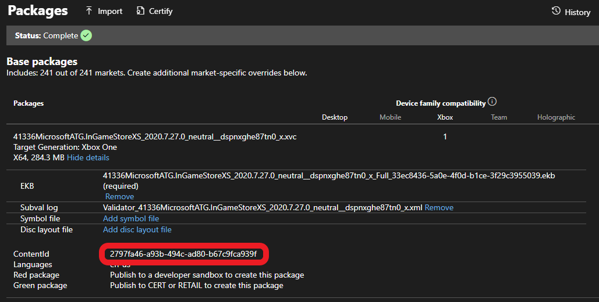

# Enabling license testing

This article describes how to set up a development build to be licensable in order to test licensing-related scenarios.

## Relevant scenarios and APIs

To test the following APIs, you need to set up your development environment as described in this article:  

| API | Usage |
| --- | ----- |
| [XStoreQueryGameLicenseAsync](../../../reference/system/xstore/functions/xstorequerygamelicenseasync.md) | Querying the characteristics of a trial or disk-based license for the game. |
| [XStoreQueryLicenseTokenAsync](../../../reference/system/xstore/functions/xstorequerylicensetokenasync.md) | Generating a valid license token for service-based validation, see [Using License Tokens](../pc-specific-considerations/xstore-license-tokens.md). |
| [XStoreQueryAddOnLicensesAsync](../../../reference/system/xstore/functions/xstorequeryaddonlicensesasync.md) | Returning add-on licenses (Durables without packages) attached to a digital game license. |
| [XStoreRegisterGameLicenseChanged](../../../reference/system/xstore/functions/xstoreregistergamelicensechanged.md) | Registering to detect a license change (for example, when a trial license upgrades to a full license). |

## Context

In retail scenarios, a game must have a license to be played.
A license request checks for an installed disc or sends a request to Microsoft services.
A license is granted if the account is entitled to the product through a direct or satisfying purchase (for example, from a subscription or bundle).
Licenses can also be granted in sharing scenarios.
For more information about sharing, see [Product sharing model for games](../fundamentals/xstore-product-sharing-model-for-games.md).

Development scenarios don't follow this behavior by default.
These scenarios include:

* Loose builds (Visual Studio F5 deploy, xbapp/wdapp register/deploy)
* Local package builds (makepkg, xbapp/wdapp install)

These builds launch without any licensing checks or related configuration.
Most `XStore` APIs still work, but unexpected results can occur when licensing games or Durables.

To configure a build to behave as licensable, apply the correct identity values to the MicrosoftGameConfig (described in [Enabling XStore development and testing](xstore-product-testing-setup.md)).

Then the following steps must be taken:

1. [Note content ID specific to the game or DLC](#get-contentid)
2. [Apply content ID to build, as appropriate to the build type](#apply-content-id-to-build)
3. [**Console only**: Note and apply EKBID to build](#apply-ekbid-to-build-only-applicable-to-console)

Then for each account running the build, an entitlement must be acquired by purchasing the product from the appropriate Store for the platform.

## Get ContentID

You can find the ContentID on the **Packages** page after you select **Show details**:



> [!NOTE]
> The content ID for [sandbox](../../../services/fundamentals/sandboxes/live-setup-sandbox.md) and retail versions can be different.
> If you install a retail version of the game, the product associates with a different content ID than the one you need for sandbox.
> Content ID also differs if regional packages are involved.

### Console

Find the content ID for an installed package by running `xbapp list /d` (or `xbapp listdlc /d` for DLC) in the Gaming Command Prompt.

```cmd
Registered Applications by Package Full Name:

   41336MicrosoftATG.InGameStoreXS_2020.7.27.0_neutral__dspnxghe87tn0  
        Install  
        Drive: Development  
        Size: 0.28 GB.  
        ContentId: {2797FA46-A93B-494C-AD80-B67C9FCA939F}  
        ProductId: {4C544E39-5130-3044-C057-5A3446536A00}  
        EKBID: {37E80840-6BE0-46F8-8EDB-92F877056087}  
        DisplayName: ATG In-Game Store Sample  
        41336MicrosoftATG.InGameStoreXS_dspnxghe87tn0!Game  
```

### PC

Find the content ID for an installed package by running `wdapp list /d` (or `wdapp listdlc /d` for DLC) in the Gaming Command Prompt.
For packages you install from the store, use the `/includeStore` flag.

## Apply content ID to build

For loose builds, add the following section in MicrosoftGameConfig:

```xml
  <DevelopmentOnly>
    <ContentIdOverride>2797FA46-A93B-494C-AD80-B67C9FCA939F</ContentIdOverride>
    <EKBIDOverride>00000000-0000-0000-0000-000000000001</EKBIDOverride>
  </DevelopmentOnly>
```

For package builds, pass the content ID to `makepkg`.
For example:

```cmd
makepkg pack /v /f chunks.xml /d Gaming.Xbox.XboxOne.x64\Layout\Image\Loose /pd ./output /contentid 2797FA46-A93B-494C-AD80-B67C9FCA939F
```

If you create a package without the `/contentid` parameter, the installation process applies any available `ContentIdOverride` in the MicrosoftGameConfig when you install from a local source.

Builds installed from the Store (sandbox or retail) always have the proper content ID (as seen in Partner Center).

## Apply EKBID to build (only applicable to console)

Set the EKBID (Escrow Key Blob ID) to make the build licensable on console.
For most scenarios, it simply needs to be overridden from the default test value of all zeroes or 33EC8436-5A0E-4F0D-B1CE-3F29C3955039.

Override the EKBID with the following command:

```cmd
xbapp setekbid <package full name> {<GUID that is not all zeroes or 33EC8436-5A0E-4F0D-B1CE-3F29C3955039>}
```

For example:

```cmd
xbapp setekbid 41336MicrosoftATG.InGameStoreXS_2020.7.27.0_neutral__dspnxghe87tn0 {00000000-0000-0000-0000-000000000001}
```

This setting isn't relevant on PC (there's no `wdapp setekbid` command).

### Trials and EKBID

For **trials**, the actual EKBID must be applied.
To find the EKBID that the game uses, run `xbapp list /d` for a build installed from the Store.
For more information, see [Implementing trials for your game](../fundamentals/xstore-usage-limited-free-trials.md).

## Ensure test account is entitled to product in the sandbox

For products published to both sandbox and retail, you can use the [DevEntitlementTool](../../../tools/tools-services/live-dev-entitlements-tool.md) to query and acquire entitlements for a test account.

The best way to get an entitlement is to go directly to the product's Store page through protocol activation, because products published only to sandbox might not be searchable.
The development console or PC must be set to the sandbox where the game is published.
For more information, see [Xbox services Sandboxes overview](../../../services/fundamentals/sandboxes/live-setup-sandbox.md) and for PC, see [Switching sandboxes properly for store operations](../pc-specific-considerations/xstore-switching-pc-sandbox-for-store.md).

Once signed in properly, use the store protocol link to reach the Store page:

**On console:**

Use Gaming Command prompt:

`xbapp launch ms-windows-store://pdp/?productid=<storeID>`

**On PC:**

In Run box (⊞Win +R) or in a web browser

`msxbox://game/?productId=<storeID>` (to show product in Xbox App)

Or

`ms-windows-store://pdp/?productid=<storeID>` (to show product in Microsoft Store)

Once on the Store page, select **Buy** or **Get** to acquire a license for the product for your [test account](../../../services/develop/test-accounts/live-setup-testaccounts.md).
Download and installation of games and DLC should start automatically. If you're planning to iterate with local builds, you can cancel the operation.

> [!Note]
> You must acquire an entitlement for every account that runs the build and expects license-related XStore APIs to work.

## DLC

In order for local DLC to be licensable, the content ID must be applied to `makepkg` and `xbapp setekbid` set to something other than the default values.
Only the DLC needs to be configured for licensing, not the base game.

License overrides are relevant to the following APIs when called with a packaged Durable:

* [XStoreAcquireLicenseForDurablesAsync](../../../reference/system/xstore/functions/xstoreacquirelicensefordurablesasync.md)
* [XStoreAcquireLicenseForPackageAsync](../../../reference/system/xstore/functions/xstoreacquirelicenseforpackageasync.md)
* [XStoreCanAcquireLicenseForPackageAsync](../../../reference/system/xstore/functions/xstorecanacquirelicenseforpackageasync.md)
* [XStoreCanAcquireLicenseForStoreIdAsync](../../../reference/system/xstore/functions/xstorecanacquirelicenseforstoreidasync.md)
* [XStoreRegisterPackageLicenseLost](../../../reference/system/xstore/functions/xstoreregisterpackagelicenselost.md)

More details can be found here:

[Manage and license downloadable content (DLC)](../fundamentals/xstore-manage-and-license-optional-packages.md)

[How to use a durable without a package](../fundamentals/xstore-dwobs.md)

## See also

[Commerce Overview](../commerce-nav.md)  
[Enabling XStore development and testing](xstore-product-testing-setup.md)  
[Switching sandboxes properly for Store operations](../pc-specific-considerations/xstore-switching-pc-sandbox-for-store.md)  
[XStore API reference](../../../reference/system/xstore/xstore_members.md)
