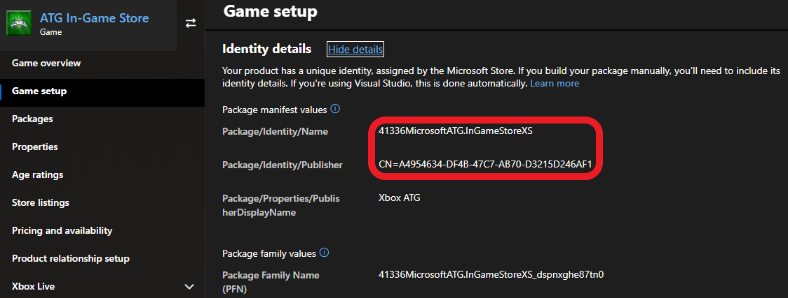
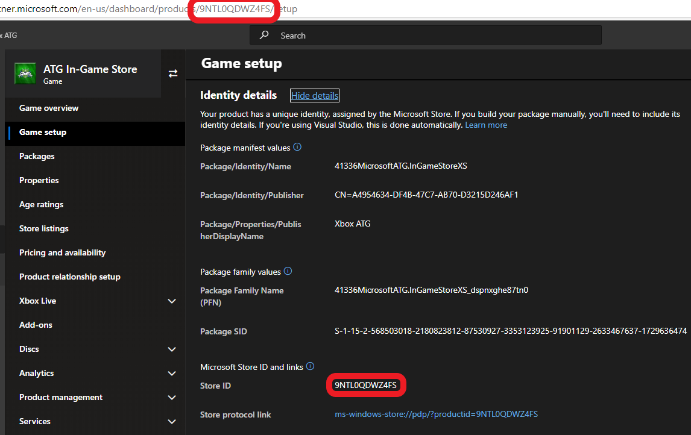

# Enabling XStore development and testing

Games use the [XStore APIs](../../../reference/system/xstore/xstore_members.md) to perform operations on the licenses and entitlements that are associated with your game and its related products (for example, add-ons).
Many of the `XStore` operations manipulate information about your game managed by Microsoft Store services.

> [!NOTE]
> This page is substantially updated from previous versions.
As of June 2023, most[*](#exceptions) `XStore` API testing no longer requires setting up the build to be licensable (for example, contentIdOverride) and for each account to have an entitlement to the game.

When you're testing commerce in development sandboxes, all purchases on a single test account must be done in the same sandbox.
Switching a test account to another sandbox and purchasing more items result in unexpected query results for the account in both sandboxes.
This is because the licenses and information of a purchase are tied to the first sandbox the item was purchased in for a single account.

When testing commerce in development sandboxes on PC, make sure that the account signed into the Microsoft Store App and the Xbox app are the same.
When in sandboxes, the credentials used for items in the Microsoft Store are tied to the Xbox account specifically.
This is critical to ensure all operations interact with products published specifically to the active sandbox.
See [Handling mismatched store account scenarios on PC](../pc-specific-considerations/xstore-handling-mismatched-store-accounts.md) for more info.

In order to test most[*](#exceptions) `XStore` API, ensure the game config contains the proper values derived from Partner Center.

<a id="exceptions"></a>
\* **API related to licensing, such as [XStoreQueryGameLicenseAsync](../../../reference/system/xstore/functions/xstorequerygamelicenseasync.md), will require a fully licensed context to function properly.**
See [Enabling license testing](xstore-licensing-setup.md) for complete details.

## Apply game IDs to MicrosoftGameConfig

First, publish your game and add-ons on [Partner Center](xstore-initial-configuration-in-partner-center.md).

Then in the game's config file ensure the values match your configured title:

```xml
  <Identity
    Name="41336MicrosoftATG.InGameStoreXS"
    Publisher="CN=A4954634-DF4B-47C7-AB70-D3215D246AF1"
    Version="2023.5.5.0" />
  <StoreId>9NTL0QDWZ4FS</StoreId>
  <MSAAppId>000000004C2690C8</MSAAppId>
  <TitleId>62ab3c24</TitleId>
```

### Identity

Located in Partner Center under **Game setup > Identity details**.

On PC: Strictly required to match what is assigned to your game in Partner Center.

While it isn't required for console, it should be checked when a package is created for submission to Partner Center.



`Name` in the `Identity` node needs to match **Package/Identity/Name**; `Publisher` in the `Identity` node needs to match **Package/Identity/Publisher**.

### StoreID

Also found in **Game setup > Identity details**



## See also

[Commerce Overview](../commerce-nav.md)

[Initial configuration in Partner Center](xstore-initial-configuration-in-partner-center.md)

[Enabling license testing](xstore-licensing-setup.md)

[Switching sandboxes properly for Store operations](../pc-specific-considerations/xstore-switching-pc-sandbox-for-store.md)

[XStore API reference](../../../reference/system/xstore/xstore_members.md)
