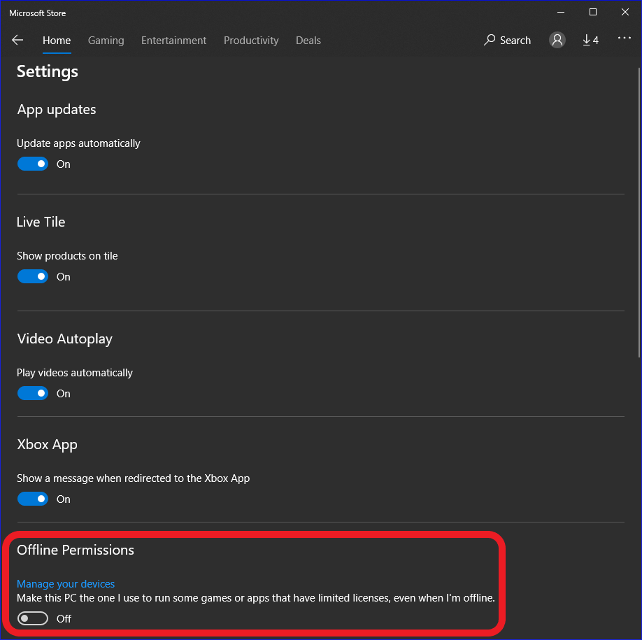
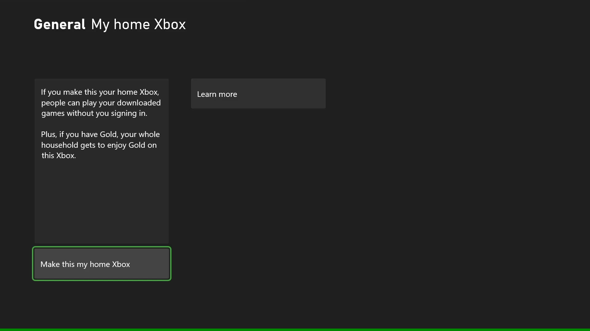

# Open and restrictive licensing

> [!NOTE]
> This article describes the features that are available to users only with the proper permissions.
For details, talk to your Developer Account Manager or other contact at Microsoft.

Microsoft Store supports three licensing models: *default*, *open*, and *restrictive*.
The default model (the only model supported by Microsoft Store) is set up by default.
The open and restrictive models are set through your Microsoft representative.

The following table shows the key differences among the three licensing models.

| Licensing type | Offline devices | Online devices | Typical usage | Devices supported |
| -------------- | --------------- | -------------- | ------------- | ----------------- |
| Default | 10 | N/A | Most apps | All\* |
| Open | Unlimited | Unlimited | Free-to-play or free to download apps | All\* |
| Restrictive | 1\*\* | Only 1 at a time | Games that aren't free-to-play | PC, Xbox |

> \*\* [Xbox Play Anywhere](https://www.xbox.com/games/xbox-play-anywhere) titles can have two offline devices: one PC and one console.

If you want to use open or restrictive licensing for your app or game, talk to your Microsoft account manager.

## Default licensing

All apps are initially configured as *default licensing*.
However, default licensing is treated differently based on Xbox console or PC.  

### Default licensing on Xbox

User is able to install their owned content on any number of consoles, but they can only have one roaming license and one offline license active at a time.
Resulting in the user only able to have at most two sessions of the game running concurrently if using two separate consoles.
For more information, see [Product sharing model for games](../fundamentals/xstore-product-sharing-model-for-games.md).

### Default licensing on PC

User can install a game on up to 10 devices linked with their Microsoft account.
Multiple users on those same devices can use the game without having to purchase it themselves.
All 10 devices can be running the game at the same time.
If the user wants to install on an 11th device, they must first remove a machine from their device list actively removing access for the game to run on that device before adding and installing to the new device.

## Open licensing for PC games

*Open licensing* lets any user acquire an app or a game without a purchase check.
Users can install the app on any number of devices.

Use open licensing for apps that don't need license enforcement or that do their own enforcement.
Open licensing isn't designed for paid apps.
An app with open licensing doesn't check to see if the user purchased it.
This licensing model reduces friction during acquisition.
However, the availability&mdash;for example, mobile operator exclusivity or market availability of the package&mdash;is still validated.

Age ratings aren't enforced with open licensing (this step is skipped).
However, age ratings are validated at purchase time.
Therefore, the app or game *must* be appropriate for all ages.

Open licensing skips the step to present legal information (such as an end-user license agreement (EULA)) to the user, so the app or game *must not* include any custom legal terms added through [Partner Center](https://partner.microsoft.com/dashboard), specifically the [Additional license terms](https://msdn.microsoft.com/windows/uwp/publish/create-app-store-listings#additional-license-terms) field on the **Store listing** page of Partner Center.

After open licensing is set, the device won't perform another check for changes in licensing.
For this reason, if you change to a different licensing model, there's no guarantee of the update to all users' licenses.
For licensing to be updated, users would have to reimage their devices or get new devices.

## Restrictive licensing for PC games

*Restrictive licensing* lets users install an app or a game on one offline device and one online device similar to the behavior of default licensing on the Xbox Console.
No more than two devices can use the license at the same time.
Only one license of the game can be actively running outside of the offline device at one time.
Therefore a concurrency check on the license is done when the app is launched from another PC.
If the online (roaming) license is already active on another PC, the title is suspended on the running machine and transferred to the new machine attempting to launch the game.
The user is presented with a message that the game was launched from a different device and that the game is being terminated.

For apps and games that are available on both Xbox and PC by using the same **Store ID** ([Xbox play anywhere](https://www.xbox.com/games/xbox-play-anywhere) titles), a user can set one console and one PC to run an app offline.

### To set a single PC as the offline device

1. Open the Microsoft Store app.
2. Select **Settings** from the drop-down menu.
3. In **Offline Permissions**, under **Make this PC the one I use to run some games or apps that have restrictive licenses, even when I'm offline**, turn the toggle switch to **On** (shown as follows).

**IMPORTANT:** You can change this setting only *three times per year*, so change it only when you're certain that it needs to be done.

### To set a single Xbox console as the offline device

1. On the Xbox One Home page, open **Settings** (left menu, gear icon, **All settings**).
2. Under **Personalization**, select **My home Xbox**.
3. Select **Make this my home Xbox** (shown as follows).
4. Select **Make this my home Xbox** again.

For this reason, if an app or a game with restrictive licensing is available for PC and Xbox consoles.
A user can install and run it offline on one PC and one Xbox One console.

If you change to a different licensing model, the change will be applied the next time the app or game is run online.

## See also

[Commerce Overview](../commerce-nav.md)

[XStore API reference](../../../reference/system/xstore/xstore_members.md)
