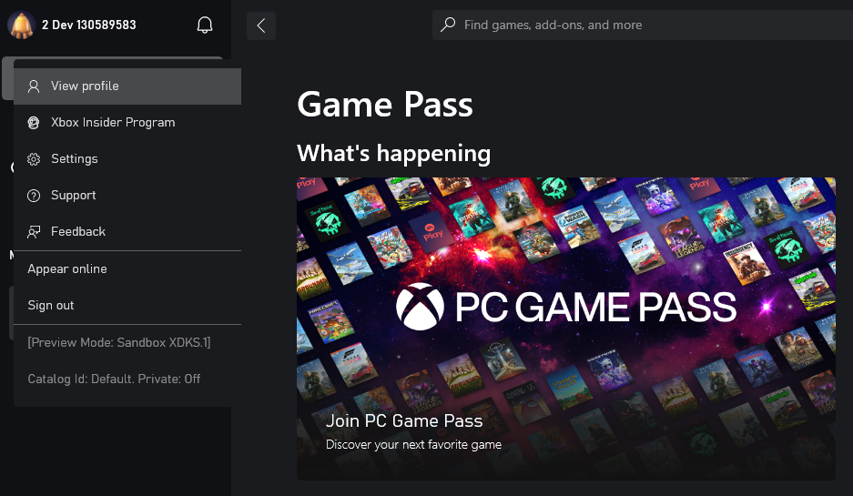

# Switching sandboxes properly for Store operations

You can switch sandboxes on your PC in various ways.
Use [`Xblpcsandbox.exe`](../../../tools/tools-services/live-pc-sandbox-switcher.md) because it signs out any accounts that are signed in to Xbox services-enabled apps when the sandbox changes.

For Xbox services operations, it suffices to sign-in with an account that is provisioned to the newly switched sandbox, which is similar to signing in with different accounts in retail.
Once signed in, the `XUser` context understands the current sandbox.

Store operations require an Xbox User signed into an Xbox services-enabled app to scope browsing and purchasing of products to a sandbox.
Simply signing in with an account in the Microsoft Store app defaults the sandbox scope to retail (or previous sandbox if one was set).

> [!IMPORTANT]
Therefore it's important to sign-in to Xbox services **first** after switching sandboxes:

1. From GDK command prompt: `xblpcsandbox` &lt;sandbox id&gt;
2. Sign in on the Xbox App with account provisioned for sandbox
3. Sign in on the Microsoft Store app with the same account

> [!NOTE]
> The Xbox App can pop up a dialog asking to switch the Store account to the newly signed in account.
Don't rely on this mechanism in sandbox.
Always explicitly sign-in with the test account on the Microsoft Store app.

The store account can also be a different account from the Xbox account.
For more information, see [Handling mismatched store account scenarios on PC](xstore-handling-mismatched-store-accounts.md).

Perform these steps after all transitions involving sandboxes:

* from retail to sandbox
* from one sandbox to another sandbox
* from sandbox to retail

The most common problem with failing to switch accounts properly is the store account isn't signed in **after** Xbox services sign-in, resulting in all store operations returning improper results.

> [!NOTE]
> When testing commerce in development sandboxes, make sure that all purchases on a single test account are done in the same sandbox.
Switching a test account to another sandbox and purchasing more items results in unexpected query results for the account in both sandboxes.
This behavior occurs because the licenses and information of a purchase are tied to the first sandbox the item was purchased in for a single account.

## Xbox App optimization

The Xbox App has an indicator in the menu that shows what sandbox is active:

The indicator appears when the PC is correctly configured for a development sandbox, and the test account signed into the Xbox App has access to that sandbox.

Using the Xbox App has the added benefit where the app can automatically attempt to reconcile the store accounts.
So, if you stay within the Xbox App, catalog, purchase operations, and ownership should reflect the same account and in the sandbox.

## In-game store operations (using `XStore` API)

The `XStoreContext` that the game obtains is that of the store account, whether that is explicitly signed in on the Microsoft Store app or done as part of Xbox App sign-in.
The best indicator of what account `XStore` API uses is the account that is used by the Xbox App for its store operations.

## See also

[Xbox Live PC Sandbox Switcher](../../../tools/tools-services/live-pc-sandbox-switcher.md)

[Xbox services Sandboxes overview](../../../services/fundamentals/sandboxes/live-setup-sandbox.md)

[Troubleshooting Sign-in Errors](../../../services/develop/troubleshooting/live-troubleshoot-sandboxes.md)

[Enabling XStore development and testing](../getting-started/xstore-product-testing-setup.md)
