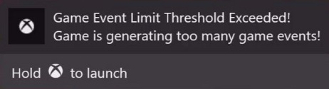

# Certification Tested Xbox Requirements for Xbox Console Games

Version 16.0 - 11/01/2025

Xbox Requirements (XRs) consist of the policies, technical requirements, and product component-related requirements to which all developers and publishers of Xbox console games must conform. XRs ensure that products created for Xbox consoles are not only stable and reliable but also provide a user experience that is consistent, safe, secure, and enjoyable.

Unless specifically noted, all Xbox Requirements apply to both the Xbox One and Xbox Series X\|S console generations.

* This page defines the XRs for the Xbox console games tested in Xbox Certification. For a list of all XRs, including those not tested in Xbox Certification, go to [Xbox Requirements](certification-requirements.md).
* For a summary of the changes in this release, see [changes in this release](#changes) at the bottom of this page.
* To review the historical change log of XRs and test cases, see [Change History for Xbox Requirements and Test Cases](../console-XR-change-history.md).
* View the [top ten failing test cases](console-TopFailingTestcases.md) on console.

> [!Important]
>The Certification team now conducts testing exclusively on retail consoles in the CERT sandbox for all [Final submissions](/gaming/game-publishing/concepts/certification/certification-guide). Previously, some test cases relied on GDK commands executed on Xbox development kits. These cases have been revised to use only steps available on retail consoles. [Optional submissions](/gaming/game-publishing/concepts/certification/certification-optional-submissions) are still tested on development kits in the CERT.DEBUG sandbox.

#### Testing suspend and resume

Refer to [Xbox Game Life Cycle](../../../gdk-dev/console-dev/overviews/xbox-game-life-cycle.md) for a detailed look at the concepts and events that make up the game life cycle. It demonstrates how to implement game state and state-change events in your game.
 
On retail consoles, a game will be suspended under the following conditions:

* When the console enters Connected Standby by being turned off with the power mode set to Instant-on.
* When the game remains out of focus for ten minutes. For example, launching an application such as Settings and keeping it in focus for ten minutes.

Test cases that suspend a game have been updated to indicate which method should be used.

## Base Requirements

The requirements in this category apply to the general rules for the standards of coding, behavior of titles, and submission of games.

### [XR-001: Title Stability](../XR/XR001.md) \*

Titles must be compliant with Microsoft Store policies regarding Title Stability. The following policy applies to this Requirement:

[10.4.2](/windows/apps/publish/store-policies#104-usability.md)  
Products must start up promptly, continue to run and remain responsive to user input. Products must shut down gracefully and not close unexpectedly. The product must handle exceptions raised by any of the managed or native system APIs and remain responsive to user input after the exception is handled.

#### 001-01 Title Stability

**Test Steps**

1. Sign in to an Xbox profile.
2. Launch the game.
3. Navigate all areas of the game, including but not limited to:
   * Gameplay
   * Menus and features
   * Downloadable content (DLC)
4. Using a new Xbox profile with no previous save data, repeat steps 1-3 while disconnected from Xbox services.

**Expected Result**  
game instability refers to any state where user input is not recognized, or the user is blocked from progressing due to a software crash without any user notification.  

**Pass Examples**

1. The game is stable.
2. The game does not cause unintended loss of user data.

**Fail Examples**

1. The game crashes, becomes unresponsive, or causes a console reboot.
2. The game causes the loss of user data.
3. A non-interactive pause or static screen is presented lasting over twenty seconds.
4. The game contains a loading screen which is more than two minutes with no indication of progress.
5. The game contains a loading screen which is more than three minutes with a progress indicator.

#### 001-02 Title Stability After Suspend

On retail consoles, a game will be suspended under the following conditions:

   * When the console enters Connected Standby by being turned off with the power mode set to Instant-on.
   * When the game remains out of focus for ten minutes. For example, launching an application such as Settings and keeping it in focus for ten minutes.  

For the purposes of this test case, both methods should be verified at step 3.  

**Test Steps**

1. Sign into an Xbox profile with the console power mode set to Instant-on.
2. Launch the game and progress into gameplay.
3. At various points throughout game, suspend the game.
4. Resume the game and verify the user can continue from their last gameplay location.
5. Continue to the next save point, save the game, and return to the main menu.
6. Reload the save made in step 6 and make sure all progress is still present.
7. Repeat steps 3-6 throughout the game.  

**Expected Result**  
Title instability refers to any state where user input is not recognized, or the user is blocked from progressing due to a software crash without any user notification. Additionally, users must not lose any save progress after returning to gameplay.

**Pass Examples**  
1. The game is stable and does not cause unintended loss of user data.
2. The game resumes from suspend and the user can immediately continue from their last gameplay location.
3. The game resumes from suspend and the user is prompted whether they want to resume from their last gameplay location.
4. The game resumes from suspend and returns to a previous menu or initial interactive state, however the user can load their last save location.
5. After suspending during online gameplay that requires online service connectivity, the game resumes and has returned the user to a previous menu or initial interactive state.
6. The game is terminated by the system as a result of connected storage de-synchronization.

**Fail Examples**  
1. The game is terminated as a result of a failure to suspend.
2. The game resumes from suspend and is terminated unexpectedly.
3. The game resumes from suspend and the user is unable to load their last save location.
4. The user is unable to re-establish a connection to partner-hosted services.

### [XR-003: Title Quality for Submission](../XR/XR003.md) \*

Xbox games must meet Xbox quality standards and be fully functional and testable.  

#### Functionally complete and testable

Titles must be fully functional and testable when submitted for certification. This includes all client code, submission artifacts, and downloadable content. Titles must be packaged cleanly with no failures using the current version of [Submission Validator](../../../features/common/packaging/subval/submissionvalidator.md). Submission Validator logs must be included with the submission.

#### Xbox quality standards

Xbox games must function correctly across all game modes and scenarios to meet player expectations. 

##### Title integrity

Titles must be free from severe issues such as crashes, freezes, unplayable frame rates, bugs causing major progression hindrances, or graphical corruption. Game settings, options, and controls must be applied correctly and respect default settings where appropriate. Navigation and content availability should be seamless, with no dead ends or inaccessible menus. Multiplayer functionality must be stable and functional, regardless of the number of players. 

##### Save game compatibility

Game saves and player progress must continue to function following content updates. Additionally, permanent data loss must not occur when loading an updated save with the base disc version.

>The following table shows which XR-003 test cases apply to your title on console or PC.

Test Case | Applicable to console | Applicable to PC
---------|----------|---------
 003-02 Title Integrity | Yes | Yes
 003-16 Save-Game Compatibility | Yes | Yes
 003-17 Headset State Change | Yes | No
 003-18 Headset State Change after Suspend | Yes | No

#### 003-02 Title Integrity

**Configuration**  

Refer to the [console test bench guide](#CONSOLEBENCH) at the bottom of this page to set up your consoles.

**Test Steps**  

1. Sign into an Xbox profile and launch the title.
2. Navigate through all menus, sub-menus, review all features, and complete all game modes.

   * Interact with and complete all menu UI, extra content, single player and multiplayer game modes, including any additional features in all supported languages.
   * Test offline, online, and split screen if applicable.
   * Test multiplayer game modes with the maximum number of players.
   * Post statistics to all supported leaderboards.  

**Expected Result**  
All titles must provide users with a reliable, fair, consistent, and complete Xbox entertainment experience.  

**Pass Examples**  

1.	The title can be completed in all game modes.
2.	Options set during gameplay are saved after terminating and re-launching the title.
3.	All areas of the title can be navigated as expected.
4.	Localized text displays correctly in all areas where supported.
5.	Users are able to post to leaderboards as expected.

**Fail Examples** 

1.	The title crashes at the end of a level or the user is blocked from progressing in any area of the game.
2.	Areas of the title cannot be navigated as expected.
3.	If the user inverts the horizontal or vertical camera controls with the pause menu, the camera controls do not change in-game.
4.	Users are not able to post to leaderboards as expected.
5.	A particular game mode cannot be completed if the user has already completed a different mode.
6.	Options set during gameplay are reset to default after terminating and re-launching the title. 
7.	The title is unplayable due to frame rate issues.

#### 003-16 Save-Game Compatibility
    
**Test Steps**  
1.    Sign in to an Xbox profile and launch the game without connecting to Xbox.
2.    Play the game and save your progress and settings. 
3.    Reboot the game and verify that you can load and resume the saved progress from step 2.
4.    Connect to Xbox and install the content update for the base title.
5.    Verify you can still load and continue your saved progress after the update. 
6.    Reboot the title, start a new game, and save your progress again. 
7.    Exit and uninstall the game.
8.    Re-install and launch the base game without a connection to the Xbox network.
9.    Verify that one of the following occurs:
     * You can load and continue your saved progress
     * The game displays a message indicating the save requires a content update to be installed
     * The game does not display the save made in step 6
10.    Reboot the title and install the content update.
11.    Verify you can still load and continue from your saved progress after the update. 

**Expected Result**  
A content-updated version of a game must be able to successfully load a save created using the non-content-updated version of the game.

**Pass Examples**  
1.    All saves can be loaded successfully by a content-updated version of a title.
2.    When launching the base version to load an updated save, the user is notified of missing content and given a reason why the save file could not be loaded, or the saves made in the content-updated version are not visible in the base version.

**Fail Examples**
1.    The content-updated version of the game is unable to load a game save created with a previous version of the title. 
2.    The base version of the game crashes when loading a save made with the content-updated version of the game.

#### 003-17 Headset State Change

**Test Steps**  
1. Enable Windows Sonic for Headphones as your headset format under Xbox Audio Settings.
2. Attach a pair of headphones to the controller or attach a pair of headphones wirelessly to the Xbox.
3. Boot the title and progress into gameplay.
4. Verify audio is heard through TV and headphones.
5. Unplug headphones, verify audio returns after a short amount of time.
6. Re-plug headphones, verify audio is heard through TV and Headphones.
7. Repeat steps 5-6 throughout the title.

**Expected Result**  
Audio continues to be heard without issue.  

**Pass Examples**  
1. Audio returns without issue whenever the headset is removed.
2. Audio returns without issue when headset is connected.  

**Fail Examples**  
1. Audio is no longer heard after the headset state changes.
2. Audio is distorted or corrupt after the headset state changes.

#### 003-18 Headset State Change after Suspend

On retail consoles, a game will be suspended under the following conditions:

   * When the console enters Connected Standby by being turned off with the power mode set to Instant-on.
   * When the game remains out of focus for ten minutes. For example, launching an application such as Settings and keeping it in focus for ten minutes.  

For the purposes of this test case, both methods should be verified at step 6.   

**Test steps**

1. Sign into an Xbox profile with the console power mode set to Instant-on.
2. Enable Windows Sonic for Headphones as your headset format under Xbox Audio Settings.
3. Attach a pair of headphones to the controller or attach a pair of headphones wirelessly to the Xbox.
4. Launch the game and progress into gameplay.
5. Verify audio is heard through TV and headphones.
6. At various points throughout game, suspend the game.
7. Resume the game and verify audio is heard through TV.
8. Re-attach the headphones and verify audio is heard through TV and headphones.
9. Repeat steps 6-8 throughout the game.

**Expected result**  
Audio continues to be heard without issue.

**Pass examples**

1. Audio returns without issue whenever the headset is removed.
2. Audio returns without issue when the headset is connected.

**Fail examples**

1. Audio is no longer heard after the headset state changes.
2. Audio is distorted or corrupt after the headset state changes.

### [XR-130: Xbox Console Families and Generations](../XR/XR130.md) \*

All game titles targeting a console generation must support the entire family of devices for that generation.

Xbox One games not using Smart Delivery function by default on Xbox Series X|S in compatibility mode. Games using Smart Delivery must work properly when running in compatibility mode on Xbox Series X|S.  

To maintain consistency across console generations, games must:

* Support navigation via gamepad input.  Titles may require additional peripherals for use with prior approval.
* Ensure that saved games work across console types within the generation.
* Ensure that online players are not segmented based on console type within the generation.
* Ensure that identical game modes are offered across console types within the generation.
* Between generations (Xbox One and Xbox Series X\|S), games which share the same TitleID must:
  * Support game save roaming for content available on both generations ([XR-052: User State and Title-Save Location, Roaming and Dependencies](../XR/XR052.md)).
  * Though not required, it is recommended that scenarios in which multiplayer, cooperative or competitive, experiences are supported offer at least one shared matchmaking hopper and allow for cross generation invite/join for shared content experiences.

#### 130-01 Controller Input

**Tools Needed**

* 1 Xbox One
* 1 Xbox One S
* 1 Xbox One X
* 1 Xbox Series X Dev Kit (using Xbox Series X\|S retail console mode)

**Test Steps**

1. Sign into an Xbox profile.
2. Launch the title.
3. Navigate all areas of the title and verify the title accepts navigation via controller input in each area.
4. Repeat all steps above across all generations of devices.

**Expected Result**  
The title supports navigation via a controller in all areas of the title and doesn't feature compulsory scenarios for other input devices, such as a keyboard/mouse. Titles may require additional peripherals for use with prior approval.

**Pass Examples**

1. The title accepts input from a controller in all areas of the title.

**Fail Examples**

1. The title accepts input from only a keyboard and/or mouse in certain areas of the title.

#### 130-02 Save Game Roaming

**Tools Needed**

* 1 Xbox One
* 1 Xbox One S
* 1 Xbox One X
* 1 Xbox Series X Dev Kit (using Xbox Series X\|S retail console mode)

**Test Steps**

1. Sign into an Xbox profile on device A and launch the title.
2. Begin gameplay and make save progress (if possible, create a settings save by changing or adding a new setting configuration).
3. Exit the title.
4. Sign in on a different device from the same generation with the same profile used in Step 1.
5. Launch the same title from Step 1 and verify that all saved games and any settings and/or configuration files can be accessed and loaded correctly and they don't have any dependencies on a specific same generation device.
6. Repeat all steps above across the same generation of devices.
7. For games which share the same TitleID across generations (Xbox One and Xbox Series X), repeat steps 1-4 for content available on both generations.

**Expected Result**  
Save games must work in their entirety across the same generation and save games must work in their entirety for games that share the same TitleID across generations (Xbox One and Xbox Series X) for content available on both generations.

**Pass Examples**

1. A game save made on an Xbox One S works on an Xbox One and Xbox One X, and vice versa across the whole family of Xbox One devices.
2. A game save must work for games that share the same TitleID across generations (Xbox One and Xbox Series X) for content available on both generations.

**Fail Examples**

1. A game save made in one generation (Xbox One or Xbox Series X) does not fully load across all device types in that generation.
2. A game save does not fully load for games that share the same TitleID across generations (Xbox One and Xbox Series X) for content available on both generations.

#### 130-03 Online Segmentation

**Tools Needed**

* 1 Xbox One
* 1 Xbox One S
* 1 Xbox One X
* 1 Xbox Series X Dev Kit (using Xbox Series X\|S retail console mode)

**Test Steps**

1. Sign into an Xbox profile and launch the title on all device types in the same generation.
2. Complete an Xbox network multiplayer game session featuring all devices.
3. Repeat step 2 across all Xbox network multiplayer modes supported by the title.

**Expected Result**  
Xbox network players must be able to join other Xbox network players irrespective of which console type is being used from the same generation.

**Pass Examples**

1. All consoles from the same generation of devices are able play against each other in multiplayer gameplay.

**Fail Examples**

1. Xbox network players are segmented within the same generation based on their Xbox One console type.

#### 130-04 Featured Game Modes

**Tools Needed**

* 1 Xbox One
* 1 Xbox One S
* 1 Xbox One X
* 1 Xbox Series X Dev Kit (using Xbox Series X\|S retail console mode)

**Test Steps**

1. Sign into an Xbox profile and launch the title.
2. Locate and access all featured game modes.
3. Repeat all steps above across the same generation of devices and ensure all game modes are identical on each device.

**Expected Result**  
Identical game modes must be offered across the same generation of devices.

**Pass Examples**

1. All consoles from the same generation of devices provide the same set of identical game modes.

**Fail Examples**

1. One or more consoles from same generation of devices provides different game modes based on their same generation console type.

#### 130-05 Compatibility Mode

**Configuration**

   * One Xbox Series X Dev Kit (using Xbox Series X\|S retail console mode)  

On retail consoles, a game will be suspended under the following conditions:

   * When the console enters Connected Standby by being turned off with the power mode set to Instant-on.
   * When the game remains out of focus for ten minutes. For example, launching an application such as Settings and keeping it in focus for ten minutes.  

For the purposes of this test case, both methods at Step 6 should be verified.  

**Test Steps**

1. For Xbox One titles, sign into an Xbox profile with the console power mode set to Instant-on.
2. Play through the title and ensure that the title performs as expected in compatibility mode.
3. Look to identify any areas where game performance, visuals, or audio is noticeably inferior between Xbox Series X to Xbox One X.
   * Check all different resolution outputs for performance issues.
   * Check Auto HDR with an HDR compatible screen.
4. Repeat Step 3 but this time look to identify any areas where game performance, visuals, or audio is noticeably inferior on the Xbox Series S to Xbox One S.
5. Ensure multiplayer fidelity between Xbox Series X\|S devices and also between Xbox One and Xbox Series X\|S devices (where supported).
   * Check matchmaking.
   * Check invites in both directions.
   * Check joining via the shell in both directions.
6. Ensure suspend and resume works as expected.
7. Ensure all game saves persist after a reboot of the console.
8. Ensure roaming saves between Xbox One (any part of the family) to Xbox Series X\|S (any part of the family) and back again functions.

**Expected Result**  
Xbox One games not supporting Smart Delivery must run without functional or performance issues on Xbox Series X\|S.

**Pass Examples**

1. The title has no performance issues when running on Xbox Series X\|S.
2. The title has no functional issues when running on Xbox Series X\|S.
3. The title can correctly enter, play, and finish all multiplayer modes when running between Xbox Series consoles, including when playing multiplayer between Xbox One and Xbox Series.
4. The title correctly supports suspend and resume when running on Xbox Series X\|S consoles.
5. The user's game saves made on Xbox Series X\|S consoles persist after a full title reboot.
6. The user's game save(s) created on Xbox One can be roamed to Xbox Series X\|S and all progress is still present. Roaming the same game save(s) back to Xbox One also retains all progress.

**Fail Examples**

1. The title has performance issues when running on Xbox Series X\|S.
2. The title has functional issues when running on Xbox Series X\|S.
3. The user cannot enter, play, or finish multiplayer in all modes when running between Xbox Series consoles, or when playing multiplayer between Xbox One and Xbox Series.
4. The title does not correctly suspend and resume when running on Xbox Series X\|S consoles.
5. The user's game save(s), or part of the game save, made on Xbox Series X\|S consoles do not persist after a full title reboot.
6. The user's game save(s) created on Xbox One cannot be roamed to Xbox Series X\|S without progress being lost. Roaming the same game save(s) back to Xbox One also loses some/all progress.

### [XR-131: Display Mode Support for Game DVR and Screenshots](../XR/XR131.md) \*

Titles must ensure that Game DVR and screenshots work properly across display modes and types. Titles that display in HDR do this by rendering both the SDR and HDR swap chains, because the SDR swap chain is used for SDR screenshots, broadcasting, and Game DVR.

#### 131-01 Game DVR and Screenshots

**Tools Needed**

* 1 Xbox One S
* 1 Xbox One X
* 1 Xbox Series X Dev Kit (using Xbox Series X\|S retail console mode)
* 1 4k/HDR Display

**Test Steps**

1. Sign in to an Xbox One S and Xbox Series S console set to 1080p with an HDR display attached and HDR output configured in the console's settings.
2. Launch the title.
3. Disable HDR in the console settings while the title is still running.
4. Return to the title and validate there are no defects in the displayed graphics.
5. Repeat steps 1-4 in 4K on an Xbox One X and Xbox Series X.  

**Expected Result**  
No graphical defects are displayed when the HDR/4K output is switched to SDR.  

**Pass Examples**

1. There are no black screens, no black bars and no obvious visual defects.  

**Fail Examples**

1. The SDR image is significantly lighter or darker than the HDR image.
2. The SDR image is smaller than the HDR image.
3. Significant black bars or borders are displayed on the SDR image.  

<a id='XR022'>

### </a>XR-022: Official Naming Standards \*

Titles must use the naming standards defined in the latest release of the [Terminology List](console-certification-terminology.md) for Xbox console and/or Xbox network features.

On Xbox consoles, titles must not display images or refer to components of the console system or components of peripherals using terms that are not specifically included in the terminology list.

#### 022-01 Official Naming Standards

**Test Steps**

1. Launch the title.
2. Visit all areas of the title.
3. Navigate all menus and sub-menus.
4. Change all available settings and options.
5. If the title supports saves, save and load all possible game types.
6. Watch all cinematics.
7. Note all text and images shown.  

**Expected Result**  
All text adheres to the most recent terminology list. Images must not display components of the console system or components of peripherals using terms that are not specifically included in the terminology list.

**Pass Examples**  
 None  

**Fail Examples**

1. The title uses a proprietary term or image from a competitive platform.
2. A title refers to a component of the console system or component of a peripheral using any term that is not included in the terminology list.

### [XR-074: Loss of Connectivity to Xbox and Partner Services](../XR/XR074.md) \*

Titles must gracefully handle errors with Xbox and partner services connectivity. Titles must honor the retry policies set by Xbox when attempting to retry a request to the Xbox service after a failure has occurred. Titles must appropriately manage messaging the user when services are unavailable. If a partner service is not available, the game must not indicate that there is an issue with the Xbox network. Titles must not crash or hang if network services are slowed or intermittently available.

#### 074-01 WAN Disconnection to Xbox Services

**Test Steps**  

1. Sign in to an Xbox profile.
2. While performing the following actions, disconnect the WAN network. If you are using an Ethernet switch/hub disconnect the uplink cable from the network device. If the device is connected via Wi-Fi, disconnect the uplink cable from the wireless access point connection:
    * Creating a new save point
    * Loading a save point
    * Reaching an auto-save point
    * Enumerating a list of saved games
    * Searching for and joining an online session
    * Attempting to create an online session
    * Viewing a leaderboard (if applicable)
    * Playing offline

**Expected Result**  
In the event that the console is unable to reach Xbox services, the title should respond with a user-friendly error message.  

**Pass Examples**  
 1. The title displays an error message indicating loss of network connection to Xbox services.
2. The title does not display an error message while playing a local game mode that does not require Xbox services.  
3. A title with `RequireXboxLive` in AppX manifest suspends and then terminates when connectivity is lost.

**Fail Examples**  
1. The user is unable to complete a non-online Xbox game session.
2. Title goes into an unresponsive or unstable state.  

#### 074-02 Direct Disconnection

**Test Steps**  
1. Launch the title and sign in to an Xbox profile.
3. While performing the following actions in the title, pull the network cable from the device, or power off the WAP or wireless router:
    * Creating a new save point.
    * Loading a save point.
    * Reaching an auto-save point.
    * Enumerating a list of saved games.
    * Searching for and joining an online session.
    * Attempting to create an online session.
    * Viewing a leaderboard (if applicable).
    * Playing offline.  

**Expected Result**  
In the event the device loses connection to Xbox services, the title should respond with a user-friendly error message.  

**Pass Examples**  
1. The title displays a user-friendly message while in online game mode.
2. The title does not interrupt gameplay during offline game mode. 
3. A title with `RequireXboxLive` in AppX manifest suspends and then terminates when connectivity is lost. 

**Fail Examples**  
1. An error message is displayed during offline game mode.
2. The title goes into an unresponsive or unstable state.
3. The user is able to view online menus or view buffered media after the network goes offline.

#### 074-03 Suspend Disconnection to Xbox Services

On retail consoles, a game will be suspended under the following conditions:

   * When the console enters Connected Standby by being turned off with the power mode set to Instant-on.
   * When the game remains out of focus for ten minutes. For example, launching an application such as Settings and keeping it in focus for ten minutes.  

For the purposes of this test case, both methods at step 3 should be verified.  

**Test Steps**

1. Sign into an Xbox profile with the console power mode set to Instant-on.
2. Launch the game and progress into gameplay.
3. At various points throughout game, suspend the game.
4. Resume the game and verify the game handles the disconnection gracefully.
5. Repeat Steps 3-4 throughout the game.

**Expected Result**  
In the event that the console is unable to reach Xbox services after being suspended, the title must resume successfully, handle the situation gracefully, and respond with a user-friendly error message where appropriate.  

**Pass Examples**  
1. During an online Xbox multiplayer session, the title displays an error message indicating loss of network connection to Xbox services.
2. The title does not display an error message while playing a local game mode that does not require Xbox services.  

**Fail Examples**  
1. The user is unable to complete a non-online Xbox game session.
2. The title goes into an unresponsive or unstable state.
3. The title displays a misleading or incorrect error message after resuming.  

#### 074-04 Xbox Service Re-connection During Suspend

On retail consoles, a game will be suspended under the following conditions:

   * When the console enters Connected Standby by being turned off with the power mode set to Instant-on.
   * When the game remains out of focus for ten minutes. For example, launching an application such as Settings and keeping it in focus for ten minutes.  

For the purposes of this test case, both methods at step 3 should be verified.  

**Test Steps**

1. Sign into an Xbox profile with the console power mode set to Instant-on and ensure the console is set to Home.
2. With no connection to Xbox but retaining a local network connection, launch the title.
    * If utilizing a ethernet switch/hub disconnect the uplink cable from the network device.
    * If the device is connected via Wifi, disconnect the uplink cable from the wireless access point. 
3. At various points throughout the game, suspend the game.
4. Reconnect the uplink cable and wait for the console to reconnect to Xbox services.
5. Resume the game and verify the game handles the re-connection gracefully.
6. Repeat Steps 2-5 throughout the game. 

**Expected Result**  
In the event that the console is unable to reach Xbox services after being suspended, the title must resume successfully, handle the situation gracefully, and respond with a user-friendly error message where appropriate.  

**Pass Examples**  
1. The user is able to resume the title and complete an offline Xbox game session without interruption.
2. The title remains stable and does not crash.  

**Fail Examples**  
1. The user is unable to complete a non-online Xbox game session.
2. The title goes into an unresponsive or unstable state.
3. The title displays a misleading or incorrect error message after resuming.  

#### 074-05 Constant Low Bandwidth

**Tools Needed:**  
_xbstress.exe_ from the GDK/XDK.  

**Configuration:**  
Network simulation is controlled by the command-line stress tool _xbstress.exe_. This tool configures various console stressors, including network simulation. For networking purposes _xbstress.exe_ controls a specialized driver on the Xbox device, which drops packets, injects latency, and limits throughput. _xbstress.exe_ has three pre-configured simulation profiles that allow you to easily simulate important networking scenarios: minimum, average, and excellent. The minimum profile corresponds to this XR.  

**Test Steps**  
1. Using the minimum profile, throttle connectivity to Xbox device's minimum operating requirements.
2. Perform title-related online actions, including but not limited to:
  * Navigating all menus.
  * Playing an online game session.  

**Expected Result**  
Titles must not crash or cause user data loss when user's internet connection drops below 192 Kbps.  

**Pass Examples**  
1. User-friendly message is displayed indicating possible impact to online play due to low bandwidth.
2. Title does not crash and does not cause a loss of user data.  

**Fail Examples**  
1. Title crashes or causes user data loss.  

#### 074-06 Variable Low Bandwidth

**Tools Needed:**  
_xbstress.exe_ from the GDK/XDK. 
 
**Configuration:**  
Network simulation is controlled by the command-line stress tool _xbstress.exe_. This tool configures various console stressors, including network simulation. For networking purposes _xbstress.exe_ controls a specialized driver on the Xbox device, which drops packets, injects latency, and limits throughput. _xbstress.exe_ has three pre-configured simulation profiles that allow you to easily simulate important networking scenarios: minimum, average, and excellent. The minimum profile corresponds to this XR.  

**Test Steps**  
1. Disable all network restrictions in _xbstress.exe_.
2. Perform title-related online actions, including but not limited to:
    * Navigating all menus.
    * Playing an online game session.
3. While performing Step 2, enable the _xbstress_ minimum profile.  

**Expected Result**  
Titles must not crash or cause user data loss when user's internet connection drops below 192 Kbps.  

**Pass Examples**  
1. User-friendly message is displayed indicating possible impact to online play due to low bandwidth.
2. Title does not crash and does not cause a loss of user data.  

**Fail Examples**  
1. Title crashes or causes user data loss.  

#### 074-07 Dynamic Connectivity Loss

**Tools Needed:**
* Fiddler Classic with the [Content Blocking](https://www.telerik.com/fiddler/add-ons) Add-on

**Configure Fiddler Classic to block Partner Services using the Content Blocking add-on**

  * On Console, [setup Fiddler](../../../features/console/networking/tools/fiddler-setup-networking.md) to debug web service calls
  * On PC, [setup Fiddler](../../../features/console/networking/tools/fiddler-pc.md) to debug web service calls
  * Install the [Content Blocking](https://www.telerik.com/fiddler/add-ons) add-on for Fiddler
  * In Fiddler, select the menu ContentBlock and "Enabled"

> [!Tip]
> **Steps to configure the block list:**
>1. With Fiddler running, launch the title and navigate all menus, complete a multiplayer session, load into every game mode, and navigate all areas of the title including, but not limited to:
>    * menus
>    * leaderboards
>    * servers (create one and join someone else's)
>    * friends lists
>    * in-title store
>    * limited time events  
> 
>This ensures the title connects to all hosts during normal gameplay.
>
>2. In Fiddler, identify which hosts are non-Microsoft services:
>    * Sort the list of sessions by Host and find hosts that DO NOT contain any of the following:
>      * `microsoft, msft, xboxlive, xboxservices, live, PlayFabApi, msn, bing`
>
>3. In Fiddler, add the Non Microsoft hosts to the block list:
>    * Right-click a Non Microsoft host and select 'Block this Host'
>    * Repeat for all other Non Microsoft hosts
>
>You don't have to block the same host multiple times.
>
>To edit the Block List, select the ContentBlock menu and "Edit Blocked Hosts..."
>
> Now that all Non Microsoft hosts have been added to the block list, proceed to running the test case.

**Test Steps**  
1. Sign in to an Xbox profile and launch the title.
2. Complete a multiplayer session, load into every game mode and navigate all areas of the title including, but not limited to:
    * Menus
    * Leaderboards
    * Servers (create one and join someone else's)
    * Friends List
    * In-title Store
    * Limited time events
3. Verify the title does not display an error message indicating an issue with the Xbox network.

**Expected Result**  
The title gracefully handles disconnections to non-Microsoft services.

**Pass Examples**  
1. Title does not hang or crash upon loss of connectivity to partner-hosted services.

**Fail Examples**  
1. Message displayed implies issues with Microsoft services.
2. Non-descriptive error message is displayed.
3. Title crashes, becomes unstable, or causes console reboot.

#### 074-08 Pre-Launch Downtime

**Tools Needed:**
* _xbstress.exe_ from the GDK/XDK
* For Windows 10, Fiddler Classic 

**Test Steps**  
1. On consoles, create a broken network channel with _xbstress.exe_ for non-Microsoft traffic using the command:

`xbstress set channel=0 network=broken addresses=[semicolon delimited list of addresses]`

2. Start the network simulation with the command: `xbstress simulate network=channels`.
3. If testing on Windows 10, use fiddler to emulate downtime.
4. Sign in to an Xbox profile. 
5. Launch the title. 
6. Access non-Microsoft online feature.  

**Expected Result**  
Titles should provide a user-friendly error message indicating that there is a problem reaching the non-Microsoft service and should allow an opportunity to retry connection.  

**Pass Examples**  
1. Title does not hang or crash upon loss of connectivity to the partner-hosted service.  

**Fail Examples**  
1. Error displayed implies issues with Microsoft service.
2. Non-descriptive error message is displayed.
3. Title crashes, becomes unstable, or causes console reboot.

### [XR-132: Service Access Limitations](../XR/XR132.md) \*

Titles which exceed [title and user based limits](../../../services/develop/best-practices/live-fine-grained-rate-limiting.md) when calling Xbox network services or do not adhere to Xbox network service retry policies may be subjected to rate limiting, which may result in service interruption or deprecation. Failure to adhere to the specified limits may block a title from release, and in-production issues with released titles may result in Xbox network services suspension up to and including title removal.

#### 132-01 Service Access Limitations

**Tools Needed**  

* [Fiddler on console](../../../features/console/networking/tools/fiddler-setup-networking.md) or [Fiddler on PC](../../../features/console/networking/tools/fiddler-pc.md)
* [Xbox services Trace Analyzer](https://aka.ms/xboxlivetoolspackage) from the GDK development tools download package. It is used to review service calls made by a title and to find any violations in calling patterns.  

**Test Steps**  

**Using Fiddler Classic**

1. Prior to launching the title, start Fiddler Classic and ensure it is configured to capture network traffic from the console or Windows 10 PC (wherever the title in question is running from).
2. With Fiddler Classic running and capturing network traffic, launch the title and proceed to move through all areas, including, but not limited to, the following:
   * Create a game save, reboot the console and load the game save
   * Change rich presence states in quick succession (if possible)
   * Unlock and view achievements
   * Post to all leaderboards and view all leaderboards using all filters
   * View in-game Friends List (including a friend with presence blocked) and move between pages rapidly
   * Earn and view a Hero Stat
   * Match-make into all online modes, including being unable to find an available session (if possible) and generate voice traffic
   * Create, save and share a game clip
   * Access the in-game store (if applicable)
3. Once testing has concluded, save the Fiddler capture to a local directory.
4. In the GDK command prompt, run `xbltraceAnalyzer -data filepath -outputdir filepath`.
5. Open the output directory from step 4 and open the 'index' file (select 'Allow blocked content' if prompted).

**Using _xbtrace.exe_**  
 *xbtrace.exe* cannot start until the title is launched, but it should be started as quickly as possible in order to capture any Xbox service calls the title makes during start up. Due to this, the preferred method for capturing title traffic is Fiddler Classic as it can be started prior to launching the title.

1. With the title running, run `xbtrace start xboxliveservices` and proceed to move through all areas of the title, including, but not limited to, the following:
   * Create a game save, reboot the console and load the game save
   * Change rich presence states in quick succession (if possible)
   * Unlock and view achievements
   * Post to all leaderboards and view all leaderboards using all filters
   * View in-game Friends List (including a friend with presence blocked) and move between pages rapidly
   * Earn and view a Hero Stat
   * Match-make into all online modes, including being unable to find an available session (if possible) and generate voice traffic
   * Create, save and share a game clip
   * Access the in-game store (if applicable)
2. Once test has concluded, `run xbtrace stop` twice.
3. Browse your console's files and in SystemScratch > xbtrace you will find the csv. Check the time stamp to make sure it registers the time you stopped recording. Copy it locally.
4. In the XDK command prompt, run `Xbltraceanalyzer -data filepath -outputdir filepath`.
5. Open the output directory from step 4 and open the 'index' file (select 'Allow blocked content' if prompted).

**Expected Result**  
Titles must ensure they keep their service calls to Xbox endpoints below the specified burst and sustain limits and not have any red results in their Xbox services Trace Analyzer report.

The Xbox services Trace Analyzer tool generates a _report.txt_ file which indicates the rule(s) that found violations, along with the details of those violations.

> [!Tip]
> **Interpreting the Xbox services Trace Analyzer report**
> * Red - Indicates an issue that is exceeding the point at which fine grained rate limiting takes effect by 10x. This is a serious issue in Certification.
> * Yellow - Indicates that the service is being rate limited because the title exceeds the frequency with which calls are allowed to the service but does not exceed the threshold that would be a serious issue in Certification. These are something titles should look to resolve.
> * Green - Indicates that the title is making calls to Xbox services below the frequency at which rate limiting would take effect.

**Pass Examples**

1. The title does not exceed the sustain limit when calling Xbox services.
2. The Xbox services Trace Analyzer report only contains yellow and/or green results.

**Fail Examples**

1. The title exceeds the sustain limit (limit at which rate limiting takes effect) by 10x. For example, if the sustained limit at which Fine Grain Rate Limiting takes effect is set to 300 calls in 300 seconds, titles at or above 3000 calls in 300 seconds will fail.
2. The Xbox services Trace Analyzer report contains one or more red result.

#### 132-02 Game Event Limitations

**Test Steps**

1. Install the title and with the title running, proceed to navigate through all areas of the title, including, but not limited to, the following:
   * Create a game save, reboot the console and load the game save
   * Change rich presence states in quick succession (if possible)
   * Unlock and view achievements
   * Post to all leaderboards and view all leaderboards using all filters
   * View in-game Friends List (including a friend with presence blocked) and move between pages rapidly
   * Earn and view a Hero Stat
   * Match-make into all online modes, including being unable to find an available session (if possible) and generate voice traffic
   * Create, save and share a game clip
   * Access the in-game store (if applicable)
2. During test, observe the title to see if the Game Event Limitations system toast appears.  

**Expected Result**  
Games must not trigger the Game Event Limitations system toast.

**Pass Examples**

1. The title does not trigger the Game Event Limitations system toast.

**Fail Examples**

1. The title triggers the Game Event Limitations system toast.  

### XR-133: Local Storage Write Limitations \*

Titles which use local storage must not exceed 1 GiB of total writes to persistent local storage or temporary storage in a 5 minute increment of time.

For more information on local storage on Xbox consoles with the GDK, read the [Local Storage section](../../../features/console/storage/local-storage.md)

#### 133-01 Local Storage Write Limitations

**Test Steps**

1. Install the title and with the title running, proceed to navigate through all areas of the title, including, but not limited to, the following:
   * Create a game save, reboot the console and load the game save
   * Play all game modes and unlock/view achievements
2. During test, observe the title to see if the Local Storage Write Limitations system toast appears.

**Expected Result**  
Games must not trigger the Local Storage Write Limitations system toast.

**Pass Examples**

1. The title does not trigger the Local Storage Write Limitations system toast.

**Fail Examples**

1. The title triggers the Local Storage Write Limitations system toast.

## Online Safety and Privacy

The requirements in this category pertain to protecting the safety and privacy of users.

### [XR-013: Linking Microsoft Accounts with Publisher Accounts](../XR/XR013.md) \*

On Xbox, titles that use partner-hosted services or accounts that require credentials must support all Xbox users and offer to link that account with the user's Microsoft account. Outside of Xbox consoles, titles can choose to allow account linking to support their game experience.  

If publisher account sign in is enabled within the title, the following rules apply:  

**Publisher Account Sign In**  

* **Accommodate All Users**  
  If a publisher account sign in is required for game features (single player, multiplayer, cross network gameplay, leader boards), sign in and sign up must support all user types, ages, and regions where the game title is offered and where those features are allowed by local/regional laws irrespective of age rating.
    * A game publisher may choose not to support a particular region, age, etc. for their publisher account. If a region, age group, or other group of players cannot create or sign into an account the title cannot require those users to sign in with an account for game features.  
    * If a particular account setting is not supported in a title-based sign-up experience (e.g., age or region) the title must gracefully handle by providing messaging to sign up on an external site or mobile optimized experience where that user is supported.  

* **Gain Consent and Provide Terms for Account Information Usage**  
  Titles must request to use and gain consent to use information from the player's Microsoft account to auto populate sign up/account creation experiences. Users must be provided with all applicable terms of use, privacy and other policies within the title (or a notice with a link to such information) during a publisher account creation process.  

* **Disclose Requirements**  
  If a publisher account is required for gameplay or additional features, it must be disclosed in the title's product description and any physical packaging including any restrictions such as age. In title, the game must define the reason and use of the publisher account. If a publisher account limits or restricts the experience for child accounts, it is suggested to add this text to the store details page for buyer awareness:
> _Certain features of the game, including online multiplayer, communication and other online features, may not be accessible by Xbox child accounts. At Xbox, a child means players under the age of 13, unless local laws specify differently._

**Publisher Account/Microsoft Account Linking**  

* **Authentication using the Xbox Secure Token Service (XSTS)**  
  XSTS tokens must be used to provide identity information for authentication when linking the user's publisher account to the user's Microsoft account. For more information about XSTS token authentication see [Xbox services authentication for title services](../../../services/fundamentals/s2s-auth-calls/service-authentication/live-title-service-authentication.md).
  
* **Gain Consent and Provide Choice**  
  Users must be notified of the account linking of the user's publisher account to the user's Microsoft account.  The user must be given the choice to opt-out if linking their accounts. Users must have the ability to de-link accounts. 
  
* **Accommodate All Users**  
  If a publisher account sign in is required for game features (Single player, multiplayer, cross network gameplay, leader boards), sign in and sign up must support all user types, ages, and regions where the game title is offered and where those features are allowed by local/regional laws irrespective of age rating. 

> [!Note]
> Publishers may implement additional fraud prevention mechanisms such as two-factor authentication interrupts when a linked account signs in from a new device for the first time. This behavior is not a violation of this XR.

#### 013-01 Linking Microsoft Accounts with Publisher Accounts

**Test Steps**  

1. Verify the title supports or requires non-Xbox accounts or login for services or functionality.
2. Using a newly created Xbox profile, use the publisher provided service account or login to enter non-Xbox account credentials during initial setup.
3. Verify the title allows the user to view the terms of use in the app or informs the user how to view the terms of use, prior to completing the account linking process.
4. Verify that the user is not prompted to re-enter their non-Xbox account credentials in any location.
5. Sign out and sign back in while the title is running.
6. Repeat Step [4].
7. Terminate and reactivate the title using the same profile.
8. Repeat Step [4].
9. Terminate the title.
10. Verify that the title does not store non-Xbox account credentials locally by deleting any saved files that may have been created by the title.
11. Reactivate the title and repeat Step [4].
12. On a different console, launch the title using the same profile and repeat Step [4].
13. Verify the user can unlink their Xbox profile from the non-Xbox account.
14. Repeat steps [1]-[13] with an Xbox child account (under the age of 13) that falls within the games' age rating.

**Expected Result**  
Titles must allow publisher accounts to be created for all users who fall within the games' age rating. The user should only have to provide their credentials once and allows the user to view the terms of use, or informs the user how to view the terms of use, prior to completing the account linking process. Users are provided with a mechanism to unlink their Xbox profile from their non-Xbox account.  

**Pass Examples**  
1. The title never asks the user to re-enter their non-Xbox account or login credentials at any point after they have initially entered them and the title provides a notification of the terms of use both during the linking process and for as long as the accounts are linked.
2. The title allows publisher accounts to be created for all users who fall within the games' age rating.

**Fail Examples**  
1. The title requires the user to enter their non-Xbox account or login credentials every time the title is launched.
2. The title requires the user to enter their non-Xbox account or login credentials when running the title from another console.
3. The title does not provide a method for viewing the terms of use during the account linking process.
4. The title does not provide a method for unlinking their Xbox profile from their non-Xbox account.
5. The title does not allow publisher accounts to be created for all users who fall within the games' age rating.

### [XR-014: Player Data and Personal Information](../XR/XR014.md) \*

Game publishers are solely responsible for collecting and processing end user data in accordance with applicable law especially when the user is a child.

Additionally, when a title has information about a player either acquired from Xbox or from their relationship with the player directly (such as a website or mobile app), titles must not display to other players:

* Information that could be used to cause financial damage to a user (such as Social Security or credit card numbers).
* Information that divulges a user's address beyond country/region.
* Information that would allow a user to impersonate another user online, such as account credentials.

#### Handling Child Data

When collecting data from accounts in the Child or Teen Age Group, titles may only request personal data necessary to verify age, obtain parental consent or complete publisher account linking.

>[!Important]
>The request for data must state what the data will be used for. For example, if a title asks for a user's birthdate it must state what the birthdate will be used for:
>
>**Good Examples**:
>* _Please provide your birthdate so we can verify your age_
>* _Please provide your birthdate so we can personalize your experience_
>* _We need your birthdate to offer age-appropriate content_
>* _We need your birthdate to comply with legal age restrictions_
>
>**Bad Examples**:
>* _Please provide your birthdate_
>* _Enter your birthdate_
>* _We need your birthdate_
>* _Birthdate required_

#### Definitions

Address is any information that can identify a user's location to the level of city or town. This includes, but is not limited to, the following: 

* Physical address 
* Mailing address 
* Billing address 
* ZIP code 
* IP address or related information 
* Geographical location information

#### 014-01 Personal Information

**Test Steps**

1.    Visit all areas of the title, including all possible Xbox multiplayer sessions. 
2.    Visit all areas where content might be saved or otherwise sent across the Xbox network, or to a title server.

**Expected Result**  
Titles must never display personal information about another user as detailed in the body of the XR.

**Pass Examples**

1.    The title displays and shares country of residence information with a user on another console.
2.    The title uses the user's IP address to define the user's general location (no more specific than state or country/region) and displays that location to other users on the leaderboards.

**Fail Examples**

1.    The title transmits and shares a user's personal information with users on other consoles.
   _Examples_: Email address, location (anything more specific than state/country/region), name, date of birth, profile passcode, secret question, password(s), credit card details.

#### 014-02 Data Collection

**Test Steps**

1.    Launch the title using a Child or Teen account.
2. Visit all areas of the title, including all possible single and Xbox multiplayer game modes.    
3. Check to see what data is being requested from the user.

**Expected Result**  
Titles must not request data from a Child or Teen user beyond what is needed for:
* Age verification
* Acquiring parental consent (such as an email address for the parent)
* Publisher account linking (such as an email address for the Parent, Child or Teen user)

**Pass Examples**

1.    The title does not request any data from the Child or Teen user.
2.    The title requests the birth date of the user and states what the data will be used for.
3.    The title requests an email address for a parent and states what the data will be used for.
4. The title requests an email address for account linking and states what the data will be used for.

**Fail Examples**

1.    The title asks for data that could be used for purposes other than verifying age, acquiring parental consent or publisher account linking.
2.    The title requests the birth date of the user and does not state what the data will be used for.
3.    The title requests an email address for a parent and does not state what the data will be used for.
4. The title requests an email address for account linking and does not state what the data will be used for.

### [XR-015: Managing Player Communication](../XR/XR015.md) \*

Titles must not allow communication over the Xbox network when the user's privacy settings do not allow it. 

Titles meet this XR by retrieving data from Xbox network services. If the title uses its own services, it must check the user's privacy permissions at the beginning of a session or when a new user joins the session. For user-initiated scenarios outside of sessions, titles meet this requirement by checking privacy prior to displaying the user's data and before performing the action. The following permissions are available for titles to check: 

| Permission name |Description |
|-------------------|----------|
|CommunicateUsingText | Check whether the user can send text communications (e.g., text chat, message, etc.) or an invite to the target user.
|CommunicateUsingVoice | Check whether the user can communicate using voice with the target user.

During the gameplay session, titles which offer communication between Xbox network and non-Xbox network players must offer the ability to mute any non-Xbox network players for the duration of the session.

> [!Note]
> Refer to [Privacy and permissions overview](../../../services/fundamentals/identity/privacy/live-privacy-overview.md) for details on how to check and resolve privacy and permissions issues in your title.

#### 015-01 User Communication

**Configuration:**

* Create a set of profiles with "Others can communicate with voice, text or invites" to Everyone, Friends and Blocked.
* For titles that support communication outside of Xbox, create a set of profiles with "You can communicate outside of Xbox with voice & text" to Allow, In-game friends and Blocked.

> [!Note]
> The difference between the "Allow" and "In-game friends" friends options are that "Allow" means you can talk to everyone cross network (including players you meet in random matchmaking). "In-game friends" are people you've explicitly chosen to play with by adding them to an in-game friends list.

**Test Steps**

1. On Device 1, sign in to a profile that has been configured with the specific set of permissions per the Configuration.
2. On Device 2, sign in to a profile that has no communication restrictions.
3. On both devices, launch the title and attempt to communicate using text, voice (both via Kinect and via the headset), and video in every location supported and attempt to send multiplayer game invites.
4. Repeat Steps 1-3 for all profiles from the Configuration step.

**Expected Result**  
Titles must check the Xbox service for a user's permissions regarding privacy and online safety-related actions and must not transmit user data or allow communication over Xbox when the user's privacy & online safety settings do not allow it.

**Pass Examples**

1. The title prevents the user from communicating via voice and text over Xbox when that specific method of communication is configured to be blocked.
2. The title prevents the user from communicating via voice and text outside of Xbox when that specific method of communication is configured to be blocked.
3. The title prevents the user from receiving multiplayer game invites on Xbox when that is blocked.

**Fail Examples**

1. The user is able to communicate via voice and text over Xbox when that specific method of communication is configured to be blocked.
2. The user is able to communicate via voice and text outside of Xbox when that specific method of communication is configured to be blocked.
3. The title allows the user to receive multiplayer game invites on Xbox when that is blocked.

#### 015-02 Muting Support

**Test Steps**

1. As user A, mute user B.
2. Have both users join an Xbox multiplayer session.
3. Attempt to send voice communication from user B to user A.
4. Ensure that user A is unable to receive any voice communication from user B.

**Expected Result**  
User A must not be able to hear communication from user B.  

**Pass Examples**

1. Voice communication from the muted user cannot be heard by the user who initiated the mute.

**Fail Examples**

1. Voice communication from the muted user can be heard by the user who initiated the mute.

#### 015-03 Blocked Users

**Test Steps**

1. As user A, block user B.
2. Have both users join an Xbox multiplayer session.
3. Attempt to send voice and written communication from user B to user A.
4. Attempt to send a multiplayer game invite from user B to user A.
5. Ensure that user A is unable to receive any communication or multiplayer game invites from user B.

**Expected Result**  
User A must not be able to hear or see communication from user B. User A must not receive multiplayer game invites from User B.  

**Pass Examples**

1. Communication from the blocked user cannot be seen or heard by the user who initiated the block.  
2. Multiplayer game invitations from the blocked user are not received by the user who initiated the block.

**Fail Examples**

1. Communication from the blocked user can be seen or heard by the user who initiated the block.
2. Multiplayer game invitations from the blocked user are received by the user who initiated the block.

### [XR-017: Title Ratings](../XR/XR017.md) \*

**Title Ratings for Xbox**

This [white paper](../XR/XR017.md) focuses on two essential concepts as they pertain to content classifications and restrictions on Xbox consoles:

* **Rating:** Specifies the age level for which different types of content are deemed appropriate by different regions' ratings boards.
* **Parental controls:** A profile setting on Xbox consoles that defines the highest rating level of content that a user can play or view within an application.

#### 017-01 Age Rating Validation

> [!IMPORTANT]
> For digital only titles or for testing without green discs please instead refer to test case [BVT 000-13](#bvt-13-age-rating-validation).
  
**Configuration:**

1. The title must be a disc submission and test discs must be available to run Test Steps #2 and #3.
   * Final (Base/Content Update) - Certificates are required for all locales that require a certificate.
   * Out of Scope/No Testing required - DLC, in-game content, titles that cannot launch without a connection to Xbox Live services.
2. The Submission Materials (Certificates)
3. Title's age ratings as declared in Microsoft Partner Center

**Test Steps**

1. Perform a comparison of the ratings values in Microsoft Partner Center against the ratings certificates supplied in the title's submission materials, and vice versa. This is done to make sure that each ratings value has a corresponding certificate and that each certificate is accounted for in Partner Center.
   * All ratings values in Partner Center should have a matching certificate. If any do not, this possibly highlights a mistake and must therefore be escalated.
2. TEST DISCS REQUIRED - Insert the disc media into a dedicated offline console set to RETAIL and install the title, ensuring that the console is not connected to Xbox Live services at any point during test.
3. For each ratings body supported by the title: set the offline console to one Location/Country governed by that ratings body within the console Settings, sign into an Xbox profile with the corresponding age restriction enabled, and launch the title to verify that:
   * The system challenges the user if the profile's age rating value is set lower than the title's age rating certificate.
   * The system does not challenge the user and the title boots beyond the first legal/license screen if the profile's age rating value is equal to the title's age rating certificate.

**Expected Result**  
 With a console Location matching each of the supported age-rating regions of the title:

* The title must challenge the user when launched with a console age rating value that is set lower than the title's age rating certificate value.
* The title must boot without challenging the user when launched with an age rating value that is set equal to the title's age rating certificate value.

### [XR-018: User-Generated Content](../XR/XR018.md) \*

User generated content (UGC) refers to any in-game digital content produced by a player and made visible or accessible to one or more other people in an online state.  

If your product contains UGC, you must:  

* Provide an in-product means for users to report inappropriate or harmful UGC to the developer for review and removal/disablement (if in violation of content guidelines) and/or implement a method for proactive detection of inappropriate or harmful UGC (for example, text filtering).
* Publish content guidelines for user generated content (such as a terms of use or code of conduct), available to users either in-product or on the title's website.
* Be prepared to remove/disable high-risk illegal content at the request of Microsoft in the unlikely event that Microsoft becomes aware of illegal material on the Xbox network that has not been addressed via standard action mechanisms or processes.
* Respect player UGC settings and gracefully handle scenarios in which a user does not have access to UGC in-game due to restricted privileges.

Additionally, if your product is integrated with a third-party game mod platform, you must:  

* Integrate with the platform's report/complaint API (if available) and moderate content if required by contractual agreement with the third party.
* Present a disclaimer, dialog, or visual indicator to users when content is not sourced from the developer.

#### 018-01 Reporting Inappropriate Content and UGC Text-String Verification

**Test Steps**  

1. Identify any areas of the title where text can be entered between non friends and is then viewable by users on another device.
2. Verify the title provides an in-product way to report other users' inappropriate or harmful UGC to the developer.
3. If there is no way to report inappropriate content, in each area, enter a string, sub string, etc. that is in the [Forbidden Terms List](/gaming/xbox-nda-docs/_content/gc/policies/console/certification-forbidden-terms).

    * Enter the forbidden term directly (i.e. "ForbiddenTerm").
    * Enter a forbidden term with another non-forbidden term separated by a space i.e. ("Good ForbiddenTerm").

4. If the title allows UGC to be created in an offline state, e.g. character names, disconnect the device from the network, enter forbidden term combinations and reconnect to the network.
5. Verify that the forbidden term is not visible to any other user on another device.
6. Repeat Steps 3-5 in each language supported by the title using forbidden terms from the matching locale.  

**Expected Result**  
The title must provide an in-product way for users to report inappropriate or harmful UGC to the developer and/or implement a method for proactive detection of inappropriate or harmful UGC (for example, text filtering using the [StringService](/dotnet/api/microsoft.xbox.services.system.stringservice) API). Inappropriate or harmful content must either be blocked or obfuscated from non-local players on Xbox services.  

Xbox gamertags are exempt from UGC requirements and should not be subject to text filtration, title-managed report options, or obfuscation due to a restricted UGC privilege.  

Guidelines for UGC, such as a terms of use or code of conduct, are available to users either in-product or on the title's website.

Titles must not block entire game modes or experiences for users with restricted UGC privileges.

**Pass Examples**  
1. Xbox gamertags are not filtered, obfuscated or subject to in-title reporting.
2. Cross-network usernames, publisher-managed usernames, custom character names or clan/squad/guild names are not obfuscated.
3. The title provides an in-product way for users to report inappropriate or harmful UGC to the developer.
4. The title prevents posting of inappropriate or harmful UGC and notifies the user for the reason the posting failed.
5. The title replaces inappropriate or harmful text with words or characters, such as _Content Blocked_, or _$!*#&_.
6. User entered text which is shared real time in game, such as a lobby or in-game text overlay, or only between friends is not filtered. 
7. Inappropriate or harmful text strings are visible to users on the local console but are not transmitted to other non-friends beyond the local console.
8. Guidelines for UGC, such as a terms of use or code of conduct, are available to users either in-product or on the title's website.
9. The title does not block entire game modes or experiences for users with restricted UGC privileges.

**Fail Examples**  
1. Xbox gamertags are filtered or obfuscated.
2. The title does not provide a way for users to report inappropriate or harmful UGC to the developer or allows inappropriate or harmful UGC to be visible to non-friends on other devices.
3. The title allows the user to circumvent inappropriate or harmful UGC filtering by creating UGC in an offline state and subsequently sharing it online.
4. Guidelines for UGC (such as a terms of use or code of conduct), are not available to users either in-product or on the title's website.
5. The title blocks entire game modes or experiences for users with restricted UGC privileges.

## Content Packages and Updates

The requirements in this category specify how Xbox One game titles must be packaged and how they must interact with add-on content packages.

### XR-034: Streaming Install Initial Play Marker \*

Titles which include an initial play marker must provide a gameplay experience when launched from the initial play marker.

For more information on Streaming Install or Intelligent Delivery with the GDK, read the [Streaming Install and Intelligent Delivery](../../../features/common/packaging/overviews/streaming_install-intelligent_delivery.md) overview.

#### 034-01 Streaming Installation

**Test Steps**

1. Sign in to an Xbox profile.
2. Install the title and launch it after the initial play marker has finished installing.
3. Attempt to enter all areas of the title before it has finished the full installation.  

**Expected Result**  
Initial play marker installation must provide a gameplay experience (such as a tutorial, play of the first level or a quick multiplayer match in one game mode).

**Pass Examples**

1. The title provides a gameplay experience when launched from the initial play marker (such as a tutorial, play of the first level or a quick multiplayer match in one game mode).

**Fail Examples**

1. After the initial play marker is installed, the title does not provide a gameplay experience. Failing experiences include:
   * Just showing a progress bar
   * Playing videos and/or a sequence of images
   * Only providing access to the Main Menu
   * Any other non-interactive experience

### [XR-129: Intelligent Delivery Content Management](../XR/XR129.md) \*

Titles that support Intelligent Delivery must handle scenarios gracefully when content that is not currently installed is needed. Titles can accomplish this by calling `PackageInstallChunksAsync` in the GDK or `AddChunkSpecifiersAsync` in the XDK when additional content needs to be installed from disc or the Xbox network.

For more information on Streaming Install or Intelligent Delivery with the GDK, read the [Streaming Install and Intelligent Delivery overview](../../../features/common/packaging/overviews/streaming_install-intelligent_delivery.md)

#### 129-01 Intelligent Delivery of Language Packs

**Tools Needed:**

* 1 Xbox One
* 1 Xbox One S
* 1 Xbox One X
* 1 Xbox Series X Dev Kit (using Xbox Series X\|S retail console mode)

**Test Steps**

1. Set Xbox One console to a supported language.
2. Install the title.
3. Launch the title.
4. Navigate the title and ensure the experience matches that of the console selected language.
5. If the title offers an in-game menu option to switch languages, select each language to install each of those language chunks.
6. Repeat steps 1-5 for all supported languages.
7. Repeat steps 1-6 on all generations of devices.  

**Expected Result**  
The expected language packs are installed as expected.  

**Pass Examples**

1. The title installs the expected language pack based on the console language setting.
2. Selecting a different language from a menu option installs the correct language pack.
3. The title remains stable and does not crash or become un-responsive.  

**Fail Examples**

1. The title does not install the expected language pack based on the console language setting.
2. Selecting a different language from a menu option does not install the correct language pack.
3. The title crashes or becomes un-responsive.  

#### 129-02 Intelligent Delivery of Device specific Content

**Tools Needed:**

* 1 Xbox One
* 1 Xbox One S
* 1 Xbox One X
* 1 Xbox Series X Dev Kit (using Xbox Series X\|S retail console mode)

**Test Steps**

1. Set Xbox One console to a supported language.
2. Install title.
3. Launch the title.
4. Navigate the title and ensure only Xbox One specific content is installed.
5. Repeat steps 1-4 on all generations of devices and ensure all generation specific content is installed.
6. Repeat steps 1-5 for all supported languages.  

**Expected Result**  
The expected device specific content is installed as expected.  

**Pass Examples**

1. The title installs the expected device specific content.
2. The title remains stable and does not crash or become un-responsive.  

**Fail Examples**

1. The title does not install the expected device specific content.
2. The title crashes or becomes un-responsive.  

#### 129-03 Migration of Device Specific Content

**Tools Needed:**

* 1 Xbox One
* 1 Xbox One S
* 1 Xbox One X
* 1 Xbox Series X Dev Kit (using Xbox Series X\|S retail console mode)

**Test Steps**

1. Xbox One Console: Set Xbox One console to a supported language.
2. Xbox One Console: Install title to an external USB device.
3. Xbox One Console: Launch the title.
4. Xbox One Console: Navigate the title and ensure only Xbox One specific content is installed.
5. Move the USB device to an Xbox One X console
6. Xbox One X Console: Take the update to install Xbox One X specific content.
7. Xbox One X Console: Launch the title and ensure the title gracefully handles the install of additional Xbox One X content.
8. Move the USB device back to an Xbox One console.
9. Xbox One Console: Navigate the title and ensure the title gracefully handles both platform content being installed.  
10. Repeat steps 5-9 on an Xbox One Series X.

**Expected Result**  
The expected device specific content is installed as expected.  

**Pass Examples**

1. The title installs the expected device specific content.
2. The title remains stable and does not crash or become un-responsive.  

**Fail Examples**

1. The title crashes or becomes un-responsive.  

#### 129-04 Intelligent Delivery of On-Demand Content

**Tools Needed:**

* 1 Xbox One
* 1 Xbox One S
* 1 Xbox One X
* 1 Xbox Series X Dev Kit (using Xbox Series X\|S retail console mode)

**Test Steps**

1. Set Xbox One console to a supported language.
2. Install title.
3. Launch the title.
4. Install all on-demand content.
5. Repeat steps 1-4 for all supported languages.
6. Repeat steps 1-5 on all generations of devices.  

**Expected Result**  
The on-demand content is installed as expected.  

**Pass Examples**

1. The title installs the on-demand content as expected.
2. The title remains stable and does not crash or become un-responsive.  

**Fail Examples**

1. The title does not install the on-demand content as expected.
2. The title crashes or becomes un-responsive.  

#### 129-05 Features and Recipes

**Tools Needed:**

* 1 Xbox One
* 1 Xbox One S
* 1 Xbox One X
* 1 Xbox Series X Dev Kit (using Xbox Series X\|S retail console mode)

**Test Steps**

1. Install the base title without any optional content associated with Features and Recipes.
2. Navigate to all areas of the title, attempt to access content not installed and ensure the title remains stable.
3. For each Feature exposed in the system UI install the Feature and attempt to access it within the title and ensure the title remains stable.
4. For each Feature not exposed in the system UI install the Feature view via the in title UI option and ensure the title remains stable.
5. For each Recipe, ensure the user owns any related store entitlements and perform a fresh install.
6. Ensure that any Features contained within the Recipe are installed and accessible within the title.

**Expected Results**  
The title remains stable when optional content is not installed and the title allows access to optional content when installed.

**Pass Examples**

1. The title remains stable when optional content is not installed.
2. The title allows access to optional content when installed.

**Fail Examples**

1. The title crashes or becomes un-responsive when optional content is not installed.
2. The title does not allow access to optional content when installed.

### [XR-123: Installation/Unlock of Game Add-Ons or Consumables During Gameplay](../XR/XR123.md) \*

Titles that offer downloadable content (DLC) must allow users to download/unlock and use the content without having to terminate and relaunch the game.

For more information on accessing and enumerating DLC in game, read the [Downloadable content (DLC) packages section](../../../features/common/packaging/packaging-downloadable-content-dlc.md)

#### 123-01 Installation/Unlock of Game Add-Ons or Consumables During Gameplay

On retail consoles, a game will be suspended under the following conditions:

   * When the console enters Connected Standby by being turned off with the power mode set to Instant-on.
   * When the game remains out of focus for ten minutes. For example, launching an application such as Settings and keeping it in focus for ten minutes.

For the purposes of this test case, suspend the game at step 7 by launching the Settings app and keeping it in focus for ten minutes.

**Test Steps**

1. Launch the title and proceed into active gameplay.
2. Initiate a game add-on or consumable purchase from the Xbox Store.
3. Allow the background download to complete.
4. Ensure that the user is able to continue with gameplay and the title is not affected by the background download completing.
5. Ensure that the content can be used without having to terminate and relaunch the game.
6. Repeat steps 1-5 with the download completing while the title is constrained.
7. Repeat steps 1-5 with the download completing while the title is suspended.
8. If the title supports an in-game store feature, repeat steps 1-5 using this feature to initiate an add-on or game download.  

**Expected Result**  
Titles that offer game add-ons or consumables must allow users to download/unlock and use the content without having to terminate and relaunch the game.  

**Pass Examples**

1. The user is able to download and use the content without having to terminate and relaunch the game.
2. The title prompts a user to return to a menu through an in-game prompt to load the new DLC.  

**Fail Examples**

1. The user must terminate and re-launch the game in order to use the content.  

#### 123-02 Installation/Unlock of Game Add-Ons or Consumables as Part of Main Game Package During Streaming Install

**Test Steps**

1. Validate that the title supports game add-on or consumable.
2. Install game add-on or consumable of each type ahead of the full game's installation.
3. Begin installing the main game package and launch from the initial play marker (if a play marker is supported).
4. Attempt to use the DLC before the title finishes installing.  

**Expected Result**  
The user should be able to see that they have access to the game add-on or consumable, and if they try to play it, the title must either allow use or inform the user that the title must fully install before the DLC can be used.  

**Pass Examples**

1. The user can see they have access to the content.
2. If the user tries to play the content, they are notified the title is still installing.  

**Fail Examples**

1. The content is not visible.
2. The content is visible but no reason is given when the user tries to play the content.  

#### [XR-037: Dependencies on Content Packages](../XR/XR037.md) \*

Purchase of add-on content (durable or consumable) must not be required for users to complete any of the main features or content of the base game. Optional content packages must not have dependencies on other optional content packages. That is, a user must not be required to download additional content packages in order to use a content package. Game saves with unique content tied to add-on content must still load on the base game or provide clear messaging explaining why it cannot be loaded.

#### 037-01 No Content Package Save-Game Dependencies for Base Title

**Test Steps**

1. Sign in to an Xbox profile and launch the title.
2. Attempt to access all features and content of the base title. Verify that the user is not required to download any add-on content.
3. Download an available content package that can be used within the title.
4. Load and use the content package, progressing far enough to create a content-based game save.
5. Return to Home and delete the content package.
6. Launch the title again.
7. Ensure that the game save can be loaded successfully, and that gameplay can continue, or that the user is clearly informed why it cannot continue.
8. Messaging must be clear and inform the user specifically how to troubleshoot the issue.
9. Repeat Steps 1-8 with all other supported content packages.

**Expected Result**  
Users must be able to complete any of the main features and/or content of the base title without needing to purchase add-on content. Titles must function correctly, or clearly inform the user why they cannot function correctly, after a user deletes a content package.  

**Pass Examples**

1. The user is able to complete all features and content included with the base title without needing to purchase add-on content. All aspects of the title can be played without issue after the user deletes a content package.
2. After creating a save within an area provided by the content package and then subsequently deleting the content package, the game clearly messages the user indicating that content *x* needs to be installed to load the game save. Titles can also query to see if the user has an entitlement to that content and either:
   * Prompt the user to download the specific content if already owned.
   * Prompt the user for potential purchase of that content if not owned.

**Fail Examples**

1. The user is forced to purchase add-on content in order to complete features or content included in the base title. After the user downloads content package 1 and content package 2 during Step 3, the ability to use content package 2 in-game is lost if content package 1 is then deleted.
2. If a content save game dependency exists and the content is not installed, the game does not clearly message the user indicating that the content needs to be installed to load the game save.  

#### 037-02 No Dependencies on Other Content Packages

**Test Steps**

1. Sign in to an Xbox profile.
2. Launch the title.
3. Download a single piece of add-on content that the title supports.
4. Attempt to use the content within the title.
5. Verify that the user is not required to download additional content in order to make use of the content from step 3.
6. Exit the title and delete the content from Step 3.
7. Repeat Steps 2-6 for each piece of content supported by the title.  

**Expected Result**  
Users must not be required to download additional content packages in order to use a content package.  Content packages must be usable in their own right.  

**Pass Examples**

1. The title does not require the user to download additional content in order to use a separate content package.  

**Fail Examples**

1. A user is required to download additional content in order to use a separate content package.  

#### 037-03 DLC Dependency

**Test Steps**

1. Sign in to an Xbox profile.
2. Download downloadable content (DLC) for the title.
3. Progress into gameplay and save progress using the DLC.
4. Exit title.
5. Remove DLC from console.
6. Launch the title and attempt to access saved progress.  

**Expected Result**  
Title gracefully handles the presence of a game save that was created with DLC if that DLC is no longer installed.  

**Pass Examples**

1. User is able to load his or her saved progress and interact with the title without issue.
2. User is notified that specific DLC is required to access his or her saved game.  

**Fail Examples**

1. Title becomes unusable when the DLC is not present.
2. User is unable to access saved progress and does not receive notification as to the reason.  

#### 037-04 Multiplayer DLC

**Test Steps**

1. Sign in to an Xbox profile.
2. Launch the title.
3. Console A: Download all available downloadable content that is usable in multiplayer gameplay.
4. Console A: Host an Xbox game session using the downloadable content (levels, characters, cars, tracks, and so on).
5. Console B: Attempt to join the game session created by Console A using all possible methods.
6. If it is not possible to join the game session, verify that clear indication is given explaining or easily inferring why it is not possible to join.
7. Repeat Steps 3-6 for all game modes.
8. Repeat Steps 3-6 with Console B as the host.  

**Expected Result**  
Titles that support downloadable content required for multiplayer gameplay must provide a clear indication to users who do not have the downloadable content installed.  

**Pass Examples**

1. Users are given proper messaging when attempting to join sessions with DLC requirements if they do not meet the requirements and are provided information on how to resolve the issue (download, re-download, etc.).
2. Through the use of icons and / or other on-screen elements, users are given clear notification when attempting to join sessions with DLC requirements if they do not meet the requirements and are provided, or can easily infer, information on how to resolve the issue (download, re-download, etc.).
3. Users who meet the DLC requirements for a multiplayer match are able to join the sessions and play.  

**Fail Examples**

1. Users who do not meet the DLC requirements of a multiplayer session are not given clear visual indication of the DLC requirement and how to resolve it.
2. Users who meet DLC requirements of a multiplayer session are not able to join together.

## Purchasing from in-game stores and from the Microsoft Store

The requirements in this category specify how purchases are to be made from in-game stores and the Microsoft Store. For policies on pricing, metadata, and offers, see the [Game Publishing Guide](https://www.microsoft.com/en-us/software-download/xboxpublisherguide).

### [XR-036: In-Title Pricing Information](../XR/XR036.md) \*

Any real-world currency prices displayed within a title, including but not limited to any promotional or subscription-based discounts, must be sourced from the Xbox catalog.

For more information on in game commerce with the GDK, see [Commerce](../../commerce/commerce-nav.md).

#### 036-01 Content Price Verification

**Test Steps**

1. Sign in to an Xbox profile.
2. Launch the title.
3. Access all areas of the title where prices are displayed.
4. Verify that the prices displayed match the prices in the Xbox catalog.
5. Terminate the title and reconfigure the Language, Language Region and Location system settings for the next supported distribution region.
6. Repeat Steps 1-4 for all supported distribution regions.  

**Expected Result**  
The prices displayed for content in-title should match the prices in the Xbox catalog for the same content.  

**Pass Examples**

 1. The prices displayed in-title are consistent with the prices in the Xbox catalog.  

**Fail Examples**

1. The prices displayed in-title are different from the prices in the Xbox catalog.  

## User Profiles

The requirements in this category apply to how a game interacts with the Xbox user models, profiles, and saving user data.

### [XR-112: Establishing a User and Controller During Initial Activation and Resume](../XR/XR112.md) \*

Titles must establish one or more active users to function as the primary user or users in the title, and handle the user or users when resuming from suspended and constrained modes. Titles do this with the GDK by using either the Simplified or Advanced User Model.

**GDK Simplified User Model Titles**

The Simplified User Model in the GDK handles default user acquisition on behalf of the title.  The title is still responsible to ensure that a controller is assigned to the user and use that controller for game input.  If no controller is assigned to the default user, the title should use XUserFindControllerForUserWithUiAsync to engage the system dialog to select a controller and begin accepting input from the player.

**GDK Advanced User Model, ERA, and UWP Multiple User Applications**

On initial activation games can choose to determine the initial user based on their game design and preference using either the user who launched the title or by explicitly prompting for a user.

The title must indicate the active user(s) before the first profile-related action (such as saving progress or settings) is taken on that user's profile.

All Microsoft Game Development Kit (GDK) titles using the advanced user model, ERA, and UWP Multiple User Application (MUA) titles must provide an entry point to the account picker to change the active user.

When a title is resumed from suspension or constrained mode, the title must validate the user/controller pairing and react accordingly by resuming the prior user's session or acquiring a new user or users.

>[!Note]
>The following table shows which test cases for XR-112 apply to your title if using the GDK Simplified User Model or the GDK Advanced User Model, ERA and UWP Multiple User Applications.

Test Cases | Applicable to GDK Simplified User Model  | Applicable to GDK Advanced User Model, ERA and UWP MUA
-----------|----------|---------
112-02 Initial User and Controller  | No | Yes
112-03 No signed in User  | No | Yes
112-04 Active User Indication  | Yes | Yes
112-05 Access to Account Picker  | No | Yes
112-06 Handling Profile Change  | No | Yes
112-07 User Change During Constrained Mode  | No | Yes
112-08 User Change During Suspension  | No | Yes

#### 112-02 Initial User and Controller
  
**Test Steps**  
1. Sign into Profile A and launch the title.
2. Verify the active user can control the title.
3. Repeat step [1] with no signed in profile and verify the title prompts to establish an active user.
4. Establish the active user and verify the user can control the title.

**Expected Result**  
Titles must set the active user to the controller/user pairing which launched the title, or show an engagement prompt to identify the controller and user, or display the account picker to sign in.  

**Pass Examples**  
1. The title sets the active user to the controller/user pairing which launched the title.
2. The title shows an engagement prompt to identify the controller and user.
3. The title displays the account picker to sign in.

**Fail Examples**  
1. The title does not allow the user to control the title with the first controller used.
2. The title does not prompt the user to establish an active user when launched with no user signed in.

#### 112-03 No Signed-In User

**Test Steps**  
1. Verify that no users are signed in.
2. Launch the title and enter every mode that supports the saving of user data.
3. Validate that each mode offers the user the opportunity to sign in before any data loss occurs. 
4. Cancel the opportunity to sign in, and verify that the title provides a warning indicating that progress will not be saved.  

**Expected Result**  
Titles must offer users the opportunity to sign in if the title is in a mode that would normally save user data or game state. Titles must notify users that their progress will not be saved if they continue with gameplay without signing in  

**Pass Examples**  
1. A user who is not signed in is prompted to sign in when accessing a title mode that would normally save user data or game state.
2. The user is notified that progress will not be saved if he or she continues in mode without signing in.  

**Fail Examples**  
1. While in a mode that normally saves user data or game state, users are not notified that progress will not be saved if they continue in that mode without signing in.
2. Users are notified that they will not be able to save their progress after data loss has already occurred.  

#### 112-04 Active User Indication

**Test Steps**  
1. Sign into a profile that has not seen the title before and has no associated save data.
2. Launch the title.
3. Verify that the title identifies the active user within the UI prior to performing any profile-related actions. Examples of "profile-related action" include altering a user's saved game or preferences, saving data to the user's profile, awarding achievements, writing statistics for a user, or any other local or cloud usage or manipulation of user data or state.
4. Create a save.
5. Re-launch the title and verify that the title identifies the active user within the UI prior to performing any profile-related actions.
6. Disconnect from Xbox Live.
7. Re-launch the title and verify that the title identifies the active user within the UI prior to performing any profile-related actions.  

**Expected Result**  
Titles must indicate the current user context prior to the first profile-related action.  

**Pass Examples**  
1. The title displays the user's gamertag and/or gamerpic within the title before performing any profile-related actions.
2. A title that does not use user profiles does not indicate the active user.
3. A title displays multiple active users for game modes that support multiple users.  

**Fail Examples**  
1. The title does not indicate the active user of the title prior to performing profile-related actions.  

#### 112-05 Access to Account Picker

**Test Steps**  
1. Sign into a profile and launch the title.
2. Confirm that the title allows the active user to access the account picker in the title and select a different profile.  

**Expected Result**  
Titles must allow users to access the account picker in the title to change the active user.  

**Pass Examples**  
1. The title allows the user to access the account picker in the title.  

**Fail Examples**  
1. The title does not allow the user access to the account picker in the title.  

#### 112-06 Handling Profile Change

**Test Steps**
1. Sign into a profile and launch the title.
2. Access the account picker and select a different profile.
3. Verify that the title reacts appropriately and switches the context of the active user to the new profile.
4. Repeat steps 1-4 for every location in the title where there is access to the account picker.

**Expected Result**  
Titles must allow users to seamlessly change to another user's context.

**Pass Examples**  
1. The title notifies the user that changing the active user could result in data loss and prompts the user for confirmation prior to proceeding to the account picker.
2. The title updates appropriately to the context of the new active user.

**Fail Examples**
1. The title does not appropriately update to the context of the new active user.

#### 112-07 User Change During Constrained Mode

**Test Steps** 
1. Sign in profile A and launch the title. 
2. At various locations within the title, press the Xbox button to constrain the title. 
3. While the title is constrained, sign out of Profile A and sign into profile B. 
4. Resume the title. 
5. Verify that the title reacts accordingly to the new active user. 

**Expected Result** 
When a title is resumed from constrained mode the title must verify if all previously engaged users are still signed into the console 

**Pass Examples** 
1. An application automatically switches the active user context to Profile B upon resuming. 
2. A game title automatically removes Profile A from the title or reestablishes a new user and uses that new user's state for gameplay. 

**Fail Examples** 
1. Titles do not update to remove profile A from the context as the active user. 
2. A game continues to use Profile A's state for gameplay after a new profile is selected. 

#### 112-08 User Change During Suspension

On retail consoles, a game will be suspended under the following conditions:

   * When the console enters Connected Standby by being turned off with the power mode set to Instant-on.
   * When the game remains out of focus for ten minutes. For example, launching an application such as Settings and keeping it in focus for ten minutes.  

For the purposes of this test case, suspend the game at step 2 by launching the Settings app and keeping it in focus for ten minutes.  

**Test Steps**  
1. Sign into an Xbox profile and launch the game.
2. At various locations throughout the game, suspend the game.
3. While the game is suspended, sign out of profile A and sign into profile B. 
4. Resume the game and verify the game reacts accordingly to the new active user. 
5. Enter gameplay with the new active user and verify the user is able to make progress. 

**Expected Result** 
1. When a game is resumed from suspension, the game must verify if all previously engaged users are still signed into the console. 

**Pass Examples** 
1. The game automatically switches the active user context to profile B upon resuming. 
2. The game automatically removes profile A from the game or reestablishes a new user and uses that new user's state for gameplay. 

**Fail Examples** 
1. The game does not update to remove profile A from the context as the active user. 
2. The game continues to use profile A's state for gameplay after a new profile is selected.

### [XR-115: Addition and Removal of Users or Controllers During Gameplay](../XR/XR115.md) \*

Titles which support multiple users must respond to the addition and removal of users or scenarios in which an active player has no controller assigned or a controller loss during gameplay as follows:

**Controller Addition:**  
After titles have selected or have been provided the initial user and controller, titles can optionally accept input from other controllers. Titles which support multiplayer experiences should consider how an additional player or controller is added into game play and is bound to a user with `XUserAddAsync`. For example, 'Press A to join' or illustrating a controller silhouette on a player select screen.

**Controller Removal:**  
If the player's controller that is driving gameplay is removed during gameplay, titles must allow reestablishment of a new active controller (for example, "Press A to continue" or receiving a `ControllerPairingChanged` in ERA or `XUserDeviceAssociationChangedCallback` event in the GDK for the active user with a valid controller).  Titles can also invoke system UX using `XUserFindControllerForUserWithUiAsync` to prompt the user to pair a controller to their user and return to gameplay.

**User Addition:**  
When using ERA or UWP, if a new user signs in, the title can add the user to the title if the title supports a multi-user experience, but the title must not automatically switch active users to the new user or interrupt the active users' experience based on a new signed-in user event.

When using the GDK (using either Simplified or Advanced User Models), users are only added when the title calls `XUserAddAsync`.

**Primary User Removal:**  
For titles using ERA or the GDK advanced user model, if the primary user is signed out (via the guide, SPOP or other means), the title must either remove the player from the game or reestablish a user and active controller.

For titles using the GDK Simplified User Model, the primary player being removed will result in the title being suspended at the system level.  

In all scenarios, titles handle removal/closure by placing their game in a good state. This includes writing to connected storage, notifying any relevant MPSD sessions that the user has left, and bringing the user to an appropriate place for sign-in if a new user has also not been added.

**Additional/Secondary User Removal:**  
Titles can handle this event in their discretion, usually by removing the player from game play immediately or prompting the player to rejoin in the context of the multiplayer experience being used.

> [!Note]
> >The following table shows which test cases for XR-115 apply to your title if using the GDK Simplified User Model or the GDK Advanced User Model, ERA and UWP Multiple User Applications.

Test Cases | Applicable to GDK Simplified User Model  | Applicable to GDK Advanced User Model, ERA and UWP MUA
---------|----------|---------
 115-01 Addition of Users  | No | Yes
 115-02 Removal of Controllers  | Yes | Yes
 115-03 Removal of Users  | No | Yes

**115-01 Addition of Users** only applies to ERA and UWP Multiple User Applications.  With the GDK, titles are only able to see those users that they have intentionally added. Users added via the shell are unknown to the title.

#### 115-01 Addition of Users

**Test Steps**

1. Sign into Profile A and ensure no other profiles are signed in.
2. Launch the title and progress into gameplay.
3. At various points during the title's use, connect a second controller and sign into Profile B.
4. Profile B attempts to provide controller input to the title.  

**Expected Result**  
ERA or UWP MUA titles must not automatically interrupt the active user's experience.  

**Pass Examples**

1. Titles do not automatically switch active users to the new user or interrupt the active user's experience.
2. Game titles may choose to allow Profile B to control the title depending upon the current context.  

**Fail Examples**

 1. The title immediately switches context to Profile B as the active user.

#### 115-02 Removal of Controllers

**Test Steps**

1. Sign into a profile and launch the title.
2. At various points during the title's use, remove the batteries from the controller.
3. Replace the batteries in the controller and verify that the user can continue to use the title.
4. Repeat Steps 1-3 but connect a second controller rather than replacing the batteries.  

**Expected Result**  
Titles must respond to the removal and addition of controllers correctly.  

**Pass Examples**

1. The active user should be able to continue using the title following the removal or addition of a controller.
2. The user is prompted to re-establish a new active controller (for example, "Press A to continue" or by invoking the system UX).  

**Fail Examples**

1. Users are unable to continue using a title following the removal of a controller.  

#### 115-03 Removal of Users

**Test Steps**

1. Sign into Profile A and ensure no other profiles are signed in.
2. Launch the title and progress into gameplay.
3. At various points during the title's use, sign out of Profile A.
4. Verify that the title either invokes the account picker or returns the user to the front end.
5. Where possible, interact with the title in the following ways:
   * Sign into Profile A and ensure that the title does not further interrupt the user's experience.
   * Sign into Profile B and ensure that the title updates to the context of the new user.

**Expected Result**  
The title must either remove the player from the game or re-establish a user and active controller. If the player is removed from the game, the title should be left in a good state. This includes writing to connected storage, notifying any relevant MPSD sessions that the user has left, and bringing the user to an appropriate place for sign-in if a new user has also not been added.

**Pass Examples**

1. The title removes the player from the game and returns to the front end.
2. The title allows the user to re-establish a new user and correctly updates to the relevant user context.  

**Fail Examples**

1. The title fails to react to the change in user state.
2. The title continues to use Profile A's user state after a new profile is selected.  

### [XR-045: Xbox network and Account Privileges](../XR/XR045.md) \*

Xbox network provides users with an expected level of privacy and online safety for themselves and their children. In order to deliver on that promise, titles must check the Xbox network service for privileges to complete certain actions on the Xbox network service or in a title experience.

While privilege checking and adherence applies to all accounts, it's important to note the experience and expectations for child accounts specifically. For child accounts, restrictions on certain activities may be blocked due to age-based defaults and/or configurations by the child's family organizer (parent or guardian). Children cannot make changes themselves, however, with certain activities it is possible and expected the title invokes the necessary system UI to allow young players to request an exception via an approval flow for that associated activity. In such circumstances, for instance, a young player may be blocked from multiplayer globally, but the family parent or guardian could approve multiplayer for the specific title via the system UI; then the child would and should be able to access this game mode for that specific title.

| **Activity**|**ID**|**Privilege Name**|**Notes**|
|-|--|--- |---|
|Playing in a multiplayer game session|254|`XPRIVILEGE_MULTIPLAYER_SESSIONS`|Allows a user to join online multiplayer gameplay sessions with real-world users (not bots) in scenarios such as: Synchronous player-vs-player gameplay in the same session, asynchronous turn-based gameplay, Team-based gameplay, User-initiated matchmaking, Sending or accepting invitations, Join-in-progress sessions. Note this privilege does not pertain to local multiplayer games run on the same device.|
|Playing in a cross-network game play session|185|`AuthPrivileges.CrossNetworkPlay`|Allows a user to participate in a gameplay session with other real-world players who are not signed into Xbox services in scenarios such as: Synchronous player-vs-player gameplay in the same session, asynchronous turn-based gameplay, Team-based gameplay, User-initiated matchmaking, Sending or accepting invitations, Join-in-progress sessions.|
|Communication with anyone |252|`XPRIVILEGE_COMMUNICATIONS`|Allows a user to communicate with any other Xbox network users through voice or text. |
|Shared gaming sessions|189|`XPRIVILEGE_SESSIONS`|Allows a user to participate in connected single-player experiences in shared environments or in scenarios where a title is a hybrid free to play and paid multiplayer title and uses this privilege to gate those experiences Xbox consoles. Single player experiences must not have any features covered under privilege 252 or 254 (Communications and Multiplayer, respectively). Use of this privilege is a title capability that requires platform approval.|
|User-generated content (UGC)|247|`XPRIVILEGE_USER_CREATED_CONTENT`|Allows a user to see other users' UGC online, download other users' UGC, or share their own UGC online. This does not restrict usage of previously downloaded UGC. |
|Sharing to a social network|220|`XPRIVILEGE_SOCIAL_NETWORK_SHARING`|Xbox consoles Only: Allows a user to share information, including game progress, Kinect-generated content, game clips, and so on outside of the Xbox network.|

Free to play titles, demos, or betas can be configured to allow multiplayer gameplay (ID 254) for players who are not Game Pass subscribers. This is done via a service side configuration and can be initiated by contacting your Microsoft representative. These titles must continue to check for the multiplayer game privilege to ensure that parental controls and player choices are respected.

#### 045-01 Respect User Privileges

**Test Steps**

1. Sign in to an Xbox profile and launch the title.
2. For each of the privileges identified in the XR Remarks, identify if the title supports the associated activity.
3. For each possible setting of each applicable privilege identified in step 2, perform the following:
   * Exit the title and change the user's settings for the privilege.
   * Restart the console.
   * Sign into the same profile and launch the title.
   * Visit all relevant areas of the title, use all title features relevant to the privilege and verify that the title respects the user's current privilege setting.  
   * Attempt to access all offline and online areas using a Silver Xbox profile.  

**Expected Result**  
Titles must honor the user's privilege settings.  

**Pass Examples**

1. The title respects the user's privilege settings.
2. The title treats a partial-allow privilege setting as if the privilege is disabled / disallowed (e.g. when the User-generated content (UGC) privilege is set to Friends Only, the title behaves as if the privilege is set to Blocked).
3. For titles using the XDK, the title invokes the system UI to alert the user of any privilege conflicts (titles must use the `Store::Product::CheckPrivilegeAsync` API). When the system UI cannot be invoked (privileges 252, 189, 247) the title shows an informative message to let the user know they cannot participate.
4. For titles using the GDK, the title invokes the system UI to alert the user of any privilege conflicts (titles must use the `XUserCheckPrivilege` and `XUserResolvePrivilegeWithUiAsync` APIs). When the system UI cannot be invoked (privileges 252, 189, 247) the title shows an informative message to let the user know they cannot participate.
5. For titles using XSAPI, the title shows an informative message to let the user know they cannot participate.

**Fail Examples**

1. The title persists a user's privilege settings and does not reflect the user's actual privileges after they have been changed.
2. The title treats a partial-allow privilege setting as if the privilege is set to its least restrictive setting (e.g. when the User-generated content (UGC) privilege is set to Friends Only, the title behaves as if the privilege is set to Allowed).
3. For titles using the XDK or GDK, the title uses in-game messaging to alert the user of any privilege conflicts and does not display the System UI.
4. For titles using XSAPI, the title does not show an informative message to let the user know they cannot participate.  

#### 045-02 Respect User Privileges - Xbox Family

**Test Setup and Configuration**

* [Xbox Family](https://www.xbox.com/en-US/family-hub) which includes the following Microsoft accounts:  
* Adult (greater than 18 years) designated as Organizer.
* Child (less than 13 years) with the _Child Default_ privilege settings:

**Activity** | **Child Default Privilege Setting** |
---------|----------|
You can join multiplayer games | Block |
You can join cross-network play | Block |
You can communicate with voice, text, or invites | Friends |
You can communicate outside of Xbox network with voice & text | Block |
You can see and upload community creations | Block |
You can share outside of Xbox |Block |

**References and Links**

* [Create an Xbox Family](https://account.microsoft.com/family/home)
* [Add family members via the Web, Family app or Xbox Console](https://support.microsoft.com/en-us/account-billing/add-people-to-your-family-group-4a07b974-8103-16ad-6ea2-46549ca19e03)
* [Managing parental consent](https://support.xbox.com/en-US/help/family-online-safety/online-safety/manage-online-safety-and-privacy-settings-xbox-one)

**Test Steps**

1. Sign into the adult and child Microsoft accounts and launch the title with the child account.
2. For each of the privileges identified in the XR Remarks, identify if the title supports the associated activity.
3. For each possible setting of each applicable privilege identified in step 2, perform the following:
   * Verify the associated activity is allowed/not-allowed based on the account privileges. _For example_: the title supports multiplayer, and the child account has the multiplayer privilege blocked. Verify the title blocks all multiplayer activity for the child and the parental permission prompts (system TCUI) are displayed when the child attempts to participate in multiplayer activities.
   * Exit the title and change the user's child's privilege settings for the privilege activities the title supports; going from blocked to allowed. _For example_: changing multiplayer or user generated content from blocked to allowed.
   * Restart the console.
   * Sign into the same profile and launch the title.
   * Visit all relevant areas of the title, use all title features relevant to the privilege and verify that the title respects the user's current privilege setting. _For example_: the title supports multiplayer. The child was blocked but now has been granted multiplayer. The title properly allows the child to access multiplayer game mode(s).
4. Repeat steps 2-3 with a parent account **not** signed into the console.

**Expected Results**  
Titles must respect all Xbox Family member's privilege settings.

**Pass Examples**

1. The title respects a child's privilege settings.
2. The title allows a child to participate in an activity when the privilege for that activity is allowed.
3. The title does not allow a child to participate in an activity when the privilege for that activity is blocked.
4. The title allows a child to participate in an activity that is blocked after permission for that activity is allowed by the parent (via the parental permission UI).
5. The title does not allow a child to participate in an activity that is blocked and permission for that activity is not allowed by the parent (via the parental permission UI).
6. The title treats a partial-allow privilege setting as if the privilege is disabled / disallowed (e.g. when the User-generated content (UGC) privilege is set to Friends Only, the title behaves as if the privilege is set to Blocked).
7. For titles using the XDK, the title invokes the system UI to alert the user of any privilege conflicts (titles must use the `Store::Product::CheckPrivilegeAsync` API). When the system UI cannot be invoked (privileges 252, 189, 247) the title shows an informative message to let the user know they cannot participate.
8. For titles using the GDK, the title invokes the system UI to alert the user of any privilege conflicts (titles must use the XUserCheckPrivilege and `XUserResolvePrivilegeWithUiAsync` APIs). When the system UI cannot be invoked (privileges 252, 189, 247) the title shows an informative message to let the user know they cannot participate.
9. For titles using XSAPI, the title shows an informative message to let the user know they cannot participate.

**Fail Examples**

1. The title does not respect the child's privilege settings.
   * Example: The title supports multiplayer and allows the child with multiplayer blocked to access multiplayer game modes.
2. The title does not invoke the proper UI to alert and inform the child of privilege conflicts.
   * Example: The title supports multiplayer, but the child is never prompted for parental permission when the privilege is blocked.
3. The title allows a child to participate in an activity when the privilege for that activity is blocked.
4. The title does not allow a child to participate in an activity when the privilege for that activity is allowed.
5. The title allows a child to participate in an activity that is blocked and permission for that activity is not allowed by the parent (via the parental permission UI).
6. The title does not allow a child to participate in an activity that is blocked and permission for that activity is allowed by the parent (via the parental permission UI).
7. The title persists a user's privilege settings and does not reflect the user's actual privileges after they have been changed.
   * Example: The title supports multiplayer. The child account has multiplayer blocked but is granted permission by the parent through the system UI. The title continues to block multiplayer even though the privilege has been granted.
8. The title treats a partial-allow privilege setting as if the privilege is set to its least restrictive setting. _For Example_: When the user-generated content (UGC) privilege is set to Friends Only, the title behaves as if the privilege is set to Allowed.
9. For titles using the XDK, the title does not invoke the system UI to alert the user of any privilege conflicts (titles must use the `Store::Product::CheckPrivilegeAsync` API). When the system UI cannot be invoked (privileges 252, 189, 247) the title does not show an informative message to let the user know they cannot participate.
10. For titles using the GDK, the title does not invoke the system UI to alert the user of any privilege conflicts (titles must use the `XUserCheckPrivilege` and `XUserResolvePrivilegeWithUiAsync` APIs). When the system UI cannot be invoked (privileges 252, 189, 247) the title does not show an informative message to let the user know they cannot participate.
11. For titles using XSAPI, the title does not show an informative message to let the user know they cannot participate.

### [XR-046: Display Name and Gamerpic](../XR/XR046.md) \*

On Xbox consoles, titles must use the gamertag as their primary display name.

Based on design choice titles can choose between the player's modern gamertag or their classic gamertag. Modern gamertag is available in the GDK and classic gamertag is available in both ERA and the GDK.

On non-console platforms, while not required, we recommend you use the Xbox network player's gamertag in the appropriate locations within the game title's experience.

The gamertag must be displayed correctly in the title based on the gamertag type used:

**Modern Gamertag**  
Display all 16 characters of the unique modern gamertag, which includes up to 12 characters of the modern gamertag, followed by # and the suffix number (if present). For example: Major Nelson (no suffix present) or Major Nelson#881. If modern gamertags are used, all Unicode character ranges available for modern gamertags must be supported. For more modern gamertag information and best practices visit the GDK development documentation article 'Overview of modern gamertags'.  

**Classic Gamertag**  
Correctly display all 15 characters of the classic gamertag. Classic gamertags include only ASCII characters a-z, A-Z, 0-9, comma (,), and space (ASCII character 0x20). For example: Major Nelson

In the GDK these items are returned using the [XUserGetGamertag](../../../reference/system/xuser/functions/xusergetgamertag.md) API. In ERA the gamertag is obtained using the `GetUserProfileAsync` API.

#### 046-01 Display Name and Gamerpic

**Tools Needed**  
* _XblTestAccountGui.exe_ from the GDK  

**Preparation**  
Create four test accounts for each of the following names and change the gamertag using _XblTestAccountGui.exe_ for each test account to the following:

* **สฐ众нь컴퓨퓨**
* **आथाώঙぁヺ**
* **øÜêþЯЂў**
* **gttest1**

**Test Steps**   
1. Locate and view where gamertags are displayed within the title.
2. Check to see how the users' gamertag is displayed in all areas identified in Step [1].
3. If the title displays users' pictures, verify that the correct Microsoft account picture or gamerpic appears for each account.

**Expected Result**  
The user's gamertag must be displayed correctly.
 
**Pass Examples**  
1. The gamertag correctly shows the Unicode characters (including the auto-generated suffix) when using Modern Gamertag.
2. The gamertag is correctly shown when using Classic Gamertag.

**Fail Examples**
1. The gamertag is not rendered at all because the Unicode characters are shown as blank characters.
2. The gamertag is not correctly shown when using Classic Gamertag.

### [XR-047: User Profile Access](../XR/XR047.md) \*

Titles must give users the option to access other Xbox network users' gamercards (user profiles) wherever users' display names are enumerated.

#### 047-01 User Profile Access

**Test Steps**

1. Devices 1 and 2: Boot the title.
2. Devices 1 and 2: Sign in to an Xbox profile.
3. Device 1: Set up an Xbox multiplayer game session.
4. Device 2: Find and join the game session created by console 1.
5. Verify the following after device 2 has joined the game session:
    * From the pre-game lobby, access another Xbox user's gamercard by selecting the gamertag or username.
    * During gameplay, attempt to access another Xbox user's gamercard by selecting the user's username or gamertag (this may or may not be possible, depending on the title).
    * From the post-game statistics screen, access another Xbox user's gamercard by selecting the user's username or gamertag.
    * From the leaderboards area, access another Xbox user's gamercard by selecting the user's username or gamertag.
    * Find any other area where gamertags are listed, and attempt to access another Xbox user's gamercard by selecting the user's username or gamertag.

**Expected Result**    
It is expected that the user will be able to view the other Xbox user's gamercard information.

**Pass Examples**  
1. A user is able to access another Xbox user's gamercard in all locations where gamertags are displayed and UI navigation is enabled.
2. A user is able to access another Xbox user's gamercard in leaderboards, session lobbies, post-game statistics, and other in-game menus regardless if UI navigation is enabled.

**Fail Example**  
1. A user is unable to access another Xbox user's gamercard in any location where gamertags are displayed and UI navigation is available.
2. A user is unable to access another Xbox user's gamercard in leaderboards, session lobbies, post-game statistics, and other in-game menus regardless if UI navigation is enabled.

1. A user is unable to access another Xbox user's gamercard in any location where gamertags are displayed and UI navigation is enabled.  

### [XR-048: Profile Settings Usage](../XR/XR048.md) \*

The Xbox network is the source of truth for Xbox user profile information. To support this, titles must not store users' information sourced from the Xbox network, such as profile data, preferences, or gamertags, beyond a locally stored cache intended to support scenarios of network disconnection. Any offline caches must be updated upon the next available connection to the service.

#### 048-01 Profile Settings Usage

**Configuration**
* 2 Xbox devices
  
**Test Steps**  
1. Select a profile and create a save.
2. Change user profile data, including updating a gamertag or account name.
3. Boot the title and load the save made in Step [2].
4. Verify that the user-profile data visible during gameplay have changed and are not stored in the save game. 
5. Verify that any reference to the gamertag (created automatically by the title) has been updated. This includes any reference on server-hosted functionality as well as any reference within the title.
6. Boot the title on a second device and verify the updated gamertag is displayed correctly.

**Expected Result**  
User-profile data must not be stored. For instance, if the title uses the gamertag in-game (like in a welcome message) or on a non-Xbox server (such as naming uploaded data), it must not persist if the user changes their gamertag. This does not apply if the user has manually entered the gamertag.

**Pass Examples**  
1. User-profile data and preference settings are updated in all displays after they have been changed.  

**Fail Examples**  
1. The title does not display the user's updated gamertag or Microsoft account name either within the title or on Xbox Home for locally stored save data such as replays, saves, options, maps, and teams. 
2. The title does not update a user's gamertag for persistent posts, such as game clips, replays, leaderboards, or other custom posts, such as messages, bulletin posts, user challenges, costumes, themes, livery, tournaments, and league.
Note: This applies to both new and previously created posts.
3. The title stores the user's gamertag for the user's saved data, such as replays, saves, options, maps, and teams, resulting in the save data becoming unusable if the user changes their gamertag or account name.

### [XR-052: User State and Title-Save Location, Roaming and Dependencies](../XR/XR052.md) \*

Titles must associate progress, saved state, preferences, achievements, and other rewards with the user(s) who have recorded that progress, chosen the preferences, or earned the rewards. Titles accomplish this by properly handling user-change notifications. Titles must avoid saving state for users who are no longer signed in. Game save data must not have any dependencies on shared content or local storage.

For games that use the same TitleID across platforms, devices and/or console generations, game save progress must roam when the user is signed into the Xbox network as follows:

* Within the same platform (Xbox consoles).
* Within devices on the same platform (e.g., Xbox One and Xbox One S).
* Across generations in the device platform (e.g., Xbox One and Xbox Series X\|S).
* Across PCs in the Windows platform (e.g., between two different PCs).
* Across PCs in the Windows platform and Xbox console platforms, (e.g., Windows and Xbox Series X\|S) game save roaming is not required but is recommended to support the player's experience.
* For non-Microsoft platforms (e.g., iOS, Android, Switch, PlayStation&reg;) game save roaming is not required but is recommended to support the player's experience.

> [!Note]
> The following table shows which test cases apply to your title if using the GDK Simplified User Model or the GDK Advanced User Model, ERA and UWP Multiple User Applications. Refer to [XR-112](../XR/XR112.md) for additional details regarding the use of the Simplified User Model versus the Advanced User Model.

Test Cases | Applicable to GDK Simplified User Model  | Applicable to GDK Advanced User Model, ERA and UWP MUA
---------|----------|---------
 052-01 User Sign-In and Sign-Out  | No | Yes
 052-02 User Change During Suspended or Terminated State  | No | Yes
 052-05 Correct User Association | Yes | Yes
 052-06 Cloud Storage: Roaming  | Yes | Yes

#### 052-01 User Sign-In and Sign-Out

**Test Steps**  
1. Ensure that Profile A and Profile B have set the console to Home.
2. Ensure that Profile A has save data including game progress and user preferences.
3. Ensure that Profile B does not have any save data.
4. Sign into Profile A and launch the title. Ensure all save data and preferences have been preserved by visiting all areas of the title, including but not limited to:
   * Single-player or multiplayer game sessions
   * Menus
   * Video or audio playback
5. Sign out of Profile A and sign into Profile B.
6. Verify that the title correctly updates the user progress, saved state, preferences, achievements, or other awards of Profile B by revisiting all areas of the title validated in step 4.
7. Begin gameplay to create save progress, and alter user preferences for Profile B.
8. Terminate and re-launch the title and verify that the save data from step 7 is reflected accurately.
9. Sign out of Profile B.
10. Delete save data 'Everywhere' from Profile A and repeat steps 4-8.  

**Expected Result**  
Changes to the primary user should be treated appropriately by the title.  

**Pass Examples**  
 1. User progress, saved state, preferences, achievements, or other awards are associated with the correct user following a user change.  

**Fail Examples**  
1. The title incorrectly associates user progress, saved state, preferences, achievements, or other awards with a user following a user change.
2. The title continues to award save data to the first user.
3. A new user can alter a prior user's save data, state or profile after they have signed out.  

#### 052-02 User Change During Suspend
  
On retail consoles, a game will be suspended under the following conditions:

   * When the console enters Connected Standby by being turned off with the power mode set to Instant-on.
   * When the game remains out of focus for ten minutes. For example, launching an application such as Settings and keeping it in focus for ten minutes.  

For the purposes of this test case, suspend the game at step 2 by launching the Settings app and keeping it in focus for ten minutes.  

**Test Steps**  
1. Sign into an Xbox profile and launch the game.
2. At various locations throughout the game, suspend the game.
3. Sign out the primary user and sign in as a different user.
4. Launch the title using the new user and attempt to continue from the previous user's location.
5. Repeat Steps 1-4 for all areas of the title.

**Expected Result**  
Changes to the primary user should be treated appropriately by the title.  

**Pass Examples**  
1. The title state upon launching with a different user is contextually appropriate for the type of title.
2. User progress, saved state, preferences, achievements, or other awards are associated with the correct user following a user change.  

**Fail Examples**  
1. The title incorrectly associates user progress, saved state, preferences, achievements, or other awards with a user following a user change.
2. The title continues to award save data to the first user.
3. A new user can alter a prior user's save data, state or profile after they have signed out.

#### 052-06 Cloud Storage: Roaming

**Devices Needed**  
* Xbox One
* Xbox One S
* Xbox One X
* Xbox Series X Dev Kit (using Xbox Series X\|S retail console mode)
* 2 PCs

**Test Steps**  
1. Sign in to an Xbox profile on device A and launch the title.
2. Begin gameplay and make save progress (if possible, create a settings save by changing or adding a new setting configuration).
3. Exit the title.
4. Sign in on a second device from the same platform/generation (e.g., Xbox Series S and Xbox Series X, Xbox One and Xbox One S and a second PC) that was used in Step 1 with the same profile used in Step 1.
   * Launch the same title from Step 1 and verify that all saved games and any settings and/or configuration files can be accessed and loaded correctly and they don't have any dependencies on shared content.
5. For games using the same TitleID on the same platform across generations (e.g., Xbox One and Xbox Series X\|S), repeat step 4.
6. For PC games using the same TitleID on the Windows platform, repeat step 4.
7. If supported, for games using the same TitleID across platforms (e.g., Windows and Xbox Series X\|S):
   * Launch the same title from Step 1 on the other supported platforms and verify that all saved games and any settings and/or configuration files can be accessed and loaded correctly and they don't have any dependencies on shared content.

**Expected Result**  
Title-save progress must be associated with a user profile and must roam between like devices/platforms when the user is signed into Xbox services. For games using the same TitleID on the same platform across generations, game save data must roam between these platforms. For PC games using the same TitleID on the Windows platform, game save data must roam between different PCs. Game save data must not have any dependencies on shared content.

 **Pass Examples**  
1. Game saves and associated settings files can be downloaded successfully on a second console on the same console platform/generation (e.g., Xbox Series S and Xbox Series X or Xbox One and Xbox One S).
2. Game saves and associated settings files can be downloaded successfully on a second PC on the Windows platform.
3. For console games that share the same TitleID on the same platform across generations (e.g. Xbox One and Xbox Series X\|S), saves and associated settings files can be roamed between these devices.
4. Game save data does not have any dependencies on shared content.

**Fail Examples**  
1. Game saves and associated settings files cannot be downloaded successfully on a second console on the same platform/generation (e.g., Xbox Series S and Xbox Series X or Xbox One and Xbox One S).
2. Game saves and associated settings files cannot be downloaded successfully on a second PC on the Windows platform.
3. For console games that share the same TitleID on the same platform across generations (e.g. Xbox One and Xbox Series X\|S), saves and associated settings files cannot be roamed between these devices.
4. The saves in the cloud are not recognized by the title on first launch, and through no user interaction, are subsequently overwritten on the second device.
5. Game save data has dependencies on shared content.

## Achievements and Awards

The following requirements apply to titles that offer achievements on the Xbox network.  All games targeting Xbox consoles are required to have Achievements and meet the following requirements. Demos are not allowed to have achievements; however, they have the option of supporting Hero Stats.

<a id='XR055'>

### </a>XR-055: Achievements and Gamerscore \*

Titles must provide the required number (minimum and maximum) of achievements and their associated gamerscore at launch. Titles are permitted to add achievements or gamerscore at any time after launch, with or without corresponding new content, but they cannot exceed title-based or calendar-based limits.

A single achievement cannot exceed 200 gamerscore and all achievements in the title must be achievable.

Unlocking achievements in the base game or a content update must represent a thorough exploration of or engagement with game content.

Item | Launch |Semi-annual additions| Lifetime limit
-----|----|-----|-----
Minimum achievements | 10 | 0 | 10
Maximum achievements | 100 | 100 | 500
Gamerscore | 1000 | 1000 | 5000

>[!Note]
>"Semi-annual" means January-June, July-December. Base game achievements and Gamerscore do not count towards the semi-annual limits.

#### 055-01 Achievements

**Test Steps**

1. Review the amount of gamerscore and total number of achievements supported by the title.
2. Play through the title and attempt to gain as many achievements as possible.
3. Repeat step 2 after resuming from connected-standby.
4. Repeat step 2 while disconnected from Xbox services.  

**Expected Result**  
All achievements unlock according to their criteria and the maximum possible Gamerscore for the base game's launch is 1000G spread between 10-100 achievements. All achievements represent a thorough exploration of or engagement with game content.

**Pass Examples**

1. All achievements can be gained.
2. Achievements unlock as per their criteria.
3. All achievements represent a thorough exploration of or engagement with game content.
4. The launch version of the game has 1000 gamerscore spread across 10-100 achievements.

**Fail Examples**

1. An achievement doesn't unlock when the criteria has been met.
2. An achievement unlocks before the criteria has been met.
3. Achievements do not represent a thorough exploration of or engagement with game content.
4. All achievements can be unlocked within a few minutes of starting the game.
5. Achievements can be unlocked without any (or minimal) user input unless required as part of the core gameplay loop.
6. The launch version of the game does not have 1000G.
7. The launch version of the game has more or fewer than 10-100 achievements.
8. Achievements do not unlock after resuming from connected-standby.
9. A single achievement exceeds 200 gamerscore.
10. Achievements do not unlock after reconnection to Xbox services.

<a id='XR057'>

### </a>[XR-057: Unlocking Achievements](../XR/XR057.md) \*

Titles must provide a way for a user to earn all achievements defined by the base title without being required to purchase additional in-title content.

Achievements must be unlocked through in-game actions, gameplay, and/or experiences.

Titles must not provide players alternative options that unlock achievements directly without corresponding gameplay activity. A non-exhaustive list of disallowed options:

* A real-money purchase
* In-game cheat codes, consoles, or menu options

These options may be used to reduce the difficulty of the gameplay required to unlock achievements.

#### 057-01 No Additional Purchases Required for Base Achievements

**Test Steps**

1. Review the achievement descriptions on the base title.
2. Verify that they do not require additional purchases or content.
3. Gain all achievements.  

**Expected Result**  
All achievements can be gained without being required to purchase additional in-title content.  

**Pass Examples**

1. All achievements can be gained without being required to purchase additional in-title content.
2. No achievements require additional in-title content.  

**Fail Examples**

1. The user is required to purchase additional in-title content to unlock an achievement defined by the base title.

## Multiplayer Sessions

The requirements in this category pertain to game titles that provide multiplayer sessions on Xbox. Xbox offers a consistent and simple way to find multiplayer sessions and to fine-tune the parameters used to find those sessions.

### [XR-064: Joinable Game Sessions and Online Play](../XR/XR064.md) \*

On Xbox consoles, titles that offer joinable game sessions must enable joinability through the Xbox shell interface.

Titles that offer cross platform multiplayer with Xbox consoles from PC devices using Xbox sign in must also enable joins through the Game Bar experience.

#### 064-01 Joining a Game Session from Outside the Game

**Configuration**

   * Two Xbox Profiles
   * Device 1 Profile A - Friends with Profile B
   * Device 2 Profile B - Friends with Profile A

On retail consoles, a game will be suspended under the following conditions:

   * When the console enters Connected Standby by being turned off with the power mode set to Instant-on.
   * When the game remains out of focus for ten minutes. For example, launching an application such as Settings and keeping it in focus for ten minutes.  

For the purposes of this test case, suspend the game at step 5 by launching the Settings app and keeping it in focus for ten minutes.  

**Test Steps**

1. Using Profile A, create a joinable game session.
2. Using Profile B not running the title, access the Friends List via the Xbox shell interface and verify that the Profile A is listed as joinable.
   * It is possible that some games may only support private multiplayer sessions and therefore not appear as joinable for Profile B, in which case please jump to step 6.
3. Profile B join Profile A's game.
4. Confirm that both profiles are placed into the game experience together.
5. Repeat steps 1-4 with Profile B while the title is in a suspended state.
6. Repeat steps 1-5 but this time, instead of Profile B joining through the Friends List, have Profile A send a game invite via the system shell to Profile B and make sure Profile B can receive, accept, and join Profile A.

**Expected Result**  
User B must be able to join user A's game and progress into the game experience together. For games that only support private multiplayer sessions and therefore do not appear as joinable for Profile B, it is acceptable for invites to be the only mechanism to join Profile A. For multiplayer game sessions that only support joining the session via matchmaking (e.g. ranked matches), it is acceptable to not support joining via the Xbox shell interface. For titles that support cross-platform multiplayer, users must be able to join between an Xbox One Console and PC.  

**Pass Examples**

1. Both profiles are placed into the game experience together.
2. User B is able to join user A's game and progress into the game experience together.  
3. User A does not appear as joinable in the Friends List via the Xbox shell interface because the game only supports private multiplayer sessions, however user A can send user B a game invitation via the system shell.
4. User A does not appear as joinable and is unable to send game invites via the Xbox shell interface whilst participating in a session that only supports joining via matchmaking (e.g. ranked matches).

**Fail Examples**

1. User B is not able to successfully join User A's game and is not placed in the game experience.  
2. User A does not appear as joinable in the Friends List via the Xbox shell interface because the game only supports private multiplayer sessions, and user A cannot send user B a game invitation via the system shell.

#### 064-02 Joining a Game Session from the Same Game

**Configuration**

* 2 Xbox Profiles
* Device 1 Profile A - Friends with Profile B
* Device 2 Profile B - Friends with Profile A  

**Test Steps**

1. Using Profile A, launch the title and create a joinable game session within the title.
2. Using Profile B, launch the same title and enter some experience within the title.
3. Using Profile B, access the Friends List via the Xbox shell interface  and select to join Profile A's game.
    * It is possible that some games may only support private multiplayer sessions and therefore do not appear as joinable for Profile B, in which case please jump to step 5.
4. Confirm that both profiles are placed into the game experience together.  
5. Repeat steps 1-4 but this time instead of Profile B joining through the Friends List via the Xbox shell interface, have Profile A send a game invite via the system shell to Profile B and make sure Profile B can receive, accept, and join Profile A.

**Expected Result**  
User B must be able to join user A's game and progress into the game experience together. For games that only support private multiplayer sessions and therefore do not appear as joinable for Profile B, it is acceptable for invites to be the only mechanism to join Profile A. For multiplayer game sessions that only support joining the session via matchmaking (e.g. ranked matches), it is acceptable to not support joining via the Xbox shell interface. For titles that support cross-platform multiplayer, users must be able to join between an Xbox One Console and PC.

**Pass Examples**

1. Both profiles are placed into the game experience together.
2. User B is able to join user A's game and progress into the game experience together.
3. User A does not appear as joinable in the Friends List via the Xbox shell interface because the game only supports private multiplayer sessions, however user A can send user B a game invitation via the system shell.
4. User A does not appear as joinable and is unable to send game invites via the Xbox shell interface whilst participating in a session that only supports joining via matchmaking (e.g. ranked matches).

**Fail Examples**

1. User B is not able to successfully join User A's game and is not placed in the game experience.
2. User A does not appear as joinable in the Friends List via the Xbox shell interface because the game only supports private multiplayer sessions, and user A cannot send user B a game invitation via the system shell.

#### 064-05 Non-Joinable Game

**Configuration**

* 3 Xbox profiles each signed into a different device
* Device 1 Profile A - Friends with Profiles B & C
* Device 2 Profile B - Friends with Profile A
* Device 3 Profile C - Friends with Profile A  

**Test Steps**

1. Using Profile A, launch the title and create a joinable game session.
2. Using Profile A, invite profiles B and C to the game.
3. Using Profile A, enter a game session so there is only one remaining slot after A joins.
4. Using Profile B, accept the invite.
5. Confirm Profiles A & B are playing together.
6. Using Profile C, accept the invite and attempt to join the game session.  

**Expected Result**  
Profile C is asked to wait until the next opportunity to jump in or Profile C is messaged the reason for the failure to join the game session.  

**Pass Examples**

1. Profile C is asked to wait until the next opportunity to jump in.
2. Profile C is messaged the reason for the failure to join the game session.  

**Fail Examples**

1. Profile C is not asked to wait until the next opportunity to jump in and Profile C is not messaged for the failure to join.  

### [XR-067: Maintaining Multiplayer Session State](../XR/XR067.md) \*

On Xbox consoles, titles with online multiplayer functionality must maintain session-state information on the Xbox network.  Titles do this through the Xbox Multiplayer Session Directory (MPSD) or if a title has their own multiplayer session state functionality, they may choose to instead record player interactions using the Multiplayer Activity Recent Player feature.

On devices other than Xbox consoles, titles which offer cross platform multiplayer with Xbox consoles must maintain session-state information in the Xbox Multiplayer Session Directory (MPSD).   If they have their own session state functionality,  they may choose to instead record player interactions using the Multiplayer Activity Recent Player feature.

#### 067-01 Maintaining Session State

**Test Steps**

1. Sign into an Xbox profile and launch the title on multiple devices.
2. Complete an Xbox game session with all players.
3. Return Home and view the Recent Players list to verify that all players from the game session are included.
4. Repeat steps 1-3 several more times but this time using new accounts each time.
5. Repeat steps 1-4 but this time have one or more player(s) leave during gameplay and ensure their profile(s) still appear in the Recent Players list during step 2.  

**Expected Result**  
Users must be able to review all players from each and every recently played game session.  

**Pass Examples**

1. All profiles are included in the device's Recent Players list.

**Fail Examples**

1. Not all the profiles are included in the device's Recent Players list.
2. Users who quit during multiplayer gameplay do not appear in the Recent Players list.  

### XR-070: Friends Lists \*

Titles must use the Xbox network friends list as the primary list of friends.  Titles must obtain the friends list from Xbox APIs and must not store the friends list in a permanent nature on game servers.

Titles can display a secondary list of friends from a central title account for players not on the Xbox network or not on the user's Xbox network friends list. Based on design, titles may create a blended friends list experience containing both Xbox network and publisher account friends in a central location; iconography or other clarifying marks must be used to disambiguate Xbox friends from those on other networks.

For information on using the friends list using the GDK, read the [People System (Friends List) overview](../../../services/community/people-system/live-people-system-nav.md)

#### 070-01 Xbox Friends List
  
**Test Steps**

1. Locate any lists of people that are displayed within the title and verify they contain the Xbox network Friends list.
2. If the title supports a blended friends list containing both Xbox network and publisher account friends, verify they are disambiguated with iconography or other clarifying marks.

**Expected Result**  
Titles must use the Xbox network Friends list as the primary list of friends using Xbox APIs and must not store them in a permanent nature on game servers. The title must disambiguate friends when showing a blended friends list containing both Xbox network and publisher account friends.

**Pass Examples**

1. The title uses the Xbox network Friends list as the primary list of friends using Xbox APIs.
2. The title has an alternate list of people, such as recent players or guild members, who are not positioned as the user's core list.
3. The title displays a friends list that is filtered to show only friends who have played the title, and, in some situations, to show only friends who are currently online or are currently online and active in the title.
4. The title displays a blended friends list containing both Xbox network and publisher account friends and disambiguates them with iconography or other clarifying marks.

**Fail Examples**

1. The title does not use Xbox APIs to display a list of friends.
2. The title stores the friends list in a permanent nature on game servers.
3. The title displays a blended friends list containing both Xbox network and publisher account friends and does not disambiguate them.

### XR-124: Game Invitations \*

Games that support joinable multiplayer experiences must allow players to send game invitations using the Xbox network platform from within the game to other Xbox network users, including scenarios where cross network players are present.

For information on game invites using the GDK, read the [Invites overview](../../../services/multiplayer/invites/live-multiplayer-invites-overview.md).

#### 124-01 Game Invitations

**Configuration**

   * Two Xbox profiles each signed into a different device
   * Device 1 profile A - friends with profile B
   * Device 2 profile B - friends with profile A

On retail consoles, a game will be suspended under the following conditions:

   * When the console enters Connected Standby by being turned off with the power mode set to Instant-on.
   * When the game remains out of focus for ten minutes. For example, launching an application such as Settings and keeping it in focus for ten minutes.  

For the purposes of this test case, both methods should be verified at step 5. 

**Test Steps**

1. Sign Users A and B into their respective devices.
2. Both users launch the title.
3. User A create a game session and locate the in-game option to send invitations.
4. User A send a game invite to User B.
5. Profile B accepts an invite from each of the following areas to join Profile A's game session.
   * Anywhere from the initial boot sequence to the initial interactive state
   * The main menu (if featured)
   * During single player gameplay (if featured)
   * During multiplayer gameplay (if featured)
   * While the title is in a suspended state on the main menu (if featured)
   * While the title is in a suspended state during single player gameplay (if featured)
   * While the title is in a constrained state on the main menu (if featured)
   * While the title is in a constrained state during any gameplay (if featured)
6. Confirm that both profiles are placed into the game experience together after each invite.  

**Expected Result**  
Games that support joinable multiplayer experiences must allow players to send game invitations from within the game to other Xbox users.

Profile B should be able to join the sessions hosted by profile A via invites.

Note it is ok for the game to restrict who can send invites to the session (i.e. just team captains in a team game).

The title is not required to take a confirmation of destructive actions approach to this situation. Because the title cannot stop the invitation or join action from being taken, it is not required to ask for confirmation, even if the action will have a destructive effect on the title.

For titles that support cross-platform multiplayer, users must be able to join sessions via invites between an Xbox One Console and PC.  

**Pass Examples**

1. The game features an in-game option that allows players to send game invitations for joinable sessions.
2. The player does not receive a confirmation of destructive action message when accepting a game invitation while in-game.
3. The invite completes but the session cannot be started/launched when required DLC is not present on the console. This is clearly messaged to the player.
4. Only the host of the game session can send invitations, if it is clear who the host is.  

**Fail Examples**

1. The game does not have an in-game option that allows players to send game invitatations for joinable sessions.
2. The game provides multiplayer game sessions on Xbox and does not contain any game modes that support game invitations.
3. After accepting a game invitation the active player is not taken into the game session to which they were invited.
4. The invite does not complete when required DLC is not present on the console. This is not messaged to the player.  

## Betas and Game Previews

The requirements in this category apply only to titles classified as betas or Game Previews. For other store policies and for program-specific definitions of open and closed betas, size limitations, duration, pricing, metadata, and offers, reach out to your [Microsoft contacts](/gaming/game-publishing/resources/managed-support/overview-microsoft-representatives-and-contacts).

Beta and Game Preview titles are subject to a subset of the XRs presented in this document. The scope of this subset is detailed in the [Xbox Requirements for Game Previews and Betas page](../certification-Requirements-Beta-Game-Preview.md).

### XR-117: Beta/Game Preview Notification \*

Titles that are in beta stage must have a splash screen or message that is displayed within the experience, after it is launched but before gameplay or application usage, communicating that:

* The title is beta/pre-release software.
* Some platform features might not work correctly.
* Some game features might not work correctly and might crash.

The notification must also outline the support boundaries for the title.

#### 117-01 Beta/Game Preview Notification to Users

**Test Steps**  

1. Sign in to an Xbox profile and launch the title.
2. Verify that prior to the user being able to participate in gameplay or application usage that the a message is displayed communicating at a minimum:
   * The title is beta/pre-release software.
   * Some platform features might not work correctly.
   * Some game features might not work correctly and might crash.
   * The notification must also outline the support boundaries for the title.

**Expected Result**  
Titles must communicate to users that the title is a beta/pre-release and might not function entirely as expected.  

**Pass Examples**

1. The user is notified of the title's beta/pre-release status prior to the user being able to engage with functionality within the title.  

**Fail Examples**

1. The title does not display a message notifying the user of the title's beta/pre-release status.
2. The user is able to access title functionality prior to seeing a notification from the title regarding beta/pre-release status. 

## BVTs: Pre-certification testing of the build

The following tests are used to check a title's readiness for Xbox Certification testing.

#### BVT-01 Build Stability

**Test Steps**

1. Launch the title, navigate all menus and enter gameplay
2. Attempt to reproduce stability issues found while performing other BVTs  

**Expected Result**  
The title must not have stability issues or long load times that would block full XR testing of the title.

#### BVT-02 Matchmaking

**Test Steps**

1. Console 1: Select the most basic Xbox game mode and host an Xbox game session.
2. Console 2: Join Console 1's Xbox game session using quick match. (Repeat this step until the minimum number of consoles has joined in order to start the game session.)
3. Console 1 and 2: Start and complete the Xbox game session.
4. Verify matchmaking works and users can enter gameplay in all other supported game modes.  

**Expected Result**  
Console 2 should always be able to locate and join Console 1's game session. Both consoles should be able to complete the Xbox game session without being disconnected or encountering stability issues.

#### BVT-03 DLC

**Test Steps**

1. Verify that the downloadable content submitted with the game is downloadable using Xbox Store or an in-game mechanic.
2. Once downloaded, verify that the content can be easily identified in the game. (A detailed downloadable content description provided with the submission materials helps the certification team to find the downloadable content.)  

**Expected Result**  
The downloadable content submitted with the title must be downloadable using Xbox Store or an in-game UI and once downloaded, should be easily identifiable in the game.

#### BVT-05 Languages

**Test Steps**

1. Via the Xbox device Settings application, set the language to English.
2. Progress into the title.
3. Verify that the title:
   * Does not crash or enter an unresponsive state.
   * Does not output any debug on screen.
   * Implements localization in all intended areas.
4. Repeat steps 1-4 for all languages supported by the title.  

**Expected Result**  
The title contains all supported languages. The title should also not contain stability issues or debug that are language specific.

#### BVT-07 Basic Configuration

**Test Steps**

1. Launch the title and ensure all BVT feature checks do not require changes to the consoles settings such as Time/Date to work.
2. Verify that a workaround is not required to reach the main menu of the title.  

**Expected Result**  
Basic functionality is expected to be working when a title is entering Certification.

#### BVT-08 Xbox Store Availability

**Tools Needed:**

* Game published to your devloper sandbox.
* Game published to the CERT and CERT.DEBUG sandboxes.  

**Test Steps**

1. Publish game to your developer sandbox.
2. Install the title from the Store.
3. Launch title and enter gameplay.

>[!Important]
>When submitting to Certification, publish the game to the CERT and CERT.DEBUG sandboxes.

**Expected Result**  
Titles must be able to be installed from the CERT and CERT.DEBUG sandboxes.

#### BVT-09 Conditions for Resubmission

**Test Steps**

1. Reproduce all issues logged as CFRs in the most recent Certification report for the title.
2. Verify all issues logged as CFRs have been fixed. Any of the issues that reproduce must have an approved exception.

**Expected Result**  
Issues marked as CFR in previous reports must be fixed unless an exception has been granted.

>Reach out to your [Microsoft contancts](/gaming/game-publishing/resources/managed-support/overview-microsoft-representatives-and-contacts) for the steps to file Exceptions.

#### BVT-10 Version Check

**Test Steps**

1. Install the title.
2. Enter My games & apps, highlight the title, press the Menu button and select 'Manage game and add-ons'.
3. Select File info.
4. Compare the FullName of the installed product with the Package name listed in the submission documents/kick-off mail.  

**Expected Result**  
The FullName of the installed XVC matches exactly with what is documented in the kick-off mail/submission documents.  

#### BVT-12 Partner-Hosted Services

**Test Steps**

1. Sign into an Xbox profile and launch the title.
2. Verify all partner-hosted services are accessible.  

**Expected Result**  
All partner-hosted services are configured for testing and all features dependent on them are accessible.

#### BVT-13 Age Rating Validation

**Configuration:**

1. Title must be Final (Base or Content Update).
   * Final (Base/Content Update) - Certificates are required for all locales that require a certificate.
   * Out of Scope - DLC, In game Content - no testing required.
2. Submission Materials are available for review.
3. Access to the product age ratings in Microsoft Partner Center.

**Test Steps**

1. Verify the following documents/information is available:
   * Submission Validator log for the submission's XVC.
   * Age rating declarations in Partner Center.
   * Age Rating certificates.
2. Open the Submission Validator log file and ensure that no warnings or failures for the `<component>Manifest-Ratings</component>` test are displayed.
   * For all titles certified after May 11, 2020: A ratings element must not be present within the AppxManifest.
   * For titles certified prior to May 11, 2020: A ratings element is allowed to be present within the AppxManifest.
3. Open Partner Center to review the product's age rating information
   * For each value displayed verify a corresponding rating certificate has been provided which matches the age rating exactly.

**Expected Result**

1. All these files must be supplied and must be relevant to this submission type.
2. All ratings must have a corresponding certificate supplied.
3. Base final submissions in certification after May 11, 2020, must not have an age ratings element defined in the AppxManifest.
4. Content updates for titles certified before May 11, 2020, must not add or remove ratings from the AppxManifest except to completely remove the ratings element.

#### BVT-14 UWP Service Config Validation

**Configuration**

Title must be a UWP submission.  

**Test Steps**

1. Sign into an Xbox profile that has not previously accessed the title.
2. Launch the title.
3. Ensure that the user is prompted to accept the Xbox account permissions.
4. At the main menu or front-end menu, run the following command `xbdir "XS:\Program Files\WindowsApps\{XVC}\"` and search for the 'xboxservices.config' file.  

**Expected Result**  
The title's service config must be configured for test.  

**Pass Examples**

1. The title contains a service config file and new users are prompted to accept the Xbox account permissions.  

**Fail Examples**

1. A service config file is not present.
2. A service config file is present but is 0 bytes.
3. New users are not prompted to accept the Xbox account permissions.  

#### BVT-15 Intelligent Delivery

**Test Steps**

1. Obtain the XVC for the title and generate a Chunkinfo.xml file using the `packageutil chunkinfo [XVC] > chunkinfo.xml` command.
2. Using the generated chunkinfo.xml establish whether the title supports Intelligent Delivery.
3. If Intelligent Delivery is supported, begin a fresh installation for one of each of the following using the `xbapp install /[Chunk Parameter] [XVC]` command:
   * Language Packs using the parameter `/Languages=` (switch to another supported language chunk and download an additional Language Pack using the either the system settings or in-title language option)
   * Device Specific Content using the parameter `/Devices=`
   * Content Type using the parameter `/ContentTypes=`
   * On Demand Content using the parameter `/Tags=`

**Expected Result**  
The title correctly installs the expected Intelligent Delivery chunk and no adverse effects are encountered.

## Console test bench layout

The console test bench layout includes devices from all Xbox console platforms and generations. This comprehensive setup ensures testing covers a wide range of configurations to maintain compatibility and performance standards. For detailed requirements on console platforms and generations, please refer to [XR-130: Xbox Console Families and Generations](../XR/XR130.md).  

The table below provides an overview of the various console settings and configurations utilized in a test bench.

| Setting | Console 1 | Console 2 | Console 3 | Console 4 | Console 5 |
|---------|-----------|-----------|-----------|-----------|-----------|
| Device | Xbox One / Xbox Series X | Xbox One X / Xbox Series S | Xbox One S / Xbox Series X | Xbox Series S | Xbox Series X|
| Console Type | Retail | Retail | Retail | Retail | Retail|
| Display Resolution Settings | 720p | 4k | 1080p | 1080p | 720p|
| Color Depth | 24 Bits | 36 Bits | 30 Bits | 24 Bits | 30 Bits|
| HDR | N/A | Alternate after 4 hours | N/A | N/A | N/A|
| Color Space | PC | Standard | PC | Standard | Standard|
| Audio | Stereo | 5.1 Bitstream | Stereo | Headset - Windows Sonic for Headphones | Stereo|
| Controllers | 1 Wireless Controller | 1 Wireless Controller | 4 Wireless Controllers | 1 Wireless Controller | 2 Wireless Controllers|
| Console Language | Language 1 | English | Language 2 | Language 3 | Language 4|
| Power Setting | Instant-On | Instant-on | Energy Saving | Instant-On | Energy Saving|
| Storage Device | Internal HDD | Internal HDD | Internal HDD | USB HDD | USB HDD|
| Installation Method | Digital download | Digital download | Disc (If Available) | Digital download | Digital download|
| Account Type | Game Pass Core - My Home Xbox | Game Pass Core - My Home Xbox | Non-Game Pass Core - My Home Xbox | Game Pass Core - My Home Xbox | Game Pass Core - My Home Xbox|
| Game Settings | Opposite to default settings | Default game settings | Change the settings every 30 minutes or after each level | Options should be set to the first quartile | Options should be set to the third quartile|

## Changes in this Release

Date | Version of the document | Description of changes
-----|------------------|-------------------
November 1, 2025 | 16.0 | Updated the following test cases that contain steps to suspend the game to use steps only available on Retail consoles. <ul><li>001-02 Title Stability After Suspending</li><li>003-18 Headset State Change after Suspend</li><li>074-03 Suspend Disconnection to Xbox Services</li><li>074-04 Xbox Service Re-connection During Suspend</li><li>112-08 User Change During Suspension</li><li>052-02 User Change During Suspend</li><li>064-01 Joining a Game Session from Outside the Game</li><li>123-01 Installation/Unlock of Game Add-Ons or Consumables During Gameplay</li><li>124-01 Game Invitations</li><li>130-05 Compatibility Mode</li></ul>On retail consoles, a game will be suspended under the following conditions:<ul><li>When the console enters Connected Standby by being turned off with the power mode set to Instant-on.</li><li>When the game remains out of focus for ten minutes. For example, launching an application such as Settings and keeping it in focus for ten minutes.</li></ul>Test case _003-19 Headset State Change after Connected Standby_ has been retired.
