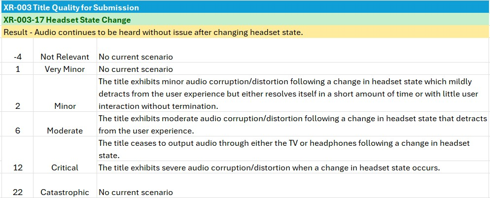
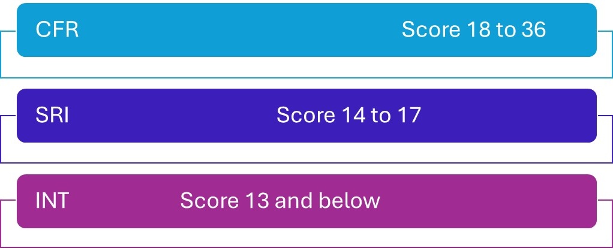

# Xbox Certification Failure Mode Analysis (FMA)

***

## Improving the consistency, quality, and relevance of decision making in test

## Abstract

Certification needs to ensure that decision-making is accurate and consistent, while ensuring that the team invests time only in issues that offer true value.

## Introduction

The Certification team makes thousands of decisions every year to determine the seriousness and noncompliance of issues.

Making consistent decisions is a challenge in a business that's both cross-regional and home to several layers of internal assessment, from testers on the floor up through leads, managers, and software engineers.

FMA offers a strict framework to enable all who are involved to make key decisions quickly and consistently while saving a significant amount of time by flagging those issues deemed too minor to be fully documented.

## Overview

FMA provides a framework for assigning three different scores to each issue: severity, probability, and repeatability. The sum of these scores determines the issue type as one of the following types.

- **Condition for Resubmission (CFR):** These issues are serious enough that the title can't be shipped until the developer fixes the issue in a resubmission, or the issue can be fixed through a Content Update delivered in a specific time frame, often by day one of end-user interaction.
- **Standard Reporting Issue (SRI):** These issues are serious, but they aren't severe enough to stop the submission from being published. 
- **Issue of Note (ION):** These SRI issues can't be mapped directly to an existing test case.

The logical progression to decide where each issue resides is partially based on the wording of the test cases and on a personal assessment of the probability and repeatability of the event that's occurring in the retail environment. 

To serve all areas of decision making, the key concepts of severity, probability, and repeatability are brought together in one place. Although possible, this approach creates a need for a database with potentially tens of thousands of entries to cover all eventualities.

It's important to split issues into their component parts to avoid an excessive number of line entries that are needed to describe an outcome. 
For Certification, FMA uses a system that has the following variables.

- **Severity:** Six potential outcomes
- **Probability:** Six potential outcomes
- **Repeatability:** Six potential outcomes

Severity (as detailed in the next section) is made up of descriptive strings and thus requires a scenario database to order the data. Both probability and repeatability are mathematically extracted from the issue itself. 

By keeping this separation, you can order 216 possibilities using only six severity scenarios per test case. This number might be more, depending on the complexity of the test case, but not by a great deal. 

By writing six statements and applying the separate mathematics of probability and repeatability, you get the same value as writing 216 separate scenarios. You get the benefit of manageability and ease of use.

## The First Building Block of FMA: Severity

Severity enables you to define how serious an issue is without considering anything outside of the event. 

FMA analysis breaks down the varying levels of severity into a user-friendly stack. Focusing on Certification's needs, the following severity warning was produced.

| Severity Rating | Meaning                                            |
|-----------------|----------------------------------------------------|
| -4              | No relevant effect on user or platform.            |
| 1               | Very minor effect on user or platform.             |
| 2               | Minor impact on user or platform.                  |
| 6               | Moderate impact on user or platform.               |
| 12              | Critical impact on user or platform.               |
| 22              | Catastrophic (High Business Impact (HBI). For example, the product becomes inoperative). |

These six potential categories define each issue, from no impact to very high impact. An overall rating exercise created weighted ratings for each category.

The ratings make for a robust part of the framework because it's relatively easy to consistently assign issues to the correct category across multiple individuals. Instead of settling for this approach, we instead chose to modify the steps per test case to create a system that's highly user-friendly and able to reflect the idiosyncrasies of specific test cases.  

An example is Headset State Change (HSC).

**Figure 1.  HSC example.**

Note the way they take two specific forms. The first form covers most issues in focused statements. For example, "The title exhibits moderate audio corruption/distortion following a change in headset state that detracts from the user experience."

This style allows the test teams to accurately assign the correct category to the issue in relation to severity. 

The second style is more specific. For example, "The title ceases to output audio through either the TV or headphones following a change in headset state."

This style captures specific behaviors that are often seen in labs, leaving no doubt to how to assign the issue.

## The Second Building Block of FMA: Probability

Definition: Probability enables us to assess how likely an end user is to be potentially exposed to a given issue. 

We use a similar grid to the one that's used for Severity but with modifications.

| Probability                                                                                        | Rating |
|----------------------------------------------------------------------------------------------------|--------|
| Extremely Unlikely to occur: 0-10% of users go through the steps that might manifest the issue. | -3     |
| Remote: 11-20% of users go through the steps that might manifest the issue.                     | 2      |
| Occasional: 21-40% of users go through the steps that might manifest the issue.                 | 3      |
| Moderate: 41-70% of users go through the steps that might manifest the issue.                   | 4      |
| Frequent: 71-90% of users go through the steps that might manifest the issue.                  | 6      |
| Almost Inevitable: 91-100% of users go through the steps that might manifest the issue.         | 8      |

Examples:

1. The issue occurs when launching the title. Probability = 8.
2. The issue occurs when joining an online session. Probability = 4.
3. The issue occurs in one specific submenu within one game mode and doesn't occur anywhere else. Probability = -3.

The evaluation includes some subjectivity. However, the system remains reliable and produces the correct final result, even when testers make slightly different judgments.

## The Third Building Block of FMA: Repeatability

Definition: Repeatability shows how likely an end user is to experience a given problem again after the original manifestation.

We've covered how two values relate to the severity and probability of the problem. You now need to identify the repeatability of the problem.

Use a similar grid to the ones that are used for severity and probability but with modifications.

| Repeatability                                     | Rating |
|---------------------------------------------------|--------|
| Issue won't happen a second time              | -3     |
| Low                                              | 2      |
| Moderate                                         | 3      |
| High                                             | 4      |
| Almost certain to occur after the initial event  | 5      |
| Certain to reoccur after the initial event      | 6      |

As with Probability, use the frequency values from the test outcome, such as the following values:  

**Frequency:** 

Console 1: 5/5

Console 2: 4/5

To calculate the value, sum up the successful reproduction attempts (the first numbers) and divide by the sum of the total number of attempts (the second numbers). Multiply this number by 6 to give the final value. In the example, the calculation looks like this: 9 ÷ 10 x 6 = 5.4, meaning that the final repeatability value is 5.

## FMA scoring explained

When you use the three systems correctly, you get three numbers. Add these numbers together to get the final score.

**Figure 2.  FMA scoring example.**

