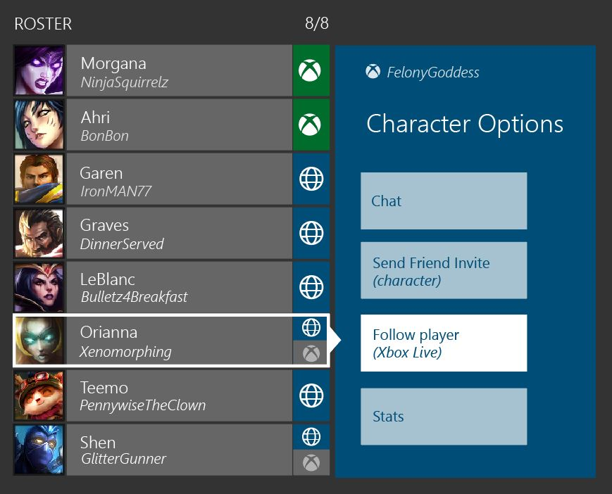

# Xbox Cross-Network Multiplayer Implementation Example: MMO

Version 2.0, 9/1/2025

The following example scenario is intended to illustrate the recommended cross-network functionality and flow in a massive multiplayer online game. It shows one possible design and implementation path.

In this scenario, the title supports the following multiplayer functionality:

* _Open game world_
  
  The title supports an open game world that allows interactions between players. Players are able to group loosely in the open world for player vs. environment (PvE) experiences. Player vs. player (PvP) experiences are 1:1 and only permitted in selected areas.
* _Custom matchmaking for instanced game sections_
  
  The title implements a custom matchmaking service for players that enter instanced PvP or PvE gameplay sections. This service matches players and/or teams of players together.
* _Dedicated servers_
  
  All gameplay for the title is executed on dedicated servers.  All traffic is also routed through these servers.
* _Chat_
  
  The title supports voice and text chat between all players. Global text chat is also supported. All traffic is routed through servers.
* _Consumables_
  
  The title provides an in-game store with purchasable (premium) in-game currency. This currency enables players to purchase items and consumables.
* _DLC_
  
  Purchasable downloadable content includes new game regions that unlock new player character classes.

## Title services

In this example, the first title service a player interacts with when launching the game is a title sign-in service. To play in the game, a player must create a title account and link it to the Xbox network account. Account creation is possible from within the title or on the title's webpage.

For account linking, the player's XUID is used and linked to a title-specific account. In the title, a player signs in once with a username/password for the title account to perform account linking. XUID access needs to be approved prior to use and must be discussed with your [Microsoft contacts](/gaming/game-publishing/resources/managed-support/overview-microsoft-representatives-and-contacts). The XUID must be protected during transmission and storage.

On the title's webpage, a player signed in with the title account also signs into the Microsoft Account for account linking. For more information refer to the _Website Account Linking_ documentation topic.

The title account has a unique ID (GUID) that allows all title services to handle players regardless of network origin. The title account also stores all player states such as player characters, progression, inventory, and all player metadata.

## Title flow

For a MMO game, a compliant flow for cross-network functionality depends on if the player is in the open world or in instanced gameplay.
The following steps apply in all cases:

1. _Validate privileges_
  
   After player sign-in a title validates the multiplayer privileges (254 & 189) and cross-network privilege (185) for the active player. If any privilege is denied, a player may not enter the title and an error dialog is displayed. At this point a title should also check the communications privilege (252) for voice and text chat to restrict functionality appropriately.

2. _Cross-network notification_
  
   On first launch the game notifies the player that cross-network functionality is present in gameplay.

The following steps apply for the open game world:

1. _Enter open world_
  
   The player always enters the open world when signing in to the game and connects to a title server.

2. _Join open world MPSD session_
  
   The title server for the open world gameplay creates multiple MPSD sessions that reflect the game regions in the open game world. One or more of these MPSD sessions have the gameplay capability enabled. All Xbox network users join the open world session for their game region. The server maintains information about both Xbox network and non-Xbox network players.
  
   The open world session allows join-in-progress and invitations for Xbox network players, and is only set to closed if the server does not accept new connections from clients.

3. _Enable open world gameplay_
  
   Gameplay features with other players are available depending on player privileges.

   * Global text chat is always enabled for players that have the communication privilege set. 
   * All text chat messages use the string validation service and a block list to filter offensive language and terms. 
   * Direct text or voice chat between all players (Xbox network/Xbox network and Xbox network/non-Xbox network) is only enabled after validating all required privacy and permission checks. See _Player blocking/muting/reporting_ for more details.
  
   For non-Xbox network friend relationships, the title uses title-specific friend relationships.
  
   Direct interaction between Xbox network players is tracked by the title service and used to set an encounter ID between these players in the open world MPSD session. This ensures that players are visible on each other's recent player lists. 

The following steps apply for instanced PvE or PvP gameplay:

1. _Group MPSD session_
  
   For Xbox network players the title creates an MPSD session to track Xbox network players. Non-Xbox network players are tracked through the title service.

2. _Group Invites/Join-in-progress_
  
   In this example game design limits joins or invites to player groups. The group MPSD session is used to support join-in-progress and invites for Xbox network players. In-game cross-network invites are supported by the title service.
  
   Xbox network invites that launch the title provide an automated UI flow into the invited gameplay and join the player to the invited in-game activity/party. If a join failure occurs, the relevant error is clearly communicated to the player. Such failures can include: full game group, non-joinable activity, player offline, etc.

3. _Group matchmaking_
  
   The title enables cross-network multiplayer for group PvP or PvE matchmaking flows. In this example, the player uses a matchmaking UI to select a PvP or PvE experience and then is grouped with other players into an instanced play experience.

4. _Create and join game MPSD session_
  
   The result of the group matchmaking is an MPSD lobby session that is created by the match service through service-to-service calls to Xbox services. All Xbox network users join this game session and remain in this session during instanced gameplay. 
  
   The service uses custom properties to additionally provide hints about the non-Xbox network users in the session. These hints can then be used by client logic for setting session state during the rest of the flow. 

5. _Instanced gameplay_
  
   After all players are ready, the instanced gameplay starts. In this example, chat is also enabled between Xbox network players through the dedicated server. 
  
   During instanced gameplay, a list of players is visible in the game UI. This list is a title character name list with the option to see gamertags or other network identifier for players. Xbox network players are uniquely highlighted. 
  
   An example of this group UI is as follows.
  
   

6. _Completing gameplay_
  
   After instanced gameplay is completed, team players return to the open game world. Players leave the MPSD game session and set the open world MPSD session as the activity session.

## Session management

To adhere to all [Xbox Requirements](../Console/certification-requirements.md), the title creates two MPSD sessions for Xbox network players:

* _Open world region game session_
  
  A large MPSD session is created by the title service at startup through service-to-service calls to Xbox services for each title server instance. All players of a title server instance are joined into the corresponding MPSD session. In these sessions the server sets an encounter ID for Xbox network players that interact with each other to ensure correct representation on the recent players list.

* _Instanced game session_
  
  This session is created by the matchmaking service through service-to-service calls to Xbox services. It contains reservations for all Xbox network players in a game session (across teams). It is used to correctly populate the recent player list of Xbox network players.

* _Group session_
  
  This session is created as soon as a player creates a group (group of 1). It's used for the activity session to support join-in-progress and invites.
  
  By game design players are not able to join during certain game modes. In these modes the **closed** property is used to disable join-in-progress and invites.

Non-Xbox network players are not directly represented in the MPSD sessions as session members. For tracking purposes the title reflects their presence in a custom session property:

```
{{"name":"jackplayer"},{"name":"johnplayer"},{"name":"joeplayer"}}
```

This list and the Xbox network session members can also be used to determine if a server instance is full.

The large MPSD session must enable the gameplay **capability** to adhere to [Xbox Requirements](../Console/certification-requirements.md).

For more information on service-to-service calls refer to the [Service-to-service multiplayer session management](../../../services/fundamentals/s2s-auth-calls/s2s-calls/s2s-call-patterns/live-mpsd-service-to-service.md) documentation.

## Player Identity

The title-specific character name of a player is shared across all networks. During the creation of character names, all strings are validated using the string validation service. Offensive language and terms are blocked.

* _Xbox network player identity_
  
  The title provides access to the Xbox network profile of all Xbox network players. This is done through in-game UI that is available within chat and gameplay interactions.

* _Non-Xbox network player identity_
  
  The title does not provide access to non-Xbox network profiles or profile names.

## Player blocking, muting and reporting

Player blocking and muting in the title is supported on the title level:

* _Xbox network player blocking/ muting_
  
  The title uses `check_multiple_permissions_with_multiple_target_users` to check privileges for multiplayer and chat with another Xbox network player and the player classes of non-Xbox network players/non-Xbox network friends. Blocking and muting is available through the profile UI of a player.
  
  The block/mute state of other Xbox network players in the same gameplay experience is checked during a gameplay transition (e.g. move to a different gameplay mode or location) or on a five minute time, whichever occurs first.

* _Non-Xbox network player blocking/muting_
  
  The title uses an in-title block list to support blocking or muting of non-Xbox network players. This list is maintained on a title service and checked for multiplayer permissions. It must be possible to mute a non-Xbox network player in the title through a custom title UI.

* _Xbox network player reporting_
  
  The title also allows reporting of players. For the Xbox network, reporting is done by the player through the profile UI that is accessible in the title. Xbox network enforcement handles player reports.

* _Non-Xbox network player reporting_
  
  For non-Xbox network users, the title provides a custom reporting UI flow. The title handles player reports accordingly for the title and/or based on guidelines by other multiplayer networks.

## Marketplace

Purchases of virtual currency on Xbox network and other multiplayer networks are tracked on a title service dependent on the scenario:

* _Virtual Currency_
  
  Players have a merged wallet of virtual currency and items across all platforms.

* _Downloadable content_
  
  Downloadable content (DLC) allows access to new regions of the game. The Microsoft Store is used for purchases on Xbox network platforms.
  
  A player can only enter the corresponding DLC region and play with other characters that have the entitlement of the region from their respective store.

## Achievements

The title has achievements that are based on open world and instanced gameplay actions. Achievement progress includes cross-network gameplay experiences. The title does not include any achievements that are limited to cross-network gameplay only. 

## Player progress

Player progress is shared between all title versions. A custom title account that is linked to multiple multiplayer networks and a custom title service is used for this purpose. 

## Game DVR/broadcasting

The title allows Game DVR and screenshots in open world and instanced gameplay, but removes all text chat from the image buffer.

## Leaderboards

The title supports custom leaderboards for in-title PvP matches and PvE challenges. These leaderboards are maintained by a title service. This service identifies players by GUIDs which are resolved on the client to the readable player name.