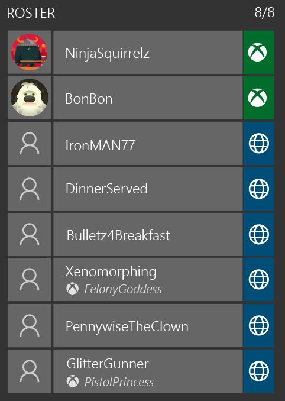
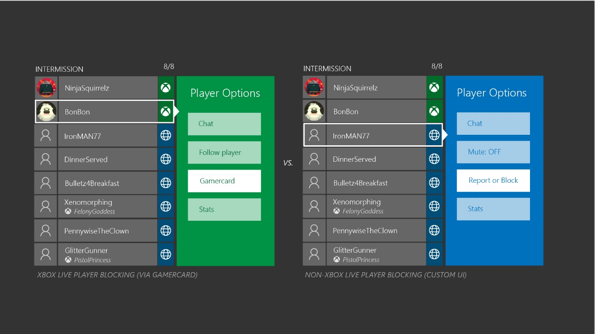
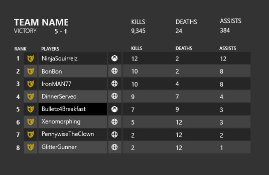

# Xbox Cross-Network Multiplayer Implementation Example: Multiplayer Game

Version 2.0, 9/1/2025

This example scenario is intended to illustrate the recommended cross-network functionality and flow in a traditional multiplayer game or MOBA. It shows one possible design and implementation path. 

In this scenario, the title supports the following multiplayer functionality:

* _Custom matchmaking_
  
  The title implements a custom matchmaking service. This service first (optionally) matches players into teams and then matches teams and players together.

* _Dedicated servers_
  
    All gameplay for the title is executed on dedicated servers. All traffic (including chat traffic) is also routed through these servers.

* _Custom leaderboards_
  
  Title services implement custom leaderboards that include deep information about player progress.

* _Multiple game modes/settings_
  
  The title supports multiple game modes such as co-op versus team-based and allows the player to configure map, game size, rules, and other settings for these modes.

* _In-game currency_
  
  The title provides an in-game store with purchasable (premium) in-game currency. This currency enables players to purchase power-ups for the team. Cosmetic items can also be purchased for player characters.

* _DLC_
  
  Purchasable downloadable content includes new maps and additional characters.

## Title services

One of the custom title services in this example is an authentication service. This service is used for account linking of an Xbox network (or other multiplayer network) account to a title-specific player account. When a player first connects to the service, account linking is performed silently, and a new cross-network player identity is created. For the Xbox network, the player's XUID is used as a unique player identifier that is linked to the title-specific account. XUID access needs to be approved prior to use and must be discussed with a DAM.

The title-specific account has a unique ID (GUID) that allows all title services to handle players regardless of network origin and stores metadata about the player. In this example, the multiplayer network and basic gameplay player stats are stored in this account.

Title services use multiplayer network information in the title-specific account to ensure that multiplayer functionality can be restricted to Xbox network players only.

## Title flow
For a typical multiplayer game, a compliant flow for cross-network functionality first starts when the player enters the multiplayer mode.

In this example the title takes the following steps:

1. _Validate privileges_
  
   Before starting multiplayer, a title validates the multiplayer privilege (254 and 189). If the privilege is denied, a title does not enter multiplayer mode.
  
   The title should also check the communications privilege (252) and end/disable voice and text chat accordingly.

2. _Validate cross-network privilege_
  
   For this example, the title integrates cross-network gameplay into the default matchmaking experience. When a player enters the matchmaking experience, the title validates the cross-network play privilege (185). If the privilege is denied, only matchmaking within the Xbox network is possible.
  
   The first time a player is placed into cross-network gameplay the title presents a notification that cross-network gameplay is active.

3. _Team matchmaking_
  
   The title matchmaking service first forms a team from a cross-network players based on matchmaking rules.

4. _Create and join team/lobby MPSD session_
  
   The title matchmaking service creates an MPSD lobby session through service-to-service calls to Xbox services. All Xbox network users join this lobby session and the service uses custom properties to additionally provide hints about the non-Xbox network users in the session. These hints can then be used by client logic for setting session state in the next step.

5. _Set team/lobby MPSD session_
  
   Xbox network clients set the lobby session as the Activity Session. Session joinability and closed status must be set accordingly to cross-network player status. Xbox network players remain in this session as long as they remain in the cross-network team.
  
   If the session is full (or becomes full later in the flow), the service or a lobby arbiter must set the session to closed. An Activity Session that has no more player slots must never be joinable.

6. _Team lobby_
  
   In the team lobby, Xbox network players and players from other multiplayer platforms are present. Voice chat is enabled between Xbox network players through a custom title service.
  
   Voice chat between all players (Xbox network/non-Xbox network) is only enabled after validating all required privacy and permission checks. For non-Xbox network friend relationships the title uses non-Xbox network friend relationship data.
  
   In the team lobby, Xbox network players and non-Xbox network players are uniquely identified by the title account identity. All player identifiers also show gamertags and equivalent player names for other multiplayer networks.
  
   An example of the player roster in the lobby UI is as follows.
  
   
  
   In the lobby UI, the team leader selects match properties (such as level or custom rules) for the next step to find a game session with another team and then kicks off the match request.

7. _Game session matchmaking_
  
   In this step, the existing cross-network teams are submitted to matchmaking with additional match properties set by the team leader. These properties are used to identify the best match and result in a new set of two teams for a match. At this point, the match service also identifies the dedicated server for both teams.

8. _Create and join game MPSD session_
  
   The result of the anonymous game session matchmaking is an MPSD game session that is created by the match service or dedicated service through service-to-service calls to Xbox services. All Xbox network users join this game session, and the service uses custom properties to additionally provide hints about the non-Xbox network users in the session.
  
   These hints can then be used by client logic for setting session state.

9. _Connect to dedicated server_
  
   In the final step, all clients connect securely to the dedicated server and initiate cross-network gameplay. All traffic between multiplayer networks must be routed through the dedicated server, no peer-to-peer connections are permitted.

10. _Completing gameplay_

    After the gameplay match is completed, teams can choose to:

    * _Replay the match_
  
      Players remain connected to the server and in the MPSD game session. Players start a new gameplay match.

    * _Search for new opponents_
  
      Players disconnect from the server and leave the MPSD game session. Players remain in the lobby session and return to the lobby screen for a next round of matchmaking.

## Session management

To adhere to all [Xbox Requirements](../Console/certification-requirements.md), the title creates two MPSD sessions for Xbox network players:

* _Lobby session_
  
  This session is created by the matchmaking service through service-to-service calls to Xbox services. It contains reservations for all Xbox network players in a team upon creation. It is the session that players can send invites for or join in progress. Invites and join-in-progress must use Xbox network systems and cannot be across networks. All Xbox network players therefore set this session as their activity session.

* _Game session_
  
  This session is created by the matchmaking service through service-to-service calls to Xbox services. It contains reservations for all Xbox network players in a game session (across teams). It is used to track the multiplayer activity of Xbox network players.
  
Non-Xbox network players are not directly represented in the MPSD sessions as session members. The title only tracks their presence in a custom session property:

```
{{"name":"jackplayer"},{"name":"johnplayer"},{"name":"joeplayer"}}
```

This list and the Xbox network session members can be used to determine if the session is full. If it is full, the invite and join-in-progress functionality for Xbox network has to be disabled for correct behavior. A player (or the server) sets the closed property on the session to disable this functionality.

The MPSD session used to track players in gameplay has to enable the **gameplay** capability to adhere to Xbox Requirements.

## Player communication blocking/reporting

Player blocking in the title is supported on the title level:

* _Xbox network player blocking_
  
  The title uses `check_multiple_permissions_with_multiple_target_users` to check privileges for multiplayer and chat with another Xbox network player and the player classes of non-Xbox network players/non-Xbox network friends. The title also provides access to the profile of another player through `ShowProfileCardAsync`. Blocking can be performed in the profile UI of a player.

* _Non-Xbox network player blocking_
  
  The title uses an in-title block list to support blocking of communication with non-Xbox network players. This list is maintained on a title service and checked for multiplayer permissions. Cross-network chat is not available by default. A non-Xbox network player can be blocked in the title through a custom title UI.
  
  

* _Xbox network player reporting_
  
  The title also allows reporting of players. For Xbox network, reporting is done by the player through the profile UI. Xbox network enforcement handles player reports.

* _Non-Xbox network player reporting_
  
  For non-Xbox network users, the title provides a custom reporting UI flow. The title handles player reports accordingly for the title and/or based on guidelines by other multiplayer networks.

## Marketplace

Purchases of in-game currency on the Xbox network and other multiplayer networks are tracked on a title service. The title provides a shared virtual currency wallet and in-game item inventory between all title versions. 

For non-Xbox network title versions the following restrictions apply:

* _Player Skins_
  
  Player skins can be purchased through in-game currency only. In-game currency is managed in a unified in-game wallet that is available across all networks. All player skins are identical across all title versions.

* _Consumables_
  
  Consumables can be purchased through in-game currency only. Like currency, consumable items are managed in a unified in-game inventory.

* _Downloadable content_
  
  On Xbox network platforms, downloadable content (new maps and character types) is managed through the Microsoft store. Entitlements from other stores are not shared.
  
  All players need to have a valid entitlement in their respective store to play in the same map together. Non-purchased character type is visible but not playable for a player that does not have the matching entitlement.

## Achievements

The title has multiple achievements that are based on multiplayer actions, including multiplayer games played. Achievement progress for these (and similar) achievements include cross-network multiplayer game sessions.

The title does not have any achievements that are limited to cross-network gameplay. Achievement progress for Xbox title achievements is possible through gameplay on other title versions.

## Player progress

Player progress is shared between the all title versions. The custom title account holds parts of the player progress.

## Game DVR/broadcasting

The title provides support for Game DVR and screenshots as well as broadcasting in cross-network multiplayer matches.

## Leaderboards

The leaderboard for the title is implemented through a title service that provides extensive leaderboard functionality beyond Xbox network leaderboards. The service creates multiple underlying leaderboards and updates them in parallel: one leaderboard for each multiplayer network, and one merged leaderboard that combines results from all multiplayer networks.

When cross-network multiplayer is enabled, the merged leaderboard is displayed. All players are represented in the same way as in the multiplayer lobby.



The Xbox network-only leaderboard is displayed when a player has disabled the cross-network gameplay functionality. 

A title-specific account is used to identify all players on the leaderboard service internally. The external identifiers for Xbox network players depend on the querying title instance. On Xbox network title instances, the XUID is returned and the client performs a lookup to determine the gamertag string of the player. On non-Xbox network title instances, the gamertag or DisplayName string of the player is returned directly. The service retrieves this string from a service-to-service call to Xbox services and caches it for up to 4 hours.