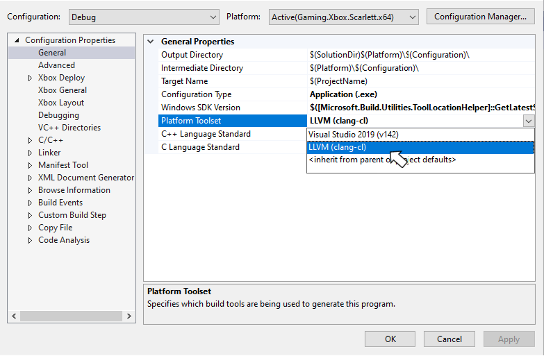

# Using Clang/LLVM with the Microsoft Game Development Kit (GDK) for consoles

You can develop Microsoft Game Development Kit (GDK) titles by using Clang/LLVM with Visual Studio 2019, Visual Studio 2022, or Visual Studio 2026 and the *clang/LLVM for Windows* toolset v12 or later. This toolset uses the Visual C/C++ Runtime (the Universal CRT library + the Microsoft STL). Other toolsets and runtime combinations might not successfully run or pass title certification.

Clang/LLVM for Windows with the **LLVM (clang-cl)** (that is, the ClangCL) Platform Toolset uses the [Microsoft Standard C++ Library](https://github.com/microsoft/STL).

| Clang Version | Visual Studio Update|
|---|---|
| clang v12 | Visual Studio 2019 (16.11) |
| clang v18.1.8 | Visual Studio 2022 (17.12) |
| clang v19.1.5 | Visual Studio 2022 (17.14) |
| clang v20.1.8 | Visual Studio 2026 (18.0) |

## Required Visual Studio versions and components

You need Visual Studio version 16.11 or later to use Clang/LLVM with the GDK. Select the **C++ Clang Compiler for Windows** component under **Individual Components** when installing Visual Studio.


Depending on which version of Visual Studio you're using, the required Clang/LLVM components might be named **C++ Clang Compiler for Windows** and **C++ Clang-cl for v142 build tools (x64/x86)**.

> [!NOTE]
> If you modify your existing Visual Studio installation to add the **C++ Clang Compiler for Windows** after the GDK is installed, you need to repair your GDK installation before using Clang/LLVM.

If you install the **C++ Clang Compiler for Windows** component, GDK setup installs support for the **ClangCl** platform toolset for the `Gaming.Xbox.*.x64` platforms.

## Compiler and linker switches

 For the `Gaming.Xbox.*.x64` platforms, the clang/LLVM command line used with `clang-cl.exe` always includes the following:

  ```
  -Wno-c++98-compat -Wno-c++98-compat-pedantic -Wno-reserved-id-macro
  -Wno-pragma-pack -Wno-unknown-pragmas
  -Wno-unused-command-line-argument
  ```

For `Gaming.Xbox.Scarlett.x64`, it also adds `-march=znver2`. This switch sets AVX2 and a few other features specific to the Hercules CPU.

For `Gaming.Xbox.XboxOne.x64`, it also adds `-march=btver2`. This switch sets AVX, F16C, and a few other features specific to the Jaguar CPU.

For more information about the switches recommended for GDK development, see [Visual C++ compiler and linker switch recommendations](compiler-switch-recommendations.md).

## Supported CPU intrinsics

Clang/LLVM and GNUC treat SSE SIMD types differently than Visual C++ and the Intel Compiler. Specifically, the __m128, __m128i, and __m128d types are opaque types rather than structs, so you can't create C++ overloaded functions that use those types. This difference also means direct element access through __m128.m128_f32[] doesn't compile on clang.

For DirectXMath on Clang/LLVM, this difference results in all the `XMVECTOR` C++ overloads being disabled. You can also opt in to this behavior on Visual C++ for better portability by defining the preprocessor symbol `XM_NO_XMVECTOR_OVERLOADS` before including the DirectXMath headers.

Visual C++ enables you to use advanced instruction intrinsics even if you're not currently building with /arch:AVX or /arch:AVX2, but clang/LLVM fails to build in this scenario without the proper compiler switches.

When you use Clang/LLVM, you must add the `-march=btver2`, `-march=znver1`, `-march=znver2`, or `-mf16c` compiler switch to use the F16C half-precision conversion intrinsics `_mm_cvtph_ps` or `_mm_cvtps_ph`.

DirectXMath in the Windows 10 SDK (18363) or earlier used the wrong CPUID intrinsics to implement `XMVerifyCPUSupport` for Clang/LLVM. This problem is fixed for DirectXMath 3.14 in the Windows 10 SDK (19041) or later.
* [https://walbourn.github.io/directxmath-3.14/](https://walbourn.github.io/directxmath-3.14/)

## Using Clang/LLVM with msbuild

To use Clang/LLVM with an msbuild project, set the **Platform Toolset** to "LLVM (clang-cl)". You can find **Platform Toolset** under the **General** tab in the Visual C++ project properties dialog, as shown in the following figure.



You can also set the Clang/LLVM toolset by directly setting the **PlatformToolset** msbuild property to **ClangCl**, as shown in the following example.

```xml

<PlatformToolset>ClangCl</PlatformToolset>

```
By default, the Clang/LLVM compiler generates significantly more informational warnings compared to MSVC. Therefore, for the 'TODO' places, you see both the `-W#pragma-messages` output as a warning, and an `-Wunused-value` warning:

```
1>Game.cpp(56,13): warning : Game.cpp: TODO in Update [-W#pragma-messages]
1>Game.cpp(58,5): warning : expression result unused [-Wunused-value]
1>Game.cpp(79,13): warning : Game.cpp: TODO in Render [-W#pragma-messages]
1>Game.cpp(81,5): warning : expression result unused [-Wunused-value]
1>Game.cpp(137,13): warning : Game.cpp: TODO in CreateDeviceDependentResources [-W#pragma-messages]
1>Game.cpp(139,5): warning : expression result unused [-Wunused-value]
1>Game.cpp(145,13): warning : Game.cpp: TODO in CreateWindowSizeDependentResources [-W#pragma-messages]
```


## Using Clang/LLVM with cmake

The CMakeExample and CMakeGDKExample GDK samples provide a good starting point for integrating Clang/LLVM into your cmake projects. You can download these samples from the [Xbox Developer Downloads page](https://aka.ms/gdkdl).

> [!NOTE]
> Make sure the **C++ CMake tools for Windows** Visual Studio component is installed before attempting to add Clang/LLVM support to your cmake projects. Visual Studio 2019 (16.11) ships with CMake 3.20. Visual Studio 2022 ships with CMake 3.21 or later.

### Using CMakeExample

Use the following steps to enable Clang/LLVM with the CMakeExample project.

The CMakeExample was updated in March 2022 to use `CMakePresets.json` rather than the older `CMakeSettings.json` solution. CMake Presets are integrated with Visual Studio 2019 16.10 or later. See [this blog post](https://devblogs.microsoft.com/cppblog/cmake-presets-integration-in-visual-studio-and-visual-studio-code/).

1. Use Visual Studio's **Open Local Folder** option to open the Desktop, Xbox Series X|S, or XboxOne folder in the root CMakeExample folder.


### CMakePresets.json integration

2. In Solution Explorer, double-click the CMakePresets.json file.

Edit the `XdkEditionTarget` variable to match your current GDK edition.

```
"cacheVariables": {
  "XdkEditionTarget": "260400",
  "CMAKE_INSTALL_PREFIX": "${sourceDir}/out/install/${presetName}"
}
```

3. Select the `x64-Debug-Clang` or `x64-Release-Clang` preset.


### CMakeSettings.json integration

2. In Solution Explorer, double-click the CMakeSettings.json file.

3. Select the **PLUS** icon and choose **x64-Clang-Debug** and **x64-Clang-Release** as shown in the following figure. Save the changes.


4. Select **Edit Json**, and then cut and paste the variables section from another configuration to the new Clang configurations as in the following example. Set the `XDKEditionTarget` value to the one appropriate for your version of the GDK including QFE level.

```
"variables": [
  {
    "name": "XdkEditionTarget",
    "value": "260400",
    "type": "STRING"
  }
]

```

5. After saving all changes, select **x64-Clang-Debug** or **x64-Clang-Release** from the build configuration dropdown and build.

## Using CMakeGDKExample

Use the following steps to enable Clang/LLVM with the CMakeGDKExample project.

1. Use Visual Studio's **Open Local Folder** option to open the CMakeGDKExample folder.


### CMakePresets.json integration

2. In Solution Explorer, double-click the CMakePresets.json file.

Edit the `XdkEditionTarget` variable to match your current GDK edition.

```
"cacheVariables": {
  "XdkEditionTarget": "260400",
  "CMAKE_INSTALL_PREFIX": "${sourceDir}/out/install/${presetName}"
}
```

3. Select the `x64-Scarlett-Clang` or `x64-XboxOne-Clang` preset.


### CMakeSettings.json integration

2. In Solution Explorer, double-click the CMakeSettings.json file.

3. Select the configuration you want to edit. Set the Toolset value to `clang_cl_x64`. Save and close.


4. For Xbox One and Xbox Series X|S configurations, select **Edit Json** and ensure the `XdkEditionTarget` variable matches your GDK edition and QFE level.

5. Select the desired value from the configuration dropdown and choose **Rebuild All** from the **Build** menu.

6. Use **File** -> **Open** -> **Project/Solution** to select the generated solution and project. For example:

CMakeGDKExample\out\build\GamingXboxOne-Debug\CMakeGDKExample.sln

You're now ready to build and deploy your project.

## Obtaining support

For bug reporting for the Visual C++ compiler, use [Report a Problem… in Visual Studio](/visualstudio/ide/how-to-report-a-problem-with-visual-studio)

For bug reporting for the clang/LLVM compiler, use [https://bugs.llvm.org/](https://bugs.llvm.org/)

For bug reports for the Microsoft Standard C++ Library (also known as STL), use [https://github.com/microsoft/STL/issues](https://github.com/microsoft/STL/issues)


## Known issues

* The Clang/LLVM toolset is significantly more verbose than Visual C++, especially when you use `-Wall -Wextra -Wpedantic`. At a minimum, suppress the following warnings either on the command line or as a `#pragma`:

```
#ifdef __clang__
#pragma clang diagnostic ignored "-Wc++98-compat"
#pragma clang diagnostic ignored "-Wc++98-compat-pedantic"
#pragma clang diagnostic ignored "-Wgnu-anonymous-struct"
#pragma clang diagnostic ignored "-Wlanguage-extension-token"
#pragma clang diagnostic ignored "-Wnested-anon-types"
#pragma clang diagnostic ignored "-Wreserved-id-macro"
#pragma clang diagnostic ignored "-Wunknown-pragmas"
#endif
```

* The Xbox tooling only works with Microsoft PDBs for debugging symbols, and it doesn't support the CodeView or DWARF debugging information that LLVM `.ld` files emit.

* Clang/LLVM's implementation of Link-Time Code Generation is distinctly different from the Microsoft Visual C++ solution. You can't mix code that uses Link-Time Code Generation between MSVC and clang/LLVM.

* As of the October 2022 release and the Windows SDK (10.0.22621), C++ static libraries include eXtended Flow Control Guard (XFG) metadata. The `ld` linker before the v15 release always emits a harmless warning when you use these libraries:

```
lld-link: warning/error: ignoring unknown debug$S subsection kind 0xFF in file xgameruntime.lib
```

* vcpkg Package Manager MSBuild integration doesn't work properly with `lld-link` since it uses wildcards in library filenames. You can work around this problem by setting `<UseLldLink>false</UseLldLink>` in the vcxproj. This problem doesn't affect vcpkg CMake integration using VS project generators.

* When building for Xbox with clang v18 in C++20 mode, two symbols are undefined when using WRL headers due to template evaluation changes.

```
wrl\implements.h(115,11): error : no member named 'RoOriginateError' in the global namespace
wrl/event.h(681,17): error : no member named 'RoTransformError' in the global namespace
wrl/event.h(712,18): error : no member named 'RoTransformError' in the global namespace
```

The following workaround resolves the problem:

```cpp
#include <wrl/client.h>

#if (__cplusplus >= 202002L) && (WINAPI_FAMILY == WINAPI_FAMILY_GAMES)
inline BOOL RoOriginateError(HRESULT, HSTRING) { return TRUE; }
inline BOOL RoTransformError(HRESULT, HRESULT, HSTRING) { return TRUE; }
#endif

#include <wrl/event.h>
```

## See also

[Visual Studio](visualstudio.md)

[Visual C++ compiler and linker switch recommendations](compiler-switch-recommendations.md)

[Using CMake with Clang/LLVM](/cpp/build/clang-support-cmake)

[Using MSBuild with Clang/LLVM](/cpp/build/clang-support-msbuild)