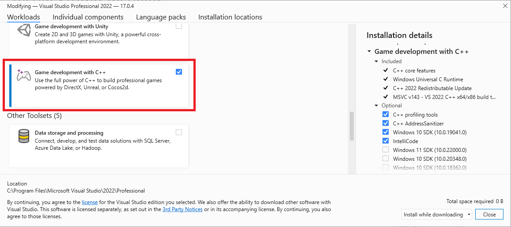
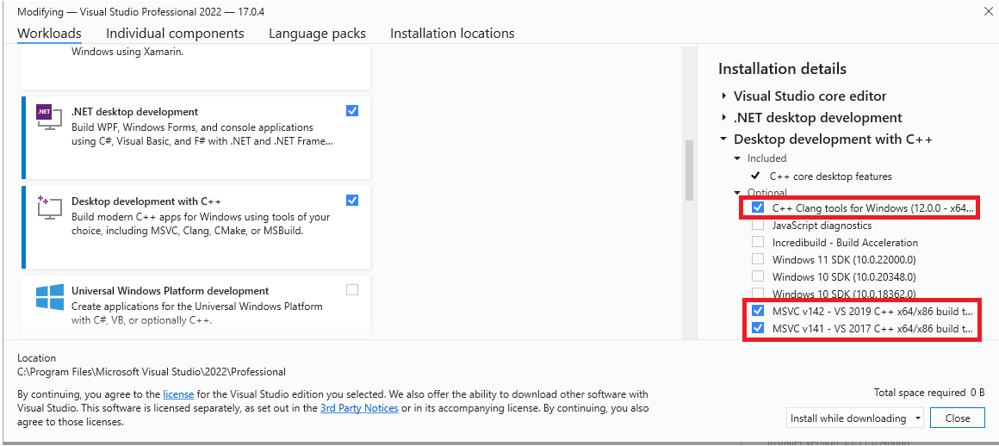
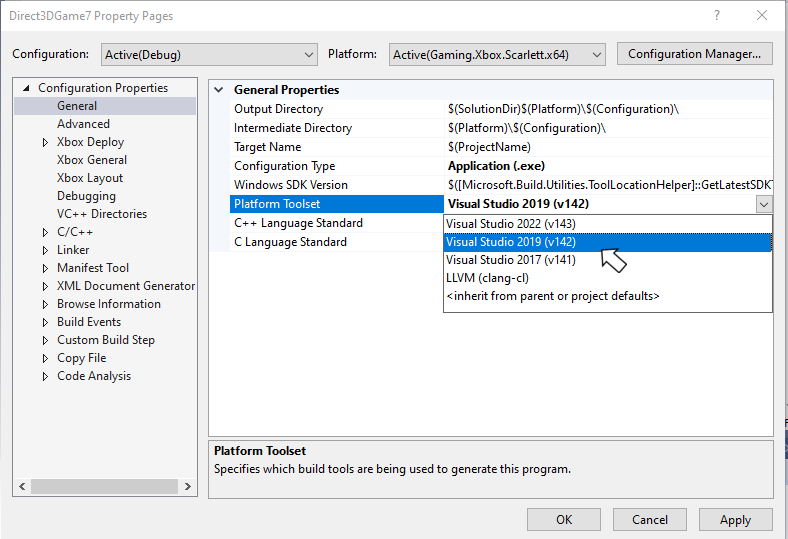

# Visual Studio 2022 support notes

[Visual Studio 2022](https://visualstudio.microsoft.com/) is supported for Microsoft Game Development Kit (GDK) development, and Long Term Support Channels are provided for 17.8, 17.10, 17.12 and 17.14 per [Visual Studio Product Lifecycle and Servicing](/visualstudio/productinfo/vs-servicing).

> [!NOTE]
> Visual Studio 2022 version 17.0 - 17.7 are out of support as of January 2025.

> [!NOTE] 
> Visual Studio 2022 version 17.0 - 17.4 are out of support as of July 2024.

## Installing Visual Studio 2022

The Microsoft Game Development Kit (GDK) supports development with either the **Professional** edition or the **Enterprise** edition of Visual Studio 2022. The Community edition isn't supported.

> [!IMPORTANT]
> GDK Visual Studio extension (VSIX) components aren't supported on ARM-based devices. To use GDK Visual Studio project templates, property pages, and debugging extensions, install the GDK on an x64-based development PC.

When installing Visual Studio 2022, you must select the **Game development with C++** workload during setup as shown in the following screenshot.



In addition to the core C++ tools that you need for game development, make sure the **Windows 10 SDK (19041)** or **Windows 11 SDK (22000)** component is installed to provide the Windows 10 SDK required to build games with the Microsoft Game Development Kit (GDK).

> *Windows 10 SDK* (20348), *Windows SDK for Windows 11* (10.0.22000), or *Windows SDK for Windows 11, Version 22H2* (10.0.22621) can also be used, but isn't required. For the October 2023 release, use of *Windows 11 SDK* or later is strongly recommended for PC development.

While not required, installing the **Desktop development with C++** workload provides more tools and samples that you might find helpful. For example, **Desktop development with C++** is required if you're building with the Clang/LLVM toolset.

If you're building a game that uses Unity, install the **Game Development with Unity** workload.

## Installing optional toolsets

The Visual Studio 2022 version of the MVSC build tools (version **v143**) is installed with the **Game development with C++** workload. In addition to the **v143** toolset, the Microsoft Game Development Kit (GDK) also supports building with the following toolsets:

* v142 (the Visual Studio 2019 toolset)
* the C++ Clang tools for windows

This flexibility allows you to upgrade to the Visual Studio 2022 IDE without updating your toolset.

The optional toolsets can be found under the **Desktop Development with C++** workload, or by searching the **Individual Components** in the Visual Studio installation dialog.



> The Visual Studio 2017 toolset `v141` no longer supported as of the October 2024 release.

## Selecting a toolset for a project

The toolset to use for a project is specified using the **Platform Toolset** property from the project's property page.



The **PlatformToolset** property can also be specified manually in the project file, as shown in the following property group.

```xml
<PropertyGroup Condition="'$(Configuration)|$(Platform)'=='Debug|Gaming.Xbox.Scarlett.x64'" Label="Configuration">
  <ConfigurationType>Application</ConfigurationType>
  <PlatformToolset>v142</PlatformToolset>
  <UseDebugLibraries>true</UseDebugLibraries>
  <CharacterSet>Unicode</CharacterSet>
  <EmbedManifest>false</EmbedManifest>
  <GenerateManifest>false</GenerateManifest>
</PropertyGroup>
```
## Visual Studio 2022 Servicing Model

Visual Studio 2022 includes a new servicing model that allows you to select a servicing baseline, and then only get updates for that baseline. This new model replaces the servicing models from previous versions of Visual Studio, which strongly encouraged the use of the latest available version. See [Visual Studio Product Lifecycle and Servicing](/visualstudio/productinfo/vs-servicing) for more details on the Visual Studio 2022 servicing model.

## Report bugs

Bug reports for the **Visual C++ compiler** should be reported (if possible) via Visual Studio _Report a Problem..._. See [Microsoft Docs](/visualstudio/ide/how-to-report-a-problem-with-visual-studio) and the [Developer Community](https://aka.ms/feedback/report?space=62) website. Be sure to read [this page](https://aka.ms/compilerbug) for details on creating a good bug report for the compiler.

> [!NOTE]
> You can add a comment to a public report issue marked as "Microsoft only" if private information is required to reproduce the issue.

For bug reporting for the **clang/LLVM for Windows compiler**, use https://bugs.llvm.org/

For bug reports for the **Microsoft Standard C++ Library** (a.k.a. STL), use https://github.com/microsoft/STL/issues

As always, feel free to reach out to your *Microsoft Representative* for critical issues that need escalation.

## See also

[Visual Studio for PC Game Development](gr-visualstudio-toc.md)