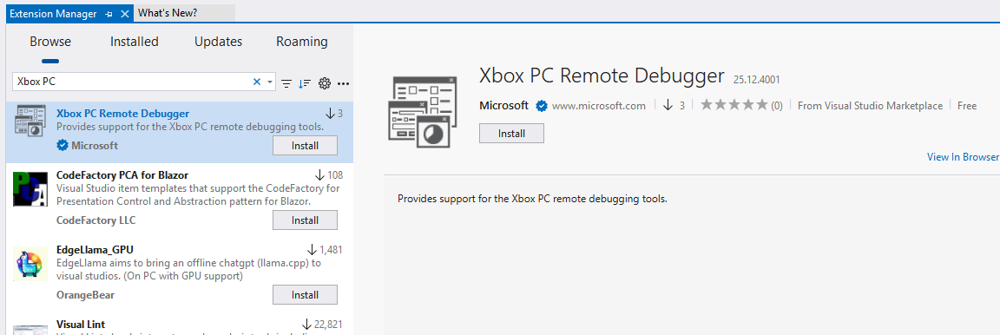
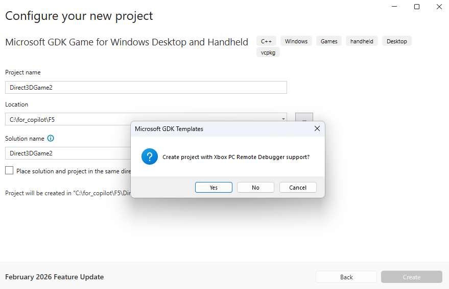
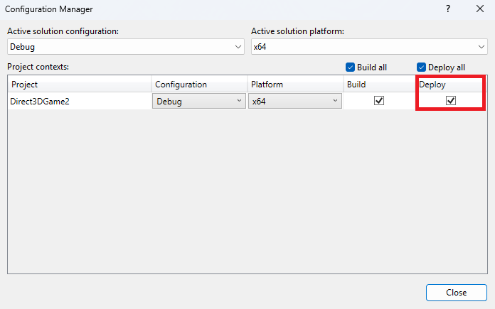
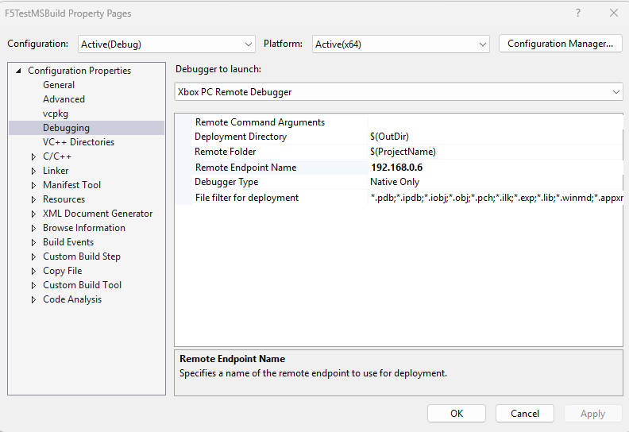
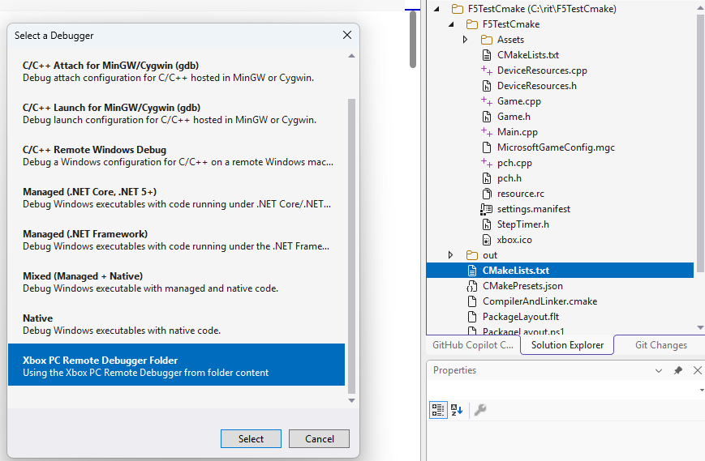
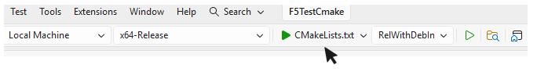
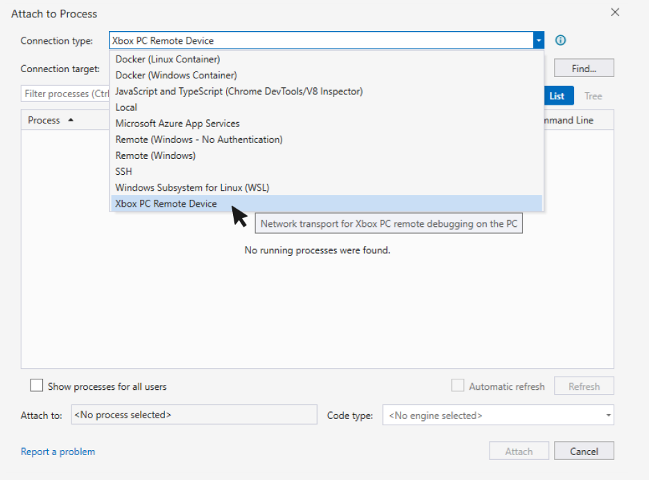

# Debugging PC projects on remote Windows devices by using Visual Studio

> [!IMPORTANT]
> The Xbox PC Toolbox app is in preview. Download it from the [Microsoft Store](https://aka.ms/toolboxinstaller) on Windows.

The [Xbox PC Remote Tools](../../../gdk-dev/pc-dev/overviews/remote-gamedev-tools.md) include the ability to deploy and debug a game running on a remote Windows device. Support is provided for both Visual Studio 2022 and Visual Studio 2026. All debugging traffic between the development PC and remote Windows device is encrypted. The ability to deploy and debug is provided by a [Visual Studio extension](https://aka.ms/XboxPCRemoteDebugger), which is available in the public Visual Studio marketplace.

Before debugging, your development PC and remote Windows device must be provisioned and paired using the steps described in the [QuickStart guide](../../../gdk-dev/pc-dev/tutorials/get-started-with-remote-devices/remote-win-gamedev-quickstart.md).

After pairing and provisioning, download the Xbox PC Remote Debugger extension using the [Extension Manager in Visual Studio](/visualstudio/ide/finding-and-using-visual-studio-extensions?view=visualstudio).
After pairing and provisioning, download the Xbox PC Remote Debugger extension using the [Extension Manager in Visual Studio](https://aka.ms/XboxPCRemoteDebugger).




## Enabling F5 Deploy and Debug in your game's project

The Xbox PC Remote Debugger extension for Visual Studio supports full "F5" integration for deploying and debugging C++ projects on remote Windows devices. Pressing <kbd>F5</kbd> builds the project, optionally deploys it to the remote device, launches the game suspended, attaches the Xbox PC Remote Debugger, and then resumes the game under debug.

After installing the [Xbox PC Remote Debugger Visual Studio extension](https://marketplace.visualstudio.com/items?itemName=XboxGDK.Microsoft-Xbox-PC-Remote-Debugger), ensure the following before using F5 remote deployment and debugging:

1. Your development PC and remote Windows device must be provisioned and paired using the steps described in the [QuickStart guide](../../../gdk-dev/pc-dev/tutorials/get-started-with-remote-devices/remote-win-gamedev-quickstart.md).

2. The Microsoft Visual Studio Debug Monitor (`MSVSMON.EXE`) must be installed on the remote device. `MSVSMON.EXE` is installed automatically by the [Xbox PC Toolbox application](../xboxpctoolbox/xboxpctoolbox.md). Alternatively, the install can be done using WinGet from an Admin prompt on the remote device:

   ```
   winget install Microsoft.VisualStudio.2022.OnecoreMsvsmon
   ```

3. [`wdEndpoint.exe`](../commandlinetools/gr-wdEndpoint.md) must be running on the remote device. `wdEndpoint.exe` is installed and started automatically by the [Xbox PC Toolbox application](../xboxpctoolbox/xboxpctoolbox.md). Alternatively, the install can be done using Winget from a command prompt on the remote device:

   ```
   winget install Microsoft.Gaming.RemoteIterationEndpoint 
   ```

Start `wdEndpoint.exe` manually after installing it via WinGet.

### Adding F5 remote debug support to a MSBuild project

To enable F5 integration for a project that uses MSBuild, add the following XML to your `.vcxproj` file. Place it after the last `</ItemDefinitionGroup>` element and before the source file `<ItemGroup>` sections:

```xml
<ItemGroup>
  <ProjectCapability Include="Gaming.Xbox.PC.Remote" />
</ItemGroup>
<Import Condition="'$(XboxPCRemotePath)'!='' AND Exists('$(XboxPCRemotePath)XboxPCcppDebugger.props')"
  Project="$(XboxPCRemotePath)XboxPCcppDebugger.props" />
<ItemGroup>
  <PropertyPageSchema Condition="'$(XboxPCRemotePath)'!=''" Include="$(XboxPCRemotePath)XboxPCcppDebugger.xml" />
</ItemGroup>
```

> [!NOTE]
> The latest version of [Microsoft GDK Templates](https://aka.ms/gdktemplates) prompts you to include this integration when creating new projects.



To enable deployment, go to **Project > Properties > Configuration Manager** and check the **Deploy** option for the desired configuration.



Before pressing **F5**, set the debugger to **Xbox PC Remote Debugger** by using either the debugging toolbar or the project property page. Several properties are available to configure deployment and debugging.




* `Remote Command Arguments`. The list of command arguments to pass to the game.

* `Deployment Directory`. The directory on the development PC to deploy to the remote Windows device. The default is `$(Outdir)`.

* `Remote Folder`. The folder the game is deployed to on the remote Windows device. The folder is relative to the *Common Root*. See the [`wdEndpoint.exe`](../commandlinetools/gr-wdEndpoint.md) topic for more information on *Common Root*.

* `Remote EndPoint Name`. The default remote device is the developer machine itself, as with standard Windows Remote Debugging. Update the `Remote EndPoint Name` to the device name where `wdEndpoint.exe` is running.

* `File filter for deployment`. Used to specify the set of files that should be excluded from deployment. Excluding `.pdb` files from deployment is a common practice, for example. Supply a list of file patterns to exclude, separated by semicolons, for example: `*.pdb;*.ipdb;*.iobj;*.obj;*.pch;*`.

After the **Deploy** checkbox is selected for your **Configuration**, the **Xbox PC Remote Debugger** is chosen as the debugger type, and the properties are filled in, pressing **F5** will build your game, deploy it to the remote Windows device, and start it under the debugger.

> [!NOTE]
> You might need to configure your symbol paths so Visual Studio can find the symbols for your game. Do so using the **Debugging** settings on the **Options** dialog accessible from the **Tools** menu.

#### F5 remote debugger per-project defaults

The Xbox PC Remote Debugger settings defaults are set by the `XboxPCcppDebugger.props` file, and any edits made to the settings in the Visual Studio Project Properties dialog are saved 'per user' on the local machine.

To have your vcxproj provide some other default value to avoid having every user set it on their machine, add it to the MSBuild as follows:

```xml
<ItemGroup>
  <ProjectCapability Include="Gaming.Xbox.PC.Remote" />
</ItemGroup>
<Import Condition="'$(XboxPCRemotePath)'!='' AND Exists('$(XboxPCRemotePath)XboxPCcppDebugger.props')"
  Project="$(XboxPCRemotePath)XboxPCcppDebugger.props" />
<PropertyGroup>
  <RemoteGameshareFolder>MyGameTitle</RemoteGameshareFolder>
</PropertyGroup>
<ItemGroup>
  <PropertyPageSchema Condition="'$(XboxPCRemotePath)'!=''" Include="$(XboxPCRemotePath)XboxPCcppDebugger.xml" />
</ItemGroup>
```

### Visual C++ Runtime (CRT) deployment

In order for a program to run on the remote machine, it needs the Visual C++ Runtime files. For the retail CRT, this can be done by installing the Visual C++ REDIST package on the remote machine. For the debug CRT, these files must be deployed with the title.

A simple solution for this in MSBuild is to add a property to your project's Global section:

```xml
<CopyCppRuntimeToOutputDir>true</CopyCppRuntimeToOutputDir>
```

This will copy the Visual C++ CRT into the `OutDir`. It will use the Debug version if `UseDebugLibraries` is set to true, otherwise it will use the Retail version.

### Adding F5 remote debug support to a CMake project

For an Open Folder project (such as a CMake project), F5 remote debugging support is configured in `launch.vs.json` rather than in a `.vcxproj` file.

1. Install the Xbox PC Remote Debugger support and make sure your remote Windows device is provisioned and running `wdEndpoint.exe`.

2. Open your CMake project folder in Visual Studio.

3. In **Solution Explorer**, right-click **CMakeLists.txt** and select **Add Debug Configuration...**.

4. Select **Xbox PC Remote Debugger Folder**. 




Visual Studio creates a `.vs\launch.vs.json` file with an `Xbox PC Remote Debugger` launch configuration.

   A typical configuration looks like this:

   ```json
   {
     "version": "0.2.1",
     "defaults": {},
     "configurations": [
       {
         "type": "default",
         "name": "MyGame.exe",
         "project": "CMakeLists.txt",
         "projectTarget": "MyGame.exe",
         "deployDirectory": "${workspaceRoot}\\out\\build\\x64-Release\\bin",
         "deployExcludeFilter": "*.pdb;*.ipdb;*.iobj;*.obj;*.pch;*.ilk;*.exp;*.lib;*.winmd;*.appxrecipe;*.log;*.tlog;*unsuccessfulbuild;*.lastbuildstate;*.copycomplete",
         "remoteGameshareFolder": "MyGame",
         "remoteMachineName": "MyROGAlly",
         "targetName": "MyGame.exe",
         "args": [],
         "deployType": "GamingXboxPCRemoteDeploy"
       }
     ]
   }
   ```

5. Update the generated configuration with values for the following properties:

   * `deployDirectory`. The local output folder that contains the files to deploy.

   * `remoteGameshareFolder`. The folder to create or use on the remote device.

   * `remoteMachineName`. The name of the remote device where `wdEndpoint.exe` is running.

   * `targetName`. The game executable to launch after deployment.

6. Optionally update these properties as needed:

   * `deployExcludeFilter`. A semicolon-separated list of file patterns to exclude from deployment.

   * `args`. Command-line arguments to pass to the game when it starts.

   * `disableDeploy`. Set this when you want to skip deployment and only launch or attach with the debugger.

7. Build your game locally, then select **CMakeLists.txt** from the debugger toolbar, and press **F5** to deploy the game to the remote device and start it under the debugger.




## Attaching the Visual Studio debugger to games running on remote Windows devices

To attach the debugger to a game that is already running on a remote device, select **Attach to Process...** from Visual Studio's **Debug** menu. Select **Xbox PC Remote Device** from the **Connection Type** dropdown and enter the IP address or host name of your remote device in the **Connection Target** text box. The list of processes running on your remote device is displayed. Select the game you'd like to debug and select the **Attach** button.



## See also  

 [Xbox PC Remote Tools](../../../gdk-dev/pc-dev/overviews/remote-gamedev-tools.md)
