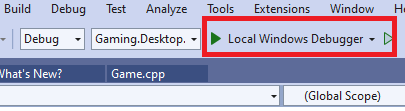
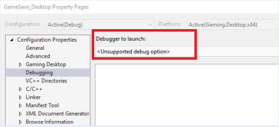
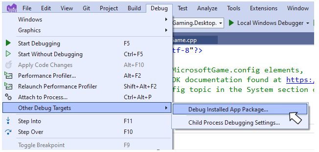
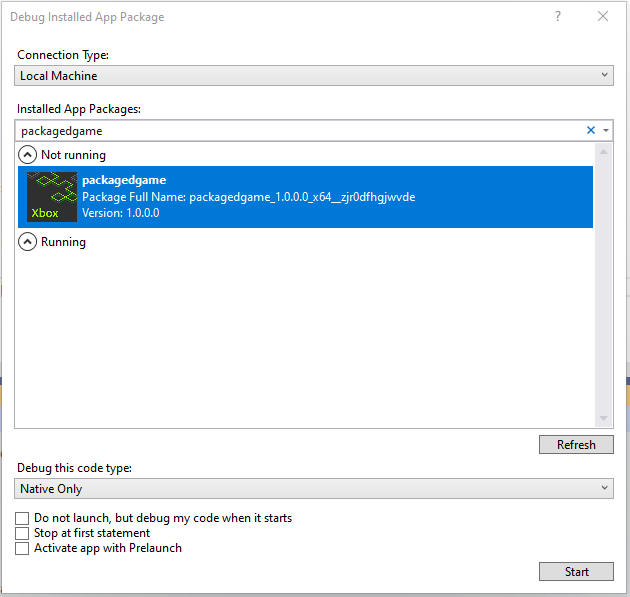
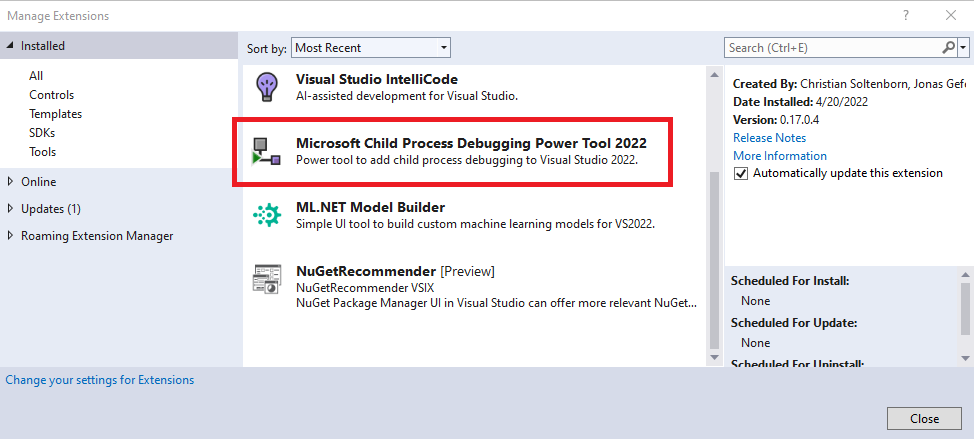
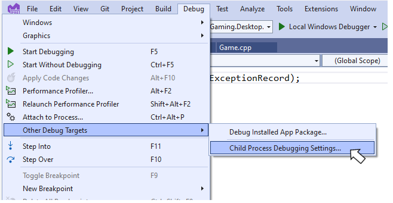
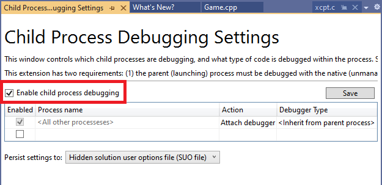
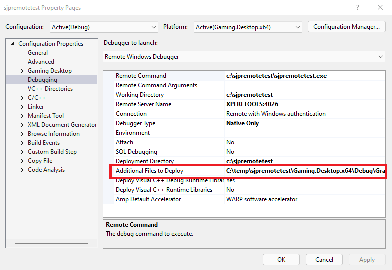

# Debugging PC projects using Visual Studio

Starting with the June 2022 version of the Microsoft Game Development Kit (GDK), the native code debugger that ships as part of Visual Studio is used to debug PC game projects.  To debug on a local PC, select **Local Windows Debugger** from the debugger dropdown on the Visual Studio toolbar as shown in the following figure.

To debug on a remote PC, select **Remote Windows Debugger** and follow the steps described in [debugging a game on a remote PC](#vs_pc_debug_remote).

> [!NOTE]
> The debugger to use for projects using a version of Microsoft Game Development Kit (GDK) prior to June 2022 is named Local Machine.  Remote debugging is not supported on versions of the Microsoft Game Development Kit (GDK) prior to June 2022.

When upgrading projects to the June 2022 version of the Microsoft Game Development Kit (GDK), there may be cases where the debugger property will be set to **Unsupported debug option** as shown in the following figure.  If this occurs, the debugger property must be reset to **Local Windows Debugger** using either the debugging toolbar, the project property page, or by setting the **DebuggerFlavor** msbuild property to **WindowsLocalDebugger** (removing the **DebuggerFlavor** property altogether will also cause **Local Windows Debugger** to be used).

PC projects no longer require a deploy step starting with the June 2022 version of the Microsoft Game Development Kit (GDK).  The **Deploy** checkbox in Visual Studio's **Configuration Manager** dialog is disabled.

When a title is launched in retail, an intermediate launcher process is used.  This bootstrapper process shows a splash screen ahead of the title rendering, checks for game updates, pre-syncs cloud saves, pre-signs in a user and so on.  These behaviors are not exercised in loose file debugging scenarios.  Use a [packaged build](#vs_pc_debug_packaged_build) to test, or debug, a game as it would be launched in retail.

## Debugging packaged builds

Before debugging a packaged build, the package must be installed using [wdapp install](../commandlinetools/gr-wdapp.md#wdapp_install).  Once installed, the title can be debugged using the **Debug Installed App Package** feature in Visual Studio.  Use the **Debug** menu to bring up the debugging dialog as shown in the following figure.

To debug your title, search for it in the dialog, set **Debug this code type** to *Native Only* and click the **Start** button.

To debug your title as it would be launched in a retail environment, add the **/bootstrapper** flag to the [wdapp install](../commandlinetools/gr-wdapp.md#wdapp_install) command line.  Titles installed in this way will be launched by a bootstrapper process.  Debugging in this scenario requires the **Child Process Debugging** extension in Visual Studio.  Install the extension using the **Manage Extensions** dialog.

Once installed, use the **Debug** menu to view the **Child Process Debugging** settings.

Click the **Enable child process debugging** checkbox on the settings page.

With child process debugging enabled, the **Debug Installed App Package** dialog will now attach the debugger to the title rather than to the bootstrapper process.

## Debugging a game on a remote PC

Debugging a title on a remote PC requires the Visual Studio remote tools.  Install the tools and configure the remote debugger as described in [Remote Debugging a C++ Project in Visual Studio](/visualstudio/debugger/remote-debugging-cpp).

Select **Remote Windows Debugger** from the **Debugger to launch** dropdown on the project's property page.  Enter the name of the title's executable, the desired working directory and so on.  By default, Visual Studio will deploy the title's executable and binary dependencies.  To debug a remote Microsoft Game Development Kit (GDK) game, additional files, including the MicrosoftGame.config file, and the logo files, will also need to be deployed.  Specify the additional files to deploy using the **Additional files to deploy** property on the **Remote Windows Debugger** property page as shown in the following figure.

## See also  

 [Visual Studio](gr-visualstudio-toc.md)