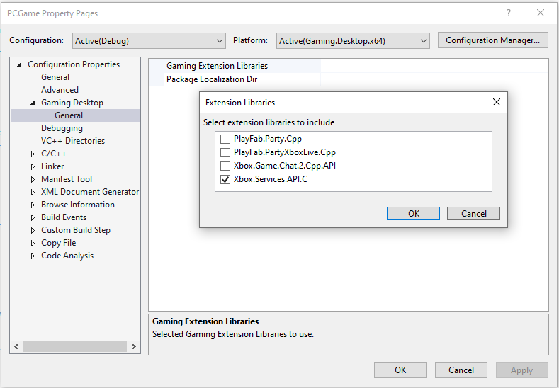

# Visual Studio properties for PC game development

The Microsoft Game Development Kit (GDK) has a custom Visual Studio property page that's used to configure Windows PC game projects.  

To access the Windows PC gaming property page

   1. In **Solution Explorer**, right-click the project name, and then select **Properties**.
   1. Expand **Configuration Properties**.
   1. Select **Gaming Desktop**.

The following Windows PC gaming property pages are available.

   *  [Gaming Extension Libraries](#gamingextensionlibraries)  
   *  [Package Localization Dir](#packagelocalizationdir)  

## Gaming Extension Libraries  

The Gaming Extension Libraries property page is used to select the set of extension libraries that your project will reference as shown in the following screenshot.

## Package Localization Dir  

The Package Localization Dir property page specifies an optional directory relative to the project directory for use when creating localized shell resources. The Package Localization Dir property page is the equivalent of the `/resw` flag to [makepkg](../../../features/common/packaging/deployment/makepkg.md). For more information about adding localized resources to your project, see [MicrosoftGame.config localization](../../../features/common/game-config/MicrosoftGameConfig-Localization.md).

## See also
[Visual Studio (for PC game development)](gr-visualstudio-toc.md)