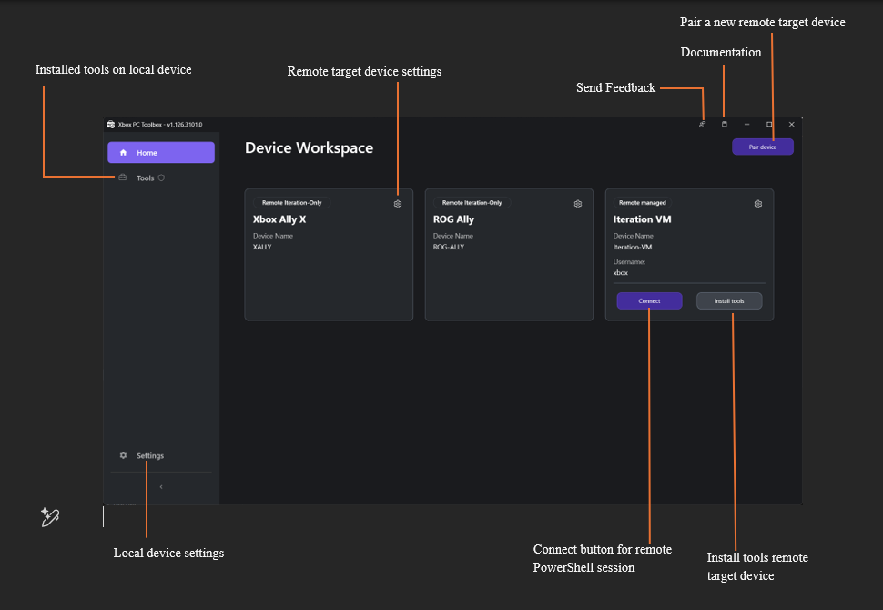
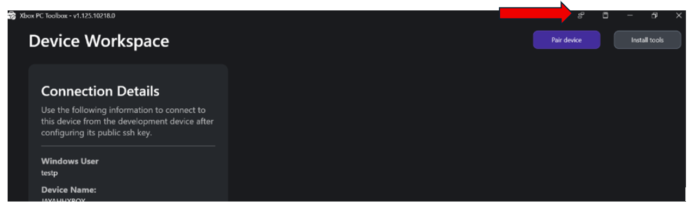
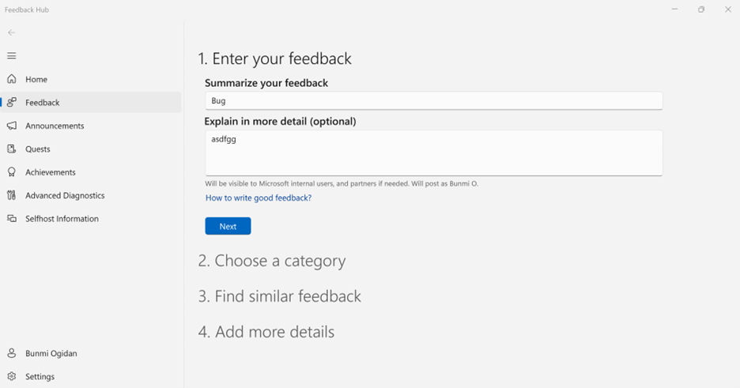
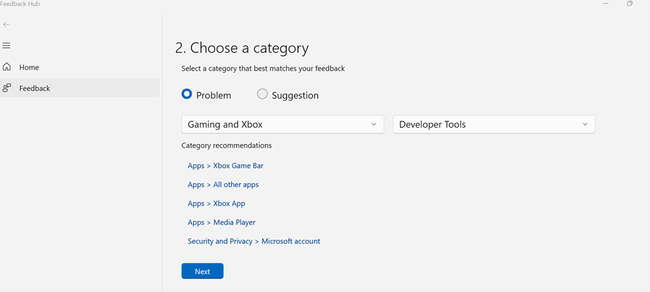
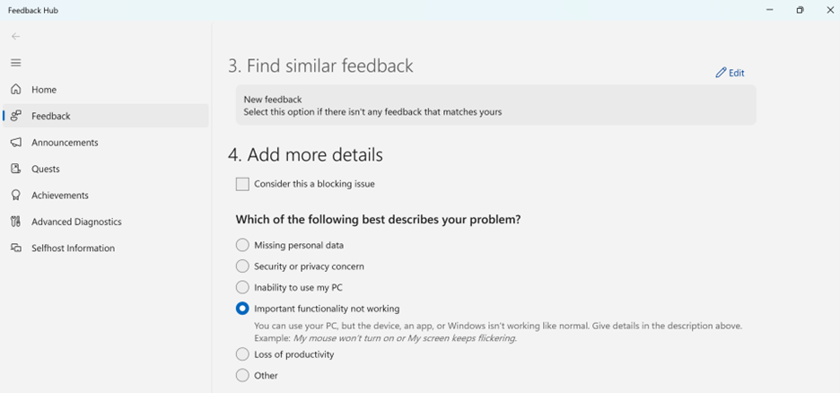
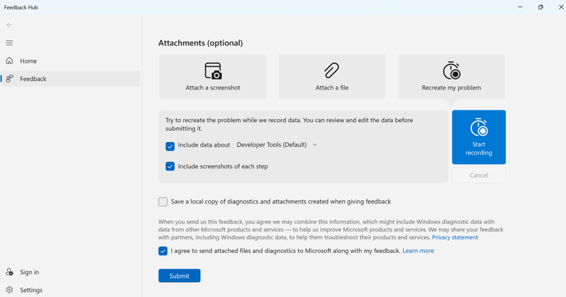

# Xbox PC Toolbox

> [!IMPORTANT]
> The Xbox PC Toolbox app is in preview. Download it from the [Microsoft Store](https://aka.ms/toolboxinstaller) on Windows.

With Xbox PC Toolbox, you can remotely set up and update Windows-based devices. Use the graphical app, installed on both your development PC and remote target device, to launch, deploy, and terminate processes on paired devices you select in the device workspace.

> [!NOTE]
> We value your feedback. To suggest features or report problems, select **Send Feedback** in the app.

* [User Interface](#UI)
* [Using Xbox PC Toolbox](#PCTOOLBOX)
* [Send Feedback](#RAP)

<a id ="UI"></a>

## User interface

The Xbox PC Toolbox app interface includes these main areas:

* **[Device Workspace]**: Discover paired devices, install tools, and connect for remote workflows like launching, deploying, and terminating apps.
* **[Pair device]**: Add a new device by entering its alias, IP address or device name, username, and a unique PIN. If you don't use the PIN within 2 minutes, the app generates a new one.
* **[Connect]**: Select a remote target device and use the **Connect** button to start a remote PowerShell session. Use `wdRemote` and `wdEndpoint` to deploy, launch, and terminate games locally from the command line.
* **[Install tools]**: Install development tools on your PC or remote target device.
* **[Settings]**: Use the settings icon in the navigation bar to view your device information, access release notes, restart the setup wizard, or send feedback. Use the gear icon on each paired device to unpair it, edit the device name, or update connection settings.



> [!NOTE]
> Xbox PC Toolbox supports gamepad navigation. You can use a gamepad to move through screens, select options, and complete setup flows the same way you would with a keyboard. The app consistently manages focus across all screens, including error and success dialogs.

<a id="PCTOOLBOX"></a>

## Using Xbox PC Toolbox

### Get started

1. Download Xbox PC Toolbox from the Microsoft Store on Windows.
1. Pair your devices and complete setup.
1. Begin using your remote development environment.

### Prerequisites

* Both devices must run the latest version of Windows Home or Pro.
* Sign in to the remote target device by using your personal Microsoft account (MSA).
* You need administrator privileges on both devices.
* Both devices must be on the same wired or wireless network.
* Avoid custom sandbox environments from the Microsoft Store.

> [!NOTE]
> If you participated in a previous preview, follow the [cleanup instructions](../../../gdk-dev/pc-dev/tutorials/get-started-with-remote-devices/remote-win-gamedev-quickstart.md) before proceeding.

### Resetup flow

If the configuration between the Xbox PC Toolbox app and a remote target device goes out of sync, the app detects the divergence and presents a resetup flow. This guided process walks you through the steps to re-establish a working connection without requiring a full manual reconfiguration of the device.

### Deploy a game build

Xbox PC Toolbox installs the command-line tool `wdRemote.exe` on your development PC and `wdEndpoint` on the remote target device. To deploy your game:

``` wdRemote /action:deploy /device:mypc1 /source:c:\game /destination:gamedir ```

This command copies your game files incrementally to the remote target’s game directory.

> [!NOTE] 
>The default directory is: 
> ``` C:\ProgramData\Microsoft\GDK\wdEndpoint\gameroot\GameDir ```

### Launch a game

After deployment, launch the game on the remote target device:

``` wdRemote /action:launch /device:mypc1 /path:gamedir\game.exe ```

The game starts on the remote target hardware.

### Terminate a game

To end a game process, use the process ID from the Toolbox app:

``` wdRemote /action:terminate /device:mypc1 /processid:1234 ```

<a id ="RAP"></a>

## Send feedback

Report issues or suggest improvements using the **Feedback Hub** in the Xbox PC Toolbox app:

1. Select **Send Feedback** from the app’s title bar.
1. Choose **Report a Problem**.
    
1. Enter your feedback details and select **Next**.
   
1. Choose a category: **Problem** or **Suggestion** under Gaming and Xbox > Developer Tools, then select **Next**.
   
1. Add new feedback or select a matching option.
1. If the issue blocks your workflow, check the box and select the best description.
   
1. Attach files if needed and select **Submit**.
   


For a detailed walkthrough on how to start provisioning and iterating on remote Windows devices via the Xbox PC Toolbox app, see the [Xbox PC Remote Tools how-to guide](../../../../docs/gdk-dev/pc-dev/tutorials/get-started-with-remote-devices/remote-win-gamedev-how-to-use-tools.md).

For the latest updates, see the [Xbox PC Remote Tools release notes](../../../gdk-dev/pc-dev/tutorials/get-started-with-remote-devices/release-notes/rwd-release-notes-2603.md).
