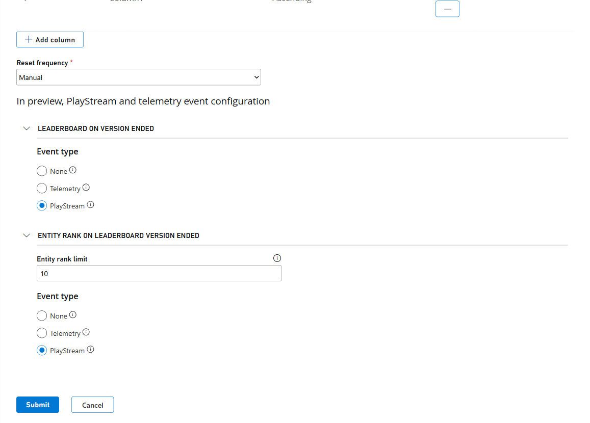

# Leaderboards with PlayStream and Telemetry 

With Leaderboards integration to [PlayStream](../../data-analytics/ingest-data/playstream-overview.md), you can easily leverage the real-time event ingestion and processing pipeline to build custom player experiences that are triggered when a Leaderboard version changes. With [PlayStream Actions and Rules](../../data-analytics/acting-data/action-rules-quickstart.md), you can trigger custom [CloudScripts](../../live-service-management/service-gateway/automation/cloudscript/index.md) or [Azure Functions](../../live-service-management/service-gateway/automation/cloudscript-af/index.md) to drive engagement and retention features like [granting rewards](../../economy-monetization/economy-v2/inventory/index.md) to top players, sending personalized notifications to players, or performing score validation to check for cheaters. PlayStream Events will also be archived in Data Explorer for data analytics and warehousing.

And if you want just the data analytics and warehousing without the real-time event actions, Leaderboards has an integration with [Telemetry Events](../../data-analytics/ingest-data/telemetry-overview.md) to provide just the analytics features.

Leaderboards provides two optional events:

- [`playfab.leaderboard.leaderboard_version_ended`](../../api-references/events/Leaderboards/leaderboard-version-ended.md)
- [`playfab.leaderboard.entity_rank_on_leaderboard_version_ended`](../../api-references/events/Leaderboards/entity-rank-on-leaderboard-version-ended.md)

These two events allow you to quickly know when a leaderboard version has ended and allow you to query previous data as soon as you want. With entity rank on leaderboard version ended, you can get the rank and score of the top entity for a leaderboard when that leaderboard version ended.

## Enable PlayStream or Telemetry Events 

You can enable events when creating a new leaderboard or editing and existing leaderboard definition. Find the section for PlayStream and telemetry event configuration and select None, PlayStream, or Telemetry. 

>**Note:** Preexisting leaderboards will have both leaderboard version ended and entity rank on leaderboard version ended events turned off by default. If you want to enable them or just one of them, please go to the leaderboard you want to modify and enable that setting. 

Once submitted, events be emitted whenever a leaderboard version changes.

## Event Usage

For learning more about how to leverage these events to preform different actions such connecting to a Azure Function, please check out these resources:

- [Using CloudScript actions with PlayStream](../../data-analytics/acting-data/action-rules-using-cloudscript-actions-with-playstream.md)
- [Quickstart: Writing a PlayFab CloudScript using Azure Functions](../../live-service-management/service-gateway/automation/cloudscript-af/quickstart.md)
- [CloudScript quickstart](../../live-service-management/service-gateway/automation/cloudscript/quickstart.md)

## Restrictions & Notes  

- The `playfab.leaderboard.entity_rank_on_leaderboard_version_ended` event, will only return up to the top 1000 ranks.  

- The `playfab.leaderboard.entity_rank_on_leaderboard_version_ended` event, will send an event for every entry within the leaderboard.

- The `playfab.leaderboard.entity_rank_on_leaderboard_version_ended` event, will not work with leaderboards with a entity type of `master_player_account` or `external`.

## See Also 

- [`playfab.leaderboard.leaderboard_version_ended`](../../api-references/events/Leaderboards/leaderboard-version-ended.md)
- [`playfab.leaderboard.entity_rank_on_leaderboard_version_ended`](../../api-references/events/Leaderboards/entity-rank-on-leaderboard-version-ended.md)
- [PlayStream Overview](../../data-analytics/ingest-data/playstream-overview.md)
- [Statistics with PlayStream and Telemetry](../../player-progression/statistics/statistics-with-playstream-and-telemetry.md).
- [Telemetry Overview](../../data-analytics/ingest-data/telemetry-overview.md)
- [Pricing Meters](../../pricing/Meters/meters.md)
- [PlayStream Event Capabilities](../../data-analytics/ingest-data/playstream-event-capabilities.md)
- [Using CloudScript actions with PlayStream](../../data-analytics/acting-data/action-rules-using-cloudscript-actions-with-playstream.md)
- [Quickstart: Writing a PlayFab CloudScript using Azure Functions](../../live-service-management/service-gateway/automation/cloudscript-af/quickstart.md)
- [CloudScript quickstart](../../live-service-management/service-gateway/automation/cloudscript/quickstart.md)
- [Limits on Leaderboards](./limits-leaderboards.md)
- [Leaderboards and Cloudscript](leaderboards-cloudscript.md).
