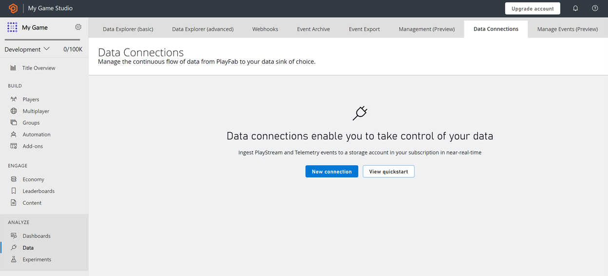

# Data Connections

**Data Connections** enables continuous, near-real-time ingestion of PlayStream and Telemetry data into your authorized storage resource in your Azure subscription. This feature works with Azure Blob Storage, Azure Data Explorer (ADX), Microsoft Fabric KQL databases, and Amazon Web Services S3.

It provides control of your data in your storage account with less than five-minute data ingestion latency. The architecture is designed for batch processing and supports Parquet files in Blob Storage with higher throughput, lower storage cost, and greater flexibility. In case of data distribution failure, a built-in automatic retry mechanism helps ensure data is delivered successfully.

You can get started with Data Connections for event ingestion by using PlayFab’s Game Manager portal or scalable APIs.

> [!Note]
> Although you can use either ADX, Blob, or Fabric KQL, these options have different potential use cases. You might prefer Blob if you’re using Synapse for ML modeling and batch processing, while ADX supports ad-hoc analytics, querying, and real-time debugging of live services.

## Why do you need it?

Data Connections replaces the Event Export and Export to S3 features that PlayFab currently supports. It allows for faster export in supported formats for offline processing. You provide the storage account where the data is ingested and delivered. That means you control encryption at rest, lifecycle management, and network access. Billing is simplified because the storage costs are included centrally in your overall Azure account billing.

### Azure Blob Data Connection
The data is readily available in Parquet blob format. Parquet is a column-oriented data file format designed for efficient data storage and retrieval. It provides efficient data compression and encoding schemes with enhanced performance to handle complex data in bulk, resulting in low latency, higher throughput, and low cost of data storage. It's designed to be a common interchange format for both batch and interactive workloads. This makes Blob Storage a good fit for offline processing and cost-optimized analytics and reporting (including ad-hoc queries over stored files).

### Azure Data Explorer Data Connection
Data Connections allows you to export to Azure Data Explorer for near-real-time ingestion and distribution of your data. Azure Data Explorer can query millions of records in a few seconds, enabling you to gain invaluable insights and make informed decisions swiftly and efficiently.

For more optimized cost and data control, you can make use of Data Connections with [Event Sampling](event-sampling-overview.md). Sampling enables you to configure the percentage of events data that you want to receive.

### Microsoft Fabric KQL database Data Connection

Use PlayFab’s Data Connections to send game events to Real-Time Analytics (RTA) databases, so you can generate near-real-time insights in Power BI or run KQL queries in your Microsoft Fabric workspace.

### Amazon AWS S3 Data Connection (PREVIEW)

The AWS S3 Data Connection provides a secure, scalable way to stream your PlayFab telemetry and event data directly into your own Amazon S3 bucket. Designed for reliability and high throughput workloads, it uses a robust pipeline to validate, transport, and land game data in an open, analytics ready format. By using your own AWS storage and IAM roles, you retain control over data governance, encryption, access policies, lifecycle management, and cost visibility. This also enables downstream workflows such as BI reporting, machine learning, and large-scale data processing in your AWS environment. 