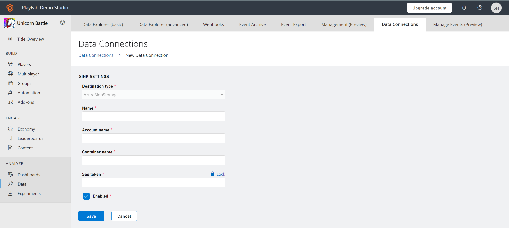
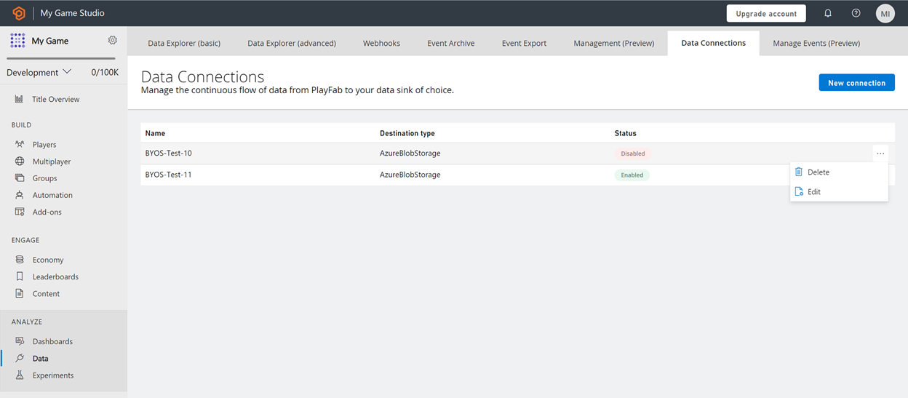

# Data Connections quickstart

## Prerequisites
- For Data Connections, you need an Azure or Amazon subscription and a storage account. 
- For PlayFab to ingest data in your storage account, you need container details along with authorization using a SAS token.
- To create a SAS token using Microsoft Azure portal, follow the steps in the next section.

## Create a Data Connection

Create a connection to integrate your storage resource with PlayFab and retrieve the PlayStream and telemetry data. You can configure up to three data connections in the **enabled (active)** state.

### Azure Blob Storage

From the Game Manager:
- Go to your **Title**
- Select **Data** from the menu on the left
- Select **Data Connections** from the **Data** tabs
- Select **New Connection**, new data connections configuration page is opened
- Define **Sink Setting** of Azure Blob Storage type
    *	Enter **Name**
    *	Enter **Account Name**
    *	Enter **Container Name**
    *	Enter **SAS Token** as generated in the Azure portal
- Select **Save**
    *	By using the default check on **Enabled**, the connection between PlayFab and your resource is established once saved.
    *	By using uncheck on **Enabled**, the connection between PlayFab and your resource is validated but not established until saved.

### Microsoft Fabric KQL database

From PlayFab Game Manager:

- Go to your **Title**
- Select **Data** from the menu on the left
- Select **Data Connections** from the **Data** tabs
- Select **New Connection**, new data connections configuration page is opened
- On the **Destination type** dropdown, select the **Fabric KQL Database** option 
- Enter a name for your **Data Connection** in the **Name** field 
- Make sure the **Enabled** box is checked 
- Go to [Microsoft Fabric](https://msit.powerbi.com/home)
- Select **Workspaces** on the left panel and select **Your Workspace** 
- Select the **Database** you want to store the data on 
- Copy the **Query URI** by selecting the **Copy** icon next to **Query URI** label 
- Go back to Data Connections on PlayFab's Game Manager
- Paste the **Query URI** you got from Fabric into the **Ingestion URI** field
- In the **Database** field, enter the name of the **KQL Database** you created in Fabric
- Fill the **Table** field with a significant name (for example, **Events**) 

> [!Note]
> To optimize your use of a Fabric KQL Data Connection and gain valuable insights into your game data, follow the tutorial on PlayFab and Microsoft Fabric Real-Time Analytics (RTA) for game creators: [PlayFab and Microsoft Fabric Real-Time Analytics (RTA) for game creators](../learn-data/reports/real-time-analytics-tutorial.md)

### Amazon Web Services S3 (PREVIEW)
From PlayFab Game Manager:
-	Navigate to your title
-	Select Data from the menu on the left
-	Select Data Connections from the Data tabs
-	Select New Connection; the new data connections configuration page opens
-	On the Destination type dropdown, select the AWS S3 option
-	Give your Data Connection a name on the Name field
-	Make sure the Enabled box is checked
-	In the AWS console:
    *	Navigate to IAM
    *	Navigate to Identity Providers
    *	Select Add Provider
    *	Select OpenID Connect
    *	In the form:
        *	For the provider URL, input `https://login.microsoftonline.com/72f988bf-86f1-41af-91ab-2d7cd011db47/v2.0`
        *	For the Audience, input `e12f8069-1801-4f61-9b5f-446d8bd57e8b`
    *	Select Add Provider
    *	Navigate back to IAM
    *	Navigate to policies
    *	Select Create policy
    *	In the form:
        *	Select JSON to switch to the JSON view.
        *	Input the following policy: { "Version": "2012-10-17", "Statement": [ { "Effect": "Allow", "Action": [ "s3:*" ], "Resource": [ "arn:aws:s3:::test/*", "arn:aws:s3:::test" ] } ] }
        *	Select Next
        *	Enter a name for your policy – take note of it for later        
        *	Select Create policy
    *	Navigate back to IAM
    *	Navigate to Roles
    *	In the form:
        *	Select Web Identity 
        *	From the Identity provider dropdown, select the previously registered https://login.microsoftonline.com/72f988bf-86f1-41af-91ab-2d7cd011db47/v2.0 provider
        *	From the Audience dropdown, select the previously registered e12f8069-1801-4f61-9b5f-446d8bd57e8b audience
        *	Select Next
        *	In the search field, enter the name of the previously registered policy
        *	Check the box to the left of the policy
        *	Select Next
        *	Enter a name for the role – noting the name
        *	Select Create role
    *	Navigate to the general purpose S3 Bucket you want to use for your Connection
    *	Select Properties
    *	Scroll to the Tags section
    *	Select Add new Tag
    *	In the form:
        *	For the key field, input playfab:titleids
        *	For the value field, input your playfab TitleID
        *	Select Save changes
    *	Ensure you have your S3 Bucket name, Role ARN, and S3 Bucket Region used in the prior steps
    *	Enter those into the appropriate fields in the Game Manager

## Manage connections

The Data Connections overview (landing) page displays the available connections categorized as **enabled** or **disabled** as a **status**. You can have up to three enabled connections to the blob storage account at any time. 
You can also use the Data Connections overview page to manage connections. Select the ellipsis (...) next to any connection. You can take two actions: **Edit** and **Delete**.

