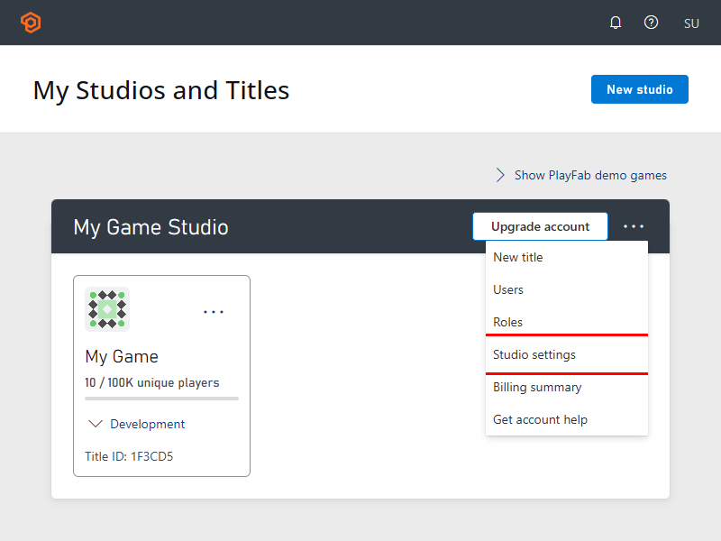
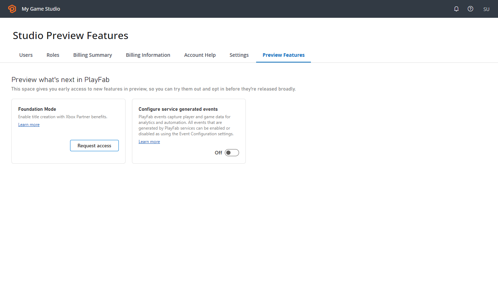

---
title: Foundation Mode Onboarding
author: m-kdearnley
description: Describes how to get started with Foundation Mode.
ms.author: kdearnley
ms.date: 02/13/2026
ms.topic: article
ms.service: azure-playfab
keywords: playfab, pricing, free tier
ms.localizationpriority: medium
---

# Onboarding to Foundation Mode

This article shows you how to set up Foundation Mode for your game. You'll request access to the preview, create a title in Foundation Mode, and link your Partner Center account.

## Prerequisites

Before you begin, make sure you have:

- A [PlayFab developer account](../identity/dev-identity/pfab-account.md) signed in with a [Microsoft Entra ID account](../identity/dev-identity/authentication/aad-authentication.md)
- A game that you're shipping or planning to ship on Xbox
- A [Partner Center account](https://developer.microsoft.com/en-GB/games/publish) (or create one during this process)

## Request access to the preview

> [!IMPORTANT]
> During the preview, Foundation Mode is available for **new titles only**. You can't migrate existing titles at this time. A migration path for existing titles is planned, targeting June 2026.

During the preview period, you need to request access before you can create titles in Foundation Mode.

1. Sign in to [Game Manager](https://developer.playfab.com/) with your Microsoft Entra ID account.
1. Navigate to your studio settings and select the Preview Features tab. You must have admin privileges for this tab to be visible. Studio settings can be reached from the home screen, click on the three dots (...) menu on your studio. 

   

   

1. Select  **Foundation Mode** and complete the request form.
1. Wait for approval. Once approved, the Foundation Mode card on the Preview Features tab displays an **Approved** badge.

## Create a Partner Center account

If you don't already have a Partner Center account, create one to use Foundation Mode.

1. Go to the [Xbox developer onboarding hub](https://developer.microsoft.com/en-GB/games/publish).
1. Follow the steps to create your developer account.
1. Complete the account verification process.

## Create a title in Foundation Mode

If your studio is onboarded to the Foundation Mode Preview, you can create new titles in Foundation Mode.

1. Sign in to [Game Manager](https://developer.playfab.com/) with your Microsoft Entra ID account.
1. Select your studio.
1. Select **New Title**.
1. Enter a name and select the correct studio for your title.
1. Link your new PlayFab Title to an existing Seller ID and Product ID in Partner Center. These fields automatically populate based on the Microsoft Entra ID used to sign in to PlayFab.
1. Select **Create Title**.

Your new title is now set up in Foundation Mode with access to all included features.

## Support during preview

If you encounter any issues, [file a support ticket](../pricing/support.md#support-ticket-submission).

## Next steps

Now that you are set up in Foundation Mode, start building your game:

- [Set up player authentication](../identity/player-identity/authentication/index.md)
- [Configure multiplayer services](../multiplayer/index.yml)
- [Set up leaderboards](../community/leaderboards/index.md)

## See also

- [Foundation Mode overview](mode-overview.md)
