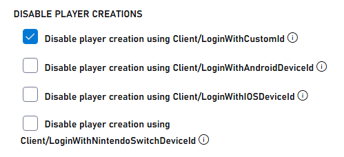
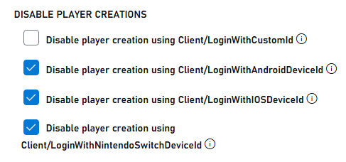

# Setting up PlayFab Authentication using Anonymous Login

This guide shows you how to implement PlayFab authentication using anonymous login APIs with server-side protection, focusing only on CustomID authentication using HTML5/JavaScript.

## Overview

> [!IMPORTANT]
> On June 30, 2025, all newly created titles will have player creation via anonymous APIs disabled. 

To enhance the security of anonymous login, PlayFab implemented a crucial security feature that separates player creation capabilities between client-side and server-side APIs.

1. **Disabled Client-Side Player Creation**:
   - For newly created titles, all anonymous login APIs on the client side (`LoginWithCustomID`, `LoginWithAndroidDeviceID`, `LoginWithIOSDeviceID`, `LoginWithNintendoSwitchDeviceId`) no longer automatically create new player accounts. Titles created before June 30, 2025 can disable anonymous login through [Game Manager configuration](anonymous-login.md#configuring-player-creation-settings).
   - Disabling client-side player creation prevents unauthorized account creation directly from unauthorized clients.
   - Only existing players can log in through client-side APIs.

1. **Enabled server-side player creation**:
   - Player account creation is now handled through server-side APIs (`LoginWithCustomID`, `LoginWithAndroidDeviceID`, `LoginWithIOSDeviceID`, `LoginWithNintendoDeviceId`).
   - This ensures all account creation happens in a secure, controlled environment.

## Prerequisites

- A unique identifier for the player (CustomID)
- A registered [PlayFab](https://developer.playfab.com/) title
- Your PlayFab title's secret key
- Familiarity with [sign-in basics and best practices](../login/login-basics-best-practices.md)
- A server with a valid domain name to serve static HTML files

> [!NOTE]
> If you need help with setting up a server, see the [Running an HTTP server for testing](running-an-http-server-for-testing.md) tutorial. Throughout this guide, we'll assume your domain is `http://playfab.example`. 

## Authentication flow

1. **Server-side account creation**:
   - Use `Server/LoginWithCustomID` with the server API to create new players
   - Requires a title secret key
   - Reference: [Server API - Login With Custom ID](xref:titleid.playfabapi.com.server.authentication.loginwithcustomid)

2. **Client-side Login**:
   - Use `Client/LoginWithCustomID` with the client API to log in existing players
   - Reference: [Client API - Login With Custom ID](xref:titleid.playfabapi.com.client.authentication.loginwithcustomid)

## Implementation steps

### 1. Set up your development environment

1. Download the JavaScript SDK from the [JavaScript SDK documentation](https://learn.microsoft.com/gaming/playfab/sdks/javascript/)
2. Install the required Node.js packages:

```bash
npm install playfab-sdk
```

### 2. Server-side implementation (Node.js)

> [!IMPORTANT]
> Keep your title secret key secure and never expose it in client-side code. The secret key should only be used in secure server environments.

```javascript
const { create } = require('domain');
const http = require('http');
const PlayFab = require('playfab-sdk');
const PlayFabServer = require('playfab-sdk/Scripts/PlayFab/PlayFabServer');

// Initialize PlayFab settings
PlayFab.settings.titleId = "YOUR_TITLE_ID"; // Replace with your actual PlayFab Title ID
PlayFab.settings.developerSecretKey = "YOUR_SECRET_KEY"; // Replace with your actual secret key

// Callback function for PlayFab API responses
function onPlayFabResponse(error, result) {
    if (error) {
        console.error("PlayFab Error:", error);
        return;
    }
    console.log("PlayFab Success:", result);
}

// Function to create user with custom ID
function createUserWithCustomId(customId, callback) {
    PlayFab.PlayFabServer.LoginWithCustomID({
        CreateAccount: true,
        CustomId: customId,
    }, (error, result) => {
        if (error) {
            console.error("PlayFab Error:", error);
            callback(error);
            return;
        }
        console.log("PlayFab Success:", result);
        callback(null, result.data);
    });
}

const customId = "YOUR_CUSTOM_ID"; // Replace with your actual custom ID
const server = http.createServer((req, res) => {
    res.writeHead(200, {'Content-Type': 'application/json'});
    createUserWithCustomId(customId, (error, result) => {
        if (error) {
            res.end(JSON.stringify({ error: error }));
            return;
        }
        res.end(JSON.stringify({ success: result }));
    });
});

const port = 3000;
server.listen(port, () => {
  console.log(`Server running at http://localhost:${port}/`);
});
```

### 3. Client-side implementation (HTML)

```html
<!DOCTYPE html>
<html>
<head>
    <script src="PlayFabSdk/src/PlayFab/PlayFabClientApi.js"></script>
</head>
<body>
    <p>Server LoginWithCustomId Auth Example</p>
    <button onclick="loginWithCustomID()">Log In with CustomId</button>
    <script>
        function loginWithCustomID() {
            var customId = "YOUR_CUSTOM_ID";
            PlayFabClientSDK.LoginWithCustomID({
                CustomId: customId,
                TitleId: YOUR_TITLE_ID,
            }, onPlayFabResponse);
        }
       

        function onPlayFabResponse(response, error) {
            if (response)
                logLine("Response: " + JSON.stringify(response));
            if (error)
                logLine("Error: " + JSON.stringify(error));
        }

        function logLine(message) {
            var textnode = document.createTextNode(message);
            document.body.appendChild(textnode);
            var br = document.createElement("br");
            document.body.appendChild(br);
        }
    </script>
</body>
</html>
```

## Configuring player creation settings

### For existing titles

1. Navigate to the PlayFab developer portal and select your title
1. Go to **Settings**.
1. Select the **API Features** tab.
4. Check the box to prevent new player accounts from being created via anonymous login APIs

  

### For new titles

> [!WARNING]
> Enabling automatic player creation for anonymous login APIs can compromise security. Only enable this feature temporarily during development or testing. Always disable it before moving to production.

New titles have player creation via anonymous APIs disabled by default. To enable for testing, perform the following:

1. Navigate to the PlayFab developer portal and select your title
1. Go to **Settings**.
1. Select the **API Features** tab.
4. Uncheck the box to allow new player accounts from being created via anonymous login APIs

   


## Testing and response examples

### Server response example

When successfully creating a user through the server API, you receive a response similar to:

```json
{
    "code": 200,
    "status": "OK",
    "data": {
        "PlayFabId": "PLAYFAB_ID",
        "SessionTicket": "SESSION_TICKET",
        "NewlyCreated": true
    }
}
```

### Client response example

When attempting to create a new account from the client API (which is now disabled), you receive an error:

```json
{
    "code": 400,
    "status": "BadRequest",
    "error": "PlayerCreationDisabled"
}
```

When successfully logging in an existing user through the client API:

```json
{
    "code": 200,
    "status": "OK",
    "data": {
        "PlayFabId": "PLAYFAB_ID",
        "SessionTicket": "SESSION_TICKET",
        "NewlyCreated": false
    }
}
```
## Further reading

- [PlayFab Authentication Overview](../authentication/index.md)
- [Login Basics and Best Practices](../login/login-basics-best-practices.md)
- [Running an HTTP Server for Testing](running-an-http-server-for-testing.md)