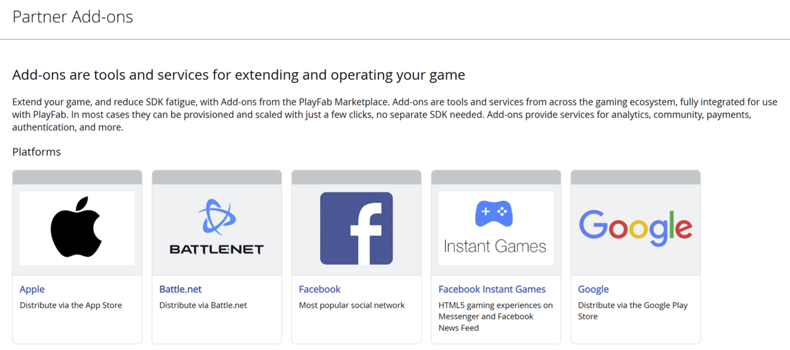
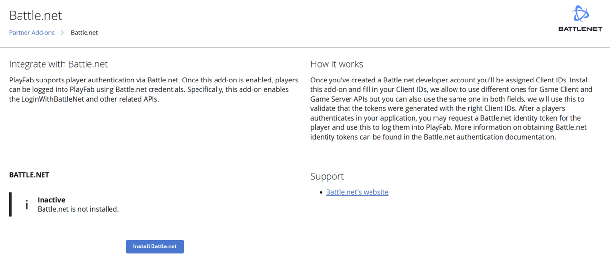
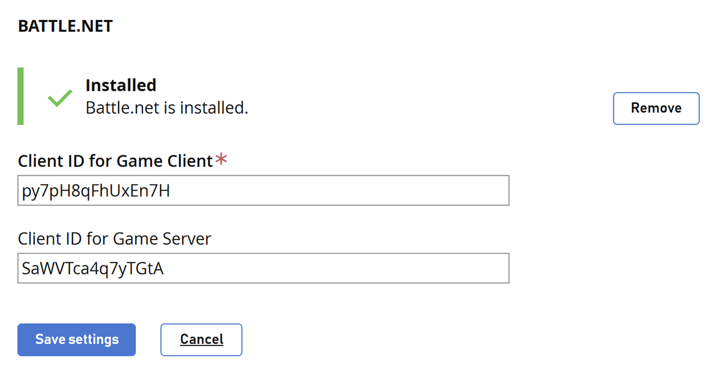
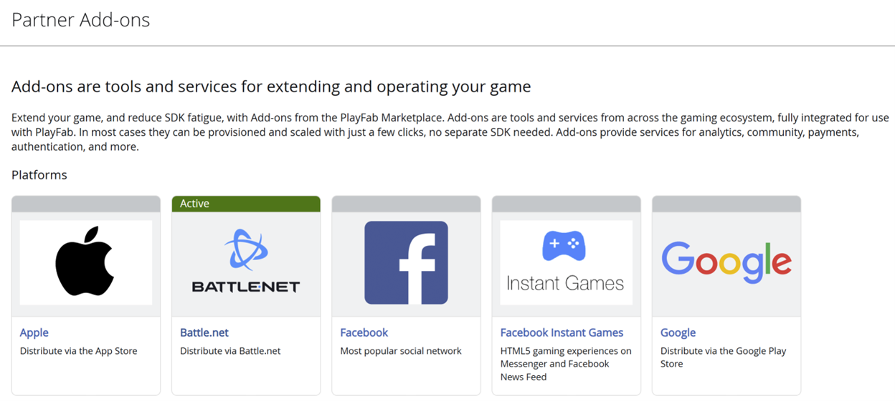
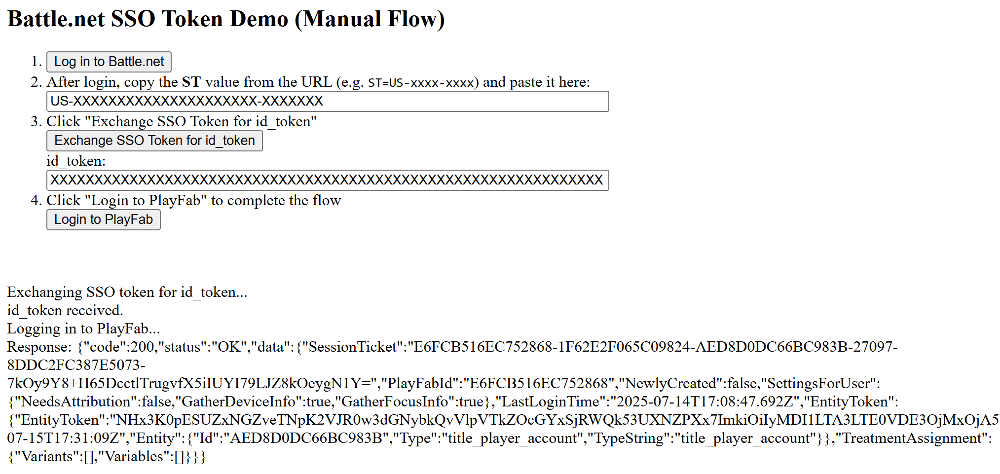

# Set up PlayFab authentication with Battle.net

This tutorial guides you through the process of setting up PlayFab authentication using Battle.net and HTML5/JavaScript.

## Requirements

You need:

- A [Battle.net account](https://developer.battle.net) for testing.
- A Registered [PlayFab](https://developer.playfab.com/) title.
- A familiarity with [Login basics and Best Practices](../login/login-basics-best-practices.md).
- A server with a valid domain name to act as a static HTML file. Consult the [Running an HTTP server for testing](running-an-http-server-for-testing.md) tutorial for information on how to set one up.

## Server and domain

This guide requires a server with a valid domain to follow. If you don't have a registered domain and remote web server yet, follow our [Running an HTTP server for testing](running-an-http-server-for-testing.md) tutorial for information on how to set one to run a local web server with a valid domain name.

Throughout this guide, we assume your domain is http://playfab.example.

## Retrieve Battle.net title Client ID

Start by navigating to the [Battle.net](https://developer.battle.net) and create a Battle.net developer account. Once your account is created, you need to create a title and be assigned Client IDs. 

## Install Battle.net Add-on
Go to the PlayFab **Game Manager** page for your title.

1. Navigate to **Add-ons** in the menu.
2. Locate and open the **Battle.net Add-on** icon/link.

  

3. Select **Install Battle.net**.

  

4. Fill in the **Client ID for Game Client**.
5. Optionally, fill in a **Client ID for Game Server**.
6. Then select the **Save settings** button.



Battle.net shows as active in the Add-on page.



## Testing using an access token

In this example, we show how to test the LoginWithBattleNet API using the classic access token approach. Use the HTML code provided for your testing.

> [!NOTE]
> *Make sure* to replace `YOUR_CLIENT_ID`, `YOUR_PLAYFAB_TITLE_ID`, `YOUR_BNET_TITLE_NAME`, and `YOUR_CLIENT_SECRET` with your own values.

```html
<!DOCTYPE html>
<html>
<head>
    <script src="https://cdn.jsdelivr.net/npm/axios/dist/axios.min.js"></script>
</head>
<body>
    <h2>Battle.net SSO Token Demo (Manual Flow)</h2>
    <ol>
        <li>
            <button onclick="openBattleNetLogin()">Log in to Battle.net</button>
        </li>
        <li>
            After login, copy the <b>ST</b> value from the URL (e.g. <code>ST=US-xxxx-xxxx) and paste it here:
            

            <input type="text" id="ssoToken" size="80" placeholder="Paste SSO token (ST=...)" />
        </li>
        <li>
            Click "Exchange SSO Token for id_token"

            <button onclick="exchangeSSOToken()">Exchange SSO Token for id_token</button>
            

            <label>id_token:</label>

            <input type="text" id="idToken" size="80" placeholder="id_token will appear here" />
        </li>
        <li>
            Click "Login to PlayFab" to complete the flow

            <button onclick="loginWithPlayFab()">Login to PlayFab</button>
        </li>
    </ol>
    


    <div id="log"></div>
    <script>
        // Demo configuration variables
        const BNET_TITLE_NAME = 'YOUR_BNET_TITLE_NAME';
        const PLAYFAB_TITLE_ID = 'YOUR_PLAYFAB_TITLE_ID';
        const CLIENT_ID = 'YOUR_CLIENT_ID';
        const CLIENT_SECRET = 'YOUR_CLIENT_SECRET';

        function openBattleNetLogin() {
            const url = `http://account.battle.net/login/en/?app=${encodeURIComponent(BNET_TITLE_NAME)}`;
            window.open(url, '_blank');
        }

        function exchangeSSOToken() {
            const ssoToken = document.getElementById('ssoToken').value.trim();
            if (!ssoToken) {
                logLine("Please enter the SSO token.");
                return;
            }
            logLine("Exchanging SSO token for id_token...");
            // Prepare the request for the token exchange
            const params = new URLSearchParams();
            params.append('scope', 'account.basic openid');
            params.append('grant_type', 'urn:ietf:params:oauth:grant-type:token-exchange');
            params.append('subject_token', ssoToken);
            params.append('subject_token_type', 'urn:blizzard:params:oauth:token-type:sso');
            params.append('requested_token_type', 'urn:ietf:params:oauth:token-type:jwt');

            // Basic Auth header
            const authHeader = 'Basic ' + btoa(CLIENT_ID + ':' + CLIENT_SECRET);

            fetch('https://oauth.battle.net/token', {
                method: 'POST',
                headers: {
                    'Content-Type': 'application/x-www-form-urlencoded',
                    'Authorization': authHeader
                },
                body: params
            })
            .then(res => res.json())
            .then(data => {
                if (data.id_token) {
                    document.getElementById('idToken').value = data.id_token;
                    logLine("id_token received.");
                } else {
                    logLine("Error: " + JSON.stringify(data));
                }
            })
            .catch(err => logLine("Error: " + err));
        }

        function loginWithPlayFab() {
            const idToken = document.getElementById('idToken').value.trim();
            if (!idToken) {
                logLine("Please exchange for an id_token first.");
                return;
            }
            logLine("Logging in to PlayFab...");
            axios.post(
                `https://${PLAYFAB_TITLE_ID}.playfabapi.com/Client/LoginWithBattleNet`,
                {
                    TitleId: PLAYFAB_TITLE_ID,
                    IdentityToken: idToken,
                    CreateAccount: true
                },
                {
                    headers: {
                        'Content-Type': 'application/json'
                    }
                }
            )
            .then(response => logLine("Response: " + JSON.stringify(response.data)))
            .catch(error => logLine("Error: " + JSON.stringify(error.response ? error.response.data : error)));
        }

        function logLine(message) {
            const logDiv = document.getElementById('log');
            logDiv.innerHTML += message + "
";
        }
    </script>
</body>
</html></code>
```

Remember to open the HTML page using your web server, and make sure to access this page using the URL you specified.

1. Once the page opens, select **Log in to Battle.net**.
2. After signing in, copy the **ST** value from the URL (for example: ST=US-xxxx-xxxx) and input it into the dialogue box.
3. Select **Exchange SSO Token for id_token** and copy the value into the dialogue box.
4. Select **Login to PlayFab** to complete the sign-in flow.
5. When finished, the script tries to authenticate on the PlayFab side and shows the result.

  