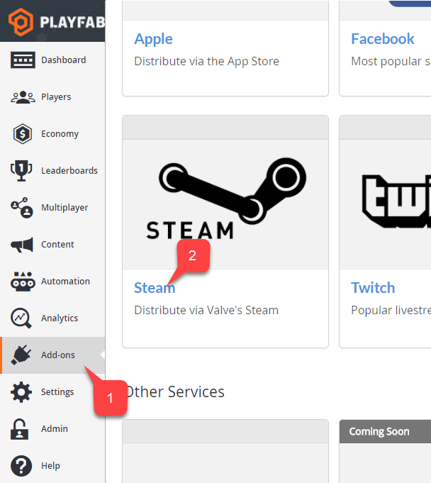
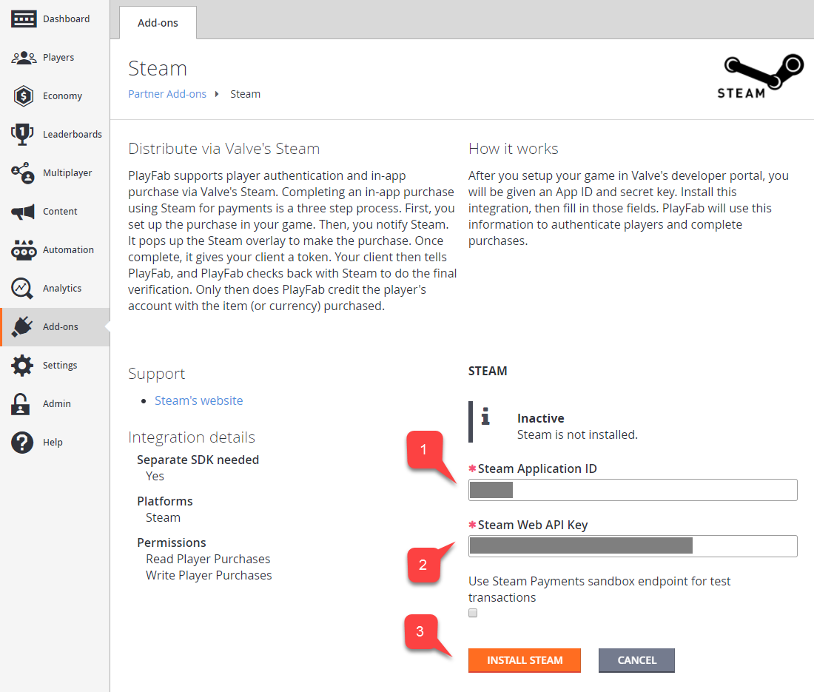
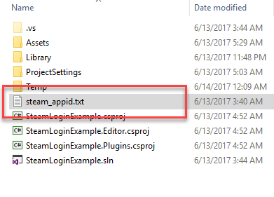
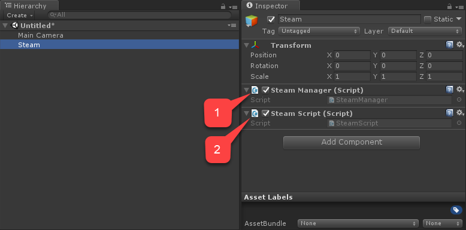
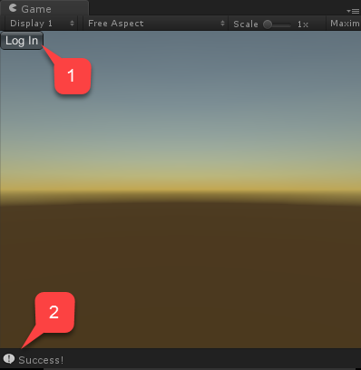

# Setting up PlayFab authentication using Steam and Unity

This tutorial guides you through the steps for logging into PlayFab using Steam through **SteamWorks** and Unity.

## Prerequisites

Before beginning, you should have:

- A Unity project with an imported PlayFab SDK, and a configured title ID.
- A Steam Application with:
  - The AppID already set up. The AppID can be acquired through the [Steam Direct (Formerly Greenlight)](https://partner.steamgames.com/steamdirect) process.
  - A Steam Publisher Web API Key. To generate a publisher key, follow [Creating a Publisher Web API Key](https://partner.steamgames.com/doc/webapi_overview/auth#create_publisher_key) in the **Steamworks** documentation.
- Familiarity with [Login basics and Best Practices](../login/login-basics-best-practices.md).

## Setting up a PlayFab title with Steam integration

To enable support for Steam authorization, PlayFab requires you to enable the Steam add-on.

Go to your **Game Manager** page:

1. Select the **Add-ons** menu item.
2. In the list of available **Add-ons**, locate **Steam** and select the title link:



1. Enter your **App ID**.
2. Enter the **Web API Key**.
3. Then select **Install Steam**.



## Setting up a Unity project

Start by downloading the latest release of Steamworks.NET from the [Releases page](https://github.com/rlabrecque/Steamworks.NET/releases).

- Get the Unity Package version of the release, and import it into the project.
- Once you import the package, close Unity.
- Navigate to the **Project** root folder.
- Locate the **steam_appid.txt** file.
- Open the file and replace the **App ID** value with your own.

  

Re-open Unity and create a new scene.

Inside that scene, create a new **GameObject** called **Steam**:

1. Add a **SteamManager** component to the **GameObject**. This component is part of Steamworks.Net.
2. Create and add a **SteamScript** component to the **GameObject**.

  

The following example shows the code for the `SteamScript` component.

```csharp
using System.Text;
using PlayFab;
using PlayFab.ClientModels;
using Steamworks;
using UnityEngine;

public class SteamScript : MonoBehaviour
{
    protected Callback<GetTicketForWebApiResponse_t> m_OnGetSteamAuthTicket;

    // Alternatively, you can use this callback if you choose to call SteamUser.GetAuthSessionTicket(...) instead
    // TicketIsServiceSpecific in the PlayFabLoginRequest should be false in this case
    // protected Callback<GetAuthSessionTicketResponse_t> m_OnGetSteamAuthTicketAlternate;

    private HAuthTicket m_hTicket;

    public void Awake()
    {
        m_OnGetSteamAuthTicket = Callback<GetTicketForWebApiResponse_t>.Create(OnGetSteamAuthTicket);
    }
    
    public void OnGUI()
    {
        if (GUILayout.Button("Log In") && SteamManager.Initialized)
        {
            GetSteamAuthTicket();
        }
    }

    private void GetSteamAuthTicket()
    {
        m_hTicket = SteamUser.GetAuthTicketForWebApi("AzurePlayFab");

        if (m_hTicket == HAuthTicket.Invalid)
        {
            Debug.Log("Failed to request steam auth ticket");
        }
        else
        {
            Debug.Log("Steam auth ticket requested");
        }
    }

    private void OnGetSteamAuthTicket(GetTicketForWebApiResponse_t pCallback)
    {
        Debug.Log("Steam auth ticket callback invoked");

        if (pCallback.m_eResult != EResult.k_EResultOK)
        {
            Debug.Log("Failed to get steam auth ticket: " + pCallback.m_eResult);
        }

        StringBuilder sb = new();
        for (int i = 0; i < pCallback.m_cubTicket; ++i)
        {
            sb.AppendFormat("{0:x2}", pCallback.m_rgubTicket[i]);
        }

        PlayFabClientAPI.LoginWithSteam(new LoginWithSteamRequest
        {
            CreateAccount = true,
            SteamTicket = sb.ToString(),
            TicketIsServiceSpecific = true
        }, OnComplete, OnFailed);
    }

    private void OnComplete(LoginResult obj)
    {
        SteamUser.CancelAuthTicket(m_hTicket);
        Debug.Log("Success!");
    }

    private void OnFailed(PlayFabError error)
    {
        SteamUser.CancelAuthTicket(m_hTicket);
        Debug.Log("Failed PlayFab login: " + error.GenerateErrorReport());
    }
}
```

## Testing

You may test right inside the editor:

1. Run the scene and select the **Log In** button.
2. The console message should appear after a moment, indicating the authentication result **Success!**.


