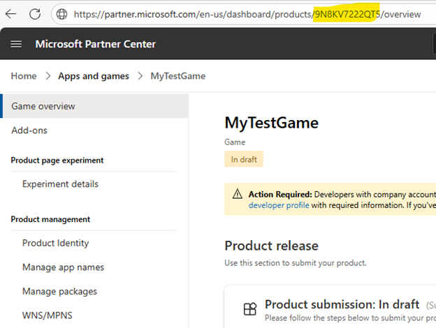
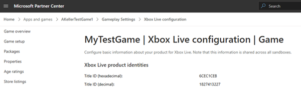
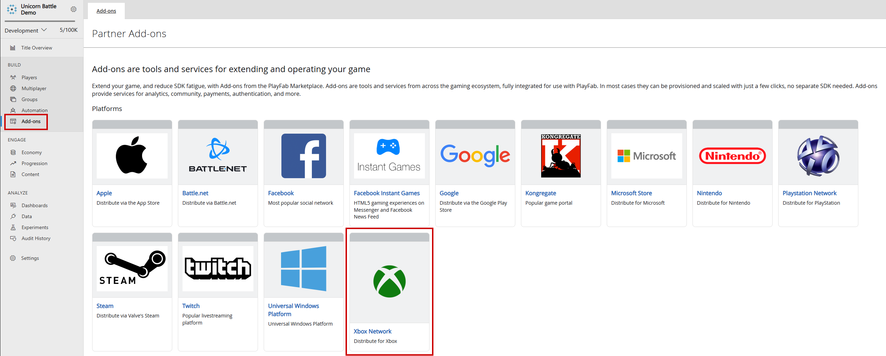
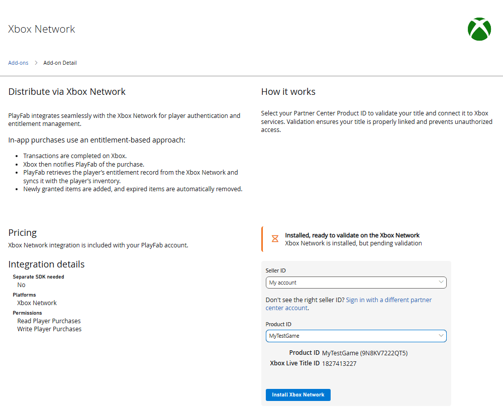
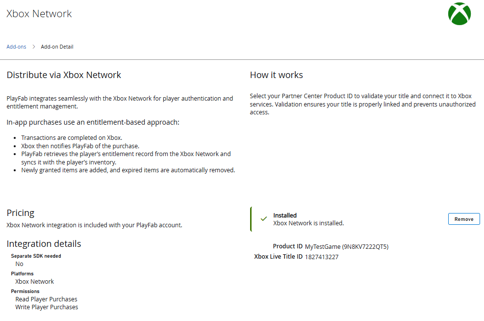

# Setting up Xbox Live title association in PlayFab

Learn how to configure scoped token validation by linking your Partner Center product ID to a PlayFab title ID. 

## Overview

In this tutorial, you'll learn how to configure token validation by specifying which Xbox Live title tokens that PlayFab APIs accept when they use Xbox Live token parameters—giving you more control over integration behavior and enabling scoped token acceptance. These APIs include `Client/loginwithxbox`, `Client/LinkXboxAccount`, `Client/UnlinkXboxAccount`, `Client/ConsumeXboxEntitlement`, `Client/GetFriendLeaderboard`, `Client/GetFriendLeaderboardAroundCurrentUser`, `Client/GetFriendLeaderboardAroundPlayer`, `Client/ConsumeMicrosoftStoreEntitlements`, `Server/loginwithxbox`, `Server/LinkXboxAccount`, `Server/UnlinkXboxAccount`, `Server/GetFriendLeaderboard`, `Server/GetFriendsList`, `Server/GetFriendLeaderboardForEntity`, `Lobby/GetFriendLobbies`, `Server/GetFriendLeaderboardAroundPlayer`, `Inventory/RedeemMicrosoftStoreInventoryItems`, and `Inventory/Redeem`. 

## Requirements

- A registered [PlayFab](https://developer.playfab.com/) title.
- [Partner Center](https://partner.microsoft.com/) account with an Xbox Live enabled title.

## Partner Center Product ID and Xbox Live Title ID

Start by navigating to the product page for your Partner Center title. 

1. In the Partner Center dashboard, navigate to [Apps and Games](https://partner.microsoft.com/dashboard/apps-and-games/overview).
2. Locate and select the Xbox Live enabled Partner Center title you wish to associate with PlayFab.
3. Find and copy the Product ID from the URL of your game.

4. Next find and copy the Xbox Live Title ID. Navigate to **Xbox services > Xbox Settings** and copy the **Title ID (decimal)** value.

## Install Xbox Live Add-on

Go to [PlayFab Game Manager](https://developer.playfab.com/) page for your title.

1. Navigate to **Add-ons** in the menu.
2. Locate and select the **Xbox Live** Add-on icon/link.

3. Use the **Seller ID** dropdown to select the correct Seller ID from Partner Center. If you don't see the correct Seller ID, select **Sign in with a different partner center account** and sign in with the correct user.

4. Use the **Product ID** dropdown to find the Partner Center Product ID that will be linked to the PlayFab title. Confirm that the Xbox Live Title ID matches the expected Xbox Live Title ID from Partner Center.

5. Select **Install Xbox Network** to save the setting and restrict API calls to the selected Xbox Live Title ID. 

By following these steps, you can confidently configure scoped Xbox Live token validation within PlayFab, ensuring that only tokens from designated Partner Center title are accepted. This setup streamlines cross-platform authentication, reinforces title-specific security, and empowers developers to deliver seamless, trusted player experiences across Xbox-enabled services.

## Further Reading

- [PlayFab Authentication Overview](../authentication/index.md)
- [Login Basics and Best Practices](../login/login-basics-best-practices.md)