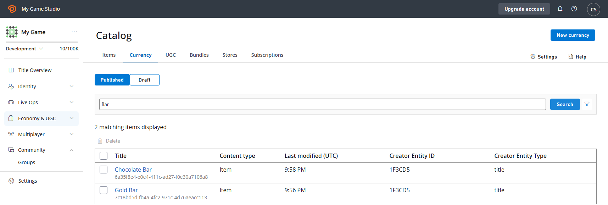
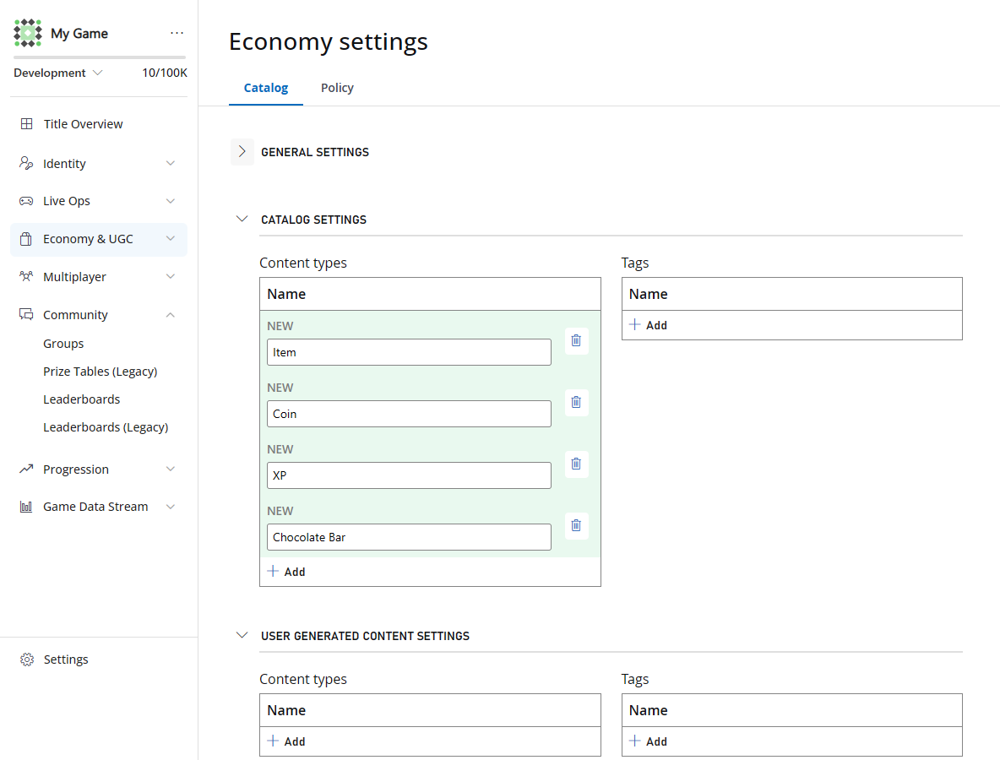
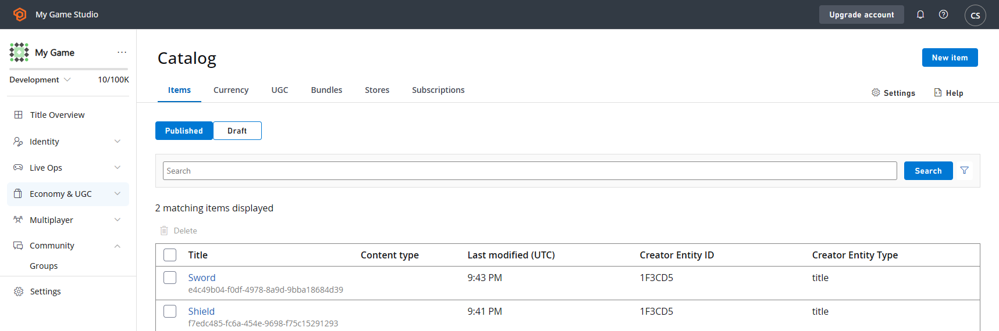
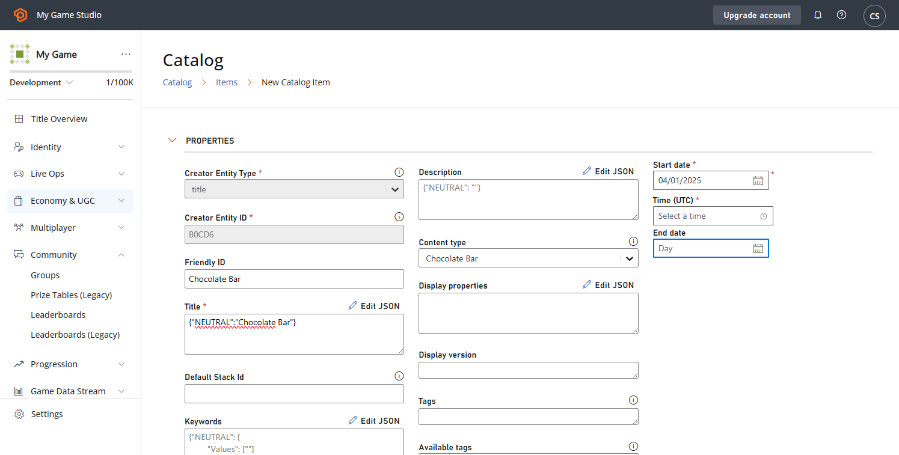
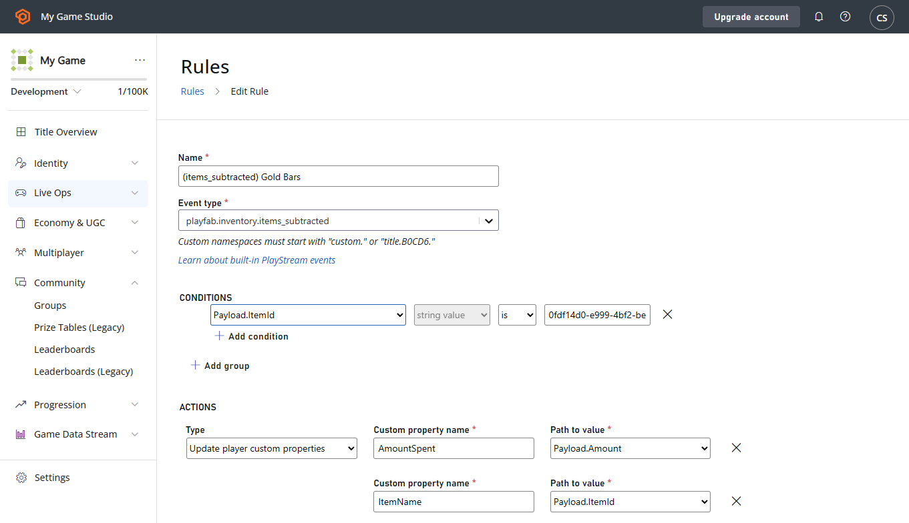
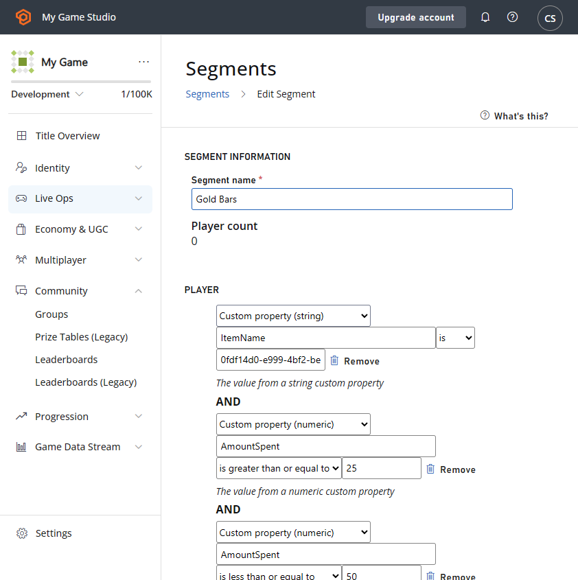
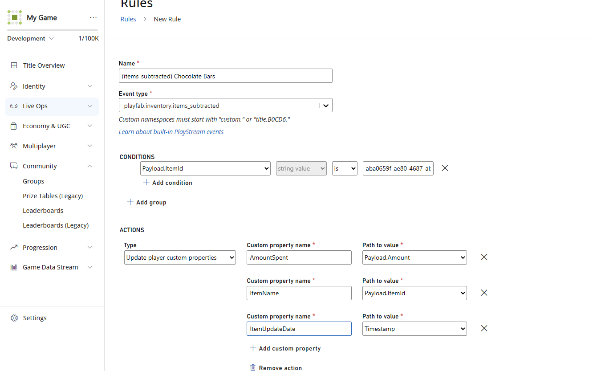
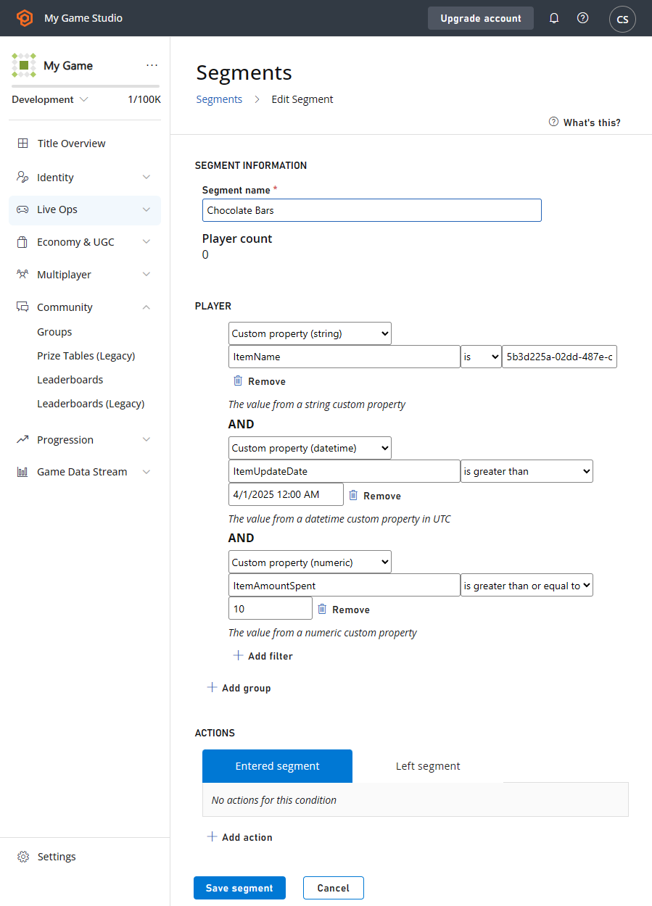
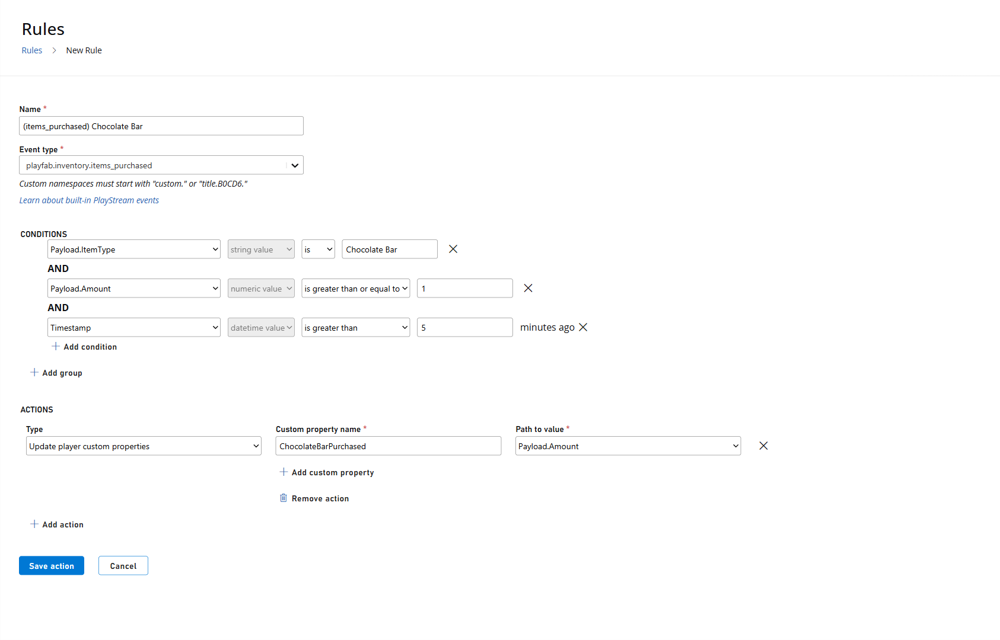
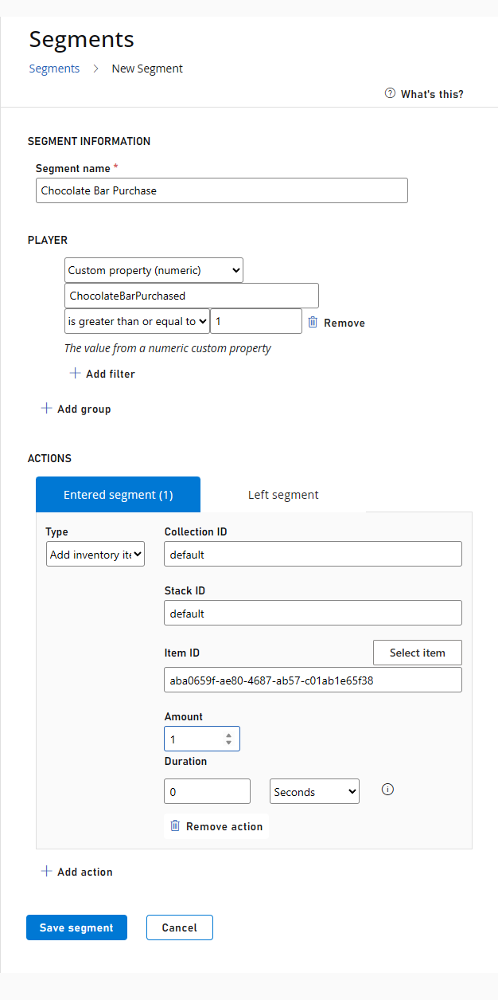

# Advanced Segmentation with Custom Properties (Public Preview)

> [!NOTE]
> The Advanced Segmentation with Custom Properties feature is in private preview. We anticipate ongoing changes to it as we continue gathering feedback and optimizing for customer use.

Advanced Segmentation with [Custom Properties (Public Preview)](player-custom-properties.md) enables dynamic player segments using your own commerce, engagement, and custom data. You can store and manage player's custom information using Custom Properties and then use it to create segments based on those specific properties. These properties can be set on players via APIs, Game Manager, or PlayStream rules, and can be used to define segments that group players based on shared characteristics. Once these segments are created, they can be used to generate actions on players. Additionally, these segments can be used to define scheduled or manual tasks.

## Creating segments with Player Custom Properties

You can create segments with Player Custom properties either via API or Game manager. 

### Via API

- Use the [Create Segment API](/rest/api/playfab/admin/segments/create-segment) to create a segment.
- Add custom property predicates using the [Update Segment](/rest/api/playfab/admin/segments/update-segment) API.

### Via Game Manager 

- Sign in to [Game Manager](https://developer.playfab.com).
- Go to the **Players** page.
- Go to the **Segments** tab.
- [Create or update a segment](segmentation-quickstart.md).
- Add custom property predicates by selecting **Add filter** under **Player**.
- Save segment. 

## Exporting players from a segment with custom properties 
 
1. [Create a segment](segmentation-quickstart.md) that references custom property predicates.
2. Use the [ExportPlayersInSegment API](segmentation-export-players-in-a-segment.md) to export player profiles 

## Scheduled Tasks 
 
1. [Run scheduled task](../../../data-analytics/acting-data/scheduled-tasks/index.md) on a segment using custom property predicates. 

## Quick Start Scenarios  

### Set up Economy V2 Catalog and Inventory

1. Create a **Gold Bar** currency as an item.
2. Create a **Chocolate Bar** currency as an item.    
   - **Required parameters:** Friendly ID, Title, and Start Date (March 1)  
     
3. Create a catalog item **Chocolate Bar**:  
   3a. Navigate to **Settings -> Economy (V2) -> Catalog (V2)**.  
   3b. Under **Catalog Settings**, add a new **Content Type** - **Chocolate Bar** and select **Save**.  

     

   3c. Go to **Engage -> Economy -> Catalog (V2) -> Items**, then select on **New item** to add.  

     

   3d. Select **Chocolate Bar** under **ContentType**, set a **Start date**, **Time**, and **Title**, then select **Save and Publish**.  

   

---

### 1. Create a Segment for Users Who Spend Between 25-50 Gold Bars (Virtual Currency Spent)  

1. Navigate to the **PlayStream Rules** page under **Automation -> Rules**.  
2. Create a rule for the `items_subtracted` event with the following configuration:  

   **Conditions:**  
   - `Payload.ItemId == <id of Gold Bar currency>`  
   - Optional: `Payload.Amount` between 25 and 50 to prevent overwrites of other amounts  

   **Actions:**  
   - Update custom properties  
     - `AmountSpent = Payload.Amount`  
     - `ItemName = Payload.ItemId`  

     

3. Navigate to the **Segments** page under **Players -> Segments**.  
4. Create a new segment with the following configuration:  
   - Custom property (string) `ItemName` is `<Gold Bar id>`  
   - Custom property (numeric) `AmountSpent` is `>= 25`  
   - Custom property (numeric) `AmountSpent` is `<= 50`  

     

---

### 2. Create a Segment for Users Who Were Granted Chocolate Bars and Used All of Them (10) After April 1, 2025 (Inventory Granted)  

1. Navigate to the **PlayStream Rules** page under **Automation -> Rules**.  
2. Create a rule for the `playfab.inventory.items_granted` event with the following configuration:  

   **Conditions:**  
   - `Payload.ItemId == <Chocolate Bars id>`  

   **Actions:**  
   - Update player custom properties  
     - `AmountSpent = Payload.Amount`  
     - `ItemUpdateDate = Timestamp`  

     

3. Navigate to the **Segments** page under **Players -> Segments**.  
4. Create a segment with the following configuration:  
   - Custom property (string) `ItemName = <Chocolate Bars id>`  
   - Custom property (datetime) `ItemUpdateDate > 4/1/2025`  
   - Custom property (numeric) `ItemAmountSpent >= 10`  

     
5. **How it Works:** The rule will **update** the player custom property with the value from each individual event—**it will not accumulate or sum values over time**. For example, if a player spends 1 chocolate bar ten separate times, the `ItemAmountSpent` property will be set to `1` each time, not `10`. As a result, the player would **not** be included in the segment that filters for `ItemAmountSpent >= 10`. If you need to track cumulative or aggregated values (e.g. total items spent across multiple events), we recommend implementing custom logic using an **Azure Function** or **CloudScript** to calculate and update the total.

6. **Note:** Gold Bars in Scenario 1 and Choclate Bars in Scenario 2 both write to the same property `ItemName`. If you want to track multiple values, you'll need multiple property names to prevent thrashing a player between 2 segments. 

---

### 3. Create a Segment for Users Who Purchased 1 Chocolate Bar in One Purchase (Catalog Purchase) 
1. Navigate to the **PlayStream Rules** page under **Automation -> Rules**.  
2. Create a rule for the `playfab.inventory.items_purchased` event with the following configuration:  

   **Conditions:**  
   - `Payload.ItemType == ChocolateBar`  
   - `Payload.Amount >= 1`  
   - `Timestamp >= 5 minutes ago`  

   **Actions:**  
   - Update custom properties  
     - `ChocolateBarPurchased = Payload.Amount`  

     

3. Navigate to the **Segments** page under **Players -> Segments**.  
4. Create a segment with the following configuration:  
   - Custom property (numeric) `ChocolateBarPurchased >= 1`  

     

5. **How It Works:**  Whenever a player purchases a **Chocolate Bar**, the rule condition triggers, executing the action to add the custom property. The player then enters the segment and can receive the configured reward or notification.  
