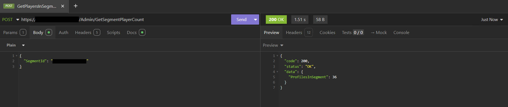

# Count Players of a Segment (Preview)

> [!NOTE]
> The GetSegmentPlayerCount API is in preview. We anticipate ongoing changes to it as we continue gathering feedback and optimizing for customer use.

This tutorial walks you through getting the player count of a given segment using the new GetSegmentPlayerCount APIs (currently in preview). These APIs, together with the ExportPlayersInSegment API and GetSegmentExport API, fully replace the functionality of the retired GetPlayersInSegment APIs. For getting started with the export APIs, follow this tutorial: [Tutorial to export players in a Segment - PlayFab | Microsoft Learn.](segmentation-export-players-in-a-segment.md)

Send a POST request with the Segment ID as a payload to the GetSegmentPlayerCount API. The 'ProfilesInSegment' in the response is the player count for the segment.

> [!Note]
> The API requires the ‘X-SecretKey’ header with the value being a Title Secret key. The ‘Content-Type’ header should be set to ‘application/json’ 