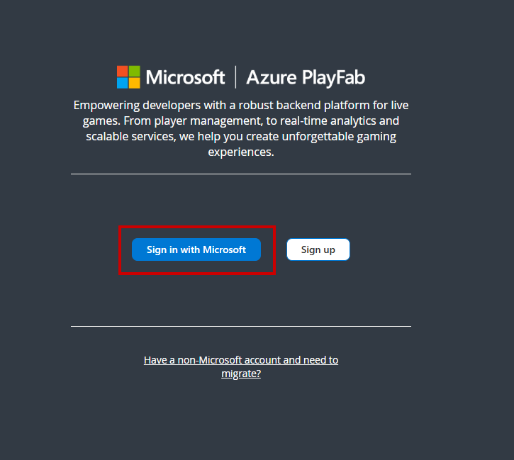
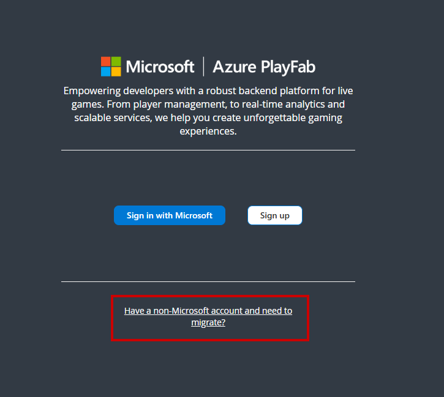
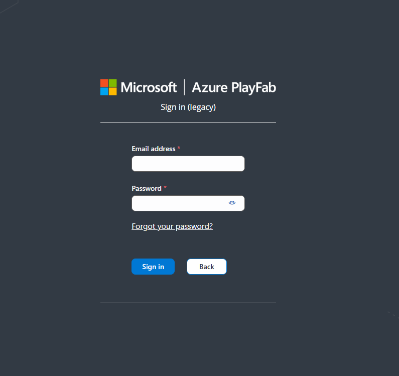
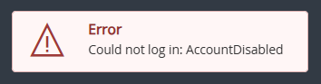
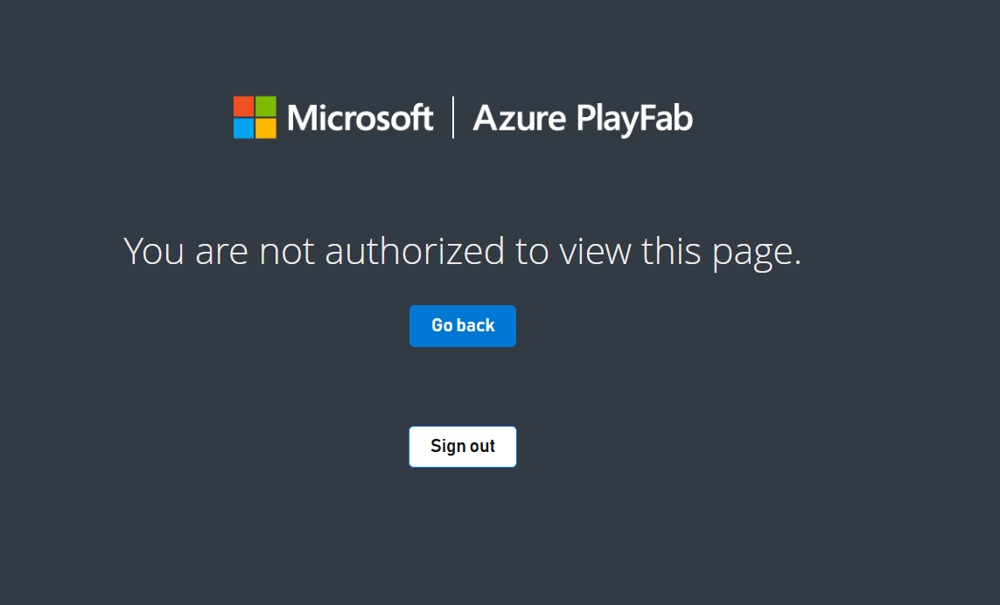
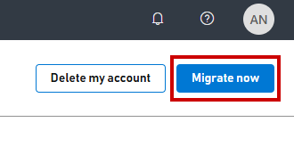

# Signing into Game Manager

> [!IMPORTANT]
> On April 30, 2025, Game Manager is retiring support for [legacy PlayFab authenticated](https://developer.microsoft.com/en-us/games/articles/2024/05/changes-to-developer-authentication-for-playfab/) developer accounts, requiring users to migrate their accounts to a Microsoft account. Users can learn more about the self-service migration tool on our [blog.](https://developer.microsoft.com/en-us/games/articles/2025/02/playfab-developer-account-self-service-migration-tool-now-available/)

Game Manager allows users to use their Microsoft or legacy PlayFab authenticated accounts to access their studios and titles. If you're having issues logging into your account, it might be due to which account type you're trying to sign into. 

> [!NOTE]
> It's possible to have both a PlayFab authenticated account and a Microsoft account using the same email. If you don't see the appropriate studios and titles in one account, try the other sign in method to see if an account exists. 

## Microsoft Account
For Microsoft account users, select the "Sign in with Microsoft" button and complete the sign in process. 

Once logged in, you're redirected to the My Studios and Titles page. 

## Legacy PlayFab Authenticated Account
If you're using a legacy PlayFab authenticated account, select "Have a non-Microsoft account and need to migrate?" to sign in.

Enter in the email and password for your PlayFab account and select "Sign in" to begin the migration process.

> [!NOTE]
> Using "Sign in with Microsoft" with a Microsoft account that isn't associated with a PlayFab account generates a new developer account, with a new studio and title. 

## Still can't sign in? 
If you still can't sign in, [contact us](https://playfab.com/contact/) and provide the email and sign in type that you're having issues with. 

## FAQ

### What is a PlayFab authenticated account and why migrate to a Microsoft account? 
- A PlayFab authenticated account is the legacy account system that utilized email and password. To improve security of PlayFab's services, new PlayFab developer accounts creation was disabled on July 29, 2024. When you migrate to a Microsoft account, you're able to utilize one identity throughout all of Microsoft Gaming's developer portals. 

### I don't see my studios and titles after migrating? 
- If you don't see your studios and titles after running the self-service migration tool, your account might be under a different Microsoft account. Try the following steps:
        
     - Sign out of your current Microsoft account and try signing into a different Microsoft account. 
     - Use a private browser to ensure your browser isn't using your windows credentials to authenticate to Game Manager.
- If you still don't see your studio and titles, [contact us](https://playfab.com/contact/) and provide the email and sign in type you're having issues with. 

### After I attempted account migration, my PlayFab account is disabled and I can't log into my Microsoft account.
- If you encounter an issue where you receive the error message saying AccountDisabled when using the legacy PlayFab authenticated accounts or "You aren't authorized to view this page" when using a Microsoft account, [contact us](https://playfab.com/contact/) and provide both your PlayFab and Microsoft account information.  

    Error message when using PlayFab authenticated accounts:

    
    
    Error message when using Microsoft account:

    

### I clicked "Migrate later" but now want to migrate, how do I start the process? 
- If you want to migrate your legacy PlayFab authenticated account to a Microsoft account and aren't automatically prompted to migrate, follow these steps to start the migration flow: 
    
    1. Sign into your legacy PlayFab authenticated account.
    2. Select your profile icon in the upper right corner and select "My Profile."
    3. In your profile, select "Migrate now" to begin the migration flow. 

        
    4. Follow the instructions to migrate to a Microsoft account. 