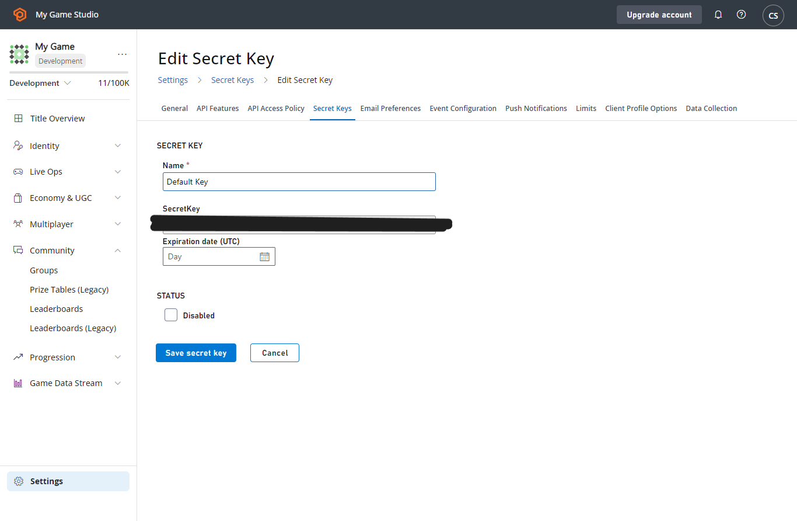

# Secret key management

PlayFab developer secret keys allow your Title to make PlayFab Admin and Server API calls. A secret key also called a developer key, is strongly coupled with a PlayFab Title.

Using the **Secret Keys** page in **Game Manager**, you can create, delete, disable, and set your keys to expire. This enables you to rotate the secret keys for your titles (which was difficult to do in the past.) It also allows you to grant temporary access to your titles.

> [!Note]
> Never include your developer Secret Key in a client build that you send to your customers. Doing so exposes your title to abuse.

To manage the secret keys for your Title:

1. Sign in to **Game Manager**.
2. Select your Title.
3. In the upper-right corner, select the gear icon.
4. Select **Title settings**, then select the **Secret Keys** tab.

The **Secret Keys** page provides options to **Delete** keys, view the **Status** of each key, and its **Name**, **Value**, and **Expiration** time, if it has one. This table lets you audit the keys that are available.

You can rename, enable, disable, or set expirations for existing keys via the dashboard. To see the options for a key, select it. Each title starts with a default key.

To rotate your keys:

1. Select **New Secret Key**.
2. Enter the **Name** of the key, and an optional expiration date.
3. Update your code to use the new key.
4. Disable the old key. Select the old key and then on the **Edit Secret Key** page, select the **Disable** checkbox.
5. Select **SAVE SECRET KEY**.

  

> [!Important]
> If your old keys are compromised, rotate the keys to return your Title to a secured state.

This flow is zero-downtime, and you can safely roll back each step until you delete the old key. If there are issues at the first step, you can delete your new key. No one should be using it.

At step two, both keys are active, so you can roll forward your code or back safely.

At step three, you can re-enable the key while you fix whatever was still depending on it.

When the process is complete, you don't need to delete the old key. If you delete that key, it can't be recovered. The delete is permanent and irrevocable.

Setting a key to Expire is useful when you need to give someone temporary access to your Title.

For example, if you have a contractor working on your game, you can give them keys that only have access for as long as you expect them to need it. If they require access beyond the original expected expiration date, you can reset the expiration date to extend the lifetime of the secret key.

## IP allowlist

IP allowlists for title secret keys are a security feature that ensures that a title secret key can't be used from outside the IPs you trust. Each secret key can carry its own list of IPv4 or IPv6 addresses (or CIDR ranges) that are permitted to use it.

When an IP allowlist is configured for a title secret key, privileged calls (Server and Admin APIs) made with that key are accepted only from source IPs that match an entry on the list. Calls from any other IP are rejected, even if the key itself is otherwise valid. Every change to a key, including allowlist edits, is captured in the existing PlayStream secret key changed event.

**Supported formats:**
* IPv4 and IPv6 addresses are both supported (for example, `203.0.113.7` or `2001:db8::1`).
* CIDR ranges are supported in either family (for example, `203.0.113.0/24` or `2001:db8::/32`).

**How to configure an IP allowlist for your title secret key:**

1. In **Game Manager**, navigate to **Title Settings** > **Secret Keys**.
2. Edit (or create) a secret key.
3. Toggle **Enable IP allowlist**.
4. Add your egress IPs or CIDR ranges, one per line (for example, `203.0.113.7` or `2001:db8::/32`).
5. Select **Save**.

> [!Important]
> Double check the list before saving. An incorrect entry blocks every IP that isn't on the list, which can lock your services out of the Server and Admin APIs.
