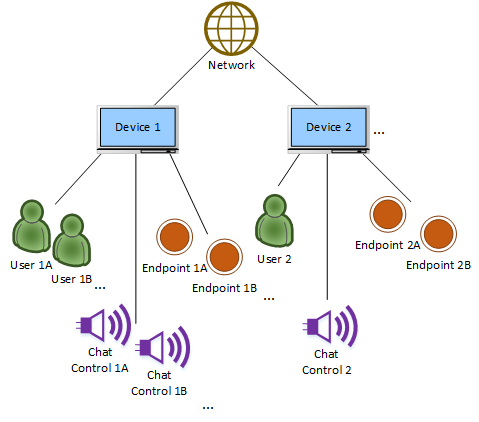
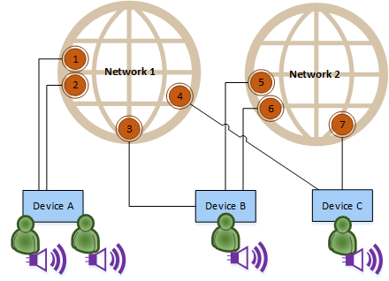

# PlayFab Party objects and their relationships

Successfully using the power and flexibility of the PlayFab Party API begins with understanding the following crucial objects defined in its scope:

* [**Device**](#device) - A distinct instance of the game executing on a physical device. A local device exists whenever the API is being used.
* [**User**](#user) - An individual logged-on player, or more precisely, a PlayFab `title_player_account` [Entity](../../live-service-management/game-configuration/entities/index.md) that the game provides to PlayFab Party for authentication and identification purposes. One or more users are associated with a given device.
* [**Network**](#network) - A secured collection of one or more devices and their authorized users that the game creates for exchanging chat or data communication. A network typically aligns with a game's multiplayer session or chat party concept.
* [**Endpoint**](#endpoint) - An abstraction for sending and receiving data within a network. An endpoint may represent a device, a user, or any desired game-specific concept.
* [**Chat control**](#chat-control) - A representation of a user specifically for configuring, originating, and targeting voice and text chat in one or more networks.

## Object relationships

As a simplified conceptual hierarchy, [networks](#network) contain [devices](#device), which in turn contain [users](#user), optional [endpoints](#endpoint), and optional [chat controls](#chat-control).
For example:

While simple enough to understand, the preceding relationship diagram is actually an incomplete depiction of PlayFab Party's capabilities and can be misleading if taken on its own. In reality, the Party API supports devices connecting to _multiple_ networks at once. For example, one might desire to maintain communication with a group of friends over time as that same group also joins and leaves separate larger game sessions with strangers. Considering this broader scenario allows us to better grasp the relationships between these objects.

It might feel intuitive to conceptualize a device as _belonging_ to networks, but this isn't the case. It's more correct to realize that devices _participate_ in networks. As such, the Party library only ever creates a single device API object, whether remote or local, when a particular instance is encountered, regardless of the number of networks it shares with your local device.

As an example, the following diagram shows two networks and three devices with users, chat controls and endpoints.
_Device A_ and its two chat controls (with associated users) are participating in _Network 1_, while _Devices B_ and _C_ have connected both to _Network 1_ _and_ to _Network 2_ with a single chat control (and associated user) each.
All devices have created one or two endpoints in each network where they're connected:

In the diagram, every device sees a single instance of all three devices and their chat controls, since they have at least one network in common with each other.
_Device A_ only knows about _Endpoints 1-4_ in _Network 1_, but _Devices B_ and _C_ can see the _Endpoints 5-7_ they created in _Network 2_ as well.

If _Device C_ instead only participates in _Network 2_ and not both networks, then:

* _Device C_ obviously wouldn't be able to create _Endpoint 4_ in _Network 1_, nor see _Endpoints 1-3_.
* _Device C_ wouldn't know about _Device A_ or its two chat controls only in _Network 1_.
* _Device A_ would similarly not see _Device C_ or its chat control only in _Network 2_.

_Device B_ however **would** still see all devices and their chat controls since it's still in both networks.

So, despite devices and chat controls being "outside" a strict hierarchical tree relationship with networks, it's important to note that a game instance will never actually encounter a remote device or chat control without the context of an accompanying network.
If the local and remote device or chat control have at least one network in common, the remote object may be visible.
But if there are no common networks, then the remote object will never be created.

> [!NOTE]
> Games aren't required to connect to more than one network simultaneously in order to use PlayFab Party successfully.
> You can learn more about whether and how to use multiple networks in a [subsequent advanced topic](concepts-multiple-networks.md).

## Common object attributes

All objects have well-defined lifetimes. A local game instance creates and destroys each object directly or using standardized notification mechanisms that are only signaled during a time window of a game's choosing. 
Working with notifications is described in more detail in a [later topic](concepts-async-operations.md).

All of the PlayFab Party API objects also support the concept of a _custom context_, which is simply a way to store an optional, local-only "shortcut" pointer or value with the object.
Custom contexts make it easy to go from PlayFab Party objects back to your corresponding private game objects in memory (if any) without needing to perform an inefficient lookup.
These values aren't transmitted remotely, since pointer values only have meaning to the local game instance.

Finally, all of the above objects except [network](#network) have a specialized "Local" sub-object containing methods and properties that are only available to the local [device](#device) that owns the object.

For example, there's a base `PartyEndpoint` object used to represent any local or remote [endpoint](#endpoint), and a more specific `PartyLocalEndpoint` object that can be retrieved via `PartyEndpoint::GetLocal()` only if that endpoint was actually created by the local device. This is where the `PartyLocalEndpoint::SendMessage()` method for transmitting game data is exposed since it wouldn't make sense for one device to be able to somehow transmit data from a  different remote device's source endpoints.

When using the C++ PlayFab Party interface (recommended), objects are exposed as C++ class instances.
When using the flat C interface, objects are represented by handle values.

## The roles of all major objects in more detail

1. [Manager](#manager) (`PartyManager`)
2. [Network](#network) (`PartyNetwork`)
3. [Device](#device) (`PartyDevice` and `PartyLocalDevice`)
4. [User](#user) (User Entity IDs and `PartyLocalUser`)
5. [Endpoint](#endpoint) (`PartyEndpoint` and `PartyLocalEndpoint`)
6. [Chat Control](#chat-control) (`PartyChatControl` and `PartyLocalChatControl`)
7. [State Change](#state-change) (`PartyStateChange`)

### Manager

In addition to the objects summarized earlier, the PlayFab Party API also exposes a top-level `PartyManager` singleton object.

This utility/organizational object is used largely as a starting point to begin working with the other objects.
Tha Manager is where new [networks](#network) and local [users](#user) are initially created, for example. All asynchronous operation completions and notifications are also centralized here. Most fundamentally, the manager is where the PlayFab Party library itself is initialized before use and cleaned up when no longer needed.

### Network

A `PartyNetwork` object represents a secured collection of participating [devices](#device), their authorized [users](#user), and any accompanying [endpoints](#endpoint) or [chat controls](#chat-control).
_Networks_ are initially created empty, but devices connect to them and authenticate at least one local user into the _network_.
_Networks_ that don't have any authenticated users are automatically destroyed after a timeout.

In order to connect to them, _networks_ are referenced using _network descriptors_.
_Network descriptors_ are largely opaque binary structures containing the information that PlayFab Party needs internally to identify and locate the _network_.
The API provides methods for serializing the structures to web-service-friendly strings and back so they can be exchanged with other devices using common social platform invite mechanisms, [PlayFab Matchmaking](../matchmaking/index.md), or other external rendezvous mechanisms outside the scope of PlayFab Party itself.
> [!NOTE]
> The _network descriptor_ for a _network_ can change in rare circumstances.
> Games should be prepared for notifications of such changes, and then update or re-advertise the new _network descriptor_ for an existing _network_ in order to avoid problems with additional devices connecting.

Even with a _network descriptor_, access to a _network_ is restricted to authorized users.
This user authorization is done during _network_ creation and through subsequent creation and revocation of invitations as described in more detail in the topic [Invitations and the security model](concepts-invitations-security-model.md).

Games can choose to use invitations to restrict entry to only users' friends, or to prevent malicious players from joining the _network_.

Devices can connect to more than one _network_ at a time.
You can learn more about whether and how to use multiple _networks_ in a [later topic](concepts-multiple-networks.md).

The kinds of actions that can be taken on `PartyNetwork` objects include authenticating local users into it, connecting and enumerating chat controls, creating and enumerating endpoints, or getting _network_-wide performance information.

### Device

The `PartyDevice` object represents a distinct instance of the game and its PlayFab Party library code executing on a physical device.
Most operations aren't performed on `PartyDevice` objects themselves; rather they're an organizational mechanism for defining which [endpoints](#endpoint) or [chat controls](#chat-control) belong to that game instance, particularly for platforms and games that support more than one local [user](#user) simultaneously.
PlayFab Party uses this relationship knowledge to optimize transmission of game data and chat by only sending one copy of a message even if multiple targets on the device need to receive it, for example.

Remote `PartyDevice` objects are "byproducts" of connecting to a [network](#network) and authenticating a user into that network.
They're only created when valid, authenticated remote users associated with the _device_ are participating in a network to which the local _device_ is also connected. Correspondingly, they're also destroyed once that is no longer true.

On the other hand, the `PartyLocalDevice` specialized sub-object is always available for the local game instance to reference as long as PlayFab Party is initialized.
It is never explicitly created or destroyed.

### User

A PlayFab Party _user_ is a unique human player for whom the game performs a [PlayFab Player Login](../../identity/player-identity/login/index.md) to acquire a `title_player_account` [Entity ID](../../live-service-management/game-configuration/entities/index.md) and token.

Remote users are identified within the PlayFab Party API solely by their Entity ID string associated with [chat controls](#chat-control) and optionally with [endpoints](#endpoint).
They're not represented using a dedicated object. This is because PlayFab Party doesn't have functionality that meaningfully interacts with arbitrary users, other than for raw identification and as a label associated with those other objects.

Conversely, for local _users_ there are explicit `PartyLocalUser` objects, since games own the management of their lifetimes within PlayFab Party.
The game will typically create a `PartyLocalUser` when the game has successfully logged that PlayFab player in using the applicable [login](../../identity/player-identity/login/index.md) method, and destroy the `PartyLocalUser` as appropriate when that user logs off.
For platforms and games that support multiple local players logged in, additional `PartyLocalUser` objects should be created for each player.

`PartyLocalUser` objects are also important because they're the basis of all authentication. A valid local _user_ must exist in order to either create a new [network](#network) or to authentication into one.

Authorizing users is described in more detail in the topic covering [Invitations and the security model](concepts-invitations-security-model.md).

Almost every operation requires a `PartyLocalUser` to be provided or present, even though very few operations are performed on `PartyLocalUser` objects themselves.

`PartyLocalUser` objects are created using the `PartyManager` object.
They can only be explicitly destroyed by their creators.
While they have no direct object representation on remote [devices](#device), chat controls and endpoints associated with them will be destroyed if the owning device removes the `PartyLocalUser` or disconnects from the network, gracefully or otherwise.

### Endpoint

`PartyEndpoint` objects are optional but are the core of PlayFab Party data communication for games that leverage them.
Like typical networking sockets, _endpoints_ are an abstracted addressing mechanism for originating or targeting data messages within a [network](#network).
They could represent a [device](#device), an individual [user](#user), or any arbitrary game-defined concept (e.g., a tank unit) that you'd like to uniquely identify for sending and receiving messages.

The specialized `PartyLocalEndpoint` sub-object is for _endpoints_ created in the network by the local game instance.
This is where most _endpoint_ functionality resides.
Its `PartyLocalEndpoint::SendMessage()` transmits game data payloads from the `PartyLocalEndpoint` to one or more other `PartyEndpoint` objects in the same network.
It provides various options for selecting how best to handle Internet packet loss (e.g., guarantee delivery and/or ordering), to control the tradeoff between low latency versus coalescing multiple messages from the same or other local endpoints for lower bandwidth usage, and to react when the connection quality isn't sufficient to support the rate at which the game is sending.
You can learn more about transmitting game data using _endpoints_ in a [later topic](concepts-endpoint-transmission.md).

In addition to being a source or destination for data messages itself, each `PartyEndpoint` object is also assigned a 16-bit _endpoint unique identifier_ by PlayFab Party that allows you to reference the specific _endpoint_ in message payloads sent to or from separate `PartyEndpoint` objects within the network.
This provides a convenient way to avoid the overhead of sending a full, larger user [Entity ID](../../live-service-management/game-configuration/entities/index.md) string or other identifier it might represent, for example, without having to build your own peer-to-peer identity agreement negotiation.

`PartyLocalEndpoint` objects are created using their containing `PartyNetwork` object.
Doing so results in corresponding `PartyEndpoint` objects being created on remote devices.
An _endpoint_ can be destroyed explicitly by its creator, or will be destroyed implicitly when the owning device disconnects from the network or the associated `PartyLocalUser` object (if one had been specified) is removed from the network.

### Chat control

`PartyChatControl` objects are the mechanism for using PlayFab Party's optional chat communication features.
They represent a particular [user](#user)'s associated audio input/output devices, preferences, and communication policies.

The specialized `PartyLocalChatControl` sub-object is also available for _chat controls_ created by the local game instance.
This is where you configure the permissions allowing chat communication to or from remote `PartyChatControl` objects, for example, to choose network-wide vs. team-only chat, or to apply platform policy restrictions.
Local _chat controls_ are used for sending chat text, synthesizing text to speech, requesting transcriptions and translations of voice streams, muting, and more.

`PartyLocalChatControl` objects must be connected to a [network](#network) before they'll be created as `PartyChatControl` objects on remote [devices](#device) in that same network.
A device will always only see a single representative `PartyChatControl` object created, even when that device and _chat control_ have connected to more than one network in common.
This helps avoid unnecessary duplication or interruption of audio and text chat messages.

`PartyLocalChatControl` objects are created using the containing `PartyLocalDevice` object.
A _chat control_ can be destroyed explicitly by its creator, or will be destroyed implicitly when the owning device disconnects from the network or the associated `PartyLocalUser` object is removed from the network.

### State Change

`PartyStateChange` structures are used to inform the game of all asynchronous operation completions, incoming messages, update notifications, and other API-related events.

To simplify how you work with complex multi-machine interactions over the Internet with unpredictable timing, PlayFab Party guarantees it won't modify any state it reports from the API except as a result of an explicit call by the game.
But since you do still need a way to learn about remotely initiated operations or unplanned occurrences that modify local state, PlayFab Party and the game cooperate through a special pair of methods, `PartyManager::StartProcessingStateChanges()` and `PartyManager::FinishProcessingStateChanges()`.
These are called at a point in the game's work loop where it's convenient to handle such updates.
The new events are reported from `PartyManager::StartProcessingStateChanges()` as an array of zero or more `PartyStateChange` structures.
Once the game has handled the _state changes_, the array is returned using `PartyManager::FinishProcessingStateChanges()`.

The `PartyStateChange` structure isn't a full object by itself. It's a base header to be cast to a more detailed structure containing information on the specific type of completion or notification, pointers to the relevant objects, and any error information.

Working with _state changes_ is described in full detail in a [later topic](concepts-async-operations.md).

## Next steps

* [Learn about PlayFab Party invitations and the security model](concepts-invitations-security-model.md)
* [Learn how PlayFab Party interacts with your discovery flows](concepts-discovery.md)
* [Find out more about PlayFab Party chat communication](../../community/voice-communications/concepts-chat.md)
* [See how to work with asynchronous operations and notifications in PlayFab Party](concepts-async-operations.md)
