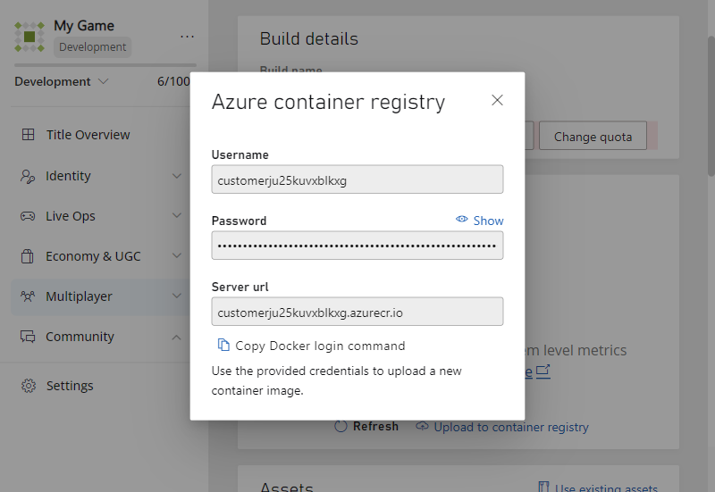

# Create and deploy Linux Builds

This article contains details on how to create Linux Builds on PlayFab Multiplayer Servers, both using containers and using processes.

## Create and deploy Linux container images

This section outlines specific steps to help you create and deploy Linux container images.

As described in [Create virtual machines (VMs)](deploying-playfab-multiplayer-server-builds.md), you configure VMs to be automatically spun up as game servers globally according to your budget and demand when using our service. In order to do so, you don't explicitly create VMs but define parameters that determine how they get created on your behalf. This process is called deploying or creating a build.

PlayFab Multiplayer Servers can deploy both Linux-based and Windows-based game servers. The way builds are deployed for Linux containers are similar to Windows containers with a few important differences. To learn more, see [Windows and Linux container image differences](#windows-and-linux-container-image-differences). If you want to use PowerShell/API to manage Linux containers, see [Manage Linux container images using APIs](#manage-linux-container-images-using-apis).

When using Linux-based game servers, instead of using a managed container image, you have to create and upload your container image to a container registry. To make it easy for you to upload containers, your account comes with an Azure container registry.

## Required knowledge

* [Docker containers](/training/modules/intro-to-docker-containers/)

## Set up your Windows development device

This step is needed only if you want to use Windows development device to create Linux container images. Alternatively, you can use Linux OS devices, VMs, or dual-OS systems with Docker installed.

[Windows Subsystem for Linux (WSL)](/windows/wsl/) enables you to use your development device in the familiar Windows environment to author and manage Linux container images. Using WSL means that you wouldn't need an overhead of a traditional Linux virtual machine or dual-boot setup.

1. [Install WSL 2](/windows/wsl/). Make sure that you restart your machine and are using WSL 2. You also need to install the Linux kernel update package.
2. [Install a Linux distribution that uses WSL](/windows/wsl/install#step-6---install-your-linux-distribution-of-choice). Although our VMs use Ubuntu, you can select any distribution you want for your container image. Consider using [Ubuntu 20.04 Long-Term Support (LTS)](https://www.microsoft.com/store/apps/9n6svws3rx71) or later versions.
3. [Install Docker Desktop for Windows with WSL 2](/windows/wsl/tutorials/wsl-containers). For direct download link, go to [Docker Desktop for Windows (external)](https://hub.docker.com/editions/community/docker-ce-desktop-windows/).

**Verify WSL 2 set up**

* Open PowerShell
* Run __wsl -l -v__ to check that both docker-desktop and ubuntu applications are running WSL 2 (version 2)

**Verify Docker set up properly for WSL**

* Open WSL terminal
* Run __docker version__ to confirm that Docker is installed and OS used is Linux

> [!Tip]
> For developing and debugging Linux C++ applications, use [WSL in Visual Studio 2019](/cpp/linux/).

## Get your PlayFab container registry sign-in credentials

The Azure container registry account is associated with your PlayFab account. Only you have access to the containers uploaded there. This Azure container registry is free of charge.

* In Game Manager, select your game title, then __Multiplayer__ > __Servers__. Select __New build__ to open the build creation page.
* Select __Linux__ as the virtual machine operating system. 
* Take note of the sign-in credentials&mdash;name, password, and customer5555555.azurecr.io, as this information is needed later



If you wish to use PowerShell/API, call the [GetContainerRegistryCredentials](/rest/api/playfab/multiplayer/multiplayerserver/getcontainerregistrycredentials) API to retrieve a container registry address, user name, and password.

## Create and push Linux container images to Azure Container Registry

These steps help you create and push your custom Linux container image.

#### Integrate your game server application with GSDK

Similar to using Windows servers, you have to integrate your game server code with the PlayFab Multiplayer Server SDK (GSDK). The GSDK integration can be part of your container image.

For instructions, see [Author a game server build](author-a-game-server-build.md) and [Integrating your title with PlayFab Game Server SDK (GSDK)](integrating-game-servers-with-gsdk.md).

#### Create a Dockerfile

A Dockerfile is a text file with no extension and contains all commands needed to build a given container image.

1. Open __Notepad__ or any suitable editor
2. Add specific commands needed to run and build a container. For an example of this file, see the [DockerFile](https://github.com/PlayFab/MpsSamples/blob/master/wrappingGsdk/Dockerfile) provided in [Wrapper sample](wrapper-sample.md). For more information on how to create this file, see [Dockerfile format (external)](https://docs.docker.com/engine/reference/builder/#format) and [Best practices when creating Dockerfile (external)](https://docs.docker.com/develop/develop-images/dockerfile_best-practices/)
3. Save file as a Dockerfile, ideally in an empty folder/directory. You should add other files that are needed to build the container image into this folder.

  Saving instructions when using __Notepad__:
  * Select __File__> __Save as...__ to open up the save options
  * Go to the folder you want to save the file in
  * Under __File name:__, use __"Dockerfile"__, including the quotes.
  * For __Save as type:__, select __All Files__
  * Select __UTF-8__ encoding
  * Select __Save__

#### Build and upload Linux container image

1. Open your Linux terminal with Docker installed.
2. Run the following Docker commands using the sign-in credentials obtained from the earlier step. Then follow the instructions on screen to enter your username and password.

```docker
docker login customer5555555.azurecr.io
```
[docker sign in](https://docs.docker.com/engine/reference/commandline/login/) logs you into the Azure container registry as shown in Game Manager.

```docker
username: customer5555555
password: HRDFOdIebJkvBAS+usa55555555
```
3. Build the container image

Run the following command to build the container image using the Dockerfile in your current directory. There's a "." at the end of the __docker build__ command.

The __-t__ flag specifies the name:tag information for your new container image. The name and tag are used if the build succeeds. If there are build errors, you have to fix them before moving on to the next step.

In the following example, the repository name is __customer5555555.azurecr.io/pvp_gameserver__ and tag is __v1__. For more information, see [docker build command reference (external link)](https://docs.docker.com/engine/reference/commandline/build/) and [Building Dockerfile (external link)](https://docs.docker.com/engine/reference/builder/).

When using WSL, the Windows C: drive is mounted at /mnt/c.
* Then run __cd /mnt/c/path/to/your/Dockerfile__ to switch to the path where your Dockerfile is.
For more information, see [Accessing C drive](/windows/wsl/faq#how-do-i-access-my-c--drive-).

```docker
docker build -t customer5555555.azurecr.io/pvp_gameserver:v1 .
```

>[!TIP]
> When using Linux, run __pwd__ to find out which directory you are currently at.

4. Upload the container image

Run the commands to push the image to your PlayFab Container registry. Select a meaningful and helpful name:tag combination for your uploaded container image. To upload your container to the PlayFab operated registry, use [docker push](https://docs.docker.com/engine/reference/commandline/push/) or another container registry client.

```docker
docker tag hello-world customer5555555.azurecr.io/pvp_gameserver:v1
docker push customer5555555.azurecr.io/pvp_gameserver:v1
```

## Check that your container is uploaded

After the container is uploaded, go back to the __New Build__ page in Game Manager and select __Refresh Images__. You would be able to see the image in the list and select it. Alternatively, you can use the [ListContainerImages](/rest/api/playfab/multiplayer/multiplayerserver/listcontainerimages) API call to list your uploaded container images.
 
Now you're ready to deploy servers. For instructions, see [PlayFab portal&mdash;Game Manager](deploy-using-game-manager.md) and [Using PowerShell/API](deploy-using-powershell-api.md).

## Windows and Linux container image differences

For many developers, using Windows managed container is the preferred simple and default choice. However, Linux container images deployed on virtual machines enjoy a cheaper hourly rate.

> [!Note]
> You are able to fully customize your game servers whether you are using Windows or Linux container images. When using Windows servers, you customize the managed container image by uploading assets. 

The following table lists some differences when creating and using them.

| Developer options| Windows                 | Linux         |
|------------------|-------------------------|---------------|
| Development device OS | Windows OS | [Windows Subsystem for Linux (WSL)](#set-up-your-windows-development-device) or Linux OS (using dual-OS or VMs)|
| Container image | Straightforward deployment using our managed container image. You can still customize the container by uploading extra files as assets. | More work is needed because you have to create your own custom container image that gives you complete control. |

## Manage Linux container images using APIs

You can use APIs to manage Linux container images. For the rest of build lifecycle (viewing usage, updating regions and standingBy configurations, deletion), manage them using Game Manager.

* [GetContainerRegistryCredentials](/rest/api/playfab/multiplayer/multiplayer-server/get-container-registry-credentials): Retrieve a container registry address, user name, and password
* [ListContainerImages](/rest/api/playfab/multiplayer/multiplayer-server/list-container-images) and [ListContainerImageTags](/rest/api/playfab/multiplayer/multiplayer-server/list-container-image-tags): Ensure your new image and tag are listed (sometimes it might take a couple of minutes for image to be fully registered in the system)
* [CreateBuildWithCustomContainer](/rest/api/playfab/multiplayer/multiplayer-server/create-build-with-custom-container): Create a build with a custom container. Specify the tagged image you uploaded earlier. Ensure the following properties are set on the request:
  * **ContainerImageReference** - The image name and tag that was uploaded earlier. These values are visible in ListContainerImages and ListContainerImageTags.
  * **ContainerFlavor** - "CustomLinux"
  * **ContainerRunCommand** (Optional) - If your container doesn't have a default command, use this property to provide the command to run, along with any arguments.

## Packaging assets for Linux process-based servers

When using Linux in **process mode** (instead of container mode), you upload your game server as an asset archive rather than a container image. This section covers important packaging requirements.

### Supported archive formats

Assets should be uploaded as `.tar.gz`, or `.tar` files, so Unix file permissions (such as the execute bit) can be preserved during extraction.

> [!WARNING]
> **`.zip` files do not preserve Unix file permissions on Linux.** If you upload your Linux game server executable in a `.zip` archive, it loses its execute permission and fails to start with a "Permission denied" error. To work around this issue, either use `.tar.gz` instead, or set your start command to a shell script that runs `chmod +x` on your executable before launching it.

### Tar.gz and tar archive structure requirements

When extracting `.tar` or `.tar.gz` archives, PlayFab Multiplayer Servers strips the first directory level from the archive (equivalent to `tar --strip-components=1`). Your archive **must** contain a single top-level wrapper directory with all your game files inside it.

**Proper structure** — files inside a top-level directory:

```
MyGameServer/
├── MyGame.x86_64
├── MyGame_Data/
│   └── ...
├── UnityPlayer.so
└── start_server.sh
```

Create the archive with:

```bash
tar czf MyGameServer.tar.gz MyGameServer/
```

> [!CAUTION]
> If your files are at the root of the archive without a wrapper directory, they are **silently skipped** during extraction. Your game server fails with "No such file or directory" errors because the executable is never written to disk.

### Setting the start command

For process-based servers, the start command should be **relative to the root asset folder after extraction** (that is, relative to where files end up after the top-level directory is stripped).

For example, if your archive contains `MyGameServer/MyGame.x86_64`, after extraction the file is at the root of the asset folder. Set your start command to:

```
MyGame.x86_64
```

If your executable is inside a subfolder (for example, `MyGameServer/bin/MyGame.x86_64`), set the start command to:

```
bin/MyGame.x86_64
```

## Manage Linux process-based builds using APIs

You can use APIs to manage Linux process-based builds. For the rest of build lifecycle (viewing usage, updating regions and standingBy configurations, deletion), manage them using Game Manager.

* [CreateBuildWithProcessBasedServer](/rest/api/playfab/multiplayer/multiplayer-server/create-build-with-process-based-server): Create a build with the game server running as a process. Ensure the following properties are set on the request:
  * **OsPlatform** - "Linux"
  * **GameAssetReferences** - The list of game assets (uploaded as `.tar.gz` or `.tar` files). Each asset requires a **FileName** matching the uploaded asset name.
  * **StartMultiplayerServerCommand** - The command to run when the game server starts. The path should be relative to the root asset folder after extraction (for example, `MyGame.x86_64 -server`).
  * **Ports** - The ports to map for the build.
  * **MultiplayerServerCountPerVm** - The number of game server instances to host on a single VM.
  * **RegionConfigurations** - The regions to deploy to, with standby and maximum server counts.

## See also

* [Intro to docker containers](/training/modules/intro-to-docker-containers/)
* [Create your first server](create-your-first-server.md)
* [Resources and samples](server-samples-resources.md)
* [PlayFab Multiplayer Server Software Development Kits (SDKs)](server-sdks.md)
* [API Reference](xref:titleid.playfabapi.com.multiplayer.multiplayerserver)
