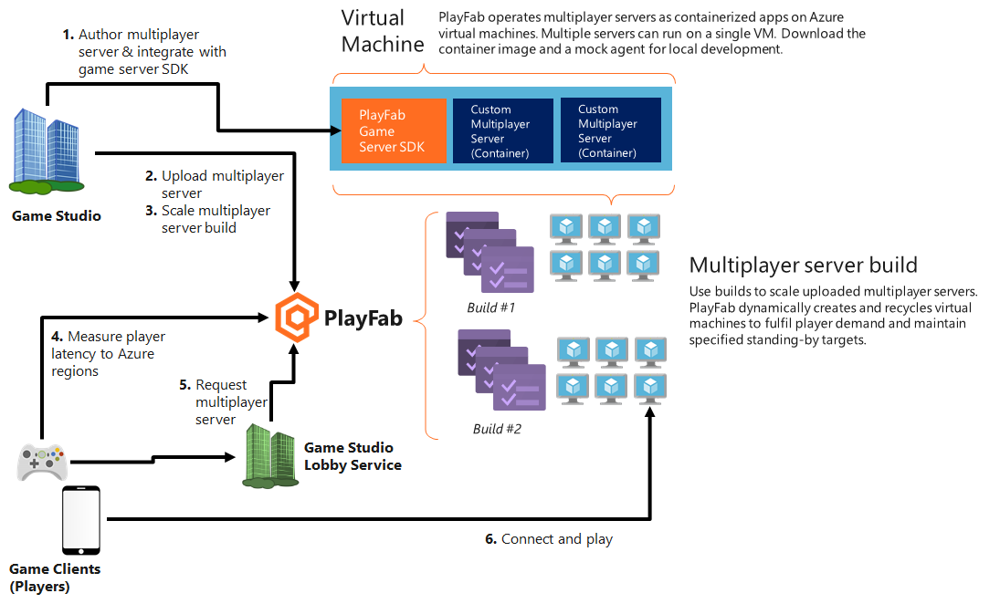

# Terminology

This article explains the terms used for PlayFab Multiplayer Server. We understand that it can be confusing since the word server is used in multiple places.

The article also briefly covers the internal structure of the PlayFab Multiplayer Server and the general relationship of the various components. For more information, see [Basics of a PlayFab game server](basics-of-a-playFab-game-server.md).

## PlayFab Multiplayer Servers

PlayFab Multiplayer Servers are also known as PlayFab virtual machines (VMs) and Servers. 

They're Azure VMs with PlayFab managed service functionalities. The added functionalities optimize them for use as multiplayer game servers.

Each PlayFab VM:
* Has a component known as *PlayFab VM agent*. PlayFab VM agent provides information about your game server's current state, health status, players that are currently connected, and other telemetry.
* Can have multiple containers (game servers) running on them. Containers are a way to wrap up an application into its own isolated package. To learn more, see [What is a container?](https://azure.microsoft.com/overview/what-is-a-container/)

### Game server containers

Game servers run as containerized applications. This means that your game server executable runs inside a container. It ensures portability because game servers now execute in a consistent environment from development to production. The lightweight nature of containers also enables you to rapidly scale-up and scale-down.

Each container:
* Functions as a game server
* Has a PlayFab Multiplayer Game Server Build. It is your usual game server build that is integrated with the PlayFab Game Server SDK (GSDK). Specifically, the code for the game server executable must include the GSDK and implement specific methods using APIs in the GSDK. This integration enables your game server to connect to the PlayFab VM agent.

The following image illustrates the various components of a PlayFab Multiplayer Server.

## Definition of key terms

* **Game server executable**: This term refers to a game server application that runs in containers on PlayFab VMs. It might be a simple network repeater, a fully authoritative game server running physics and AI, or anything in between. All game server executables need to be integrated with PlayFab Game Server SDK (GSDK). By using this SDK, your game server can interact with the PlayFab Multiplayer platform service.

* **Game server build**: This term refers to the full set of content that you upload onto the game server. It includes the game server executable packaged with all the assets and certificates needed. You can upload it as individual certificates, zip files, and/or a container image. If you don't need a custom container image, you can use PlayFab managed Windows containers.

* **PlayFab Multiplayer Game Server Build**: This term refers to the only type of game server build that you can use in PlayFab Multiplayer Servers. It's your usual game server build (as defined above) that you integrate with the PlayFab Game Server SDK (GSDK). Specifically, the code for the game server executable must include the GSDK and implement specific methods by using APIs in the GSDK.

* **Game server**: This term refers to your game server executable running in a container. A single virtual machine can run multiple containers (servers).

* **PlayFab VM agent**: This agent is built into PlayFab VMs and facilitates key server interactions with the *PlayFab Multiplayer platform service*. The GSDK in the game server executable connects your game server to the PlayFab agent.

* **PlayFab Multiplayer platform service**: This managed service runs in the background for PlayFab Multiplayer Servers. It communicates information through the PlayFab VM agent about your game server's current state, health status, players that are currently connected, and other telemetry.

## Next steps

* [Using PlayFab Multiplayer Servers to host multiplayer games](using-playfab-servers-to-host-games.md)
* [Author a game server build](author-a-game-server-build.md)
* [Deploy a build](deploying-playfab-multiplayer-server-builds.md)
