# Account linking strategies for PlayFab Game Saves

## Primary linking identity

The first requirement for any cross-progression strategy is to determine which player identity will span across gaming platforms. The player needs to be able to sign in with this identity on any device on which the game is available. For a first-party title, this is often the Microsoft account (MSA)/Xbox account. For many third parties, this is likely a publisher identity exposed through an OpenID Connect implementation. The two requirements for this player identity are:

1. Available to players on every platform on which they could play the game
2. Supported by an existing PlayFab Login call, such as `LoginWithXbox` or `LoginWithOpenIdConnect`

Beyond those two requirements, it's useful if the identity supports some sort of device-based caching and silent sign-in on subsequent game launches. This isn't a hard requirement but can reduce workflow complexity and/or player friction.

## Platform-native identity

A platform-native identity is the account system provided by the platform on which the player is running the game. Examples include:
- Steam: Steam account and auth ticket (`ISteamUser::GetAuthTicketForWebApi`)
- Xbox on PC/Console: MSA/Xbox `XUserHandle` and XSTS token
- PlayStation: PSN Online ID / account
- Nintendo: Nintendo Service Account / device ID

These identities are typically used to create and reuse a `PFLocalUserHandle` for the active player on a given device (for example, `PFLocalUserCreateHandleWithSteamUser` or wrapping an `XUserHandle`). They can also be used to authenticate via provider-specific PlayFab Login APIs (for example, `LoginWithSteam`, `LoginWithXbox`) when appropriate.

In cross-progression scenarios, platform-native identities are linked to the primary linking identity, so that progress and entitlements follow the player across platforms. The recommended workflows in this document use the platform-native identity as the local user context and the primary linking identity as the cross-platform anchor.

## Linking strategy options

This document explores two related strategies:

1. All players are **required** to link their platform-native identity with your primary linking identity before playing.
2. Linking between the platform-native and primary linking identities is **optional** but heavily encouraged before playing.

The first strategy is easier to implement and avoids difficult decisions for players involving potential lost progress down the road. It does increase initial friction getting started with the game and can lead to negative sentiment in cases where players don't see sufficient value in the upfront linking requirement. It's especially unsuitable for many free-to-play and mobile games that depend on extremely low barriers to bring in as many players as possible.

The second strategy improves the up-front player experience in exchange for potential conflicts and hard decisions in the future, in addition to increased coding complexity for developers. Players can get started without any additional sign-in requirements. They can even start completely offline if the game supports it. That flexibility can create a problem down the road when they do decide to link. It's possible that the identity they link to may have preexisting progress on another platform. If that's the case, establishing the link could involve either abandoned progress or a messy merge the game will need to handle. Even if games do choose this strategy, they're encouraged to promote linking as early as possible, describe the benefits of linking, and warn of the potential risks of not linking.

Ultimately, the choice between these strategies must be driven from a business perspective. One isn't clearly superior to the other. There's clear market evidence that transitioning from option 2 to option 1 after launch creates player dissatisfaction. This indicates the importance of getting this choice right early and designing around it from the start.

## Desired state

Regardless of strategy, the ultimate goal is to get every player into the same state. Their primary linking identity should be linked with the platform-native identity on every device on which they play. In that state, progress is consistently tied to the primary linking identity and platform-native identities can also be used as an effective proxy identity for the primary identity on all platforms.

On some platforms, it's possible that the primary linking identity **is** the platform-native identity (first-party games running on an Xbox). In those cases, it becomes trivial to attain the desired state. This document doesn't explore those in any depth, as existing sign-in and linking guidance is adequate.

## LocalUser versus login

It's important to differentiate between two related but separate concepts that exist within the PlayFab SDK.

A LocalUserCreate call constructs a local user object and returns a PFLocalUserHandle without performing any authentication. It identifies and caches the user by a platform-specific or persisted local ID (for example, wrapping an XUserHandle) so you can reuse the same local context across operations and game instances. This operation is purely local: it doesn't make network requests, obtain an entity token, or create a PlayFab account.

In contrast, a Login call authenticates the local user with PlayFab and establishes an authenticated entity, including tokens and IDs. The Login call performs network requests (such as /Client/LoginWithXbox) and respects flags like createAccount, and once successful, the result is cached so subsequent calls can reuse the authenticated state.

In short, creating a local user sets up local identity and handle management required for PlayFab Game Saves, while signing in is the step that contacts PlayFab to authenticate and enable APIs that require an entity.

## Strategy 1 - required primary identity linking

For the purposes of illustrating this strategy, we're going to discuss an Xbox first-party game shipping on Steam. The game uses Xbox/MSA as its primary linking identity. It requires all players to sign in to their Xbox/MSA prior to any gameplay. It still uses a LocalUserHandle based on the Steam identity, but blocks actual sign-in until the player has created and linked an Xbox identity. On subsequent launches, it can go straight through using the Steam identity, as it's been verified as linked.

### High-level summary

- Player must sign in with the cross-platform identity (Xbox/MSA) before playing.
- Create a local player from the platform account (Steam) but hold online play until Xbox/MSA sign-in is complete.
- After Xbox/MSA sign-in, link the platform account to the cross-platform account.
- Refresh the local platform profile so it's connected to the cross-platform account.
- Future launches are seamless: the player can go straight to play because the link is established.

### Detailed walkthrough

**Create a Steam local user handle**
- Call `PFLocalUserCreateHandleWithSteamUser(serviceConfigHandle, customContext, outLocalUserHandle)`.
- Result: `PFLocalUserHandle`; no authentication yet.

**Attempt to go online**
- Call `PFLocalUserLoginAsync(localUserHandle, /*createAccount*/ false, async)`.
- On completion, if `PFLocalUserLoginGetResult` fails with `E_PF_ACCOUNT_NOT_FOUND`, trigger Xbox sign-in to bootstrap the account.
- If `PFLocalUserLoginGetResult` succeeds, we already have an account in the desired state and it's online. Workflow complete.

> [!NOTE]
> If your title requires the cross-platform identity to remain linked to the current user (for example, the game requires Xbox sign-in and expects the entity's Xbox link to match the currently signed-in Xbox account), a successful platform login alone isn't sufficient. Call `PFAccountManagementClientGetAccountInfoAsync` after login to verify the cross-platform link matches the current user. If it doesn't, the entity may be tied to a stale cross-platform identity—follow the **Sign in via Xbox** and **Link Steam** steps below to realign.

**Sign in via Xbox**
- Build `PFAuthenticationLoginWithXUserRequest`:
  - Set `createAccount=true` to create the PlayFab account if needed.
  - Provide the `XUserHandle` from your signed-in Xbox user on the PC.
- Call `PFAuthenticationLoginWithXUserAsync(serviceConfigHandle, request, async)`.
- Complete with `PFAuthenticationLoginWithXUserGetResultSize(...)` and `PFAuthenticationLoginWithXUserGetResult(...)` to obtain `PFEntityHandle`.
- Note: Use `PFAuthenticationLoginWithXbox` if the LoginWithXUser variant isn't available. This requires you to extract the XSTS token from the `XUserHandle` yourself.

**Link Steam to the authenticated (Xbox-backed) PlayFab account**
- Build a client link request with the current Steam auth ticket (from `ISteamUser::GetAuthTicketForWebApi` or equivalent in your integration; confirm exact function name in your code).
- Call `PFAccountManagementClientLinkSteamAccountAsync(entityHandle, linkRequest, async)`.
- Note: "LinkSteamAccount" is under Account Management, not Authentication.
- After success, the player's Steam identity is linked to the Xbox-backed PlayFab account.

**Associate Steam local user with an entity (post-link)**
- Call `PFLocalUserLoginAsync(steamLocalUserHandle, /*createAccount*/ false, async)` again.
- `PFLocalUserLoginGetResult` now succeeds; the resulting `PFEntityHandle` is bound to the Steam local user.

**Normal operation going forward**
- Game Save and other online APIs use the authenticated `PFEntityHandle`.
- Subsequent game launches can go straight to playing because all the linking is in place.

Notes
- `PFLocalUserCreateHandleWithSteamUser` doesn't sign in on its own but attempting to call `PFGameSaveFilesAddUserWithUiAsync` results in a sign-in attempt. Ensure you've gone through the account linking flow prior to that call.

### Link-conflict handling

Two distinct conflicts can arise when linking Steam to the Xbox-backed entity. Each requires a different remedy:

| Error | Meaning | Remedy |
|---|---|---|
| `E_PF_LINKED_ACCOUNT_ALREADY_CLAIMED` | The current Steam account is linked to a **different** PlayFab entity. | Call `PFAccountManagementClientLinkSteamAccountAsync` again with `forceLink=true` (after consent). This moves the Steam link to the current entity. |
| `E_PF_ACCOUNT_ALREADY_LINKED` | The current entity already has a **different** Steam account linked. | Call `PFAccountManagementClientUnlinkSteamAccountAsync` to remove the old Steam link first, then call `PFAccountManagementClientLinkSteamAccountAsync` for the new Steam account. `forceLink` doesn't resolve this error. |

**Recommended flow:**

- After Xbox sign-in, call `PFAccountManagementClientGetAccountInfoAsync(xboxEntity, getInfoRequest, async)` to fetch account info and inspect linked identities.
- If the entity already has a **different Steam account** linked:
  - Warn the player that proceeding removes the old Steam association from this entity. Obtain consent.
  - Call `PFAccountManagementClientUnlinkSteamAccountAsync(xboxEntity, unlinkRequest, async)` to remove the existing Steam link.
  - Then call `PFAccountManagementClientLinkSteamAccountAsync` with the current Steam ticket.
- If the link call returns `E_PF_LINKED_ACCOUNT_ALREADY_CLAIMED` (the Steam account belongs to another entity):
  - Warn the player that this Steam account is associated with a different PlayFab account and linking it here removes that association.
  - Retry with `forceLink=true` after consent.

This preserves player agency and avoids unintentionally overriding links while still providing a clear path to reconcile identities.

### Sample C++ flow (Steam-first gate, Xbox bootstrap, link Steam, sign in with Steam again):

> [!IMPORTANT]
> This sample uses `static XAsyncBlock` variables to simplify lifetime management. Production code should allocate async blocks dynamically (for example, as part of the context struct) to support concurrent or reentrant calls.

```cpp
// Assumes: serviceConfigHandle, taskQueue, and a signed-in XUserHandle (xUserHandle) are available
//
// NOTE: RETURN_IF_FAILED is used here for brevity. Because XAsyncBlock callbacks return void,
// production code should replace it with proper error handling (for example, log and return).

// Single context block used by multiple nested callbacks
struct Strategy1AsyncCtx
{
    PFServiceConfigHandle serviceConfig{};
    XTaskQueueHandle queue{};
    PFLocalUserHandle steamUser{};
    XUserHandle xUserHandle{};
    PFEntityHandle xboxEntity{};
};

// 1) Create Steam local user
PFLocalUserHandle steamUser{};
RETURN_IF_FAILED(PFLocalUserCreateHandleWithSteamUser(serviceConfigHandle, /*customContext*/ nullptr, &steamUser));

// 2) Attempt Steam login with createAccount=false
XAsyncBlock steamLoginAsync{};
steamLoginAsync.queue = taskQueue;
// Provide context for nested callbacks
// NOTE: Caller is responsible for deleting s1ctx in the terminal callback.
Strategy1AsyncCtx* s1ctx = new Strategy1AsyncCtx{ serviceConfigHandle, taskQueue, steamUser, xUserHandle };
steamLoginAsync.context = s1ctx;
steamLoginAsync.callback = [](XAsyncBlock* async)
{
    auto* ctx = static_cast<Strategy1AsyncCtx*>(async->context);
    // Try to get result-size; failure means login failed
    size_t bufferSize{};
    HRESULT hrSize = PFLocalUserLoginGetResultSize(async, &bufferSize);
    if (FAILED(hrSize))
    {
        if (hrSize == E_PF_ACCOUNT_NOT_FOUND)
        {
            // 3) Bootstrap via Xbox (provider API), then link Steam
            PFAuthenticationLoginWithXUserRequest xreq{};
            xreq.createAccount = true;
            xreq.user = ctx->xUserHandle; // supply your signed-in XUserHandle

            static XAsyncBlock xboxLoginAsync{}; // ensure lifetime until callback
            xboxLoginAsync.queue = async->queue;
            xboxLoginAsync.context = ctx;
            xboxLoginAsync.callback = [](XAsyncBlock* xAsync)
            {
                auto* ctx = static_cast<Strategy1AsyncCtx*>(xAsync->context);
                // Obtain Xbox login result
                PFEntityHandle xboxEntity{};
                size_t xSize{};
                RETURN_IF_FAILED(PFAuthenticationLoginWithXUserGetResultSize(xAsync, &xSize));
                std::vector<uint8_t> xbuf(xSize);
                PFAuthenticationLoginResult const* xres{};
                RETURN_IF_FAILED(PFAuthenticationLoginWithXUserGetResult(xAsync, &xboxEntity, xbuf.size(), xbuf.data(), &xres, nullptr));
                ctx->xboxEntity = xboxEntity;

                // Detect existing Steam linkage before linking
                // Build a minimal GetAccountInfo request
                // Then call PFAccountManagementClientGetAccountInfoAsync(xboxEntity, &getInfoReq, &getInfoAsync)
                // and inspect the linked accounts section of the result.
                //
                // If the entity already has a DIFFERENT Steam account linked:
                //   Call PFAccountManagementClientUnlinkSteamAccountAsync(xboxEntity, &unlinkReq, &unlinkAsync)
                //   to remove the old Steam link, then proceed to link the current Steam account below.
                //   forceLink does NOT resolve this case (E_PF_ACCOUNT_ALREADY_LINKED error).
                //
                // If a DIFFERENT entity has this Steam account claimed:
                //   The link call below will fail with E_PF_LINKED_ACCOUNT_ALREADY_CLAIMED.
                //   Retry with forceLink=true after obtaining player consent.

                // Link Steam to Xbox-backed account
                PFAccountManagementClientLinkSteamAccountRequest linkReq{};
                linkReq.steamTicket = GetCurrentSteamTicket(); // your helper wrapping ISteamUser::GetAuthTicketForWebApi
                bool isServiceSpecific = true;
                linkReq.ticketIsServiceSpecific = &isServiceSpecific;
                // To resolve E_PF_LINKED_ACCOUNT_ALREADY_CLAIMED after consent:
                // bool forceLink = true;
                // linkReq.forceLink = &forceLink;

                static XAsyncBlock linkAsync{};
                linkAsync.queue = xAsync->queue;
                linkAsync.context = ctx;
                linkAsync.callback = [](XAsyncBlock* linkXAsync)
                {
                    auto* ctx = static_cast<Strategy1AsyncCtx*>(linkXAsync->context);
                    RETURN_IF_FAILED(XAsyncGetStatus(linkXAsync, false));

                    // 4) Re-login Steam local user to bind entity handle
                    static XAsyncBlock steamReloginAsync{};
                    steamReloginAsync.queue = linkXAsync->queue;
                    steamReloginAsync.context = ctx;
                    steamReloginAsync.callback = [](XAsyncBlock* reloginAsync)
                    {
                        auto* ctx = static_cast<Strategy1AsyncCtx*>(reloginAsync->context);
                        PFEntityHandle entity{};
                        RETURN_IF_FAILED(PFLocalUserLoginGetResult(reloginAsync, &entity, 0, nullptr, nullptr, nullptr));
                        // Now the Steam local user has an associated entity
                    };

                    RETURN_IF_FAILED(PFLocalUserLoginAsync(ctx->steamUser, /*createAccount*/ false, &steamReloginAsync));
                };

                RETURN_IF_FAILED(PFAccountManagementClientLinkSteamAccountAsync(ctx->xboxEntity, &linkReq, &linkAsync));
            };

            // NOTE: On platforms that don't support LoginWithXUser, replace this with PFAuthenticationLoginWithXboxAsync
            RETURN_IF_FAILED(PFAuthenticationLoginWithXUserAsync(ctx->serviceConfig, &xreq, &xboxLoginAsync));
        }
        // Other failures: handle/log as needed
        return;
    }

    // Steam login succeeded: get entity
    PFEntityHandle entity{};
    RETURN_IF_FAILED(PFLocalUserLoginGetResult(async, &entity, 0, nullptr, nullptr, nullptr));
    // Use entity as needed; PFServices/GameSave APIs, etc.
};

RETURN_IF_FAILED(PFLocalUserLoginAsync(steamUser, /*createAccount*/ false, &steamLoginAsync));
```

Implementation notes:
- Use `E_PF_ACCOUNT_NOT_FOUND` to decide the Xbox bootstrap path; handle other errors separately.
- Keep using the Steam `PFLocalUserHandle`; provider-specific Xbox sign-in returns an `entityHandle` used only to link Steam.
- After linking, sign in with Steam again to bind the entity to the LocalUser.
- Ensure you fetch a fresh Steam ticket for linking.
- Close handles when no longer needed (`PFLocalUserCloseHandle`, `PFEntityCloseHandle`).

## Strategy 2 - optional primary identity linking

For this scenario, the game runs on Steam and uses Xbox/MSA as the primary linking identity. Players can begin playing without immediately signing in to Xbox/MSA. The game encourages linking early with clear benefits and warnings, but initial gameplay isn't blocked.

### High-level summary
- Create a local player using the platform account (Steam) and try to play online without creating a new account.
- If online works, continue; if not, offer a choice:
  - Sign in with the cross-platform identity (Xbox/MSA) to create a unified account, or
  - Create a platform-only account now and start playing immediately.
- Encourage early linking to Xbox/MSA by explaining benefits and risks.
- When the player chooses to link:
  - If linking succeeds directly, continue playing with a unified account.
  - If the Xbox/MSA account already has progress elsewhere, pause and ask which progress to keep (reconciliation):
    - Keep Xbox/MSA progress and attach the current platform account.
    - Keep current platform progress and defer linking.
- After linking, refresh the local platform profile so it's connected to the unified account.
- Future launches are seamless: the player can go straight to play (assuming linking wasn't deferred).

### Detailed walkthrough

**Create a Steam local user handle**
- Call `PFLocalUserCreateHandleWithSteamUser(serviceConfigHandle, customContext, outLocalUserHandle)`.
- Result: `PFLocalUserHandle`; no authentication yet.

**Attempt to go online (silent Steam path)**
- Call `PFLocalUserLoginAsync(localUserHandle, /*createAccount*/ false, async)`.
- On completion:
  - If `PFLocalUserLoginGetResult` succeeds, use the resulting `PFEntityHandle` and proceed online.
    - Check if the Steam-backed account is already linked to Xbox/MSA. Call `PFAccountManagementClientGetAccountInfoAsync(entityHandle, getInfoRequest, async)` and inspect linked identities. If not linked, prompt the player to link Xbox using the flow below (non-blocking), so future cross-progression works seamlessly.
  - If `PFLocalUserLoginGetResult` fails with `E_PF_ACCOUNT_NOT_FOUND`, the player remains offline until an account is created. Offer two choices:
    - Create an Xbox-backed PlayFab account now: sign in with Xbox/MSA (for example, `PFAuthenticationLoginWithXUserAsync`).
    - Sign in with Steam now and start playing: call `PFLocalUserLoginAsync(localUserHandle, /*createAccount*/ true, async)` to create a Steam-backed PlayFab account bound to the local handle; on success, use the resulting `PFEntityHandle` to proceed online immediately.
  - For other errors, handle gracefully (retry/backoff).

**Prompt to link Xbox (non-blocking)**
- Present benefits of linking (cross-progression, entitlement portability).
- Offer Xbox/MSA sign-in.

**Sign in via Xbox (bootstrap or late-link with reconciliation detection)**
- If the player is initiating Xbox linking later (they already have a Steam-backed `PFEntityHandle` from the current session):
  - Don't create a new Xbox-backed account.
  - Attempt to link the Xbox identity directly to the current Steam-backed account by calling the appropriate link API (for example, `PFAccountManagementClientLinkXboxAccountAsync(currentSteamEntity, linkRequest, async)`).
  - If the link succeeds, the Xbox/MSA identity is now linked; continue normal operation.
  - If the link fails with a preexisting link/conflict error (Xbox identity already linked elsewhere), enter Account Reconciliation mode. Immediately perform Xbox/MSA sign-in with `createAccount=false` (for example, `PFAuthenticationLoginWithXUserAsync`) to obtain the Xbox-backed `PFEntityHandle`, then fetch profile metadata for context before prompting the player. After consent, proceed to linking decisions.
- If the player has no existing account for Xbox (bootstrap path):
  - First attempt Xbox/MSA sign-in with `createAccount=false` using `PFAuthenticationLoginWithXUserAsync` (or `PFAuthenticationLoginWithXboxAsync` where `LoginWithXUser` isn't available).
    - If sign-in succeeds: the Xbox/MSA account already has a PlayFab account and likely existing progress. Enter Account Reconciliation mode to choose which progress to keep.
    - If sign-in fails with `E_PF_ACCOUNT_NOT_FOUND`: proceed to create the PlayFab account by signing in again with `createAccount=true`.
  - Complete with `PFAuthenticationLoginWithXUserGetResultSize(...)` and `PFAuthenticationLoginWithXUserGetResult(...)` to obtain `PFEntityHandle`.

**Link Steam to the authenticated (Xbox-backed) PlayFab account**
- Applicable when you just created a fresh Xbox-backed PlayFab account (no existing Steam links).
- If you entered Account Reconciliation earlier, linking decisions and any required `forceLink` actions are handled there; skip this step.
- Build a client link request with the current Steam auth ticket (from `ISteamUser::GetAuthTicketForWebApi` or your integration).
- Call `PFAccountManagementClientLinkSteamAccountAsync(entityHandle, linkRequest, async)` with `forceLink=false` (default). This is expected to succeed for a fresh account.
- If the link fails, treat it as an error condition (unexpected conflict or auth failure). Surface an error to the player and consider prompting them to sign in again before retrying.
- After success, the player's Steam identity is linked to the Xbox-backed PlayFab account.

**Associate Steam local user with an entity (post-link)**
- Call `PFLocalUserLoginAsync(steamLocalUserHandle, /*createAccount*/ false, async)` again.
- `PFLocalUserLoginGetResult` now succeeds; the resulting `PFEntityHandle` is bound to the Steam local user.

**Normal operation going forward**
- Game Save and other online APIs use the authenticated `PFEntityHandle`.
- Subsequent game launches will be able to go straight to playing because all the linking is in place.

Notes
- Don't block initial gameplay with the Xbox/MSA sign-in; prompt early but allow players to defer.
- `PFLocalUserCreateHandleWithSteamUser` doesn't sign in on its own. Ensure linking flows are completed before calling APIs that trigger sign-in like `PFGameSaveFilesAddUserWithUiAsync`.

### Account reconciliation (existing progress on Xbox/MSA)

When a player signs in with an Xbox/MSA account that already has progress (for example, from console or another platform), you must avoid blindly creating a new account or overriding existing links. Use a cautious, two-phase approach to detect and reconcile.

> [!TIP]
> **Player-facing wording:** In developer docs we use "reconciliation." For player UI, prefer clearer terms like "Game Profile Selection", "Choose Progress", or "Keep Existing Progress" to reduce confusion and emphasize that the player is selecting one profile to continue with (not merging).

#### Detection phase
- Reconciliation can be entered via two paths:
  1) Existing Xbox/MSA account detected: attempt Xbox/MSA sign-in with `createAccount=false`.
     - If sign-in succeeds, the Xbox/MSA identity already has a PlayFab account and likely existing progress—enter reconciliation.
     - If sign-in fails with `E_PF_ACCOUNT_NOT_FOUND`, proceed with bootstrap (`createAccount=true`). There's no need to enter reconciliation.
  2) Late-link conflict detected: when linking Xbox/MSA to the current Steam-backed account, the link fails with a preexisting-link/conflict error (Xbox identity already linked with a different Steam identity).
     - Immediately perform Xbox/MSA sign-in with `createAccount=false` (for example, `PFAuthenticationLoginWithXUserAsync`) to obtain the Xbox-backed `PFEntityHandle`.
     - Fetch profile metadata (for example, recent progression, save slots, timestamps) to present context.
     - Enter reconciliation to decide which progress to keep.

#### Reconciliation phase
- Recommend the straightforward option: keep Xbox/MSA (primary linking identity) progress and abandon local Steam progress. This preserves the cross-platform anchor and avoids complex merges.
- Players effectively have three choices (games may choose to only offer 1-2 of these):
  1) Keep Xbox/MSA progress (recommended): proceed to link the current Steam account to the existing Xbox-backed PlayFab account.
  2) Keep current Steam progress and cancel linking: continue with the Steam-backed account for now; don't link or override Xbox/MSA data. Offer linking again next time.
  3) Keep current Steam progress and abandon Xbox progress: switch to the Steam-backed account and intentionally drop Xbox/MSA progress. This path requires explicit game design consideration and shouldn't be attempted lightly, especially if other platform-native identities are already attached to the Xbox account. For this document, we don't cover implementation details for this scenario.
- Prior to committing:
  - Call `PFAccountManagementClientGetAccountInfoAsync` for the Xbox entity to inspect existing provider links and verify whether a Steam link already exists.
  - If the entity has a **different Steam account** linked, warn the player that this existing Steam association is removed from the entity before the new one can be added. This requires calling `PFAccountManagementClientUnlinkSteamAccountAsync` before linking the current Steam account. `forceLink` doesn't resolve this scenario.
  - If the **current Steam account** is linked to a **different entity**, calling `PFAccountManagementClientLinkSteamAccountAsync` returns `E_PF_LINKED_ACCOUNT_ALREADY_CLAIMED`. Warn that linking moves the Steam identity away from the other entity, then retry with `forceLink=true` after consent.

#### Commit actions (based on player choice)
- Player chooses Xbox/MSA progress:
  - Ensure Xbox sign-in entity is obtained (perform `PFAuthenticationLoginWithXUserAsync` with `createAccount=false` if not already done during detection).
  - If the Xbox entity already has a different Steam account linked, call `PFAccountManagementClientUnlinkSteamAccountAsync` to remove it first.
  - Link current Steam to Xbox-backed account. If the call returns `E_PF_LINKED_ACCOUNT_ALREADY_CLAIMED` (Steam is on another entity), retry with `forceLink=true` after consent.
  - Sign in with the Steam local user again (`PFLocalUserLoginAsync(..., /*createAccount*/ false, ...)`) to bind the entity.
- Player chooses Steam progress:
  - If no PlayFab account exists for Steam yet, create/bind via `PFLocalUserLoginAsync(..., /*createAccount*/ true, ...)`.
  - Defer Xbox link; allow gameplay immediately. Offer linking again next time.

#### Notes
- Always fetch and display enough context to inform the player's decision.
- Record telemetry for reconciliation outcomes to improve prompts and defaults over time.

### Strategy 2 flow diagram

The following diagram shows the complete decision tree. Every path converges on a single terminal node where the player reaches a playable state.



## See also

- [PlayFab Game Saves overview](overview.md)
- [Game Saves quickstart](quickstart.md)
- [Game Saves conflicts](conflicts.md)
- [Token expiration and relogin](../../sdks/c/relogin.md)