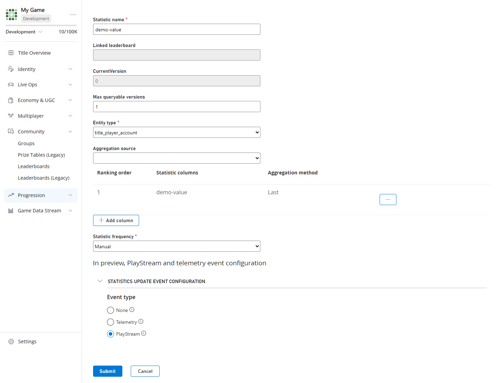

# Statistics with PlayStream and Telemetry 

The statistic updated PlayStream and telemetry event is a powerful tool that allows developers to automatically log and track player performance across various game metrics. By leveraging this event, you can capture real-time player achievements, progress milestones, and performance data that can be connected to Azure Functions, Microsoft Fabric, or EventHubs. This enables developers to build comprehensive player analytics, create dynamic reward systems, and develop data-driven insights that enhance player engagement and retention. 

A great example of this is automatically tracking when a player reaches performance milestones like achieving a new high score, completing challenges, or improving their skill ratings. Each time a statistic is updated, the event captures both the new and previous values. This data can trigger automated responses such as granting rewards, unlocking new content, or sending personalized notifications. For analytics teams, this continuous stream of performance data provides invaluable insights into player behavior patterns, skill progression rates, and engagement metrics that can inform game balance decisions and content development strategies. 

With PlayFab, you can seamlessly monitor player performance through the statistic updated event, which fires whenever a player's statistic value changes (i.e., created, updated, or deleted). This event provides immediate visibility into player achievements and progress, allowing you to build responsive systems that react to player performance in real-time.

## Enable PlayStream and Telemetry Event 

To enable the statistic update event, go to the edit page of the statistic you want to modify or create a new statistic. When you are there, look for the `PlayStream and telemetry events` and select whether you want to have them sent via PlayStream, telemetry, or if you don't want an event to be sent at all (none option). 

>**Note** Preexisting statistics will have the statistic update set to none by default. If you want to enable this event, please go to the statistic you want to modify and enable that setting.

Once you have enabled the event, you are now free to connect your events to whatever you want (i.e., Azure function, Kusto cluster, etc). To learn more about how you can leverage this event, here is a tutorial on how to route PlayStream and telemetry events to a Kusto cluster, [here](../../data-analytics/learn-data/reports/real-time-analytics-tutorial.md).

## Restrictions

- `playfab.statistic.statistic_updated`, will not work with statistics that use the entity type `master_player_account` or `external`

## See Also

- [`playfab.statistic.statistic_updated`](../../api-references/events/Statistics/statistic-updated.md)
- [PlayStream Overview](../../data-analytics/ingest-data/playstream-overview.md)
- [Leaderboards With PlayStream and Telemetry](../../community/leaderboards/leaderboards-with-playstream-and-telemetry.md)
- [Telemetry Overview](../../data-analytics/ingest-data/telemetry-overview.md)
- [Pricing Meters](../../pricing/Meters/meters.md)
- [PlayStream Event Capabilities](../../data-analytics/ingest-data/playstream-event-capabilities.md)
- [Using CloudScript actions with PlayStream](../../data-analytics/acting-data/action-rules-using-cloudscript-actions-with-playstream.md)
- [Quickstart: Writing a PlayFab CloudScript using Azure Functions](../../live-service-management/service-gateway/automation/cloudscript-af/quickstart.md)
- [CloudScript quickstart](../../live-service-management/service-gateway/automation/cloudscript/quickstart.md)
- [Limits on statistics](./limits-statistics.md)