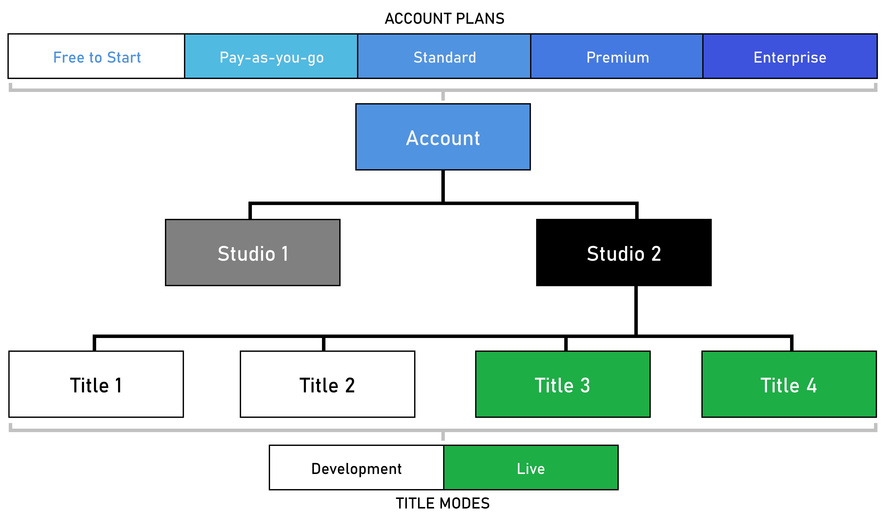

# Account yupgrades
Customers can upgrade their account plan using the self-serve plans experience found in Game Manager.

## Account plans 
A PlayFab account has five plan options:
1. **FREE TO START:** This plan has no cost to the customer. Once a title reaches its Development Mode limits, it must be launched by upgrading to a paid plan. To learn how to launch a title, see Title Launches.
2. **PAY-AS-YOU-GO:** This paid plan has no monthly base rate. Accounts are only charged for their monthly consumption for live titles. 
3. **STANDARD:** This paid plan has a monthly base rate and private support options ([PaidTechnicalSupport.md](Support.md)). This plan comes with included meter usage amounts that live titles may access. Once the included meter amounts have been used, the account will be charged for additional consumption.
4. **PREMIUM:** This paid plan has a monthly base rate and private support options ([PaidTechnicalSupport.md](Support.md)). This plan comes with more included meter usage than the Standard plan. Once the included meter amounts have been used, the account will be charged for additional consumption.
5. **ENTERPRISE:** An Enterprise account has a monthly base rate and private support channels that offer 24/7 assistance. This plan comes with more included meter usage than the Premium plan. Once the included meter amounts have been used, the account will be charged for additional consumption. 

The base rate's included consumption is cumulative across titles linked to an account.

>[! NOTE]
> All PlayFab account plans adhere to the [https://playfab.com/terms/](https://playfab.com/terms/).

## Understanding the account-studio-title relationship
An account is linked to one Studio and a Studio may be linked to many titles. Upgrades are executed at the account level and launches are executed at the Title level.

## Changing plans
You can change your account's plan via Game Manager using the **Plan Recommendation** and **Plan Selection** pages. Plan changes are scheduled for the beginning of the next billing period.

### Upgrading from free-to-start
You can upgrade your account plan at any time on the **My Studios and Titles** page. Use the following steps to upgrade your account from Free to Start. Upgrading an account will upgrade all studios owned by the account.

1. Log in to [http://developer.playfab.com/](http://developer.playfab.com/).

2. On the **My Studios and Titles** page, locate the header of a Studio whose linked account should be upgraded. Select **Upgrade Account**.

3. Through the **Plan Recommendation** page, you can see your account's meter usage for the past 30 days, your current plan, and a recommended plan based upon your usage. On each plan, you can see the estimated monthly cost given your historic usage. To change your plan, select **Proceed with plan**.

4. On the **Plan Selection** page, the recommended plan will be automatically selected, though you can select any plan your account is eligible for. Titles can be launched in conjunction with the plan change. Select any titles to launch. The Next button will open the next tab.

5. Enter Contact Information and Payment Information to move to the **Review** page. Select **Confirm this Plan** to complete the account upgrade.

6. Once you upgrade your account, on the **Studio Settings** page under the Studio Plan section, you will see your current plan as well as the scheduled plan and date of schedule.

After an account is upgraded, the provided payment instrument is charged a monthly base rate per account in addition to usage charges for launched titles.

### Upgrading and downgrading
You can upgrade or downgrade your account plan at any time on the Studio Settings page of any studio owned by the account. Use the following steps to change your account's plan. Changing the account plan will change all studios owned by the account.

1. Log in to [http://developer.playfab.com/](http://developer.playfab.com/).

2. On the **My Studios and Titles** page, locate the header of a Studio whose linked account should be upgraded. Select the options button indicated by the 3 dots and select **Studio Settings**. On the **Studio Settings** page, locate the header of a Studio whose linked account should be upgraded. Select **Change Plan**.

3. Through the **Plan Recommendation** page, you can see your account's meter usage for the past 30 days, your current plan, and a recommended plan based upon your usage. On each plan, you can see the estimated monthly cost given your historic usage. To change your plan, select **Proceed with plan**.

4. On the **Plan Selection** page, the recommended plan will be automatically selected, though you can select any plan your account is eligible for. Titles can be launched in conjunction with the plan change. Select any titles to launch. The Next button will open the next tab.

5. Enter Contact Information and Payment Information to move to the **Review** page. Select **Confirm this Plan** to complete the account upgrade.

6. Once you upgrade your account, on the **Studio Settings** page under the Studio Plan section, you will see your current plan as well as the scheduled plan.

### Upgrading to enterprise

Any account is eligible to upgrade to an Enterprise account plan. The PlayFab team must be contacted to upgrade to an Enterprise account plan. [https://playfab.com/contact/](https://playfab.com/contact/)

### Cancel all charges and delete Your sFtudio 

Before proceeding with deletion, consider the following recommended (but optional) actions to ensure a smooth transition and avoid any unintended loss: 

* Back up any critical data, as deleting your studio is a permanent action and data is not recoverable. 

* Download reports from the Billing summary page for your records and future reference. 

* Communicate the decision with your development team to prevent any surprise loss of access. 

Once you’ve completed these steps, you can continue with the studio deletion process outlined below. 

To cancel all charges, you must request deletion of your studio **at least 10 calendar days before the end of the month**. Studio deletion is a permanent action that deletes all titles and removes all developers’ access to the studio. This feature is available only to studio admins. 

1. Log in to [http://developer.playfab.com/](http://developer.playfab.com/).

2. On the My Studios and Titles page, locate the header of the Studio you plan to delete. Click the three dots on the right and select Studio Settings. 

3. Click Delete Studio button on the top right of the screen.  

4. Confirm your cancellation. 

PlayFab will delete your studio within 10 calendar days following your cancellation. You will be charged for the usage incurred up to the point of your cancellation request and receive a final invoice on your regular due date. Please note that deleting a studio does not result in a prorated refund for plan charges. 

Deleting a studio does not delete your PlayFab developer identity. Instead of deleting a studio, you can also delete all titles and change the account plan to Pay as You Go to prevent charges.   

## FAQ

**How do I know which subscription plan my account and its associated studios are currently on?**
There are two ways to know which plan your account is currently on.

**1. Presence of Upgrade Account Button:**  Navigate to the "My Studios" page. If a Studio displays the **Upgrade Account** button, the Studio and its associated account are currently free and have no account plan (1).

**2. Base Rate Amount:** While on the "My Studios" page, if no "Upgrade Account" button is present, navigate to the **Billing Summary** page (3). A lack of the **Upgrade Account** button means that the Studio and its associated account are on a paid subscription plan.

The amount of the base rate will represent the paid subscription plan of an account. A Base Rate of **$99** indicates that the Studio and its associated account are on the **Standard plan**. A base rate of **$1999** indicates that the Studio and its associated account are on the **Premium plan**. The Premium plan can only be acquired through contacting PlayFab.

**How do I know which subscription plan I am upgrading my account to?**
All accounts upgraded through Game Manager are automatically upgraded to the Standard plan, as indicated by the agreed-to base rate listed within the **Upgrade Account**(1) flow.

To upgrade to a Premium plan, please [PaidTechnicalSupport.md](Support.md).
