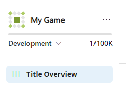
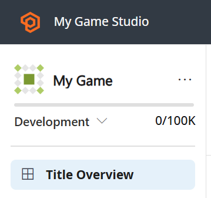

# Titles in Development Mode

> [!IMPORTANT]
> When you're ready to scale up, it's important to make sure you switch your title from "Development Mode" to "Live." To make this change, use the **Launch** button on the Game Overview page or the PlayFab main dashboard. This change ensures that the title isn't limited to 100 unique users.

> [!NOTE] 
> Development Mode is being replaced by Foundation Mode as of March 11, 2026. To access PlayFab services with no monthly bill for the duration of your development cycle, we recommend [creating new titles in Foundation Mode](../get-started/foundation-onboarding.md). All titles that ship to an Xbox storefront will also get Foundation Mode services included as part of their platform agreement. 

Developers can evaluate PlayFab services risk free using Development Mode, with no monthly bills up to the first 1000 unique users. Once a title in Development Mode hits this limit, no additional users can be created until a title is moved to a live mode. 

Titles can be [launched](title-launches.md) through Game Manager and is then considered live. Launching a title removes all Development Mode limitations. 

By default, every title created starts in Development Mode. The **My Studios and Titles** main page indicate which state a title is in through a mark on the bottom, left corner of the title block. This indicator can also be viewed at the top of the left nav within a title. Titles in Development Mode are labeled **Development**. Live titles are blank.

**My Studios view of Development Mode title tag**

**Title page view of Development Mode title tag**

**Live title with blank tag**

> [!NOTE]
> As long as your title is in Development Mode, consumption isn't counted towards any of your billable meters.

The example below shows how meter consumption is reflected in the billing for a fictional customer called Fun Studios:

| Title | Title mode | Meter Consumption |
| --- | --- | --- |
| Fun Game | Live | 1 million PlayStream events |
| Fun Game 2: The Return of Fun | Development Mode | 100,000 PlayStream events

When Fun Studios visits their Billing Summary page, they only see the consumption for their Live title, Fun Game, count against their Standard Plan included resources.

**For more information on these topics, check out these pages:**

- [Pricing Meters](Meters/meters.md)
- [Account Upgrades](account-upgrades.md)
- [Billing Summary and Base Rate](billingDetails.md)

## Limits

There are some studio and title limits associated with Development Mode:

### Studio limits

| Limit | Amount |
| --- | --- |
| Titles in Development Mode | 10 Titles |

### Title limits

| Limit | Amount |
| --- | --- |
| Unique users | 1000 users created |
| PlayStream events | 1 million events |
| Telemetry events | 1 million events |
| Profile reads | 5 million reads |
| Profile writes | 1 million writes |
| Profile storage | 2 gigabytes (GB) |
| Entity statistics reads | 5 million reads |
| Entity statistics writes | 1 million writes |
| Entity statistics storage | 100 Stat definitions, versions = 1 |
| Entity leaderboard reads | 5 million reads |
| Entity leaderboard writes | 1 million writes |
| Entity leaderboard storage | 50 Leaderboard definitions, 10,000 rows, versions = 1 |
| Content and configuration reads | 20,000 reads |
| Content and configuration writes | 15,000 writes |
| Content and configuration storage | 2 GB |
| CloudScript execution time | 20,000 GB-s |
| CloudScript total executions | 200,000 executions |
| Insights credits | Insights Performance Level 1 |

**Definition of unique users:**
Unique users are the total number of players ever created in your Development Mode title, which is distinct from monthly active users or daily active users.

> [!NOTE]
> You can learn more about title limits at [PlayFab Pricing](https://www.playfab.com/pricing).
