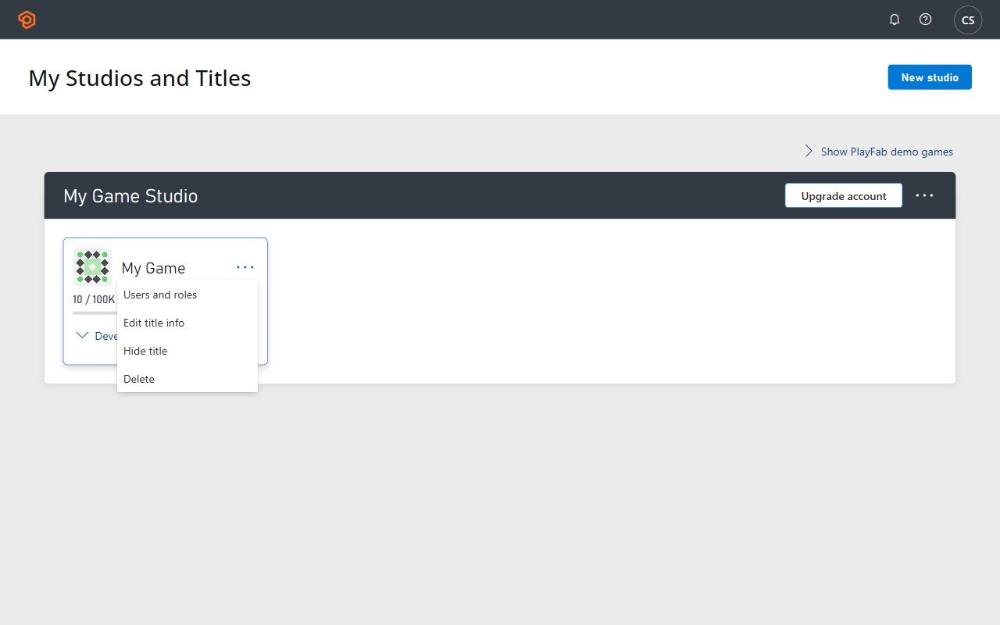

# PlayFab Release Notes 2017

## 171204  

Date: December 4, 2017

### Unreal SDK changes (Cpp and Bp)

- Updated both SDKs to **Unreal 4.18.1**.
- Older versions still work, but require uncommenting `#defines` in the \_.build.cs files.

## 171127  

Date: November 27, 2017

### API changes

- An inventory feature allowing "Limited Edition" items is now released from beta.

- This feature lets you define that only a fixed number of a particular `itemId` is available in your game.
- Removed a virtual currency property from API methods that use "[ProfileModel](xref:titleid.playfabapi.com.client.accountmanagement.getplayerprofile#playerprofilemodel)", as that information is never provided or correct. It returns... someday.

### New API methods

- admin.[CheckLimitedEditionItemAvailability](xref:titleid.playfabapi.com.admin.playeritemmanagement.checklimitededitionitemavailability)
- admin.[IncrementLimitedEditionItemAvailability](xref:titleid.playfabapi.com.admin.playeritemmanagement.incrementlimitededitionitemavailability)
- client.[GetPaymentToken](xref:titleid.playfabapi.com.client.playeritemmanagement.getpaymenttoken)
  - Used for [XSolla specific payment processing](../economy-monetization/economy/tutorials/non-receipt-payment-processing.md)
- client.[ReportDeviceInfo](xref:titleid.playfabapi.com.client.analytics.reportdeviceinfo)
  - This API method isn't meant to be called directly. It's currently a built-in feature for Unity and Lumberyard SDKs. It can be disabled with the [API Policy](../api-references/api-access-policy.md). Additionally, we're adding another option soon to disable in the title settings page in Game Manager.

### Updated API method error codes

- client.[AddOrUpdateContactEmail](xref:titleid.playfabapi.com.client.accountmanagement.addorupdatecontactemail)
- client.[GetLeaderboardAroundPlayer](xref:titleid.playfabapi.com.client.playerdatamanagement.getleaderboardaroundplayer)
- client.[LoginWithAndroidDeviceID](xref:titleid.playfabapi.com.client.authentication.loginwithandroiddeviceid)
- client.[LoginWithCustomID](xref:titleid.playfabapi.com.client.authentication.loginwithcustomid)
- client.[LoginWithIOSDeviceID](xref:titleid.playfabapi.com.client.authentication.loginwithiosdeviceid)

### SDK specific updates

- [UnitySdk](https://github.com/PlayFab/UnitySDK): We're now building all published unity package files with Unity 2017.2.0f3.
- For testing, we internally updated to the latest for each major.minor version, from Unity 4.7.2f1 to 2017.1.2f1.
- Unity Example Test Game Server: Fix applied to `HttpHelper` to fix SSL validation on `SignalR` requests.
- [ActionScriptSDK](https://github.com/PlayFab/ActionScriptSDK): AirSdk in example updated to v27.
- [Cocos2d-xSDK](https://github.com/PlayFab/Cocos2d-xSDK): We're still targeting 3.15.1, despite the 3.16 Cocos release (stay tuned).
- SdkTestingCloudScript and [NodeSDK](https://github.com/PlayFab/NodeSDK): Updated the example VS projects to support VS/msbuild 2017.
- WindowsSDK: This is the last build of the NuGet package targeting Visual Studio 2013:
  - [WindowsSdk VS 2013 NuGet Package](https://www.NuGet.org/packages/com.playfab.windowssdk.v120/1.19.171127)
  - We're updating our automated build machines, and we aren't installing VS 2013 on the new ones.
  - The [newer NuGet package](https://www.NuGet.org/packages/com.playfab.windowssdk.v140/) will continue to work on VS 2015 and 2017.

## 171106  

Date: November 6, 2017

### New API methods

- admin.[GetPlayerProfile](xref:titleid.playfabapi.com.admin.accountmanagement.getplayerprofile)
- server.[SendEmailFromTemplate](xref:titleid.playfabapi.com.server.accountmanagement.sendemailfromtemplate)

### Updated PlayStream event

- [sent_email](../api-references/events/TitleCommunications/sent-email.md) gains new fields: Body, and Subject.

### All SDKs

- **MINOR SDK BREAKING CHANGE:** `ForgetClientCredentials()` renamed to `ForgetAllCredentials()`.
- This is part of a "coming soon" feature, which is announced when complete.

## 171102

Date: November 2, 2017

### New PlayFab feature

- Send emails to your players, using templates.

### New API methods

- admin.[ResetPassword](xref:titleid.playfabapi.com.admin.accountmanagement.resetpassword)
- admin.[GetPlayerIdFromAuthToken](xref:titleid.playfabapi.com.admin.accountmanagement.getplayeridfromauthtoken)
- client.[AddOrUpdateContactEmail](xref:titleid.playfabapi.com.client.accountmanagement.addorupdatecontactemail)
- client.[RemoveContactEmail](xref:titleid.playfabapi.com.client.accountmanagement.removecontactemail)
- server.[SendCustomAccountRecoveryEmail](xref:titleid.playfabapi.com.server.accountmanagement.sendcustomaccountrecoveryemail)

### Documentation update

- [New list of error codes relevant to every PlayFab API call](../api-references/global-api-method-error-codes.md)
- Updated Error Codes for: client.[LoginWithGoogleAccount](xref:titleid.playfabapi.com.client.authentication.loginwithgoogleaccount), client.[UpdatePlayerStatistics](xref:titleid.playfabapi.com.client.playerdatamanagement.updateplayerstatistics), server.[ConsumeItem](xref:titleid.playfabapi.com.server.playeritemmanagement.consumeitem)

### New PlayStream events

- [auth_token_validated](../api-references/events/PlayerIdentity/auth-token-validated.md)
- [player_updated_contact_email](../api-references/events/PlayerIdentity/player-updated-contact-email.md)
- [sent_email](../api-references/events/TitleCommunications/sent-email.md)

### Unreal specific update

- Our auto builder failed to publish the Unreal SDKs for build number 171016 and 171026. We resolved the issue with our auto-builder, published version 171026 after the fact, and releases resumed normally

### Unity specific changes

- **MINOR BREAKING CHANGE:** Renamed `ForgetClientCredentials` to `ForgetAllCredentials`.
- This is part of a new feature coming soon. We're renaming `ForgetClientCredentials` to `ForgetAllCredentials` in all SDKs over the next few releases.

## 171026  

Date: October 26, 2017

### API documentation changes

- Updating error codes for API methods.

- Removed many error codes that are universal to all API methods from the per-API-method list. A new page describes universal error codes.
- **Removed Universal Codes:**
  - InvalidParams
  - OverLimit
  - DataUpdateRateExceeded
  - AccountBanned
- These errors (and others, to be published in a separate document), can be returned from any API method and should be handled appropriately.
- Added new error codes to several dozen API methods, and removed a few false codes. The error code lists should be much more accurate for method-specific error returns. This is still an ongoing process, so there are more updates.
- Several API methods involving virtual currency can decrease the balance to less than zero. We labeled these appropriately.

### API changes

- **New API methods:**
  - admin.[DeleteTitle](xref:titleid.playfabapi.com.admin.accountmanagement.deletetitle)
  - Hosted game servers support both **IPv4** and **IPv6**.
  - Custom game servers now support **IPV6**. All newly started game server instances are assigned both **IPV4** and **IPV6** addresses, which are displayed in the Game Manager **Servers** tab and returned by the matchmaking APIs. Clients can connect to either the **IPV4** or **IPV6** address for the assigned server.
  - All API methods that return server addresses now return both options: client.[StartGame](xref:titleid.playfabapi.com.client.matchmaking<!-- .startgame -->).[StartGameResult](xref:titleid.playfabapi.com.client.matchmaking<!-- .startgame#startgameresult -->)

### Game Manager changes

- You can now delete titles using the new Admin/DeleteTitle API, or on the Game Manager studios page, as shown in the following image.
   

## 171016  

Date: October 16, 2017

### API changes

- Added a parameter to server.[SendPushNotification](xref:titleid.playfabapi.com.server.accountmanagement.sendpushnotification).[SendPushNotificationRequest](xref:titleid.playfabapi.com.server.accountmanagement.sendpushnotification#sendpushnotificationrequest).[PushNotificationPackage](xref:titleid.playfabapi.com.server.accountmanagement.sendpushnotification#pushnotificationpackage), for iOS Badge.
- Clarified the device-specific nature of various parameters.

### New PlayStream events

- [player_started_purchase](../api-references/events/Player/player-started-purchase.md)
- [player_paid_for_purchase](../api-references/events/Player/player-paid-for-purchase.md)

### JavaScriptSDK specific changes

- [JavaScriptSDK](https://github.com/PlayFab/JavaScriptSDK)
  - Our SDK now integrates with [Phaser.io](https://phaser.io/).

### LuaSDK specific changes

- [LuaSDK](https://github.com/PlayFab/LuaSDK)
  - Fixed our Lua publish pipeline, and LuaSDK is being updated properly again.

### UnitySdk specific changes

- [UnitySdk](https://github.com/PlayFab/UnitySDK)
  - We handled a [regression in Unity](https://issuetracker.unity3d.com/issues/unitywebrequest-getresponseheaders-method-returns-null-on-android-devices) on our side, and it should no longer affect PlayFab customers.

~~**UnrealCppSdk specific changes:**~~ (UPDATED : This SDK is deprecated. For the new unreal SDK, refer to [UnrealMarketplaceSDK](https://www.unrealengine.com/marketplace/playfab-SDK))

- ~~One of our customers has made an add-on plugin to our SDK, which integrates the Unreal OnlineSubsystem & the PlayFab SDK~~
- ~~You can check it out [here](https://gitlab.com/mtuska/OnlineSubsystemPlayFab).~~

### Unicorn Battle example

- Deleted PlayFab custom Push Plugin & Updated to FCM push messages.

## 170925  

Date: September 5, 2017

### API Changes

- Removed a handful of beta APIs that were never made public. This shouldn't affect any current customers or live titles.
- We bypassed the default language-level header checks in our CloudScript engine. This means several CloudScript http.request() headers that were formerly being rejected should now work.

### Global Push Notification update

- See [our blog](https://blog.playfab.com/blog/push-sep-17) for details about the improvements to Push Notifications

### New PlayStream events

- [player_device_info](../api-references/events/PlayerIdentity/player-device-info.md)
- Games using the latest UnitySDK can now see some basic analytics data about their customers. SnowFlake is ideal for viewing and analyzing this information, but it's also available in the PlayStream Event History.
- player_updated_membership

### JavaScriptSDK specific changes

- [JavaScriptSDK](https://github.com/PlayFab/JavaScriptSDK)
  - Added a handful of mini-features that exist in other SDKs to JavaScriptSDK:
  - You can now inject extra headers into requests (removing one of the blockers for Double Encrypted Logins with this SDK).
  - Added a new function: `PlayFabClientSDK.ForgetClientCredentials()`
  - This is a convenience function that resets the client after shutting down or logging out.
  - `PlayFab.GenerateErrorReport()`
  - This is a convenience function that converts the error-result from a failed PlayFab call into a single complete description of how the call failed.
- Added optional data relays into the PlayFab API requests:
  - `result.customData`
    - This is any contextual object you can attach to the request, which can provide context for the result. For example, you can provide a local client-player object as the `customData` for an **UpdatePlayerStatistics** call, and set the updated statistics on that player after the remote call has succeeded.
  - `result.request`
    - The request for your API calls are now relayed to the result, which can provide context for the result. For example, when you call `UpdatePlayerStatistics`, you can read the updated stats from the request, when updating your local player object.

### UnitySDK specific changes

- [UnitySDK](https://github.com/PlayFab/UnitySDK)
  - New experimental feature: This release of PlayFab UnitySDK now optionally lets you see device information for your players. Example information you can see is: memory, resolution, user-agent, device-type, OS version, etc.

~~**UnrealCppSdk specific changes:**~~ (UPDATED : This SDK is deprecated. For the new unreal SDK, refer to [UnrealMarketplaceSDK](https://www.unrealengine.com/marketplace/playfab-SDK))

- ~~Updated to Unreal 4.17~~
- ~~Split apart into three separate plugins, each with different functionality~~
- ~~Significant upgrades overall~~

## 170828  

Date: August 28, 2017

### Client API changes

- ~~client.[GetCurrentGames].[result].Games[i].GameServerState is deprecated, and replaced with [GameServerStateEnum]~~.
~~- GameServerState was serialized as an integer, which was an error. The new field is a proper enum-string.~~ (UPDATED: This is deprecated. See [Servers](../multiplayer/servers/index.md))

### Other API changes

- Deprecated the following API methods on Admin and Server APIs.
  - [GetActionsOnPlayersInSegmentTaskInstance](xref:titleid.playfabapi.com.admin.scheduledtask.getactionsonplayersinsegmenttaskinstance) - This has accidentally been labeled as deprecated, but that was an error that is reverted.
- [SendPushNotification](xref:titleid.playfabapi.com.server.accountmanagement.sendpushnotification) can now specify [TargetPlatforms](xref:titleid.playfabapi.com.server.accountmanagement.sendpushnotification#sendpushnotificationrequest)
- Added some clarifications for which parameters work on which platforms for [SendPushNotificationRequest](xref:titleid.playfabapi.com.server.accountmanagement.sendpushnotification#sendpushnotificationrequest) (Using parameters not supported for a target platform isn't recommended).
- Added some info about [Shared Group](xref:titleid.playfabapi.com.client.sharedgroupdata.createsharedgroup) [restrictions](../community/associations/groups/using-shared-group-data.md) to the Shared Group documentation (specifically that they can't be used for anything like Guilds).
- [Player Profiles](xref:titleid.playfabapi.com.client.accountmanagement.getplayerprofile#playerprofilemodel) can now store a player [contact email address](xref:titleid.playfabapi.com.client.accountmanagement.getplayerprofile#contactemailinfomodel).

### New PlayStream events

- [entity_created](../api-references/events/PlayerIdentity/entity-created.md)
- [entity_logged_in](../api-references/events/PlayerIdentity/entity-logged-in.md)

## 170814  

Date: August 14, 2017

### API updates

- server.[GetFriendsList](xref:titleid.playfabapi.com.server.friendlistmanagement.getfriendslist) and client.[GetFriendsList](xref:titleid.playfabapi.com.client.friendlistmanagement.getfriendslist) API methods now return a [PlayerProfile](xref:titleid.playfabapi.com.client.friendlistmanagement.getfriendslist#playerprofilemodel) for each of your friends.

### CSharpSdk specific updates

- SDK now includes a file called [NewtonSoftJsonWrapper.cs](https://github.com/PlayFab/CSharpSDK/blob/master/PlayFabSDK/source/Json/NewtonsoftWrapper.cs), which will let you swap out our included SimpleJson serializer with the NewtonSoft NuGet package.
- The file includes instructions on how to use it.

## 170807  

Date: August 7, 2017

### New API methods

- admin.[DeletePlayer](xref:titleid.playfabapi.com.admin.accountmanagement.deleteplayer)

### Deprecated API methods

- These API methods never worked as fully and completely as they were supposed to. To clean this up, we've started over, and built the new [DeletePlayer](xref:titleid.playfabapi.com.admin.accountmanagement.deleteplayer) API in the preceding section, and these are deprecated:
- `admin.ResetUsers`
- `admin.DeleteUsers`

### API updates

- `PlayerProfile` (in [Admin](xref:titleid.playfabapi.com.admin.accountmanagement.getplayerprofile#playerprofilemodel)/[Server](xref:titleid.playfabapi.com.server.accountmanagement.getplayerprofile#playerprofilemodel)/[PlayStream](xref:titleid.playfabapi.com.client.accountmanagement.getplayerprofile#playerprofilemodel)) contains a new field `ContactEmailAddresses`, which contains any email address info you may have saved about your players.

### PlayStream events

- New Event: [auth_token_validated](../api-references/events/PlayerIdentity/auth-token-validated.md)
- New Event: [player_removed_title](../api-references/events/PlayerIdentity/player-removed-title.md)
- New Event: [player_updated_contact_email](../api-references/events/PlayerIdentity/player-updated-contact-email.md)
- New Event: [player_verified_contact_email](../api-references/events/PlayerIdentity/player-verified-contact-email.md)
- New Event: [sent_email](../api-references/events/TitleCommunications/sent-email.md) (Still in beta, but events are already public)
- New Field in Event: [player_realmoney_purchase](../api-references/events/Player/player-realmoney-purchase.md).TransactionId

~~**LumberyardSdk changes:**~~

- ~~**UPGRADE WARNING:** This SDK is no longer compatible with previous versions of Lumberyard.~~
- ~~This release of PlayFab LumberyardSdk no longer works with Lumberyard version 1.3. It's upgraded and now targets Lumberyard 1.9. We'll likely have it targeting 1.10 soon, but again without backwards compatibility to 1.9 or earlier. See [our blog](https://blog.playfab.com/blog/cpp-SDK-updates) for details.~~

~~**UnrealCppSdk:**~~ (**UPDATED**: This SDK is deprecated. For the new unreal SDK, refer to [UnrealMarketplaceSDK](https://www.unrealengine.com/marketplace/playfab-SDK)).

<!-- ~~This SDK is discontinued, and will no longer be maintained. We will produce an upgrade guide so that users can switch to the UnrealBlueprintSdk. See this blog for more details.~~
- ~~See our [upgrade guide](https://github.com/PlayFab/UnrealBlueprintSDK/blob/master/UnrealCppSdkUpgradeGuide.md)~~-->

~~**Unreal SDK:**~~ (**UPDATED**: This SDK is deprecated. For the new unreal SDK, refer to [UnrealMarketplaceSDK](https://www.unrealengine.com/marketplace/playfab-SDK))

- ~~The PlayFab UnrealBlueprintSdk is now rebranded as the "Unreal SDK"~~
- ~~Unreal SDK is updated to 4.16, with some minor fixes~~
- ~~We're also removing support for older versions of Unreal, which require older versions of Visual Studio~~
- ~~We now support 4.14 through 4.16~~
- ~~Your project may continue working for older versions of Visual Studio, but we can only support and test Visual Studio 2015 and later~~
- ~~Read [our blog](https://blog.playfab.com/blog/visual-studio-2013-deprecation-notice) for more info~~

### Unity Editor Extensions

- Fixed issues downloading and uploading CloudScript revisions.
- Fixed issues for users whose system language uses non-ASCII letters.

## 170710  

Date: July 10, 2017

### API changes

- Released an Enterprise feature for double-encrypted logins from beta, and it's now live.
- **New API methods:**
  - admin.[CreatePlayerSharedSecret](xref:titleid.playfabapi.com.admin.authentication.createplayersharedsecret)
  - admin.[DeletePlayerSharedSecret](xref:titleid.playfabapi.com.admin.authentication.deleteplayersharedsecret)
  - admin.[GetPlayerSharedSecrets](xref:titleid.playfabapi.com.admin.authentication.getplayersharedsecrets)
  - admin.[SetPlayerSecret](xref:titleid.playfabapi.com.admin.authentication.setplayersecret)
  - admin.[UpdatePlayerSharedSecret](xref:titleid.playfabapi.com.admin.authentication.updateplayersharedsecret)
  - client.[GetTitlePublicKey](xref:titleid.playfabapi.com.client.authentication.gettitlepublickey)
  - client.[SetPlayerSecret](xref:titleid.playfabapi.com.client.authentication.setplayersecret)
  - server.[SetPlayerSecret](xref:titleid.playfabapi.com.server.authentication.setplayersecret)
- server.[RegisterGameRequest](xref:titleid.playfabapi.com.server.matchmaking<!-- .registergame#registergamerequest -->) has a new property: LobbyId, which will let you attempt to re-register an existing game
- server.[SendPushNotificationRequest](xref:titleid.playfabapi.com.server.accountmanagement.sendpushnotification#sendpushnotificationrequest) now accepts a new property: Package, which defines all of the advanced Android push capabilities.

### SDK breaking change

- admin.[SetupPushNotificationRequest](xref:titleid.playfabapi.com.admin.title-widedatamanagement.setuppushnotification#setuppushnotificationrequest).Platform is now defined as an enum instead of a string. This isn't a breaking change to the API (as enums are transmitted as strings), but it requires some users to convert their strings to the enum values in their code.

### Changes in all SDKs

- Minor SDK Breaking Change: Most SDKs have lost an optional field in multiple requests called UseSpecificVersion, which was an alternate way to define the adjacent Version field as null. Not all languages have the capability to define an integer as null in the request, and this field was only meant to be useful in relevant SDKs (Specifically Unreal). If you're using this field, just remove it, and set the adjacent Version field to null when appropriate.

### Unity EditorExtensions update

- Updated the flags panel.
- `ENABLE/DISABLE_IDFA` flag can be toggled now.
- Displays non-PlayFab flags, and lets you remove them (use with caution, don't remove flags you need).

### SDK Dependency updates

- [UnitySDK](https://github.com/PlayFab/UnitySDK) built, packaged, and tested with Unity2017.1.0f1.
  - Only trivial, non-breaking changes.
- [ActionScriptSDK](https://github.com/PlayFab/ActionScriptSDK) tested with AirSDK v26.
  - SDK unchanged, example updated to target v26.
- [Cocos2d-xSDK](https://github.com/PlayFab/Cocos2d-xSDK) built, and tested with Cocos 3.15.1.
- Cocos 3.14->3.15 contained changes that broke our example, which in turn meant the example had to be updated. The example still works with 3.13 through 3.15, but the example might not work with older versions of Cocos SDK unchanged, and should work with most of the latest 3.X Cocos versions.

## 170612  

Date: June 12, 2017

### Documentation changes

- Many small revisions to dozens of API methods for clarity
- Merged several documentation-groupings, each of which only contained a single API method, into a single group called "Platform Specific Methods".
- Renamed the "Matchmaking APIs" group to "Matchmaking" to be consistent with other groups.
- Many length-restricted string fields now describe the allowed ranges.

### Changes in all SDKs

- Updated and fixed lots of broken links in all SDK READMEs.

### UnitySDK specific changes

- [UnitySDK](https://github.com/PlayFab/UnitySDK)
  - We now support multiple versions of the Android API and Google Play Services. Read more details [here](https://github.com/PlayFab/UnitySDK/tree/master/Packages).
  - This concludes the planned changes to the Unity + Android Push-Plugin for now. Let us know if you have any more requests [here](https://community.playfab.com/questions/10840/android-plugin-upgrade-discussion.html).

## 170530  

Date: May 30, 2017

### API changes

- **BREAKING CHANGE:** In server.[ReportPlayer](xref:titleid.playfabapi.com.server.playeritemmanagement.reportplayer), we immediately removed the `titleId` field in [ReportPlayerServerRequest](xref:titleid.playfabapi.com.server.playeritemmanagement.reportplayer#reportplayerserverrequest) (not merely deprecated). All reports now go to their own title, and can't report to another title.
  - This had to be a breaking change as it was otherwise a mild cross-title exploit. [Contact us](https://community.playfab.com/questions/ask.html) if you need assistance with this change.
- In client.[ReportPlayer](xref:titleid.playfabapi.com.client.accountmanagement.reportplayer) and server.[ReportPlayer](xref:titleid.playfabapi.com.server.playeritemmanagement.reportplayer), we deprecated result.Updated in both cases. It's always true, and the API Call returns an error if the player is over the report limit. We changed this error condition to OverLimit to match other limits.
- All [login methods](xref:titleid.playfabapi.com.client.authentication) can now return a [player profile object](xref:titleid.playfabapi.com.client.authentication.loginwithandroiddeviceid#playerprofilemodel), if requested, which contains information previously only available to leaderboard results.

### New API methods

- client.[GetPlayerProfile](xref:titleid.playfabapi.com.client.accountmanagement.getplayerprofile) and server.[GetPlayerProfile](xref:titleid.playfabapi.com.server.accountmanagement.getplayerprofile)
  - Returns information previously only available to leaderboard results.

### Documentation

- Small updates, several examples no longer contain information about deprecated fields.
- [ExecuteCloudScript](xref:titleid.playfabapi.com.client.server-sidecloudscript.executecloudscript) return and log size limits defined.

### New PlayStream events

- gameserverhost_started
- gameserverhost_stopped
- [player_set_profile_property](../api-references/events/Player/player-set-profile-property.md)

### UnitySDK specific changes

- [UnitySDK](https://github.com/PlayFab/UnitySDK)
  - Overhauled our Android Push plugin.
  - [Blog Post](https://blog.playfab.com/blog/push-upgrade-5-22)
  - [New/Updated Guide](../live-service-management/game-configuration/title-communications/push-notifications/push-notifications-for-android.md)

### CSharpSDK specific changes

- [CSharpSDK](https://github.com/PlayFab/CSharpSDK)
  - It's now possible to specify extra headers that are injected into an API request.
  - This is an Enterprise-Only feature, specifically for double-encrypted login requests.

## 170508  

Date: May 8, 2017

### API changes

- **BREAKING CHANGE:**
  - [ExecuteCloudScript](xref:titleid.playfabapi.com.client.server-sidecloudscript.executecloudscript) doesn't serialize the return value of your call if it's too large.
  - [ExecuteCloudScript](xref:titleid.playfabapi.com.client.server-sidecloudscript.executecloudscript) doesn't serialize the logs for your call if they're too large.
- Under either of these conditions, the call still returns 200/successful, but the FunctionResult and/or Logs properties are null.

### PlayStream event changes

- [player_vc_item_purchased](../api-references/events/Player/player-vc-item-purchased.md) and [character_vc_item_purchased](../api-references/events/Character/character-vc-item-purchased.md) now contain a StoreId parameter indicating which store was used to make a purchase.
- **New event:**
  - [title_profile_view_constraints_changed](../api-references/events/PlayerIdentity/title-profile-view-constraints-changed.md)

### CSharpSDK updates

- [CSharpSDK](https://github.com/PlayFab/CSharpSDK)
  - Deleted some unused source files in [CSharpSDK](https://github.com/PlayFab/CSharpSDK).
  - This shouldn't affect any existing projects, or the NuGet package, as those files weren't referenced by the Visual Studio Solution.

### Postman collection update

- Several common request parameters now use environment variables.
- Specifically, TitleId={{TitleId}}, PlayFabId={{PlayFabId}}, CharacterId={{CharacterId}}, and CatalogVersion={{PrimaryCatalogName}}

## 170424  

Date: April 24, 2017

### SDK hotfix release

- **[JavaSDK](https://github.com/PlayFab/JavaSDK) Updates:**
  - We now publish Jar files for the SDK, one for code, and one for Java docs, which you can import into your Java project instead of copy-pasting code. Thanks to Will Iverson <!--(https://gamestudioone.com/)--> for helping us improve our [JavaSDK](https://github.com/PlayFab/JavaSDK) usability
- **UnityEditorExtensions updates:**
  - We've resolved some install-time exceptions. Specifically it's no longer required that you restart Unity after a first-time install.
  - Additionally, an issue where the Client API was sometimes disabled inappropriately is now fixed. (edited)
- ~~**UnrealCppSdk Updates:**~~ (UPDATED : This SDK is deprecated. For the new unreal SDK, refer to [UnrealMarketplaceSDK](https://www.unrealengine.com/marketplace/playfab-SDK))
- ~~The titleId is now available from the Plugin interface~~

## 170411  

Date: April 11, 2017

### API changes

- New Enterprise Feature: More login encryption
- You can use the Policy API methods to enforce Login Calls can require a second layer of encryption
- See: [UpdatePolicy](xref:titleid.playfabapi.com.admin.authentication.updatepolicy) , specifically [UpdatePolicyRequest](xref:titleid.playfabapi.com.admin.authentication.updatepolicy#updatepolicyrequest).[Statements](xref:titleid.playfabapi.com.admin.authentication.updatepolicy#permissionstatement).[ApiConditions](xref:titleid.playfabapi.com.admin.authentication.updatepolicy#apicondition)
- This feature is still partially in beta, and activating it isn't suggested (yet - Coming Soon!)

### New PlayStream events

- [player_receipt_validation](../api-references/events/Player/player-receipt-validation.md)

### UnitySDK specific changes

- It's now possible to specify extra headers that are injected into an API request (This is required for the encrypted login calls in the preceding section).

### UnityEditorExtensions specific changes

- Fixed a compile issue with Unity 5.6.

## 170406  

Date: April 6, 2017

### Hot Fix for Unity Android Push plugin

- Fixed Android 7.0+ Crash Bug.
- Fixed Android missing Large Icon support (Lollipop+).
- Fixed Android Small Icon support on Android 7.0+ (now supports \_transparent.png).

## 170403  

Date: April 3, 2017

### API changes

- **Client & Server Leaderboard Methods:** Get-Leaderboard methods (such as client.[GetLeaderboard](xref:titleid.playfabapi.com.client.playerdatamanagement.getleaderboard)) previously gained new non-nullable parameters Version and UseSpecificVersion. The requirement that they were non-nullable was an API-breaking change. We have updated these properties to be fully optional.
- **Client API:** The Items field of [GetPurchaseResult](xref:titleid.playfabapi.com.client.playeritemmanagement.getpurchase#getpurchaseresult) is deprecated: This portion of the result is often incorrect or incomplete. It's eventually replaced with a fully functional parameter.

### New PlayStream events

- `player_display_name_filtered`

~~**Unreal Specific Changes:**~~ (**UPDATED** : This SDK is deprecated. For the new Unreal SDK, refer to [UnrealMarketplaceSDK](https://www.unrealengine.com/marketplace/playfab-SDK))

- ~~UnrealCppSdk: An issue where PlayFab settings such as TitleId were lost when publishing a build is fixed.
Both SDKs are tested and verified working with Unreal 4.15~~

### JavaSDK specific changes

- [JavaSDK](https://github.com/PlayFab/JavaSDK)
  - Restructured [JavaSDK](https://github.com/PlayFab/JavaSDK) folder structure and testing.
  - The internal folder structure of the repo has changed a bit to accommodate Maven best practices.
  - Dependencies are now Maven controlled and no longer included with the SDK.
  - Converted our internal automated testing to Maven command line.
  - Our SDK isn't available on Maven Central, as that effort has faltered. There's no ETA for completion at this time.

### UnitySDK specific changes

- [UnitySDK](https://github.com/PlayFab/UnitySDK)
  - Internal Unity version for testing and building asset bundles updated to 5.6.0. Our Unity SDK remains compatible with all versions of Unity from 4.7 through 5.6.
  - Fixed a compile issue with `UnityEditorExtensions` in Unity 5.6.

## 170223  

Date: February 22, 2017

### API changes

- PlayFab leaderboards now store an avatar url for every player. This can be used to reference a player image for leaderboard entries.
- All leaderboard APIs can now fetch a specific version of the leaderboard. This is for titles that are set to use Resetting Leaderboards.
- Leaderboard entries now contain the [PlayerProfile](xref:titleid.playfabapi.com.client.accountmanagement.getplayerprofile#playerprofilemodel), which can be used to display more detailed leaderboards without extra API calls
- PlayFab can now authenticate clients using Windows Hello and validate Windows store receipts

### New APIs
```
- [Client/UpdateAvatarUrl](xref:titleid.playfabapi.com.client.accountmanagement.updateavatarurl)
- `Client/RegisterWithWindowsHello`<!-- [Client/RegisterWithWindowsHello](xref:titleid.playfabapi.com.client.authentication.registerwithwindowshello) -->
- `Client/GetWindowsHelloChallenge`<!-- [Client/GetWindowsHelloChallenge](xref:titleid.playfabapi.com.client.authentication.getwindowshellochallenge) -->
- `Client/LoginWithWindowsHello`<!-- [Client/LoginWithWindowsHello](xref:titleid.playfabapi.com.client.authentication.loginwithwindowshello) -->
- `Client/LinkWindowsHello`<!-- [Client/LinkWindowsHello](xref:titleid.playfabapi.com.client.accountmanagement.linkwindowshello) -->
- `Client/UnlinkWindowsHello`<!-- [Client/UnlinkWindowsHello](xref:titleid.playfabapi.com.client.accountmanagement.unlinkwindowshello) -->
- [Client/ValidateWindowsStoreReceipt](xref:titleid.playfabapi.com.client.platformspecificmethods.validatewindowsstorereceipt)
- [Server/SetFriendTags](xref:titleid.playfabapi.com.server.friendlistmanagement.setfriendtags)
```
### New PlayStream events

- [player_changed_avatar](../api-references/events/PlayerIdentity/player-changed-avatar.md)

### WindowsSDK specific changes

- Added some missing null checks to the JSON serializer.

### All SDKs

- Minor additions to the [testTitleData](https://github.com/PlayFab/SDKGenerator/blob/master/JenkinsConsoleUtility/testTitleData.md) format. This only applies to the Example-Test projects that come with SDKs.

## 170130  

Date: January 29, 2017

### Breaking changes

- Changed the folder structure for [JavaScriptSDK](https://github.com/PlayFab/JavaScriptSDK) and [NodeSDK](https://github.com/PlayFab/NodeSDK) with today's major release. This may result in some broken connections for your project when you upgrade. (File names and file contents didn't change. New **TypeScript** files now exist, which didn't exist before.)

### API changes

- Added clarifying documentation to CDN APIs. Specifically mentioning that the CDN isn't part of our free service.
- Google login fixes (Blog Post Pending).

### New PlayStream events

- `developer_logged_in`
- `developer_registered`
- [studio_created](../api-references/events/DeveloperIdentity/studio-created.md)
- [studio_user_added](../api-references/events/DeveloperIdentity/studio-user-added.md)
- [studio_user_invited](../api-references/events/DeveloperIdentity/studio-user-invited.md)
- [studio_user_removed](../api-references/events/DeveloperIdentity/studio-user-removed.md)

### JavaScriptSDK specific changes

- [JavaScriptSDK](https://github.com/PlayFab/JavaScriptSDK)
  - Release day for a major upgrade! Version number updated to 1.0.
  - TypeScript integration!
  - Repository cleanup: Separating the SDK files from the example files.
  - Converted our example project to TypeScript.
  - See [our blog](https://blog.playfab.com/blog/typescript/)!

### NodeSDK specific changes

- [NodeSDK](https://github.com/PlayFab/NodeSDK)
  - Release day for a major upgrade! Version number updated to 1.0
  - TypeScript integration!
  - Converted our example project to TypeScript
  - See [our blog](https://blog.playfab.com/blog/typescript/)!

### CloudScript examples

- Release of a new example repository.
- TypeScript integration!
- See [our blog](https://blog.playfab.com/blog/typescript/)!
- And [new repository](https://github.com/PlayFab/SdkTestingCloudScript)!
- We're expanding this repository over time.

### UnitySDK specific changes

- [UnitySDK](https://github.com/PlayFab/UnitySDK)
  - Fixed an issue where **JsonWrapper** doesn't work as expected in all cases.
  - See our forum post for details: <https://community.playfab.com/questions/7599/cloudscript-getplayercombinedinfo-little-problem.html>
  - Removed all of the following deprecated wrapper classes in favor of `PlayFab.Json.JsonWrapper`:
    - `PlayFab.Json.JsonConvert` (Use `PlayFab.Json.JsonWrapper`)
    - `PlayFab.Json.SimpleJson` (Use `PlayFab.Json.JsonWrapper` or `PlayFab.Json.PlayFabSimpleJson`)
    - `PlayFab.SimpleJson` (Use `PlayFab.Json.JsonWrapper` or `PlayFab.Json.PlayFabSimpleJson`)
  - Repeating a note from [160627](2016.md#160627), `UnityEngine.SimpleJson` is an empty namespace in the `UnityEngine.dll`, and that makes it necessary for us to not use that identifier.

### Unity Editor Extensions

- Resolved an issue where the PlayFab panel will re-load infinitely if your account can't view any studios.
- Resolved an issue where `PlayFabSharedSettings` (Scriptable Object) doesn't save properly if you pick your title from the PlayFab panel.

## 170109  

Date: January 8, 2017

### Breaking changes

- Removed libs in older versions of WindowsSDK, and they must be re-created in Visual Studio. Those libs never worked in vs2015, so it's highly suggested you just update to the latest WindowsSDK, published last week.

### API changes

- Fixed typos in documentation.

### All SDKs

- [New Getting Started Guides](../index.yml)

### SDKGenerator specific changes

- [SDKGenerator](https://github.com/PlayFab/SDKGenerator)
  - The [ActionScriptSDK](https://github.com/PlayFab/ActionScriptSDK) build script was inconsistent from the other SDKs. We simplified the [SDKGenerator](https://github.com/PlayFab/SDKGenerator) commands that build [ActionScriptSDK](https://github.com/PlayFab/ActionScriptSDK) to match other SDKs. (No changes to the SDK itself.)

### UnitySdk specific changes

- [UnitySdk](https://github.com/PlayFab/UnitySDK)
  - Some public elements in PlayFabSettings have gained Obsolete tags: `PlayFabSettings.PlayFabSharedSettings` `PlayFabSettings.DefaultPlayFabApiUrl` `PlayFabSettings.GetSharedSettingsObject()` `PlayFabSettings.ProductionEnvironmentUrl`

These are made private after a transition period.

### WindowsSDK specific changes

- BFG'd the GitHub repo, and removed all large files from the history. Delete your clone or fork, and re-create it so that your history is clean.

## 170102  

Date: January 1, 2017

### API changes

- `Client/GetUserCombinedInfo` transitioned to fully obsolete, and we removed it from the SDK and documentation.

### Cocos2d-xSDK specific changes

- [Cocos2d-xSDK](https://github.com/PlayFab/Cocos2d-xSDK)
  - Fixed a crash when a PlayFab API returns an invalid response.
  - Resolved some compiler warnings.
  - Added unit tests for lambda callback functions in our test example project.

### UnitySDK specific changes

- [UnitySDK](https://github.com/PlayFab/UnitySDK)
  - We've internally updated to Unity 5.5, and our **.unitypackage** files are built using this version
  - As always, we continue to support *all Unity versions 4.7 and higher*.

  - Added static constructors to many static classes, to solidify the initialization sequence in **Mono2x** compiler. This should resolve some of the `PlayFabSharedSettings` issues we've been seeing in iOS.
  - **IDFA/ADID** will now work properly for Unity 5.6 beta.
  - **KNOWN ISSUE:** Unity 5.6 beta builds don't work on **Windows Server** (**OS**), which includes PlayFab game-server hosting. Contact Unity if this affects you.

### WindowsSDK specific changes

- Release day for a major upgrade!
- Blog Post: [Windows SDK Update Released](https://api.playfab.com/blog/windows-SDK-update-released)
- Upgrade Guide: [PlayFab WindowsSdk v0.x -> v1.x Upgrade guide](https://github.com/PlayFab/WindowsSdk/blob/master/UpgradeGuide.md)
