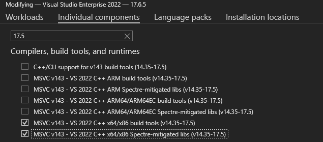

## Requirements

- [PlayFab developer account](https://developer.playfab.com)
   - Complete [Quickstart: Game Manager](../../live-service-management/gamemanager/quickstart.md) to set up your PlayFab account.
- [Visual Studio 2019 or 2022](https://visualstudio.microsoft.com/)
   - For GDK development, see [SDK & tools requirements](/gaming/gdk/_content/gc/getstarted/overviews/sdk-and-tools#install-visual-studio)

## Project Setup

Download and install the October 2025 (or later) Microsoft Game Development Kit (GDK), which includes the PlayFab Unified SDK.

### Configure Project Compilation and Linking

1. **Additional Include Directories**
   - Right-click your Visual Studio project and select **Properties**.
   - Go to **C/C++ > General**.
   - Add the SDK's `include` folder (e.g., `$(GameDKLatest)\windows\include`) to **Additional Include Directories**.
2. **Additional Library Directories**
   - Go to **Linker > General**.
   - Add the SDK's `lib` folder (e.g., `$(GameDKLatest)\windows\lib\x64`) to **Additional Library Directories**.
3. **Additional Dependencies**
   - Go to **Linker > Input**.
   - Add the required SDK `.lib` files from the SDK's `lib` folder to **Additional Dependencies** (e.g., `xgameruntime.lib`, `PlayFabCore.lib`, `PlayFabServices.lib`, `PlayFabMultiplayer.lib`, `Party.lib` etc.).
4. **Runtime Dependencies**
   - Copy the required SDK `.dll` files from the SDK's `bin` folder (e.g., `$(GameDKLatest)\windows\bin\x64`) to your project's output directory (e.g., `libHttpClient.dll`, `PlayFabCore.dll`, `PlayFabServices.dll`, `PlayFabMultiplayer.dll`, `Party.dll`, etc.).

### Troubleshooting setup issues

If you encounter linking issues, ensure Visual Studio build tools and libraries (version 17.5 or later) are installed. In Visual Studio Installer, select **Modify** for VS2022 and add the required components.

